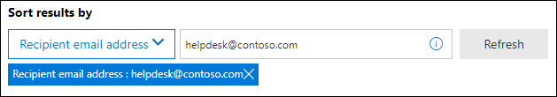

# <a name="view-and-release-quarantined-messages-from-shared-mailboxes"></a>Afficher et libérer les messages mis en quarantaine à partir de boîtes aux lettres partagées

> [!NOTE]
> Les fonctionnalités décrites dans cet article sont actuellement en prévisualisation, ne sont pas disponibles pour tout le monde et peuvent faire l’objet de changements.

Les utilisateurs peuvent gérer les messages mis en quarantaine lorsqu’ils sont l’un des destinataires, comme décrit dans Rechercher et libérer les messages mis en quarantaine en tant [qu’utilisateur dans EOP.](find-and-release-quarantined-messages-as-a-user.md) Mais qu’en est-il des boîtes aux lettres partagées où l’utilisateur dispose des autorisations Accès total et Envoyer en tant que ou Envoyer de la part de la boîte aux lettres comme décrit dans les boîtes aux lettres partagées [dans Exchange Online](/exchange/collaboration-exo/shared-mailboxes)? 

Auparavant, la possibilité pour les utilisateurs de gérer les messages mis en quarantaine envoyés à une boîte aux lettres partagée nécessitait aux administrateurs de laisser le mappage automatique activé pour la boîte aux lettres partagée (il est activé par défaut lorsqu’un administrateur donne à un utilisateur l’accès à une autre boîte aux lettres). Toutefois, en fonction de la taille et du nombre de boîtes aux lettres  à qui l’utilisateur a accès, les performances peuvent être réduites lorsque Outlook tente d’ouvrir toutes les boîtes aux lettres à l’accès de l’utilisateur. Pour cette raison, de nombreux administrateurs choisissent de [supprimer le mappage automatique pour les boîtes aux lettres partagées.](/outlook/troubleshoot/profiles-and-accounts/remove-automapping-for-shared-mailbox)

À présent, le mappage automatique n’est plus nécessaire pour que les utilisateurs gèrent les messages mis en quarantaine qui ont été envoyés à des boîtes aux lettres partagées. Cela fonctionne simplement. Il existe deux méthodes différentes pour accéder aux messages mis en quarantaine qui ont été envoyés à une boîte aux lettres partagée :

- Si l’administrateur a activé les notifications de courrier indésirable pour l’utilisateur final dans les [stratégies anti-courrier](configure-your-spam-filter-policies.md#configure-end-user-spam-notifications)indésirable, tout utilisateur qui a accès aux notifications de courrier indésirable de l’utilisateur final dans la boîte aux lettres partagée peut cliquer sur le bouton Réviser dans la notification pour passer en quarantaine dans le portail Microsoft 365 Defender.  Notez que cette méthode permet uniquement aux utilisateurs de gérer les messages mis en quarantaine qui ont été envoyés à la boîte aux lettres partagée. Les utilisateurs ne peuvent pas gérer leurs propres messages de mise en quarantaine dans ce contexte.
- L’utilisateur [peut être mis en quarantaine dans le portail Microsoft 365 Defender.](find-and-release-quarantined-messages-as-a-user.md) Par défaut, seuls les messages envoyés à l’utilisateur sont affichés. Toutefois, l’utilisateur peut modifier les résultats du tri **(le** bouton **ID** de message par  défaut) en adresse de messagerie du **destinataire,** entrer l’adresse e-mail de la boîte aux lettres partagée, puis cliquer sur Actualiser pour voir les messages mis en quarantaine qui ont été envoyés à la boîte aux lettres partagée.

  

Quelle que soit la méthode utilisée, les utilisateurs peuvent éviter toute confusion en incluant la colonne **Destinataire** pour les messages mis en quarantaine. Le nombre maximal de colonnes à afficher est 7, donc l’utilisateur doit cliquer sur Modifier les colonnes, supprimer une colonne existante (par exemple, **type** de stratégie), sélectionner le **destinataire,** puis cliquer sur Enregistrer ou enregistrer par **défaut.**  

  

## <a name="things-to-keep-in-mind"></a>Éléments à garder à l’esprit

- Le premier utilisateur à agir sur le message mis en quarantaine décide de la fin du message pour toutes les personnes qui utilisent la boîte aux lettres partagée. Par exemple, si une boîte aux lettres partagée est accessible par 10 utilisateurs et qu’un utilisateur décide de supprimer le message de mise en quarantaine, le message est supprimé pour les 10 utilisateurs. De même, si un utilisateur décide de libérer le message, il est publié dans la boîte aux lettres partagée et est accessible par tous les autres utilisateurs de la boîte aux lettres partagée.

- Actuellement, le bouton Bloquer **l’expéditeur** n’est pas disponible dans le volant Détails pour les messages mis en quarantaine qui ont été **envoyés** à la boîte aux lettres partagée.

- En ce qui concerne les opérations de mise en quarantaine pour les boîtes aux lettres partagées, si vous utilisez des groupes de sécurité imbrmbrés pour accorder l’accès à une boîte aux lettres partagée, nous vous recommandons de ne pas utiliser plus de deux niveaux de groupes imbrmbrés. Par exemple, le groupe A est membre du groupe B, qui est membre du groupe C. Pour attribuer des autorisations à une boîte aux lettres partagée, n’ajoutez pas l’utilisateur au groupe A, puis affectez le groupe C à la boîte aux lettres partagée.  

- Pour gérer les messages mis en quarantaine pour la boîte aux lettres partagée dans [Exchange Online PowerShell,](/powershell/exchange/connect-to-exchange-online-powershell)l’utilisateur final doit utiliser la cmdlet [Get-QuarantineMessage](/powershell/module/exchange/get-quarantinemessage) avec une adresse de messagerie de boîte aux lettres partagée pour la valeur du paramètre _RecipientAddress_ pour identifier les messages. Par exemple :

  ```powershell
  Get-QuarantinedMessage -RecipientAddress officeparty@contoso.com
  ```

  Ensuite, l’utilisateur final peut sélectionner un message mis en quarantaine dans la liste pour afficher ou prendre des mesures.

  Cet exemple montre tous les messages mis en quarantaine qui ont été envoyés à la boîte aux lettres partagée, puis libère le premier message de la liste de la quarantaine (le premier message de la liste est 0, le deuxième est 1, et ainsi de suite).

  ```powershell
  $SharedMessages = Get-QuarantinedMessage -RecipientAddress officeparty@contoso.com | select -ExpandProperty Identity
  $SharedMessages
  Release-QuarantinedMessage -Identity $SharedMessages[0]
  ```

  Pour obtenir des informations détaillées sur la syntaxe et les paramètres, consultez les rubriques suivantes :

  - [Get-QuarantineMessage](/powershell/module/exchange/get-quarantinemessage)
  - [Get-QuarantineMessageHeader](/powershell/module/exchange/get-quarantinemessageheader)
  - [Preview-QuarantineMessage](/powershell/module/exchange/preview-quarantinemessage)
  - [Release-QuarantineMessage](/powershell/module/exchange/release-quarantinemessage)
