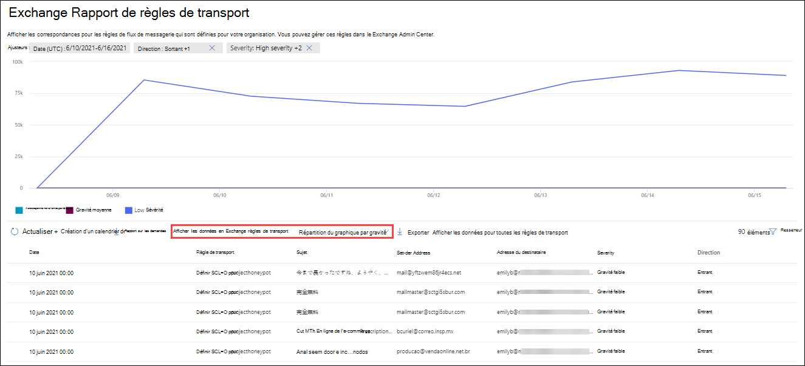
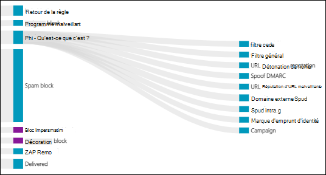
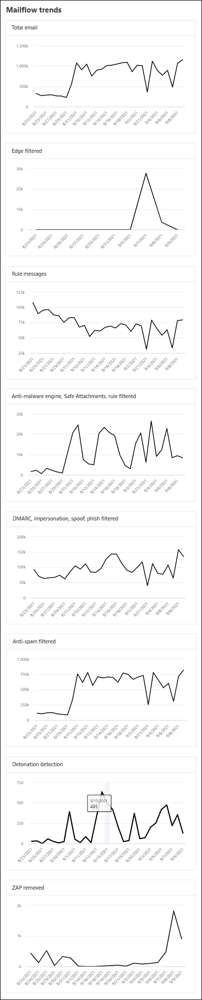
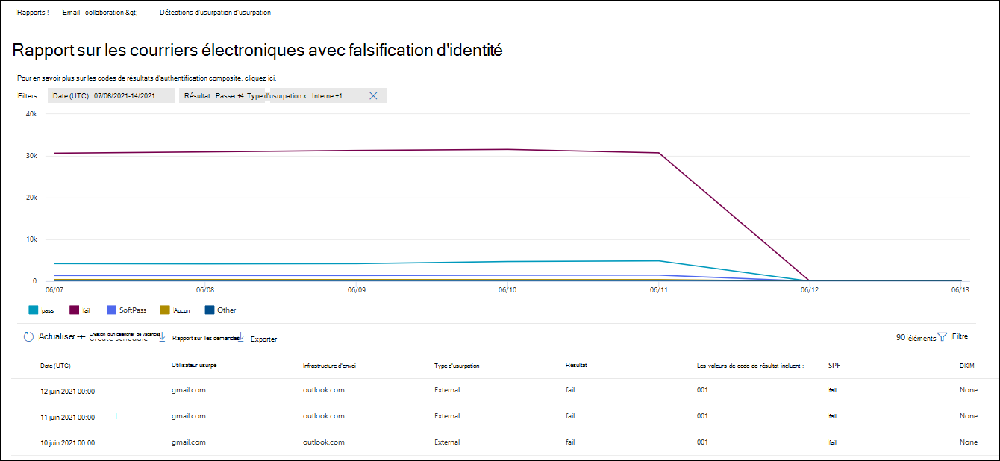
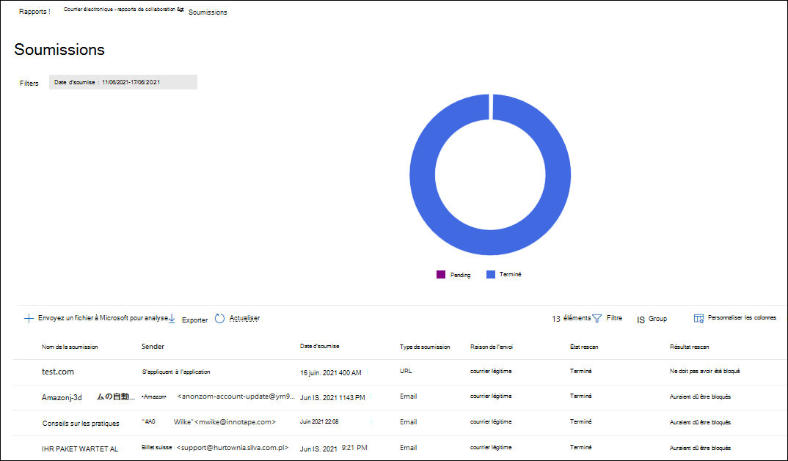
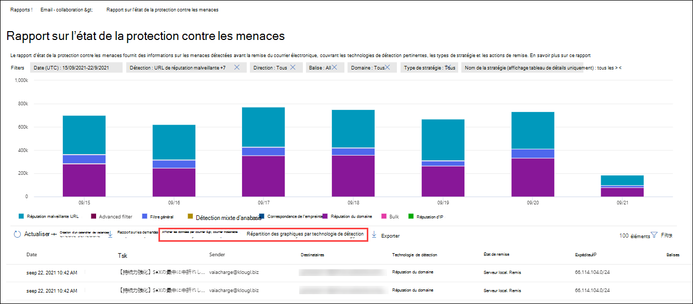
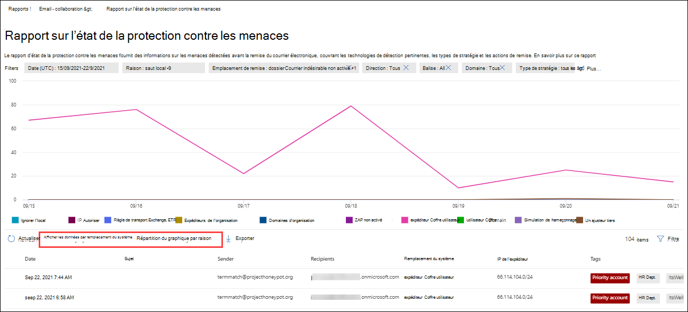
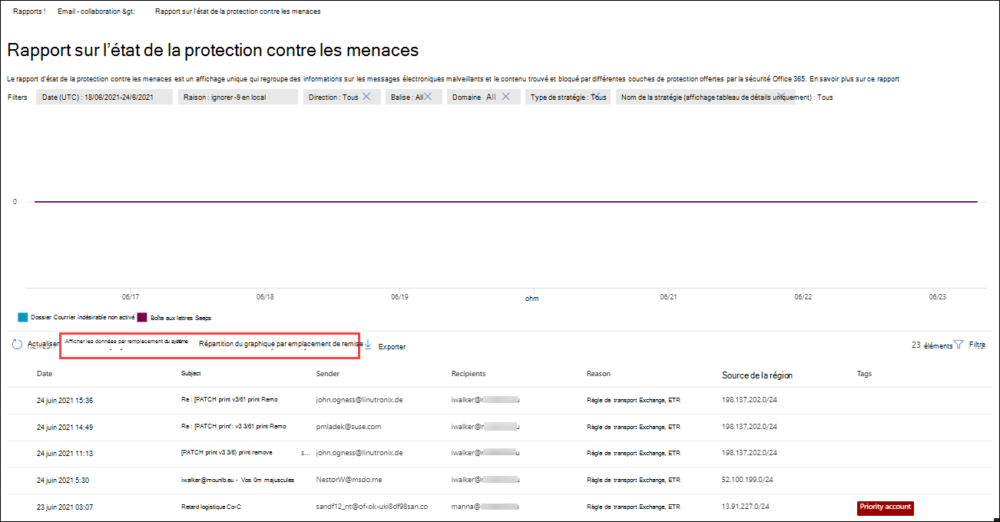

# Afficher les rapports de sécurité de messagerie dans le portail Microsoft 365 Defender messagerie

[!INCLUDE [Microsoft 365 Defender rebranding](../includes/microsoft-defender-for-office.md)]

**S’applique à**
- [Exchange Online Protection](exchange-online-protection-overview.md)
- [Microsoft Defender pour Office 365 : offre 1 et offre 2](defender-for-office-365.md)
- [Microsoft 365 Defender](../defender/microsoft-365-defender.md)

De nombreux rapports sont disponibles sur le portail Microsoft 365 Defender pour vous aider à voir comment les fonctionnalités de sécurité du courrier électronique, telles que les fonctionnalités <https://security.microsoft.com> anti-courrier indésirable, anti-programme malveillant et chiffrement dans Microsoft 365 protègent votre organisation. Si vous avez les [autorisations nécessaires,](#what-permissions-are-needed-to-view-these-reports)vous pouvez afficher et télécharger ces rapports comme décrit dans cet article.

> [!NOTE]
>
> Certains rapports de la page rapports de **collaboration** & courrier électronique nécessitent Microsoft Defender pour Office 365. Pour plus d’informations sur ces rapports, voir [View Defender pour Office 365 rapports dans le portail Microsoft 365 Defender.](view-reports-for-mdo.md)
>
> Les rapports liés au flux de messagerie sont désormais dans le Centre d’administration Exchange(EAC). Pour plus d’informations sur ces rapports, voir Rapports de flux de messagerie dans [le nouveau centre Exchange’administration.](/exchange/monitoring/mail-flow-reports/mail-flow-reports)

## Rapport utilisateurs compromis

> [!NOTE]
> Ce rapport est disponible dans les organisations Microsoft 365 avec Exchange Online boîtes aux lettres. Il n’est pas disponible dans les organisations Exchange Online Protection autonomes (EOP).

Le **rapport Utilisateurs** compromis indique le nombre de  comptes  d’utilisateurs marqués comme suspects ou restreints au cours des 7 derniers jours. Les comptes dans l’un de ces états sont problématiques, voire compromis. Avec une utilisation fréquente, vous pouvez utiliser le rapport pour repérer des pics, voire des tendances, dans des comptes suspects ou restreints. Pour plus d’informations sur les utilisateurs compromis, voir [Répondre à un compte de messagerie compromis.](responding-to-a-compromised-email-account.md)

L’affichage agrégé affiche les données des 90 derniers jours et l’affichage détail affiche les données des 30 derniers jours.

Pour afficher le rapport dans le portail  Microsoft 365 Defender, consultez la & collaboration de rapports e-mail \>  \> **& rapports de collaboration.** Dans la page **& de collaboration,** recherchez les utilisateurs **compromis,** puis cliquez sur Afficher **les détails.** Pour aller directement dans le rapport, ouvrez <https://security.microsoft.com/reports/CompromisedUsers> .

Dans la page **Utilisateurs** compromis, le graphique affiche les informations suivantes pour la plage de dates spécifiée :

- **Restreint :** le compte d’utilisateur n’a pas pu envoyer de courrier électronique en raison de modèles hautement suspects.
- **Suspect**: le compte d’utilisateur a envoyé des messages suspects et risque d’être limité à l’envoi de courriers électroniques.

Le tableau de détails sous le graphique présente les informations suivantes :

- **Heure de création**
- **ID d'utilisateur**
- **Action**

Vous pouvez filtrer le graphique et le tableau de détails en cliquant sur **Filtrer** et en sélectionnant une ou plusieurs des valeurs suivantes dans le volant qui s’affiche :

- **Date (UTC)**: **date de début** et date de **fin.**
- **Activité**: **restreint ou** **suspect**

Lorsque vous avez terminé la configuration des filtres, cliquez sur **Appliquer,** **Annuler** ou **Effacer les filtres.**

Dans la page principale du rapport,  **[Créer une planification,](#schedule-report)** icône  **[Demander un rapport](#request-report)** et icône  **[Les boutons d’exportation](#export-report)** sont disponibles.

## Exchange de règles de transport

Le **rapport Exchange** règles de transport de messagerie indique l’effet des règles de flux de messagerie (également appelées règles de transport) sur les messages entrants et sortants dans votre organisation.

Pour afficher le rapport dans le portail  Microsoft 365 Defender, consultez la & collaboration de rapports e-mail \>  \> **& rapports de collaboration.** Dans la page **Rapports de collaboration &** courrier électronique, recherchez Exchange de **transport,** puis cliquez sur **Afficher les détails.** Pour aller directement dans le rapport, ouvrez <https://security.microsoft.com/reports/ETRRuleReport> .

Dans la page Exchange de règles de **transport,** les graphiques et données disponibles sont décrits dans les sections suivantes.

### Répartition du graphique par direction

Si vous sélectionnez **répartition des graphiques par direction,** les graphiques suivants sont disponibles :

- **Afficher les données par Exchange de** transport  : nombre de **messages** entrants et sortants affectés par les règles de flux de messagerie.
- Afficher les **données par DLP Exchange transport**  : nombre de **messages** entrants et sortants affectés par les règles de flux de messagerie de protection contre la perte de données (DLP).

Les informations suivantes sont affichées dans le tableau de détails sous le graphique :

- **Date**
- **Stratégie DLP** ( Afficher **les données par DLP Exchange de transport uniquement)**
- **Règle de transport**
- **Sujet**
- **Adresse de l’expéditeur**
- **Adresse du destinataire**
- **Gravité**
- **Direction**

Vous pouvez filtrer le graphique et le tableau de détails en cliquant sur **Filtrer** et en sélectionnant une ou plusieurs des valeurs suivantes dans le volant qui s’affiche :

- **Date (UTC)** **Date de début** et date de **fin**.
- **Direction**: **sortant et** **entrant**.
- **Gravité :** **gravité élevée,** **gravité moyenne** et gravité **faible**

Lorsque vous avez terminé la configuration des filtres, cliquez sur **Appliquer,** **Annuler** ou **Effacer les filtres.**

Dans la page principale du rapport,  **[Créer une planification,](#schedule-report)** icône  **[Demander un rapport](#request-report)** et icône  **[Les boutons d’exportation](#export-report)** sont disponibles.

### Répartition du graphique par gravité

Si vous sélectionnez **répartition des graphiques par gravité,** les graphiques suivants sont disponibles :

- **Afficher les données par Exchange de transport**: nombre de messages de gravité **élevée,** moyenne et **faible.** Vous définissez le niveau de gravité en tant qu’action dans la règle (**Auditez** cette règle avec le niveau de gravité _ou SetAuditSeverity_). Pour plus d’informations, voir [Actions de règle de flux](/Exchange/security-and-compliance/mail-flow-rules/mail-flow-rule-actions)de messagerie dans Exchange Online .

- Afficher les données **par DLP Exchange de transport**: nombre de **messages** de gravité **élevée,** moyenne et faible qui ont été affectés par les règles de flux de messagerie DLP.

Les informations suivantes sont affichées dans le tableau de détails sous le graphique :

- **Date**
- **Stratégie DLP** ( Afficher **les données par DLP Exchange de transport uniquement)**
- **Règle de transport**
- **Subject**
- **Adresse de l’expéditeur**
- **Adresse du destinataire**
- **Gravité**
- **Direction**

Vous pouvez filtrer le graphique et le tableau de détails en cliquant sur **Filtrer** et en sélectionnant une ou plusieurs des valeurs suivantes dans le volant qui s’affiche :

- **Date (UTC)** **Date de début et** date de **fin**
- **Direction**: **sortant et** **entrant**
- **Gravité :** **gravité élevée,** **gravité moyenne** et gravité **faible**

Lorsque vous avez terminé la configuration des filtres, cliquez sur **Appliquer,** **Annuler** ou **Effacer les filtres.**

Dans la page principale du rapport,  **[Créer une planification,](#schedule-report)** icône  **[Demander un rapport](#request-report)** et icône  **[Les boutons d’exportation](#export-report)** sont disponibles.

## Rapport de forwarding

> [!NOTE]
> Ce rapport est désormais disponible dans le EAC. Pour plus d’informations, [reportez-vous au](/exchange/monitoring/mail-flow-reports/mfr-auto-forwarded-messages-report)rapport des messages transmis automatiquement dans le nouveau EAC.

## Rapport d’état du flux de messagerie

Le  rapport d’état du flux de messagerie est un rapport intelligent qui affiche des informations sur le courrier électronique entrant et sortant, les détections de courrier indésirable, les programmes malveillants, les e-mails identifiés comme « bons » et les informations sur les messages électroniques autorisés ou bloqués sur le edge. Il s’agit du seul rapport qui contient des informations sur la protection edge et qui indique la quantité de messages électroniques bloqués avant d’être autorisé à entrer dans le service pour évaluation par Exchange Online Protection (EOP). Il est important de comprendre que si un message est envoyé à cinq destinataires, nous le compterons comme cinq messages différents et pas un seul message.

Pour afficher le rapport dans le portail  Microsoft 365 Defender, consultez la & collaboration de rapports e-mail \>  \> **& rapports de collaboration.** Dans la page **Rapports de collaboration &** courrier électronique, recherchez le résumé **de** l’état du flux de messagerie, puis cliquez sur Afficher **les détails.** Pour aller directement dans le rapport, ouvrez <https://security.microsoft.com/reports/mailflowStatusReport> .

### Affichage des types pour le rapport d’état du flux de messagerie

Dans la page **Rapport d’état du** flux de messagerie, l’onglet **Type** est sélectionné par défaut. Le graphique affiche les informations suivantes pour la plage de dates spécifiée :

- **Bon courrier**
- **Total**
- **Programme malveillant**
- **Courriers hameçons**
- **Courrier indésirable**
- **Protection Edge**
- **Messages de règle**

Le tableau de détails sous le graphique présente les informations suivantes :

- **Direction**
- **Type**
- **24 heures**
- **3 jours**
- **7 jours**
- **15 jours**
- **30 jours**

Vous pouvez filtrer le graphique et le tableau de détails en cliquant sur **Filtrer** et en sélectionnant une ou plusieurs des valeurs suivantes dans le volant qui s’affiche :

- **Date (UTC)**: **date de début** et date de **fin.**
- **Sens du courrier**: **entrant** **et sortant.**
- **Tapez**:
  - **Bon courrier**
  - **Programme malveillant**
  - **Courrier indésirable**
  - **Protection Edge**
  - **Messages de règle**
  - **Courriers hameçons**

Lorsque vous avez terminé la configuration des filtres, cliquez sur **Appliquer,** **Annuler** ou **Effacer les filtres.**

De retour sur la page principale du rapport, si vous cliquez sur Choisir une catégorie pour plus de **détails,** vous pouvez sélectionner parmi les valeurs suivantes :

- **E-mail de hameçonnage**: cette sélection vous place dans le rapport d’état [de la protection contre les menaces.](view-email-security-reports.md#threat-protection-status-report)
- **Programmes malveillants dans les e-mails**: cette sélection vous place dans le rapport d’état [de la protection contre les menaces.](view-email-security-reports.md#threat-protection-status-report)
- **Détections de courrier indésirable**: cette sélection vous permet d’envoyer le rapport [détections de courrier indésirable.](view-email-security-reports.md#spam-detections-report)
- **Courrier indésirable bloqué edge**: cette sélection vous permet d’envoyer le rapport [détections de courrier indésirable.](view-email-security-reports.md#spam-detections-report)

Dans la page principale du rapport,  **[Créer une planification et](#schedule-report)** une  **[Les boutons d’exportation](#export-report)** sont disponibles.

### Affichage direction pour le rapport d’état du flux de messagerie

Si vous cliquez sur **l’onglet Direction,** le graphique affiche les informations suivantes pour la plage de dates spécifiée :

- **Entrant**
- **Sortant**

Vous pouvez filtrer le graphique et le tableau de détails en cliquant sur **Filtrer** et en sélectionnant une ou plusieurs des valeurs suivantes dans le volant qui s’affiche :

- **Date (UTC)**: **date de début** et date de **fin.**
- **Sens du courrier**: **entrant** **et sortant.**
- **Tapez**:
  - **Bon courrier**
  - **Programme malveillant**
  - **Courrier indésirable**
  - **Protection Edge**
  - **Messages de règle**
  - **Courriers hameçons**

Lorsque vous avez terminé la configuration des filtres, cliquez sur **Appliquer,** **Annuler** ou **Effacer les filtres.**

De retour sur la page principale du rapport, si vous cliquez sur Choisir une catégorie pour plus de **détails,** vous pouvez sélectionner parmi les valeurs suivantes :

- **E-mail de hameçonnage**: cette sélection vous place dans le rapport d’état [de la protection contre les menaces.](view-email-security-reports.md#threat-protection-status-report)
- **Programmes malveillants dans les e-mails**: cette sélection vous place dans le rapport d’état [de la protection contre les menaces.](view-email-security-reports.md#threat-protection-status-report)
- **Détections de courrier indésirable**: cette sélection vous permet d’envoyer le rapport [détections de courrier indésirable.](view-email-security-reports.md#spam-detections-report)
- **Courrier indésirable bloqué edge**: cette sélection vous permet d’envoyer le rapport [détections de courrier indésirable.](view-email-security-reports.md#spam-detections-report)

Dans la page principale du rapport,  **Créer une planification et** une  **Les boutons d’exportation** sont disponibles.

### Affichage de flux de messagerie pour le rapport d’état du flux de messagerie

**L’affichage Flux de** messagerie vous montre comment les fonctionnalités de protection contre les menaces de messagerie électronique de Microsoft filtrent le courrier électronique entrant et sortant dans votre organisation. Cette vue utilise un diagramme de flux horizontal (appelé diagramme _Sankey)_ pour fournir des détails sur le nombre total de messages électroniques et sur la façon dont les fonctionnalités de protection contre les menaces configurées, notamment la protection edge, les logiciels anti-programme malveillant, le anti-hameçonnage, le courrier indésirable et la détection d’usurpation d’adresse affectent ce nombre.

L’affichage agrégé et le tableau détails autorisent 90 jours de filtrage.

Les informations du diagramme sont codées en couleur par **EOP** ou **Defender pour Office 365** technologies.

Le diagramme est organisé en bandes horizontales suivantes :

- **Bande de courrier** totale : cette valeur est toujours affichée en premier.
- **Bloc Edge** et **bande traitée** :
  - **Bloc Edge**: messages filtrés sur le bord et identifiés comme étant de la protection Edge.
  - **Traité :** messages gérés par la pile de filtrage.
- Bande de résultats :
  - **Bloc de règles**: messages qui sont Exchange règles de flux de messagerie (règles de transport).
  - **Blocage des programmes** malveillants : messages identifiés comme programmes malveillants par différents filtres.\*
  - **Bloc de hameçonnage**: messages identifiés comme hameçonnages lors du traitement par différents filtres.\*
  - **Blocage de courrier indésirable**: messages identifiés comme courrier indésirable lors du traitement par différents filtres.\*
  - **Bloc d’emprunt** d’identité : messages détectés comme emprunt d’identité d’utilisateur ou emprunt d’identité de domaine dans Defender Office 365.\*
  - **Bloc de détonation**: messages détectés lors de la désaération d’un fichier ou d’une URL par des stratégies de pièces jointes Coffre ou des stratégies de liens Coffre dans Defender pour Office 365.\*
  - **ZaP supprimé :** messages supprimés par purge automatique d’heure zéro (ZAP).\*
  - **Remis :** messages remis aux utilisateurs en raison d’une autoriser.\*

Si vous pointez sur une bande horizontale dans le diagramme, vous verrez le nombre de messages associés.

\* Si vous cliquez sur cet élément, le diagramme est développé pour afficher d’autres détails. Pour obtenir une description de chaque élément dans les nodes développés, voir [Technologies de détection.](/office/office-365-management-api/office-365-management-activity-api-schema#detection-technologies)

Le tableau de détails sous le diagramme présente les informations suivantes :

- **Date**
- **Nombre total de messages électroniques**
- **Edge filtré**
- **Messages de règle**
- **Moteur anti-programme malveillant, Coffre pièces jointes, règle filtrée**
- **Emprunt d’identité DMARC, usurpation d’identité, hameçonnage filtré**
- **Détection de détonation**
- **Filtrage anti-courrier indésirable**
- **ZAP supprimé**
- **Messages dans lequel des menaces non détectées n’ont pas été détectées**

Si vous sélectionnez une ligne dans le tableau de détails, une répartition supplémentaire du nombre de messages est affichée dans le volant d’informations qui s’affiche.

Vous pouvez filtrer le graphique et le tableau de détails en cliquant sur **Filtrer** et en sélectionnant une ou plusieurs des valeurs suivantes dans le volant qui s’affiche :

- **Date (UTC)** **Date de début** et date de **fin**.
- **Direction**: **sortant et** **entrant**.

Lorsque vous avez terminé la configuration des filtres, cliquez sur **Appliquer,** **Annuler** ou **Effacer les filtres.**

De retour sur la page  principale du rapport, vous  pouvez cliquer sur Afficher les tendances pour afficher les graphiques de tendance dans le volant de tendances de flux de messagerie qui s’affiche.

Dans la page principale du rapport,  **Le bouton** Exporter est disponible.

## Rapport sur les détections de programmes malveillants

> [!NOTE]
> Ce rapport a été supprimé. Les mêmes informations sont disponibles dans le rapport d’état [de la protection contre les menaces.](#threat-protection-status-report)

## Rapport de latence du courrier

Le **rapport de latence de messagerie** dans Defender pour Office 365 contient des informations sur la remise et la latence de détonation du courrier au sein de votre organisation. Pour plus d’informations, voir [Rapport de latence de messagerie.](view-reports-for-mdo.md#mail-latency-report)

## Rapport sur la détection des courriers indésirables

> [!NOTE]
> Ce rapport a été supprimé. Les mêmes informations sont disponibles dans le rapport d’état [de la protection contre les menaces.](#threat-protection-status-report)

## Rapport sur les détections d’usurpation d’usurpation

Le **rapport sur les détections d’usurpation d’informations** affiche des informations sur les messages qui ont été bloqués ou autorisés en raison de l’usurpation d’informations. Pour plus d’informations sur l’usurpation d’adresse, consultez la protection contre l’usurpation [d’adresse dans EOP.](anti-spoofing-protection.md)

L’affichage agrégé du rapport autorise 45 jours de filtrage, tandis que l’affichage détaillé ne permet que dix jours \* de filtrage.

\* Au final, vous pourrez utiliser jusqu’à 90 jours de filtrage.

Pour afficher le rapport dans le portail  Microsoft 365 Defender, consultez la & collaboration de rapports e-mail \>  \> **& rapports de collaboration.** Dans la page **& de collaboration,** recherchez les détections d’usurpation **d’adresse,** puis cliquez sur **Afficher les détails.** Pour aller directement dans le rapport, ouvrez <https://security.microsoft.com/reports/SpoofMailReportV2> .

Le graphique présente les informations suivantes :

- **Pass**
- **Échec**
- **SoftPass**
- **Aucune**
- **Other**

Lorsque vous pointez sur un jour (point de données) dans le graphique, vous pouvez voir combien de messages usurpés ont été détectés et pourquoi.

Vous pouvez filtrer le graphique et le tableau de détails en cliquant sur **Filtrer** et en sélectionnant une ou plusieurs des valeurs suivantes dans le volant qui s’affiche :

- **Date (UTC)** **Date de début et** date de **fin**
- **Résultat**:
  - **Pass**
  - **Échec**
  - **SoftPass**
  - **Aucune**
  - **Other**
- **Type d’usurpation :** **interne** et **externe**

Le tableau de détails sous le graphique présente les informations suivantes :

- **Date**
- **Utilisateur usurpé**
- **Infrastructure d’envoi**
- **Type d’usurpation**
- **Résultat**
- **Code de résultat**
- **SPF**
- **DKIM**
- **DMARC**
- **Nombre de messages**

Pour plus d’informations sur les codes de résultats d’authentification composite, consultez les [en-têtes de message anti-courrier](anti-spam-message-headers.md)indésirable Microsoft 365 .

Dans la page principale du rapport,  **[Créer une planification,](#schedule-report)** icône  **[Demander un rapport](#request-report)** et icône  **[Les boutons d’exportation](#export-report)** sont disponibles.

## Rapport soumissions

Le **rapport Soumissions** affiche des informations sur les éléments que les administrateurs ont signalés à Microsoft pour analyse. Pour plus d’informations, voir Utiliser la soumission d’administrateur pour soumettre des messages suspects de courrier indésirable, d’hameçonnage, d’URL et [de fichiers à Microsoft.](admin-submission.md)

Pour afficher le rapport dans le portail  Microsoft 365 Defender, consultez la & collaboration de rapports e-mail \>  \> **& rapports de collaboration.** Dans la page **& de collaboration,** recherchez **Soumissions,** puis cliquez sur **Afficher les détails.** Pour aller directement dans le rapport, ouvrez <https://security.microsoft.com/adminSubmissionReport> . Pour aller aux [soumissions d’administrateur dans le portail Microsoft 365 Defender,](admin-submission.md)cliquez **sur Go to Submissions**. Les administrateurs pourront afficher le rapport pour les 30 derniers jours.

Le graphique présente les informations suivantes :

- **En attente**
- **Terminée**

Vous pouvez filtrer le graphique et le tableau de détails en cliquant sur **Filtrer** et en sélectionnant une ou plusieurs des valeurs suivantes dans le volant qui s’affiche :

- **Date signalée :** **heure de début** et heure de **fin**
- **Type de soumission**:
  - **Courrier électronique**
  - **URL**
  - **Fichier**
- **ID de soumission**
- **ID de message réseau**
- **Sender**
- **Name**
- **Soumis par**
- **Raison de l’envoi**:
  - **Non indésirable**
  - **Hameçonnage**
  - **Programme malveillant**
  - **Courrier indésirable**
- **État de rescan :**
  - **En attente**
  - **Terminée**

Le tableau de détails sous le graphique  présente les mêmes informations  et possède les  mêmes **options** de colonnes De groupe ou de personnalisation que sous l’onglet Soumis pour analyse dans envois de collaboration & courrier \> **électronique.** Pour plus d’informations, voir [Afficher les soumissions d’administrateur à Microsoft.](admin-submission.md#view-admin-submissions-to-microsoft)

Sur la page principale du rapport, le **[bouton Exporter](#export-report)** est disponible.

## Rapport sur l’état de la protection contre les menaces

Le **rapport d’état de la protection** contre les menaces est disponible dans EOP et Defender pour Office 365 ; toutefois, les rapports contiennent des données différentes. Par exemple, les clients EOP peuvent afficher des informations sur les programmes malveillants détectés dans le courrier électronique, mais pas sur les fichiers [malveillants détectés](mdo-for-spo-odb-and-teams.md)par les pièces jointes Coffre pour SharePoint, OneDrive et Microsoft Teams .

Le rapport fournit le nombre de messages électroniques avec du contenu malveillant, tels que des fichiers ou des adresses web (URL) bloqués par le moteur anti-programme malveillant, la purge automatique d’heure zéro [(ZAP)](zero-hour-auto-purge.md)et Defender pour des fonctionnalités de Office 365 telles que les liens [Coffre,](safe-links.md)les pièces [jointes Coffre](safe-attachments.md)et les fonctionnalités de protection contre l’emprunt d’identité dans les stratégies [anti-hameçonnage.](set-up-anti-phishing-policies.md#exclusive-settings-in-anti-phishing-policies-in-microsoft-defender-for-office-365) Vous pouvez utiliser ces informations pour identifier les tendances ou déterminer si des stratégies d’organisation doivent être ajuster.

**Remarque**: il est important de comprendre que si un message est envoyé à cinq destinataires, nous le compterons comme cinq messages différents et pas un seul message.

Pour afficher le rapport dans le portail  Microsoft 365 Defender, consultez la & collaboration de rapports e-mail \>  \> **& rapports de collaboration.** Dans la page **Rapports de collaboration & courrier** électronique, recherchez l’état de la **protection** contre les menaces, puis cliquez sur Afficher **les détails.** Pour aller directement dans le rapport, ouvrez l’une des URL suivantes :

- Defender pour Office 365 :<https://security.microsoft.com/reports/TPSAggregateReportATP>
- EOP : <https://security.microsoft.com/reports/TPSAggregateReport>

Par défaut, le graphique affiche les données des 7 derniers jours. Si vous cliquez sur **Filtrer** dans la page du rapport d’état de la **protection** contre les menaces, vous pouvez sélectionner une plage de dates de 90 jours (les abonnements d’essai peuvent être limités à 30 jours). Le tableau de détails autorise le filtrage pendant 30 jours.

Les vues disponibles sont décrites dans les sections suivantes.

### Afficher les données par vue d’ensemble

Dans **l’affichage Des données par vue d’ensemble,** les informations de détection suivantes sont affichées dans le graphique :

- **Programme malveillant de messagerie**
- **Hameçonnage par e-mail**
- **Courrier indésirable**
- **Programme malveillant de contenu**

Aucun tableau de détails n’est disponible sous le graphique.

Si vous cliquez **sur Filtre,** les filtres suivants sont disponibles :

- **Date (UTC)** **Date de début** et date de **fin**.
- **Détection**:
  - **Programme malveillant de messagerie**
  - **Hameçonnage par e-mail**
  - **Courrier indésirable**
  - **Programme malveillant de contenu**
- **Protégé par**: **MDO** (Defender for Office 365) et **EOP**.
- **Balise**: **tout ou** la balise utilisateur spécifiée (y compris les comptes de priorité). Pour plus d’informations sur les balises utilisateur, voir [Balises utilisateur.](user-tags.md)
- **Direction**:
  - **All**
  - **Entrant**
  - **Sortant**
- **Domaine**: **tout** ou [un domaine accepté.](/exchange/mail-flow-best-practices/manage-accepted-domains/manage-accepted-domains)
- **Type de stratégie**:
  - **All**
  - **Anti-programme malveillant**
  - **Pièces jointes fiables**
  - **Anti-hameçonnage**
  - **Anti-courrier indésirable**
  - **Règle de flux de messagerie** (règle de transport)
  - **Autres**

Lorsque vous avez terminé la configuration des filtres, cliquez sur **Appliquer,** **Annuler** ou **Effacer les filtres.**

### Afficher les données par hameçonnage de messagerie \> électronique et répartition des graphiques par technologie de détection

Dans **l’affichage \> des données par hameçonnage par courrier électronique** et répartition **du** graphique par technologie de détection, les informations suivantes sont affichées dans le graphique :

- **Réputation malveillante d’URL**: réputation d’URL malveillante générée à partir de \* Defender pour Office 365 détonations dans d’autres Microsoft 365 clients.
- **Filtre avancé :** signaux de hameçonnage basés sur l’apprentissage automatique.
- **Filtre général :** signaux de hameçonnage basés sur des règles d’analyste.
- **Usurpation d’adresse intra-organisation**: l’expéditeur tente d’usurper le domaine du destinataire.
- **Usurpation d’un domaine externe**: l’expéditeur tente d’usurper un autre domaine.
- **Usurpation d’identité DMARC**: échec de l’authentification DMARC sur les messages.
- **Marque d’emprunt d’identité**: emprunt d’identité de marques connues basées sur des expéditeurs.
- **Détection d’analyse mixte**
- **Réputation des fichiers**
- **Correspondance de l’empreinte**
- **Réputation de détonation d’URL**\*
- **Détonation d’URL**\*
- **Utilisateur de l’emprunt d’identité**\*
- **Domaine d’emprunt d’identité**: emprunt d’identité des domaines que le client \* possède ou définit.
- **Emprunt d’identité d’intelligence de** boîte aux lettres : emprunt d’identité des utilisateurs définis par l’administrateur ou appris par le biais de l’intelligence \* des boîtes aux lettres.
- **Détonation de fichier**\*
- **Réputation de détonation de fichier**\*
- **Campagne**\*

\*Defender pour Office 365 uniquement

Dans le tableau de détails sous le graphique, les informations suivantes sont disponibles :

- **Date**
- **Sujet**
- **Expéditeur**
- **Destinataires**
- **Technologie de détection**
- **État de remise**
- **IP de l’expéditeur**
- **Tags**

Si vous cliquez **sur Filtre,** les filtres suivants sont disponibles :

- **Date (UTC)** **Date de début et** date de **fin**
- **Détection**: valeurs identiques à dans le graphique.
- **Protégé par**: **MDO** (Defender for Office 365) ou **EOP**
- **Direction**:
  - **All**
  - **Entrant**
  - **Sortant**
- **Balise**: **tout ou** la balise utilisateur spécifiée (y compris les comptes de priorité). Pour plus d’informations sur les balises utilisateur, voir [Balises utilisateur.](user-tags.md)
- **Domaine**: **tout** ou [un domaine accepté.](/exchange/mail-flow-best-practices/manage-accepted-domains/manage-accepted-domains)
- **Type de stratégie**:
  - **All**
  - **Anti-programme malveillant**
  - **Pièces jointes fiables**
  - **Anti-hameçonnage**
  - **Anti-courrier indésirable**
  - **Règle de flux de messagerie** (règle de transport)
  - **Autres**
- **Nom de la stratégie (affichage tableau de détails uniquement)**: **tout** ou la stratégie spécifiée.
- **Destinataires**

Lorsque vous avez terminé la configuration des filtres, cliquez sur **Appliquer,** **Annuler** ou **Effacer les filtres.**

Dans la page principale du rapport,  **[Créer une planification,](#schedule-report)** icône  **[Demander un rapport](#request-report)** et icône  **[Les boutons d’exportation](#export-report)** sont disponibles.

### Afficher les données par courrier \> indésirable et répartition des graphiques par technologie de détection

Dans **l’affichage \> des données par courrier indésirable et** répartition du graphique par technologie de détection, les informations suivantes sont affichées dans le graphique : 

- **Réputation d’URL malveillante**
- **Filtre avancé**
- **Filtre général**
- **Détection d’analyse mixte**
- **Correspondance de l’empreinte**
- **Réputation du domaine**
- **E-mail de masse**
- **Réputation d’IP**

Dans le tableau de détails sous le graphique, les informations suivantes sont disponibles :

- **Date**
- **Subject**
- **Expéditeur**
- **Destinataires**
- **Technologie de détection**
- **État de remise**
- **IP de l’expéditeur**
- **Tags**

Si vous cliquez **sur Filtre,** les filtres suivants sont disponibles :

- **Date (UTC)** **Date de début et** date de **fin**
- **Détection**: valeurs identiques à dans le graphique.
- **Direction**:
  - **All**
  - **Entrant**
  - **Sortant**
- **Balise**: **tout ou** la balise utilisateur spécifiée (y compris les comptes de priorité). Pour plus d’informations sur les balises utilisateur, voir [Balises utilisateur.](user-tags.md)
- **Domaine**: **tout** ou [un domaine accepté.](/exchange/mail-flow-best-practices/manage-accepted-domains/manage-accepted-domains)
- **Type de stratégie**:
  - **All**
  - **Anti-programme malveillant**
  - **Pièces jointes fiables**
  - **Anti-hameçonnage**
  - **Anti-courrier indésirable**
  - **Règle de flux de messagerie** (règle de transport)
  - **Autres**
- **Nom de la stratégie (affichage tableau de détails uniquement)**: **tout** ou la stratégie spécifiée.
- **Destinataires**

Lorsque vous avez terminé la configuration des filtres, cliquez sur **Appliquer,** **Annuler** ou **Effacer les filtres.**

Dans la page principale du rapport,  **[Créer une planification,](#schedule-report)** icône  **[Demander un rapport](#request-report)** et icône  **[Les boutons d’exportation](#export-report)** sont disponibles.

### Afficher les données par programme malveillant et \> répartition des graphiques par technologie de détection

Dans **l’affichage \> des données par programme** malveillant par courrier électronique et **répartition des** graphiques par technologie de détection, les informations suivantes sont affichées dans le graphique :

- **Détonation de fichier** \* : détection par Coffre pièces jointes.
- **Réputation de détonation de fichier**: toutes les réputations de fichiers \* malveillants générées par Defender pour Office 365 détonations.
- **Réputation des fichiers**
- **Moteur anti-programme malveillant :** détection à partir de moteurs \* anti-programme malveillant.
- Blocage du type de fichier de stratégie **anti-programme** malveillant : il s’adresse aux messages électroniques filtrés en raison du type de fichier malveillant identifié dans le message.
- **Réputation malveillante d’URL**\*
- **Détonation d’URL**\*
- **Réputation de détonation d’URL**\*
- **Campagne**\*

Dans le tableau de détails sous le graphique, les informations suivantes sont disponibles :

- **Date**
- **Sujet**
- **Expéditeur**
- **Destinataires**
- **Technologie de détection**
- **État de remise**
- **IP de l’expéditeur**
- **Tags**

Si vous cliquez **sur Filtre,** les filtres suivants sont disponibles :

- **Date (UTC)** **Date de début et** date de **fin**
- **Détection**: valeurs identiques à dans le graphique.
- **Protégé par**: **MDO** (Defender for Office 365) ou **EOP**
- **Direction**:
  - **All**
  - **Entrant**
  - **Sortant**
- **Balise**: **tout ou** la balise utilisateur spécifiée (y compris les comptes de priorité). Pour plus d’informations sur les balises utilisateur, voir [Balises utilisateur.](user-tags.md)
- **Domaine**: **tout** ou [un domaine accepté.](/exchange/mail-flow-best-practices/manage-accepted-domains/manage-accepted-domains)
- **Type de stratégie**:
  - **All**
  - **Anti-programme malveillant**
  - **Pièces jointes fiables**
  - **Anti-hameçonnage**
  - **Anti-courrier indésirable**
  - **Règle de flux de messagerie** (règle de transport)
  - **Autres**
- **Nom de la stratégie (affichage tableau de détails uniquement)**: **tout** ou la stratégie spécifiée.
- **Destinataires**

Lorsque vous avez terminé la configuration des filtres, cliquez sur **Appliquer,** **Annuler** ou **Effacer les filtres.**

Dans la page principale du rapport,  **[Créer une planification,](#schedule-report)** icône  **[Demander un rapport](#request-report)** et icône  **[Les boutons d’exportation](#export-report)** sont disponibles.

### Répartition du graphique par type de stratégie

Dans l’affichage des données par hameçonnage de **messagerie, \>** affichage des données par courrier indésirable ou affichage des données par affichage des programmes malveillants de messagerie, la sélection de la répartition du graphique par **type** de stratégie affiche les informations suivantes dans le graphique : **\>** **\>**

- **Anti-programme malveillant**
- **Coffre Pièces jointes**\*
- **Anti-hameçonnage**
- **Anti-courrier indésirable**
- **Règle de flux de messagerie** (également appelée règle de transport)
- **Autres**

Dans le tableau de détails sous le graphique, les informations suivantes sont disponibles :

- **Date**
- **Subject**
- **Expéditeur**
- **Destinataires**
- **Technologie de détection**
- **État de remise**
- **IP de l’expéditeur**
- **Tags**

Si vous cliquez **sur Filtre,** les filtres suivants sont disponibles :

- **Date (UTC)** **Date de début et** date de **fin**
- **Détection**:
  - **Réputation malveillante d’URL**: réputation d’URL malveillante générée à partir de \* Defender pour Office 365 détonations dans d’autres Microsoft 365 clients.
  - **Filtre avancé :** signaux de hameçonnage basés sur l’apprentissage automatique.
  - **Filtre général :** signaux de hameçonnage basés sur des règles d’analyste.
  - **Usurpation d’adresse intra-organisation**: l’expéditeur tente d’usurper le domaine du destinataire.
  - **Usurpation d’un domaine externe**: l’expéditeur tente d’usurper un autre domaine.
  - **Usurpation d’identité DMARC**: échec de l’authentification DMARC sur les messages.
  - **Marque d’emprunt d’identité**: emprunt d’identité de marques connues basées sur des expéditeurs.
  - **Détection d’analyse mixte**
  - **Réputation des fichiers**
  - **Correspondance de l’empreinte**
  - **Réputation de détonation d’URL**\*
  - **Détonation d’URL**\*
  - **Utilisateur de l’emprunt d’identité**\*
  - **Domaine d’emprunt d’identité**: emprunt d’identité des domaines que le client \* possède ou définit.
  - **Emprunt d’identité d’intelligence de** boîte aux lettres : emprunt d’identité des utilisateurs définis par l’administrateur ou appris par le biais de l’intelligence \* des boîtes aux lettres.
  - **Détonation de fichier**\*
  - **Réputation de détonation de fichier**\*
  - **Campagne**\*
- **Protégé par**: **MDO** (Defender for Office 365) ou **EOP**
- **Direction**:
  - **All**
  - **Entrant**
  - **Sortant**
- **Balise**: **tout ou** la balise utilisateur spécifiée (y compris les comptes de priorité). Pour plus d’informations sur les balises utilisateur, voir [Balises utilisateur.](user-tags.md)
- **Domaine**: **tout** ou [un domaine accepté.](/exchange/mail-flow-best-practices/manage-accepted-domains/manage-accepted-domains)
- **Type de stratégie**:
  - **All**
  - **Anti-programme malveillant**
  - **Pièces jointes fiables**
  - **Anti-hameçonnage**
  - **Anti-courrier indésirable**
  - **Règle de flux de messagerie** (règle de transport)
  - **Autres**
- **Nom de la stratégie (affichage tableau de détails uniquement)**: **tout** ou la stratégie spécifiée.
- **Destinataires**

\*Defender pour Office 365 uniquement

Lorsque vous avez terminé la configuration des filtres, cliquez sur **Appliquer,** **Annuler** ou **Effacer les filtres.**

Dans la page principale du rapport,  **[Créer une planification,](#schedule-report)** icône  **[Demander un rapport](#request-report)** et icône  **[Les boutons d’exportation](#export-report)** sont disponibles.

### Répartition du graphique par état de remise

Dans l’affichage des données par hameçonnage de **messagerie, \>** affichage des  données par courrier indésirable ou affichage des données par affichage des programmes malveillants de messagerie, la sélection de la répartition du graphique par état de remise affiche les informations suivantes dans le graphique : **\>** **\>**

- **Boîte aux lettres hébergée : Boîte de réception**
- **Boîte aux lettres hébergée : courrier indésirable**
- **Boîte aux lettres hébergée : dossier personnalisé**
- **Boîte aux lettres hébergée : éléments supprimés**
- **Forwarded**
- **Serveur local : remis**
- **Mise en quarantaine**
- **Échec de remise**
- **Dropped**

Dans le tableau de détails sous le graphique, les informations suivantes sont disponibles :

- **Date**
- **Subject**
- **Expéditeur**
- **Destinataires**
- **Technologie de détection**
- **État de remise**
- **IP de l’expéditeur**
- **Tags**

Si vous cliquez **sur Filtre,** les filtres suivants sont disponibles :

- **Date (UTC)** **Date de début et** date de **fin**
- **Détection**:
  - **Réputation malveillante d’URL**: réputation d’URL malveillante générée à partir de \* Defender pour Office 365 détonations dans d’autres Microsoft 365 clients.
  - **Filtre avancé :** signaux de hameçonnage basés sur l’apprentissage automatique.
  - **Filtre général :** signaux de hameçonnage basés sur des règles d’analyste.
  - **Usurpation d’adresse intra-organisation**: l’expéditeur tente d’usurper le domaine du destinataire.
  - **Usurpation d’un domaine externe**: l’expéditeur tente d’usurper un autre domaine.
  - **Usurpation d’identité DMARC**: échec de l’authentification DMARC sur les messages.
  - **Marque d’emprunt d’identité**: emprunt d’identité de marques connues basées sur des expéditeurs.
  - **Détection d’analyse mixte**
  - **Réputation des fichiers**
  - **Correspondance de l’empreinte**
  - **Réputation de détonation d’URL**\*
  - **Détonation d’URL**\*
  - **Utilisateur de l’emprunt d’identité**\*
  - **Domaine d’emprunt d’identité**: emprunt d’identité des domaines que le client \* possède ou définit.
  - **Emprunt d’identité d’intelligence de** boîte aux lettres : emprunt d’identité des utilisateurs définis par l’administrateur ou appris par le biais de l’intelligence \* des boîtes aux lettres.
  - **Détonation de fichier**\*
  - **Réputation de détonation de fichier**\*
  - **Campagne**\*
- **Protégé par**: **MDO** (Defender for Office 365) ou **EOP**
- **Direction**:
  - **All**
  - **Entrant**
  - **Sortant**
- **Balise**: **tout ou** la balise utilisateur spécifiée (y compris les comptes de priorité). Pour plus d’informations sur les balises utilisateur, voir [Balises utilisateur.](user-tags.md)
- **Domaine**: **tout** ou [un domaine accepté.](/exchange/mail-flow-best-practices/manage-accepted-domains/manage-accepted-domains)
- **Type de stratégie**:
  - **All**
  - **Anti-programme malveillant**
  - **Pièces jointes fiables**
  - **Anti-hameçonnage**
  - **Anti-courrier indésirable**
  - **Règle de flux de messagerie** (règle de transport)
  - **Autres**
- **Nom de la stratégie (affichage tableau de détails uniquement)**: **tout** ou la stratégie spécifiée.
- **Destinataires**

\*Defender pour Office 365 uniquement

Lorsque vous avez terminé la configuration des filtres, cliquez sur **Appliquer,** **Annuler** ou **Effacer les filtres.**

Dans la page principale du rapport,  **[Créer une planification,](#schedule-report)** icône  **[Demander un rapport](#request-report)** et icône  **[Les boutons d’exportation](#export-report)** sont disponibles.

### Afficher les données par programme malveillant de \> contenu

Dans la **vue \> Afficher les données par programme** malveillant de contenu, les informations suivantes sont affichées dans le graphique de Microsoft Defender pour Office 365 organisations :

- **Moteur anti-programme** malveillant : fichiers malveillants détectés dans SharePoint, OneDrive et Microsoft Teams par la détection de virus intégrée dans [Microsoft 365](virus-detection-in-spo.md).
- **Détonation de fichiers**: fichiers malveillants détectés par les Coffre pièces jointes pour [SharePoint, OneDrive et Microsoft Teams](mdo-for-spo-odb-and-teams.md).

Dans le tableau de détails sous le graphique, les informations suivantes sont disponibles :

- **Date (UTC)** **Date de début et** date de **fin**
- **Location**
- **Technologie de détection**
- **Nom du programme malveillant**

Si vous cliquez **sur Filtre,** les filtres suivants sont disponibles :

- **Date (UTC)** **Date de début et** date de **fin**
- **Détection**: **moteur anti-programme malveillant** ou **détonation de fichiers**

Lorsque vous avez terminé la configuration des filtres, cliquez sur **Appliquer,** **Annuler** ou **Effacer les filtres.**

Dans la page principale du rapport,  **[Créer une planification,](#schedule-report)** icône  **[Demander un rapport](#request-report)** et icône  **[Les boutons d’exportation](#export-report)** sont disponibles.

### Afficher les données par substitution du système et répartition du graphique par raison

Dans **l’affichage des données par remplacement** du système et la **répartition** du graphique par l’affichage Raison, les informations de motif de remplacement suivantes sont affichées dans le graphique :

- **Ignorer l’local**
- **Ip allow**
- **Exchange de transport (règle** de flux de messagerie)
- **Expéditeurs autorisés par l’organisation**
- **Domaines autorisés par l’organisation**
- **ZAP non activé**
- **Expéditeur Coffre utilisateur**
- **Domaine Coffre utilisateur**
- **Simulation de hameçonnage**: pour plus d’informations, voir Configurer la remise de simulations de hameçonnage tierces aux utilisateurs et de messages non filtrés à des boîtes aux lettres [SecOps.](configure-advanced-delivery.md)
- **Filtre tiers**

Dans le tableau de détails sous le graphique, les informations suivantes sont disponibles :

- **Date**
- **Subject**
- **Expéditeur**
- **Destinataires**
- **Remplacement du système**
- **IP de l’expéditeur**
- **Tags**

Si vous cliquez **sur Filtre,** les filtres suivants sont disponibles :

- **Date (UTC)** **Date de début et** date de **fin**
- **Raison**: mêmes valeurs que le graphique.
- **Emplacement de remise**: **dossier courrier indésirable non activé** ou boîte aux lettres **SecOps**.
- **Direction**:
  - **All**
  - **Entrant**
  - **Sortant**
- **Balise**: **tout ou** la balise utilisateur spécifiée (y compris les comptes de priorité). Pour plus d’informations sur les balises utilisateur, voir [Balises utilisateur.](user-tags.md)
- **Domaine**: **tout** ou [un domaine accepté.](/exchange/mail-flow-best-practices/manage-accepted-domains/manage-accepted-domains)
- **Type de stratégie**: **All**
- **Nom de la stratégie (affichage tableau détails uniquement)**: **Tous**
- **Destinataires**

Lorsque vous avez terminé la configuration des filtres, cliquez sur **Appliquer,** **Annuler** ou **Effacer les filtres.**

Dans la page principale du rapport,  **[Le bouton](#export-report)** Exporter est disponible.

### Afficher les données par substitution du système et répartition du graphique par emplacement de remise

Dans **l’affichage Afficher les données par substitution** système et répartition du graphique par emplacement de remise, les informations de motif de remplacement suivantes sont affichées dans le graphique : 

- **Dossier Courrier indésirable non activé**
- Boîte aux lettres **SecOps**: pour plus d’informations, voir Configurer la remise de simulations de hameçonnage tierces aux utilisateurs et de messages non filtrés aux boîtes aux lettres [SecOps.](configure-advanced-delivery.md)

Dans le tableau de détails sous le graphique, les informations suivantes sont disponibles :

- **Date**
- **Sujet**
- **Expéditeur**
- **Destinataires**
- **Remplacement du système**
- **IP de l’expéditeur**
- **Tags**

Si vous cliquez **sur Filtre,** les filtres suivants sont disponibles :

- **Date (UTC)** **Date de début et** date de **fin**
- **Raison**
  - **Ignorer l’local**
  - **Ip allow**
  - **Exchange de transport (règle** de flux de messagerie)
  - **Expéditeurs autorisés par l’organisation**
  - **Domaines autorisés par l’organisation**
  - **ZAP non activé**
  - **Expéditeur Coffre utilisateur**
  - **Domaine Coffre utilisateur**
  - **Simulation de hameçonnage**: pour plus d’informations, voir Configurer la remise de simulations de hameçonnage tierces aux utilisateurs et de messages non filtrés à des boîtes aux lettres [SecOps.](configure-advanced-delivery.md)
  - **Filtre tiers**
- **Emplacement de remise**: **dossier courrier indésirable non activé** ou boîte aux lettres **SecOps**.
- **Direction**:
  - **All**
  - **Entrant**
  - **Sortant**
- **Balise**: **tout ou** la balise utilisateur spécifiée (y compris les comptes de priorité). Pour plus d’informations sur les balises utilisateur, voir [Balises utilisateur.](user-tags.md)
- **Domaine**: **tout** ou [un domaine accepté.](/exchange/mail-flow-best-practices/manage-accepted-domains/manage-accepted-domains)
- **Type de stratégie**:
  - **All**
  - **Anti-programme malveillant**
  - **Coffre Pièces jointes**\*
  - **Anti-hameçonnage**
  - **Anti-courrier indésirable**
  - **Règle de flux de messagerie** (règle de transport)
  - **Autres**
- **Nom de la stratégie (affichage tableau détails uniquement)**: **Tous**
- **Destinataires**

\*Defender pour Office 365 uniquement

Lorsque vous avez terminé la configuration des filtres, cliquez sur **Appliquer,** **Annuler** ou **Effacer les filtres.**

Dans la page principale du rapport,  **[Le bouton](#export-report)** Exporter est disponible.

## Principaux rapports sur les programmes malveillants

Le **rapport des principaux programmes** malveillants présente les différents types de programmes malveillants détectés par la protection [anti-programme malveillant dans EOP.](anti-malware-protection.md)

Pour afficher le rapport dans le portail  Microsoft 365 Defender, consultez la & collaboration de rapports e-mail \>  \> **& rapports de collaboration.** Dans la page **Rapports de collaboration & courrier** électronique, recherchez **les** principaux programmes malveillants, puis cliquez sur Afficher **les détails.** Pour aller directement dans le rapport, ouvrez <https://security.microsoft.com/reports/TopMalware> .

Lorsque vous pointez sur une souris dans le graphique en secteurs, vous pouvez voir le nom d’un type de programme malveillant et le nombre de messages détectés comme ayant ce programme malveillant.

Dans la page **Rapport de programmes malveillants supérieure,** une version plus grande du graphique en secteurs s’affiche sur la page de rapport. Le tableau de détails sous le graphique présente les informations suivantes :

- **Principaux programmes malveillants**
- **Count**

Si vous cliquez **sur Filtre,** vous pouvez spécifier une plage de dates avec la **date de** début et la date **de fin.**

Dans la page principale du rapport,  **[Créer une planification et](#schedule-report)** une  **[Les boutons d’exportation](#export-report)** sont disponibles.

## Rapport sur la protection des URL

Le **rapport sur la protection des URL** est disponible uniquement dans Microsoft Defender pour Office 365. Pour plus d’informations, voir le [rapport de protection des URL.](view-reports-for-mdo.md#url-protection-report)

## Rapport des messages signalés par l’utilisateur

> [!IMPORTANT]
> Pour que le rapport des **messages** signalés par l’utilisateur fonctionne correctement, l’enregistrement **d’audit** doit être Microsoft 365 votre environnement. Cette tâche est généralement effectuée par une personne dont le rôle Journaux d’audit est Exchange Online. Pour plus d’informations, [voir Turn Microsoft 365 audit log search on or off](../../compliance/turn-audit-log-search-on-or-off.md).

Le rapport des **messages** signalés par l’utilisateur affiche des informations sur les messages électroniques que les utilisateurs ont signalés comme courrier indésirable, tentatives d’hameçonnage ou courrier de qualité à l’aide du module complémentaire Signaler un [message](enable-the-report-message-add-in.md) ou signaler le hameçonnage. 

Pour afficher le rapport dans le portail  Microsoft 365 Defender, consultez la & collaboration de rapports e-mail \>  \> **& rapports de collaboration.** Dans la page **& de collaboration,** recherchez les **messages** signalés par l’utilisateur, puis cliquez sur Afficher **les détails.** Pour aller directement dans le rapport, ouvrez <https://security.microsoft.com/reports/userSubmissionReport> . Pour aller aux [soumissions d’administrateur dans le portail Microsoft 365 Defender,](admin-submission.md)cliquez **sur Go to Submissions**.

Vous pouvez filtrer le graphique et le tableau de détails en cliquant sur **Filtrer** et en sélectionnant une ou plusieurs des valeurs suivantes dans le volant qui s’affiche :

- **Date signalée :** **heure de début** et heure de **fin**
- **Auteur du rapport**
- **Sujet de l’e-mail**
- **ID de message signalé**
- **ID de message réseau**
- **Sender**
- **Raison signalée**
  - **Non indésirable**
  - **Hameçonnage**
  - **Courrier indésirable**
- **Simulation de hameçonnage**: **Oui** ou **Non**

Lorsque vous avez terminé la configuration des filtres, cliquez sur **Appliquer,** **Annuler** ou **Effacer les filtres.**

Pour grouper les entrées, cliquez sur **Grouper** et sélectionnez l’une des valeurs suivantes dans la liste suivante :

- **Aucune**
- **Raison**
- **Sender**
- **Auteur du rapport**
- **Résultat rescan**
- **Simulation de hameçonnage**

Le tableau de détails sous le graphique présente les informations suivantes :

- **Sujet de l’e-mail**
- **Auteur du rapport**
- **Date de rapport**
- **Sender**
- **Raison signalée**
- **Résultat rescan**
- **Tags**

Pour envoyer un message à Microsoft pour analyse, sélectionnez l’entrée du message dans le tableau, cliquez sur Envoyer à **Microsoft** pour analyse, puis sélectionnez l’une des valeurs suivantes dans la liste liste suivante :

- **Signaler propre**
- **Signaler le hameçonnage**
- **Signaler un programme malveillant**
- **Signaler le courrier indésirable**'
- **Examen du déclencheur** (Defender for Office 365)

Dans la page principale du rapport,  **[Le bouton](#export-report)** Exporter est disponible.

## Quelles autorisations sont nécessaires pour afficher ces rapports ?

Pour afficher et utiliser les rapports décrits dans cet article, vous devez être membre de l’un des groupes de rôles suivants dans le portail Microsoft 365 Defender:

- **Gestion de l'organisation**
- **Administrateur de sécurité**
- **Lecteur de sécurité**
- **Lecteur général**

Pour plus d’informations, consultez [Autorisations dans le portail Microsoft 365 Defender](permissions-microsoft-365-security-center.md).

**Remarque**: l’ajout d’utilisateurs au rôle Azure Active Directory correspondant dans le Centre d'administration Microsoft 365 donne aux  utilisateurs les autorisations requises dans le portail Microsoft 365 Defender et les autorisations pour d’autres fonctionnalités dans Microsoft 365. Pour plus d’informations, consultez la rubrique [À propos des rôles d’administrateur](../../admin/add-users/about-admin-roles.md).

## Que se passe-t-il si les rapports n’affichent pas de données ?

Si vous ne voyez pas de données dans vos rapports, vérifiez les filtres que vous utilisez et vérifiez que vos stratégies sont correctement définies. Pour en savoir plus, [consultez La protection contre les menaces.](protect-against-threats.md)

## Rapport de planification

1. Dans la page principale du rapport, cliquez sur  **Créer une planification.**
2. **L’Assistant Créer un rapport programmé** s’ouvre. Dans la page **Nom du rapport programmé,** examinez ou personnalisez la valeur **nom,** puis cliquez sur **Suivant**.
3. Dans la page **Définir les préférences,** configurez les paramètres suivants :
   - **Fréquence**: sélectionnez l’une des valeurs suivantes :
     - **Hebdomadaire** (par défaut)
     - **Mensuelle**
   - **Date de début**: date de début de la génération du rapport. La valeur par défaut est aujourd’hui.
   - **Date d’expiration**: date de fin de la génération du rapport. La valeur par défaut est un an à partir d’aujourd’hui.

   Lorsque vous avez terminé, cliquez sur **Suivant**.

4. Dans la page **Destinataires,** choisissez les destinataires du rapport. La valeur par défaut est votre adresse de messagerie, mais vous pouvez en ajouter d’autres.

   Lorsque vous avez terminé, cliquez sur **Suivant**.

5. Dans la page **Révision,** examinez vos sélections. Vous pouvez cliquer sur le **bouton Retour** ou **le** lien Modifier dans les sections respectives pour apporter des modifications.

   Lorsque vous avez terminé, cliquez sur **Envoyer**.

### Rapports existants gérés

Pour gérer les rapports programmés que vous avez déjà créés, vous devez suivre les étapes suivantes :

1. In the Microsoft 365 Defender portal, go to **Reports** \> expand Email & **collaboration** select \> Manage **schedules**.

   Pour aller directement à la page **Gérer les planifications,** utilisez <https://security.microsoft.com/ManageSubscription> .

2. Dans la page **Gérer les planifications,** les informations suivantes sont affichées pour chaque rapport programmé :
   - **Planifier la date de début**
   - **Nom de la planification**
   - **Type de rapport**
   - **Frequency**
   - **Dernière envoi**

   Recherchez le rapport programmé existant que vous souhaitez modifier.

3. Une fois que vous avez sélectionné le rapport programmé, faites l’une des actions suivantes dans le volant de détails qui s’ouvre :
   - **Modifier le** nom : cliquez sur ce bouton, modifiez le nom du rapport dans le volant qui s’affiche, puis cliquez sur **Enregistrer**.
   - **Supprimer la planification**: cliquez sur ce bouton, lisez l’avertissement qui s’affiche (les rapports précédents ne seront plus disponibles pour le téléchargement), puis cliquez sur **Enregistrer**.
   - **Section Détails de la** planification : cliquez **sur Modifier les préférences** pour modifier les paramètres suivants :
     - **Fréquence**: **hebdomadaire ou** **mensuel**
     - **Date de début**
     - **Date d’expiration**

     Lorsque vous avez terminé, cliquez sur **Enregistrer**.

   - **Section Destinataires** : cliquez **sur Modifier les destinataires** pour ajouter ou supprimer des destinataires pour le rapport programmé. Lorsque vous avez terminé, cliquez sur **Enregistrer**

   Lorsque vous avez terminé, cliquez sur **Fermer**.

## Rapport de demande

1. Dans la page principale du rapport, cliquez sur  **Rapport de demande**.
2. **L’Assistant Créer un rapport à la** demande s’ouvre. Dans la page Du rapport Nom à  **la** demande, examinez ou personnalisez la valeur nom, puis cliquez sur **Suivant**.
3. Dans la page **Définir les préférences,** examinez ou configurez les paramètres suivants :
   - **Date de début**: date de début de la génération du rapport. La valeur par défaut est il y a un mois.
   - **Date d’expiration**: date de fin de la génération du rapport. La valeur par défaut est aujourd’hui.

   Lorsque vous avez terminé, cliquez sur **Suivant**.

4. Dans la page **Destinataires,** choisissez les destinataires du rapport. La valeur par défaut est votre adresse de messagerie, mais vous pouvez en ajouter d’autres.

   Lorsque vous avez terminé, cliquez sur **Suivant**.

5. Dans la page **Révision,** examinez vos sélections. Vous pouvez cliquer sur le **bouton Retour** ou **le** lien Modifier dans les sections respectives pour apporter des modifications.

   Lorsque vous avez terminé, cliquez sur **Envoyer**.

6. Une fois que le rapport a été créé, vous êtes conduit à la **page** Nouveau rapport à la demande créée, où vous pouvez cliquer sur Créer un autre rapport **ou** **Terminé**.

   Le rapport est également disponible sur la page **Rapports pour téléchargement,** comme décrit dans la section suivante.

### Télécharger des rapports existants

1. Dans le portail Microsoft 365 Defender, allez sur **Rapports** développez \> **e-mail & collaboration** \> sélectionnez Rapports pour **téléchargement.**

   Pour aller directement à la page **Rapports de téléchargement,** utilisez <https://security.microsoft.com/ReportsForDownload> .

2. Dans la page **Rapports de téléchargement,** les informations suivantes sont affichées pour chaque rapport disponible :
   - **Date de début**
   - **Name**
   - **Type de rapport**
   - **Dernière envoi**
   - **Direction**

   Recherchez et sélectionnez le rapport à télécharger.

## Rapport d’exportation

1. Dans la page principale du rapport, cliquez sur  **Exporter** (si ce lien est disponible).

Si vous cliquez sur la page principale du rapport, un volant **de conditions** d’exportation s’affiche et vous pouvez configurer les paramètres suivants :

- **Sélectionnez un affichage à exporter**: sélectionnez l’une des valeurs suivantes :
  - **Résumé :** Les données sont disponibles pour les 90 derniers jours.
  - **Détails**: les données sont disponibles pour les 30 derniers jours.
- **Date (UTC)**: **date de début** et date de **fin.**

Lorsque vous avez terminé la configuration des filtres, cliquez sur **Exporter.** Dans la boîte de dialogue qui s’ouvre, vous pouvez choisir d’ouvrir le fichier, d’enregistrer le fichier ou de mémoriser la sélection.

Chaque fichier .csv exporté est limité à 150 000 lignes. Si les données contiennent plus de 150 000 lignes, plusieurs .csv fichiers sont créés.

## Sujets associés

[Protection contre le courrier indésirable et les programmes malveillants dans EOP](anti-spam-and-anti-malware-protection.md)

[Rapports intelligents et informations sur le portail Microsoft 365 Defender web](reports-and-insights-in-security-and-compliance.md)

[Afficher les rapports de flux de messagerie dans le portail Microsoft 365 Defender messagerie](view-mail-flow-reports.md)

[Afficher des rapports pour Defender pour Office 365](view-reports-for-mdo.md)
