# Afficher les rapports de sécurité de courrier dans le centre de sécurité et conformité

[!INCLUDE [Microsoft 365 Defender rebranding](../includes/microsoft-defender-for-office.md)]

Un grand nombre de rapports sont disponibles dans le [Centre de conformité security &](https://protection.office.com) pour vous aider à découvrir comment les fonctionnalités de sécurité de messagerie, telles que le blocage du courrier indésirable, les programmes malveillants et les fonctionnalités de chiffrement de Microsoft 365 protègent votre organisation. Si vous disposez des [autorisations nécessaires](#what-permissions-are-needed-to-view-these-reports), vous pouvez afficher ces rapports dans le centre de sécurité & conformité en accédant au **Reports** \> **tableau de bord**rapports. Pour accéder directement au tableau de bord rapports, ouvrez <https://protection.office.com/insightdashboard> .

## Rapport sur les utilisateurs compromis

> [!NOTE]
> Ce rapport est disponible dans les organisations Microsoft 365 avec des boîtes aux lettres Exchange Online. Elle n’est pas disponible dans les organisations Exchange Online Protection (EOP) autonomes.

Le rapport **utilisateurs compromis** indique le nombre de comptes d’utilisateur marqués comme **suspects** ou **restreints** au cours des 7 derniers jours. Les comptes dans l’un de ces États sont problématiques ou même compromis. Avec une utilisation fréquente, vous pouvez utiliser le rapport pour repérer les pics, voire les tendances, dans les comptes suspects ou restreints. Pour plus d’informations sur les utilisateurs compromis, consultez [la rubrique relative à la réponse à un compte de courrier compromis](responding-to-a-compromised-email-account.md).

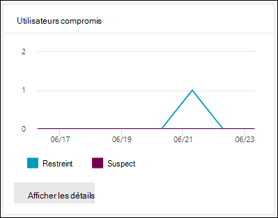

L’affichage d’agrégat affiche les données des 90 derniers jours et affiche les données des 30 derniers jours.

Pour afficher le rapport, ouvrez le [Centre de sécurité & conformité](https://protection.office.com), accédez **Reports** au \> **tableau de bord** rapports et sélectionnez **utilisateurs compromis**. Pour accéder directement au rapport, ouvrez <https://protection.office.com/reportv2?id=CompromisedUsers> .

Vous pouvez filtrer le graphique et le tableau détails en cliquant sur **filtres** et en sélectionnant une ou plusieurs des valeurs suivantes :

- **Date de début** et **Date de fin**

- **Suspect**: le compte d’utilisateur a envoyé un courrier électronique suspect et n’est pas autorisé à envoyer des courriers électroniques.

- **Restricted**: le compte d’utilisateur ne peut pas envoyer de courrier électronique en raison de modèles très suspects.

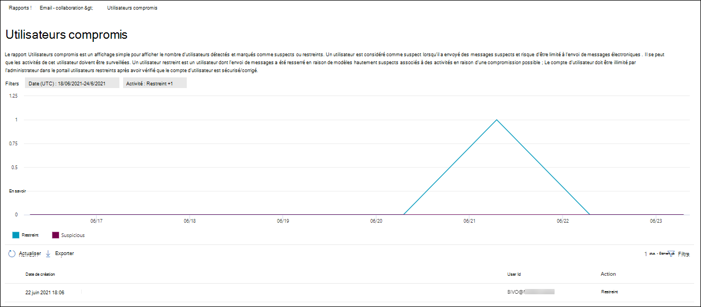

Si vous cliquez sur **afficher les détails table**, vous pouvez voir les détails suivants :

- **Heure de création**
- **ID d'utilisateur**
- **Action**

Pour revenir à l’affichage de rapport, cliquez sur **afficher le rapport**.

## Rapport de chiffrement

Le **rapport de chiffrement** est disponible dans EOP (abonnements avec boîtes aux lettres dans Exchange Online ou environnement EOP autonome sans boîte aux lettres Exchange Online). L’équipe de sécurité de votre organisation peut utiliser les informations contenues dans ce rapport pour identifier des modèles et appliquer ou ajuster de façon proactive des stratégies pour les messages électroniques sensibles. Par exemple :

- Si vous voyez un grand nombre de messages électroniques chiffrés par les utilisateurs, vous souhaiterez peut-être ajouter une stratégie de chiffrement pour automatiser le chiffrement pour certains cas d’utilisation. Pour plus d’informations, reportez-vous à la rubrique [définition de règles de flux de messagerie pour chiffrer les messages électroniques dans Microsoft 365](../../compliance/define-mail-flow-rules-to-encrypt-email.md).

- Si un certain nombre de modèles de chiffrement sont disponibles mais que personne ne les utilise, vous pouvez découvrir si les utilisateurs ont besoin d’une formation sur les fonctionnalités.

L’affichage d’agrégation autorise le filtrage pendant les 90 derniers jours, tandis que l’affichage des détails autorise le filtrage pendant 10 jours.

Pour afficher le rapport, ouvrez le [Centre de sécurité & conformité](https://protection.office.com), accédez **Reports** au \> **tableau de bord** rapports et sélectionnez **rapport de chiffrement**. Pour accéder directement au rapport, ouvrez <https://protection.office.com/reportv2?id=EncryptionReport> .

Pour en savoir plus sur le chiffrement, consultez la rubrique [chiffrement des messages électroniques dans Microsoft 365](../../compliance/email-encryption.md).

### Affichage de rapport pour le rapport de chiffrement

Vous pouvez utiliser les filtres suivants sur le graphique :

- **Afficher les données par : rapport de chiffrement des messages** et dépanner **par : méthode**de chiffrement : les méthodes de chiffrement suivantes sont disponibles :

  - **Chiffrement par utilisateur**
  - **Chiffrement par stratégie**

  Si vous cliquez sur **filtres**, vous pouvez modifier le graphique avec les filtres suivants :

  - **Date de début** et **Date de fin**
  - Méthode de chiffrement.
  - Modèle de chiffrement.

- **Afficher les données par : rapport de chiffrement des messages** et dépanner **par : modèle de chiffrement**: les méthodes de chiffrement suivantes sont disponibles :

  - **Ne pas transférer**
  - **Chiffrer uniquement**
  - **OME précédent**
  - **Personnalisé**

  Si vous cliquez sur **filtres**, vous pouvez modifier le graphique avec les filtres suivants :

  - **Date de début** et **Date de fin**
  - Méthode de chiffrement
  - Modèle de chiffrement

- **Afficher les données de : 5 principaux domaines de destinataire**: cette vue affiche un graphique en secteurs avec le nombre de messages envoyés pour les 5 principaux domaines de destinataire.

  Si vous cliquez sur **filtres**, vous pouvez sélectionner une **Date de début** et une date de **fin**.

### Vue de la table Détails pour le rapport de chiffrement

Si vous cliquez sur **afficher les détails table**, les informations affichées dépendent du graphique que vous examinez :

- Dépanner **en : méthode de chiffrement** ou **décomposer par : modèle de chiffrement**: les informations suivantes sont affichées :

  - **Date**
  - **Adresse de l’expéditeur**
  - **Modèle de chiffrement**
  - **Méthode de chiffrement**
  - **Adresse du destinataire**
  - **Subject**

- **Afficher les données par : les principaux domaines de destinataires**:

  - **Date**
  - **Domaine du destinataire**
  - **Nombre de messages**
  
Si vous cliquez sur **filtres** dans un affichage tableau détaillé, vous pouvez modifier les résultats à l’aide des filtres suivants :

- **Date de début** et **Date de fin**
- Méthode de chiffrement
- Modèle de chiffrement

Pour revenir à l’affichage de rapport, cliquez sur **afficher le rapport**.

## Rapport d’état de flux de flux

Le **rapport d’état de flux** de courrier contient des informations sur les messages malveillants, le courrier indésirable, le hameçonnage et le serveur Edge bloqué. Pour plus d’informations, consultez la rubrique [flux de rapport d’État](view-mail-flow-reports.md#mailflow-status-report).

## Détections de programmes malveillants dans le rapport de messagerie

Le rapport **détections de programmes malveillants dans le courrier électronique** affiche des informations sur les détections de programmes malveillants dans les messages électroniques entrants et sortants (programmes malveillants détectés par Exchange Online protection ou EOP). Pour plus d’informations sur la protection contre les programmes malveillants dans EOP, consultez la rubrique [Anti-Malware Protection in EOP](anti-malware-protection.md).

 Le filtre d’affichage global autorise 90 jours, tandis que le filtre de table des détails autorise uniquement 10 jours.

Pour afficher le rapport, ouvrez le [Centre de sécurité & conformité](https://protection.office.com), accédez **Reports** au \> **tableau de bord** rapports et sélectionnez **détections de programmes malveillants dans le courrier électronique**. Pour accéder directement au rapport, ouvrez <https://protection.office.com/reportv2?id=MalwareDetections> .

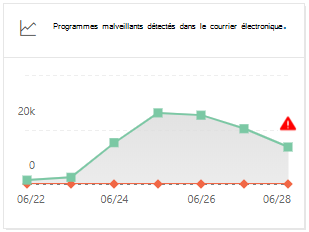

Vous pouvez filtrer le graphique et le tableau détails en cliquant sur **filtres** et en sélectionnant :

- **Date de début** et **Date de fin**
- **Entrants**
- **Sortant**

Si vous cliquez sur **afficher les détails table**, vous pouvez voir les détails suivants :

- **Date**
- **Adresse de l’expéditeur**
- **Adresse du destinataire**
- **ID du message**: disponible dans le champ d’en-tête **message-ID** de l’en-tête du message et doit être unique. Un exemple de valeur est `<08f1e0f6806a47b4ac103961109ae6ef@server.domain>` (Notez les chevrons).
- **Subject**
- **Filename**
- **Nom du programme malveillant**

Pour revenir à l’affichage de rapport, cliquez sur **afficher le rapport**.

## Rapport de courrier électronique envoyé et reçu

Le rapport **courrier électronique envoyé et reçu** contient des informations sur les programmes malveillants, le courrier indésirable, les règles de flux de messagerie (également appelées règles de transport) et les détections de programmes malveillants avancés une fois que le courrier entre dans le service. Pour plus d’informations, consultez la rubrique [rapport de courrier électronique envoyé et reçu](view-mail-flow-reports.md#sent-and-received-email-report).

## Rapport sur la détection des courriers indésirables

Le rapport **détections du courrier** indésirable affiche les messages électroniques de courrier indésirable bloqués par EOP. Les messages sont comptés individuellement, et non par destinataire. Par exemple, si le même message de courrier indésirable a été envoyé aux destinataires 100 de votre organisation, il compte comme un seul message.

L’affichage agrégat autorise un filtrage de 90 jours, tandis que le tableau des détails autorise un filtrage de 10 jours.

Pour afficher le rapport, ouvrez le [Centre de sécurité & conformité](https://protection.office.com), accédez à **rapports** \> **Dashboard** et sélectionnez **détections de courrier indésirable**. Pour accéder directement au rapport, ouvrez <https://protection.office.com/reportv2?id=SpamDetections> .

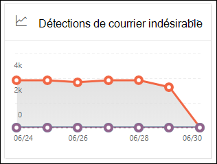

Pour plus d’informations sur la protection contre le courrier indésirable, consultez la rubrique [protection contre le courrier indésirable dans EOP](anti-spam-protection.md).

### Affichage de rapport pour le rapport des détections de courrier indésirable

Les graphiques suivants sont disponibles dans l’affichage rapport :

- **Décomposation par : action**: les types d’événements suivants sont affichés :

  - **Contenu du courrier indésirable filtré**
  - **Blocage d’IP de courrier indésirable**
  - **Bloc d’enveloppe de courrier indésirable**
  - **Filtre DBEB de courrier indésirable**: blocage du périmètre basé sur l’annuaire (DBEB)

  Lorsque vous placez le curseur de la souris sur un jour (point de données) dans le graphique, vous pouvez voir le nombre d’éléments qui ont été bloqués cette journée, ainsi que la façon dont ces éléments sont catégorisés.

  

- **Décomposer en : direction**: les instructions suivantes sont affichées :

  - **Entrants**
  - **Sortant**

  

Si vous cliquez sur **filtres** dans un affichage de rapport, vous pouvez modifier les résultats à l’aide des filtres suivants :

- **Date de début** et **Date de fin**
- Valeurs de la direction
- Valeurs de type d’événement

### Vue de la table Détails pour le rapport des détections de courrier indésirable

Si vous cliquez sur **afficher les détails** de la table dans n’importe quel affichage de rapport, les informations suivantes s’affichent :

- **Date**
- **Adresse de l’expéditeur**
- **Adresse du destinataire**
- **Type d’événement**
- **Action**
- **Subject**

Si vous cliquez sur **filtres** dans un tableau de détails, vous pouvez modifier les résultats à l’aide des filtres suivants :

- **Date de début** et **Date de fin**
- Valeurs de la direction
- Valeurs de type d’événement

Pour revenir à l’affichage de rapport, cliquez sur **afficher le rapport**.

## Rapport des détections d’usurpation

Le rapport des **détections d’usurpation** indique le nombre de messages d’usurpation d’identité détectés et ceux qui ont été considérés comme « corrects » (courrier infalsifiable pour des raisons professionnelles légitimes). Pour plus d’informations sur l’usurpation, consultez la rubrique [protection contre l’usurpation d’identité dans EOP](anti-spoofing-protection.md).

La vue agrégée du rapport autorise 90 jours de filtrage, tandis que l’affichage détaillé autorise uniquement les 10 jours de filtrage.

Pour afficher le rapport, ouvrez le [Centre de sécurité & conformité](https://protection.office.com), accédez à **rapports** \> **Dashboard** et sélectionnez **détections d’usurpation d’identité**. Pour accéder directement au rapport, ouvrez <https://protection.office.com/reportv2?id=SpoofMailReport> .

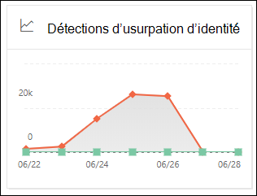

Lorsque vous placez le curseur de la souris sur un jour (point de données) dans le graphique, vous pouvez voir le nombre de messages électroniques d’usurpation.

Vous pouvez filtrer le graphique et le tableau détails en cliquant sur **filtres** et en sélectionnant une ou plusieurs des valeurs suivantes :

- **Date de début** et **Date de fin**

- **Courrier électronique approprié**

- **Détecté comme courrier indésirable**

Si vous cliquez sur **afficher les détails table**, vous pouvez voir les détails suivants :

- **Date**
- **Expéditeur usurpé**
- **Véritable expéditeur**
- **IP de l’expéditeur**
- **Action**
- **Nombre de messages**

Pour revenir à l’affichage de rapport, cliquez sur **afficher le rapport**.

## Rapport sur l’état de la protection contre les menaces

Le rapport d' **État de protection contre les menaces** est disponible à la fois dans EOP et dans Office 365 ATP ; Toutefois, les rapports contiennent des données différentes. Par exemple, les clients EOP peuvent afficher des informations sur les programmes malveillants détectés dans les courriers électroniques, mais pas sur les [fichiers malveillants détectés par la protection avancée contre les menaces pour SharePoint, OneDrive ou Microsoft teams](atp-for-spo-odb-and-teams.md).

Le rapport indique le nombre de messages électroniques avec du contenu malveillant, tels que des fichiers ou des adresses de sites Web (URL) bloqués par le moteur anti-programme malveillant, la [purge automatique avec zéro heure (supprimable)](zero-hour-auto-purge.md)et les fonctionnalités ATP telles que les [liens approuvés](atp-safe-links.md), [les pièces jointes fiables](atp-safe-attachments.md)et l' [anti-hameçonnage ATP](set-up-anti-phishing-policies.md). Vous pouvez utiliser ces informations pour identifier les tendances ou déterminer si les stratégies de l’organisation doivent être ajustées. Il est important de comprendre que si un message est envoyé à cinq destinataires, nous le dénombrez cinq messages différents et pas un message.

Pour afficher le rapport, ouvrez le [Centre de sécurité & conformité](https://protection.office.com), accédez à **rapports** \> **Dashboard** et sélectionnez **Threat Protection Status**. Pour accéder directement au rapport, ouvrez l’une des URL suivantes :

- Office 365 ATP : <https://protection.office.com/reportv2?id=TPSAggregateReportATP>
- EOP <https://protection.office.com/reportv2?id=TPSAggregateReport>

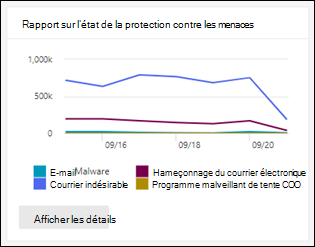

Par défaut, le graphique affiche les données des 7 derniers jours. Si vous cliquez sur **filtres**, vous pouvez sélectionner une plage de dates de 90 jours (les abonnements à la version d’évaluation peuvent être limités à 30 jours). La vue de table des détails autorise le filtrage pendant 30 jours.

### Affichage de rapport pour le rapport d’état de protection contre les menaces

Les vues disponibles sont les suivantes :

- **Afficher les données par : vue d’ensemble**: les informations de détection suivantes sont affichées :

  - **Courrier malveillant de messagerie**
  - **Courrier hameçon**
  - **Programme malveillant de contenu**

  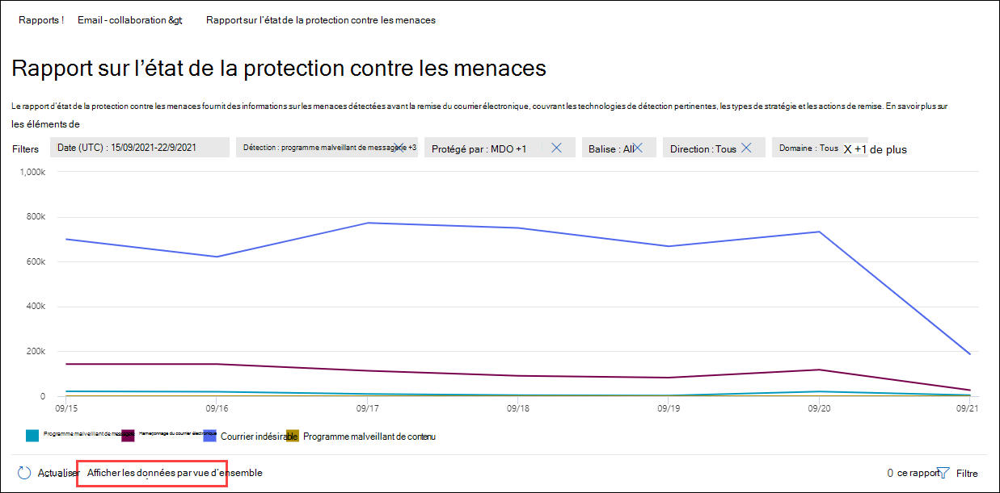

- **Afficher les données par : contenu \> Programme malveillant**1: les informations suivantes sont affichées pour les organisations Office 365 ATP :

  - **Moteur anti-programme malveillant**: captures de fichiers malveillants dans SharePoint Online, OneDrive et teams par anti-programme malveillant.
  - **Détonation**des fichiers malveillants dans SharePoint Online, OneDrive et teams par des pièces jointes fiables.

  

- **Afficher les données par : substitution de message**: les informations de raison de remplacement suivantes sont affichées :

  - **Omission sur site**
  - **Autoriser IP**
  - **Règle de flux de messagerie**
  - **Expéditeur autorisé**
  - **Autorisation de domaine**
  - **ZAP non activée**
  - **Dossier courrier indésirable non activé**
  - **Expéditeur approuvé par l’utilisateur**
  - **Domaine approuvé par l’utilisateur**

  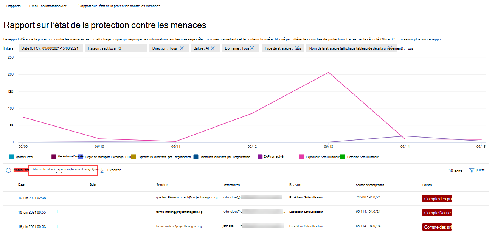

- Dépanner **par : la technologie de détection** et l' **affichage des données par : E-mail \> hameçon**: les informations suivantes sont affichées :

  - Fonctionnalité de **réputation d’URL générée par l’ATP**1: réputation d’URL malveillante générée à partir de détonateurs ATP dans d’autres clients ATP.
  - **Filtre anti-hameçonnage avancé**: signaux d’hameçonnage basés sur l’apprentissage de l’ordinateur.
  - **Échec de l’anti-falsification-DMARC**: échec de l’authentification DMARC sur les messages.
  - **Anti-spoof-intra-org**: l’expéditeur tente d’usurper le domaine du destinataire.
  - **Anti-falsification-domaine externe**: l’expéditeur tente d’usurper un autre domaine.
  - **Emprunt d’identité de marque**: emprunt d’identité de marques connues basées sur des expéditeurs.
  - **Emprunt d’identité de domaine**1: emprunt d’identité de domaines que le client possède ou définit.
  - **Réputation d’URL EOP**: réputation d’URL malveillante.
  - **Filtre de hameçonnage général**: signal d’hameçonnage basé sur les règles d’analyste. 
  - **Autres**
  - **Hameçonnage zap**2: suppression automatique des messages d’hameçonnage par zéro heure.
  - **Détonation d’URL**1
  - **Emprunt d’identité de l’utilisateur**1: emprunt d’identité des utilisateurs défini par l’administrateur ou appris via l’intelligence des boîtes aux lettres.

  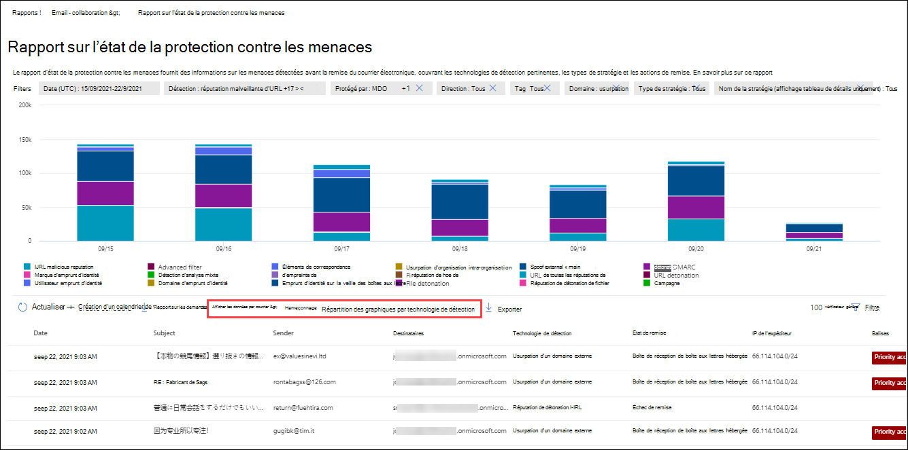

- Dépanner **par : les technologies de détection** et les **données d’affichage par : \> programmes malveillants de messagerie**: les informations suivantes sont affichées :

  - **Réputation de fichier générée par l’ATP**1: toutes les réputations de fichiers malveillants générées par les détonateurs ATP.
  - **Moteur anti-programme malveillant**1: détection à partir de moteurs anti-programme malveillant.
  - **Bloc de type fichier de stratégie anti-programme malveillant**: il s’agit de messages électroniques filtrés en raison du type de fichier malveillant identifié dans le message.
  - **Détonation de fichier**1: captures de détonation de fichier par des pièces jointes fiables.  
  - **Réputation de fichier malveillant**
  - **Programme malveillant zap**2
  - **Autres**

  

- **Décomposation par : type de stratégie** et **affichage des données : envoyez un message électronique \> hameçon** ou **Affichez les données par : courrier \> malveillant**: les informations suivantes sont affichées :

  - **Anti-programme malveillant**
  - **Pièce jointe fiable**1
  - **Anti-hameçonnage**
  - **Blocage du courrier indésirable**
  - **Règle de flux de messagerie** (également appelée règle de transport)
  - **Autres**

  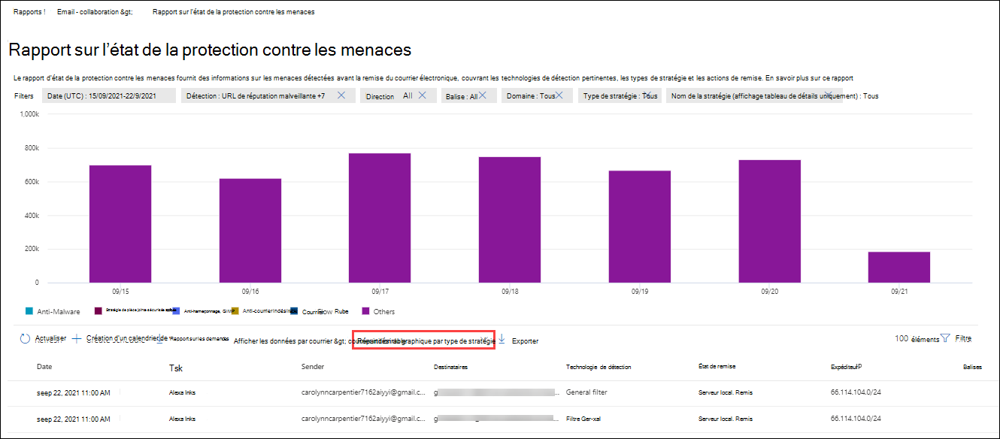

- Dépanner **: état de remise** et **afficher les données par : courrier \> hameçon** ou **affichage des données par : courrier \> malveillant**: les informations suivantes sont affichées :

  - **Échec de la remise**
  - **Raccroché**
  - **Renvoyé**
  - **Boîte aux lettres hébergée : dossier personnalisé**
  - **Boîte aux lettres hébergée : éléments supprimés**
  - **Boîte aux lettres hébergée : boîte de réception**
  - **Boîte aux lettres hébergée : courrier indésirable**
  - **Serveur local : fourni**
  - **Mise en quarantaine**

  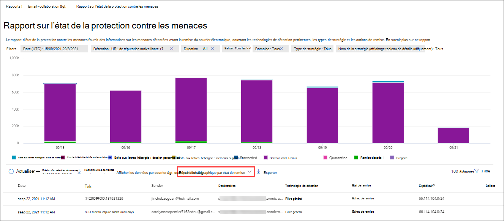

1 ATP Office 365 uniquement

2 la purge automatique à zéro heure (ZAP) n’est pas disponible dans la version autonome d’EOP (elle fonctionne uniquement dans les boîtes aux lettres Exchange Online).

Si vous cliquez sur **filtres**, les filtres disponibles dépendent du graphique que vous examinez :

Pour **les \> programmes malveillants de contenu**, vous pouvez modifier le rapport par **Date de début** et **Date de fin**, ainsi que la valeur de **détection** .

Pour le **remplacement de message**, vous pouvez modifier le rapport avec les filtres suivants :

- **Date de début** et **Date de fin**
- **Motif de remplacement**
- **Tag**: Filter by tag pour renvoyer des utilisateurs ou des groupes auxquels une balise spécifique a été appliquée. Pour plus d’informations sur les balises utilisateur, voir [User Tags](user-tags.md).
- **Domaine**

Pour tous les autres affichages, vous pouvez modifier le rapport avec les filtres suivants :

- **Date de début** et **Date de fin**
- **Détection**
- **Protégé par**: **ATP** ou **EOP**
- **Tag**: Filter by tag pour renvoyer des utilisateurs ou des groupes auxquels une balise spécifique a été appliquée. Pour plus d’informations sur les balises utilisateur, voir [User Tags](user-tags.md).
- **Domaine**

### Vue de la table Détails pour le rapport d’état de protection contre les menaces

Si vous cliquez sur **afficher les détails table**, les informations affichées dépendent du graphique que vous examinez :

- **Afficher les données par : contenu \> Programmes malveillants**:

  - **Date**
  - **Location**
  - **Demandé par**
  - **Nom du programme malveillant**

Si vous cliquez sur **filtres** dans cet affichage, vous pouvez modifier le rapport par **Date de début** et date de **fin**, ainsi que par la valeur de **détection** .

- **Afficher les données par : remplacement de message**:

  - **Date**
  - **Subject**
  - **Expéditeur**
  - **Destinataires**
  - **Détectés par**
  - **Motif de remplacement**
  - **Source de compromission**
  - **Tags**

Si vous cliquez sur **filtres** dans cet affichage, vous pouvez modifier le rapport avec les filtres suivants :

- **Date de début** et **Date de fin**
- **Motif de remplacement**
- **Tag**: Filter by tag pour renvoyer des utilisateurs ou des groupes auxquels une balise spécifique a été appliquée. Pour plus d’informations sur les balises utilisateur, voir [User Tags](user-tags.md).
- **Domaine**
- **Destinataires** (Notez que cette propriété filtrable est disponible uniquement dans l’affichage Table des détails)

**Afficher les données par : vue d’ensemble**: aucun bouton **afficher la table des détails** n’est disponible.

- Tous les autres graphiques :

  - **Date**
  - **Subject**
  - **Expéditeur**
  - **Destinataires**
  - **Détectés par**
  - **État de remise**
  - **Source de compromission**
  - **Tags**

Si vous cliquez sur **filtres**, vous pouvez modifier le rapport avec les filtres suivants :

- **Date de début** et **Date de fin**
- **Détection**
- **Protégé par** (Office 365 ATP uniquement) : **ATP** ou **EOP**
- **Tag**: Filter by tag pour renvoyer des utilisateurs ou des groupes auxquels une balise spécifique a été appliquée. Pour plus d’informations sur les balises utilisateur, voir [User Tags](user-tags.md).
- **Domaine**
- **Destinataires** (Notez que cette propriété filtrable est disponible uniquement dans l’affichage Table des détails)

## Premier rapport de programmes malveillants

Le rapport des **principaux programmes malveillants** indique les différents types de programmes malveillants détectés par la [protection contre les programmes malveillants dans EOP](anti-malware-protection.md).

Pour afficher le rapport, ouvrez le [Centre de sécurité & conformité](https://protection.office.com), accédez à **rapports** \> **Dashboard** et sélectionnez les **principaux programmes malveillants**. Pour accéder directement au rapport, ouvrez <https://protection.office.com/reportv2?id=TopMalware> .

Lorsque vous placez le curseur de la souris sur un coin du graphique en secteurs, vous pouvez voir le nom d’un type de programme malveillant et le nombre de messages détectés comme présentant ce programme malveillant.

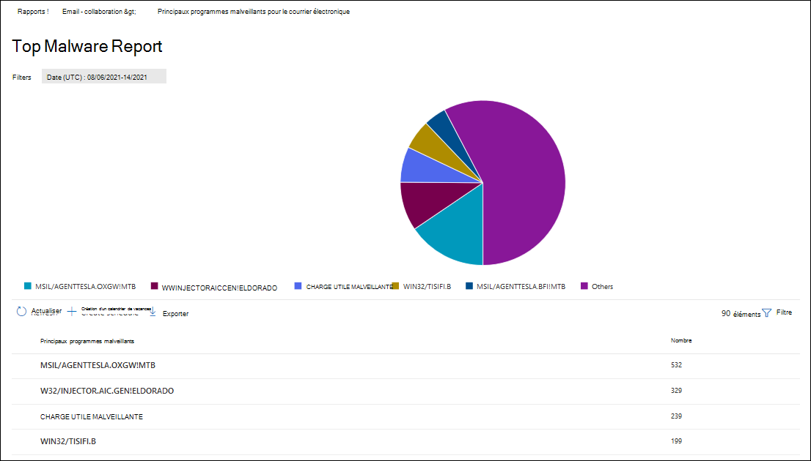

Si vous cliquez sur **afficher les détails table**, vous pouvez voir les détails suivants :

- **Principaux programmes malveillants**
- **Count**

Si vous cliquez sur **filtres** dans le mode État ou le tableau détails, vous pouvez spécifier une plage de dates avec **Date de début** et date de **fin**.

## Rapport d’URL de protection contre les menaces

Le **rapport URL protection contre les menaces** est disponible dans Office 365 Advanced Threat Protection (ATP). Pour plus d’informations, consultez la rubrique [URL Threat Protection report](view-reports-for-atp.md#url-threat-protection-report).

## Rapport sur les messages signalés par l’utilisateur

Le rapport **messages signalés** par l’utilisateur affiche des informations sur les messages électroniques que les utilisateurs ont signalés comme courriers indésirables, tentatives de hameçonnage ou courrier électronique à l’aide du [complément de message de rapport](https://docs.microsoft.com/microsoft-365/security/office-365-security/enable-the-report-message-add-in).

Des détails sont disponibles pour chaque message, notamment la raison de remise, une exception de stratégie de courrier indésirable ou une règle de flux de messagerie configurée pour votre organisation. Pour afficher les détails, sélectionnez un élément dans la liste rapports utilisateur, puis affichez les informations sous les onglets **Résumé** et **Détails** .

Pour afficher ce rapport, dans le [Centre de sécurité & conformité](https://protection.office.com), effectuez l’une des opérations suivantes :

- Accédez au **Threat management** \> **tableau de bord** gestion \> **des menaces-messages signalés par l’utilisateur**.

- Accédez à **Threat management** \> **examen** \> **des menaces-messages signalés par l’utilisateur**.

> [!IMPORTANT]
> Pour que le rapport des messages signalés par l’utilisateur fonctionne correctement, la **journalisation d’audit doit être activée** pour votre environnement Office 365. Cette opération est généralement réalisée par une personne disposant du rôle journaux d’audit dans Exchange Online. Pour plus d’informations, voir [activer ou désactiver la recherche dans le journal d’audit Microsoft 365](https://docs.microsoft.com/microsoft-365/compliance/turn-audit-log-search-on-or-off).

## Quelles sont les autorisations nécessaires pour afficher ces rapports ?

Pour afficher et utiliser les rapports, vous devez être membre du groupe de rôles spécifié dans le centre de sécurité & conformité **et** dans Exchange Online.

- Dans le centre de sécurité & conformité, vous devez être membre de l’un des groupes de rôles suivants :

  -Gestion de l’organisation-administrateur de la sécurité (vous pouvez également le faire dans le [Centre d’administration Azure Active Directory](https://aad.portal.azure.com) -lecteur de sécurité

  Pour en savoir plus, consultez [Autorisations dans le Centre de sécurité et de conformité](https://docs.microsoft.com/microsoft-365/security/office-365-security/permissions-in-the-security-and-compliance-center).

- Dans Exchange Online, vous devez être membre de l’un des groupes de rôles suivants :

  -Gestion de l’organisation-affichage uniquement-gestion de l’organisation-affichage uniquement des destinataires-gestion de la conformité

Pour plus d’informations, consultez la rubrique [autorisations dans Exchange Online](https://docs.microsoft.com/Exchange/permissions-exo/permissions-exo) et [gérer les groupes de rôles dans Exchange Online](https://docs.microsoft.com/Exchange/permissions-exo/role-groups).

## Qu’en est-il si les rapports n’affichent pas de données ?

Si vous ne voyez pas de données dans vos rapports, vérifiez que vos stratégies sont correctement configurées. Pour en savoir plus, consultez la rubrique se [protéger contre les menaces](protect-against-threats.md).

## Voir aussi

[Protection contre le courrier indésirable et les programmes malveillants dans EOP](anti-spam-and-anti-malware-protection.md)

[Rapports intelligents et aperçus dans le Centre de sécurité et conformité](reports-and-insights-in-security-and-compliance.md)

[Afficher les rapports de flux de messagerie dans le centre de sécurité & conformité](view-mail-flow-reports.md)

[Afficher les rapports pour Office 365 protection avancée contre les menaces](view-reports-for-atp.md)
