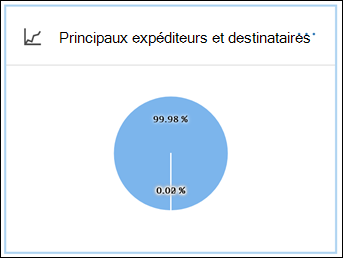

# Afficher les rapports de sécurité de courrier dans le centre de sécurité et conformité

Un grand nombre de rapports sont disponibles dans le [Centre de conformité security &](https://protection.office.com) pour vous aider à découvrir comment les fonctionnalités de sécurité de messagerie, telles que le blocage du courrier indésirable, les programmes malveillants et les fonctionnalités de chiffrement de Microsoft 365 protègent votre organisation. Si vous disposez des [autorisations nécessaires](#what-permissions-are-needed-to-view-these-reports), vous pouvez afficher ces rapports dans le centre de sécurité & conformité en accédant au **Reports** \> **tableau de bord**rapports.

Vos rapports de sécurité de messagerie incluent les éléments suivants :

- [Rapport d’URL de protection contre les menaces](#url-threat-protection-report-new) (**nouveau !**)
- [Rapport sur les utilisateurs compromis](#compromised-users-report)
- [Rapport de chiffrement](#encryption-report)
- [Rapport sur l’état de la protection contre les menaces](#threat-protection-status-report)
- [Rapport de détection des programmes malveillants](#malware-detections-report)
- [Premier rapport de programmes malveillants](#top-malware-report)
- [Rapport des expéditeurs et des destinataires principaux](#top-senders-and-recipients-report)
- [Rapport des détections d’usurpation](#spoof-detections-report)
- [Rapport de détections de courrier indésirable](#spam-detections-report)
- [Rapport de courrier électronique envoyé et reçu](#sent-and-received-email-report)
- [Rapport sur les messages signalés par l’utilisateur](#user-reported-messages-report)

## Rapport d’URL de protection contre les menaces (**nouveau !**)

Le rapport URL protection contre les menaces est disponible pour tous les utilisateurs :

- Un module complémentaire de protection avancée contre *les menaces et* Exchange Online (plan 1 *ou* plan 2)
- Un abonnement Microsoft 365 E5

Il s’agit d’un rapport « centré sur les clic » qui comporte deux vues agrégées.

1. La première vue est par *action de protection par clic sur les URL*, qui est axée sur l’affichage du nombre de clics d’URL par les utilisateurs au sein du client, ainsi que le résultat du clic. Un clic indique que l’utilisateur a cliqué sur la page bloquer pour le site Web malveillant (il peut être désactivé par l’administrateur au sein d’une stratégie de liens fiables).

2. La deuxième vue est *URL Click by applications*, qui affiche le nombre d’URL cliquez dans différentes applications qui prennent en charge les liens fiables dès aujourd’hui, comme dans un client de messagerie ou dans Microsoft Word. Les données dans les deux vues agrégées sont actualisées toutes les 4 heures.

Le tableau des détails du rapport URL protection protection fournit une vue quasi en temps réel de tous les clics effectués au sein du client, ainsi que des informations d’identification telles que le *nom d’utilisateur*, l' *URL*, l' *ID de message réseau* (si l’URL a cliqué dans un e-mail), ainsi que d’autres informations précieuses utiles pour les analyses et les analyses.

Par défaut, le rapport affiche uniquement les données sur les clics à partir d’URL bloquées par les liens fiables, mais il est également possible d’afficher des informations pour tous les clics d’URL en sélectionnant *URL autorisées* dans les filtres.

Ce rapport ne disposera pas de données de clics à partir des utilisateurs pour lesquels la stratégie de liens fiables est sélectionnée lorsque l’option *ne pas suivre les clics utilisateur* est sélectionnée.

## Rapport sur les utilisateurs compromis

Ce rapport, accessible à tous les utilisateurs disposant d’Exchange Online Protection, indique le nombre de comptes d’utilisateur marqués comme suspects ou utilisateurs restreints, données particulièrement utiles en tant que comptes entrez l’un des États qui indique que le compte d’utilisateur peut être problématique, voire compromis. Dans le cas d’une utilisation fréquente, le rapport de l’utilisateur compromis peut repérer des pics, voire des tendances, dans des comptes marqués dans des États suspects ou restreints, donnant des preuves à un problème de sécurité et du bien-être de votre client.

## Rapport de chiffrement

Le **rapport de chiffrement** affiche des informations sur les messages électroniques qui ont été chiffrés, via les stratégies de votre organisation ou par le biais de contrôles utilisateur final. L’équipe de sécurité de votre organisation peut utiliser les informations contenues dans ce rapport pour identifier des modèles et appliquer ou ajuster de façon proactive des stratégies pour les messages électroniques sensibles.

Pour afficher ce rapport, accédez au rapport de **Reports** \> **Dashboard** \> **chiffrement**du tableau de bord des rapports dans le centre de sécurité & conformité.

Lors de la première ouverture du rapport, vous verrez des données sur les méthodes de chiffrement utilisées sur les messages électroniques pour les sept (7) derniers jours. Vous pouvez modifier la plage de dates et les détails affichés dans le rapport en cliquant sur **filtres** dans le coin supérieur droit de l’écran.

Vous pouvez également utiliser le menu **dépanner par** pour afficher les données en utilisant un modèle de chiffrement (ou une méthode).

De plus, vous pouvez utiliser le menu **afficher les données par** pour afficher le nombre de messages chiffrés sur les cinq domaines destinataires.

Avec la flexibilité du nouveau rapport de chiffrement, vous pouvez afficher les tendances et prendre les mesures appropriées. Par exemple, si vous voyez un grand nombre de messages électroniques chiffrés par les utilisateurs, vous souhaiterez peut-être ajouter une stratégie de chiffrement pour automatiser le chiffrement pour certains cas d’utilisation. (Pour obtenir de l’aide, reportez-vous à la rubrique [définition de règles de flux de messagerie pour chiffrer les messages électroniques dans Microsoft 365](../../compliance/define-mail-flow-rules-to-encrypt-email.md).) En guise d’exemple, si un certain nombre de modèles de chiffrement sont disponibles mais que personne ne les utilise, vous pouvez découvrir si les utilisateurs ont besoin d’une formation pour cette fonctionnalité.

Ce rapport permet à l’équipe de sécurité et de conformité de votre organisation de surveiller le mode d’utilisation du chiffrement des messages et d’indiquer si d’autres actions sont nécessaires. Pour en savoir plus sur le chiffrement, consultez la rubrique [chiffrement des messages électroniques dans Microsoft 365](../../compliance/email-encryption.md).

## Rapport sur l’état de la protection contre les menaces

Le rapport d' **État de protection contre les menaces** est un rapport intelligent qui affiche des messages malveillants détectés et bloqués par Exchange Online Protection. Ce rapport est utile pour afficher le courrier électronique identifié comme un programme malveillant ou une tentative de hameçonnage dans le temps (jusqu’à 90 jours), et permet aux administrateurs de sécurité d’identifier les tendances ou de déterminer si les stratégies ont besoin d’être ajustées.

> [!NOTE]
> Un rapport d’état de protection contre les menaces est disponible pour les clients qui ont [Office 365 ATP](https://docs.microsoft.com/microsoft-365/security/office-365-security/office-365-atp) ou [Exchange Online Protection](exchange-online-protection-overview.md) (EoP); Toutefois, les informations affichées dans le rapport d’état de protection contre les menaces pour les clients ATP contiennent probablement des données différentes de celles que peuvent afficher les clients EOP. Par exemple, les clients EOP peuvent afficher des informations sur les programmes malveillants détectés dans les messages électroniques, mais pas les informations sur les [fichiers malveillants détectés dans SharePoint Online, OneDrive ou Microsoft teams](https://docs.microsoft.com/microsoft-365/security/office-365-security/atp-for-spo-odb-and-teams), une capacité spécifique à la protection avancée contre les menaces. ([En savoir plus sur les rapports ATP](https://docs.microsoft.com/microsoft-365/security/office-365-security/view-reports-for-atp).)

Pour afficher ce rapport, dans le [Centre de sécurité & conformité](https://protection.office.com), accédez à **rapports** \> **tableau de bord** de \> **protection contre les menaces**.

Lorsque vous ouvrez pour la première fois le rapport d’état de protection contre les menaces, le rapport affiche les données des sept derniers jours par défaut ; Toutefois, vous pouvez cliquer sur **filtres** et modifier la plage de dates pour un maximum de 90 jours de détail. (Si vous utilisez un abonnement d’évaluation, vous pouvez être limité à 30 jours de données.)

Ce rapport est utile pour l’affichage de l’efficacité et de l’impact des [fonctionnalités Exchange Online Protection](https://docs.microsoft.com/microsoft-365/security/office-365-security/eop-features)de votre organisation et pour des tendances à long terme.

Vous pouvez également choisir d’afficher les données pour les e-mails identifiés comme malveillants, les e-mails identifiés comme des tentatives de hameçonnage ou par e-mail identifiés comme contenant des programmes malveillants.

## Rapport de détection des programmes malveillants

Le rapport **détections de programmes malveillants** indique le nombre de messages entrants et sortants détectés comme contenant des programmes malveillants pour votre organisation.

Pour afficher ce rapport, dans le [Centre de sécurité & conformité](https://protection.office.com), accédez à **rapports** \> **Dashboard** \> **Detections**.

À l’instar d’autres rapports, comme le [rapport d’état de protection contre les menaces](#threat-protection-status-report), le rapport affiche les données des sept derniers jours par défaut. Toutefois, vous pouvez choisir des **filtres** pour modifier la plage de dates.

## Premier rapport de programmes malveillants

Le rapport des **principaux programmes malveillants** indique les différents types de programmes malveillants détectés par [Exchange Online](https://docs.microsoft.com/microsoft-365/security/office-365-security/eop-features).

Pour afficher ce rapport, dans le [Centre de sécurité & conformité](https://protection.office.com), consultez la partie rapports du tableau de bord des **rapports** \> **Dashboard** \> **Top Malware**.

Lorsque vous placez le curseur de la souris sur un coin du graphique en secteurs, vous pouvez voir le nom d’un type de programme malveillant et le nombre de messages détectés comme présentant ce programme malveillant.

Cliquez (ou appuyez) sur le rapport pour l’ouvrir dans une nouvelle fenêtre de navigateur, dans laquelle vous pouvez obtenir une vue plus détaillée du rapport.

Sous le graphique, vous verrez une liste de programmes malveillants détectés et le nombre de messages détectés comme présentant ce programme malveillant.

## Rapport des expéditeurs et des destinataires principaux

Le rapport des **expéditeurs et des destinataires principaux** est un graphique en secteurs illustrant les principaux expéditeurs de vos courriers électroniques.

Pour afficher ce rapport, dans le [Centre de sécurité & conformité](https://protection.office.com), accédez à **rapports** \> **tableau de bord** \> **des expéditeurs et destinataires principaux**.

Lorsque vous placez le curseur de la souris sur un coin du graphique en secteurs, vous pouvez voir le nombre de messages envoyés ou reçus.

Cliquez (ou appuyez) sur le rapport pour l’ouvrir dans une nouvelle fenêtre de navigateur, dans laquelle vous pouvez obtenir une vue plus détaillée du rapport.

Utilisez la liste **afficher les données pour** déterminer si vous souhaitez afficher les données des destinataires, des expéditeurs, des destinataires de courrier indésirable et des programmes malveillants les plus fréquents. Vous pouvez également consulter la personne qui a reçu un programme malveillant détecté par [Exchange Online Protection](exchange-online-protection-overview.md).

Sous le graphique, vous verrez les expéditeurs et destinataires de courriers les plus fréquents, ainsi que le nombre de messages envoyés ou reçus pendant la période donnée.

## Rapport des détections d’usurpation

Le rapport des **détections d’usurpation** indique le nombre de messages d’usurpation d’identité détectés et ceux qui ont été considérés comme « corrects » (courrier infalsifiable pour des raisons professionnelles légitimes).

Pour afficher ce rapport, dans le [Centre de sécurité & conformité](https://protection.office.com), accédez à **rapports** \> **tableau de bord** des rapports \> **Spoof Mail**.

Lorsque vous placez le curseur de la souris sur un jour dans le graphique, vous pouvez voir le nombre de messages d’usurpation d’adresse.

Cliquez (ou appuyez) sur le rapport pour l’ouvrir dans une nouvelle fenêtre de navigateur, dans laquelle vous pouvez obtenir une vue plus détaillée du rapport. Pour en savoir plus sur la protection contre les falsifications, consultez la rubrique [protection contre l’usurpation d’identité dans Microsoft 365](anti-spoofing-protection.md).

## Rapport de détections de courrier indésirable

Le rapport **détections du courrier indésirable** affiche tout le contenu du courrier indésirable bloqué par Exchange Online. Les messages sont comptabilisés par message et non par destinataire. Par exemple, si un message électronique a été envoyé à 100 destinataires au sein de votre organisation, il est compté comme un seul message.

Pour afficher ce rapport, dans le [Centre de sécurité & conformité](https://protection.office.com), accédez à **rapports** \> **tableau de bord** de \> **courrier indésirable**.

Lorsque vous placez le curseur de la souris sur un jour du graphique, vous pouvez voir le nombre d’éléments qui ont été bloqués cette journée, ainsi que la catégorie de ces éléments. Par exemple, vous pouvez voir le nombre de messages indésirables filtrés et le nombre d’éléments provenant d’une adresse IP (Internet Protocol) bloquée.

Cliquez (ou appuyez) sur le rapport pour l’ouvrir dans une nouvelle fenêtre de navigateur, dans laquelle vous pouvez obtenir une vue plus détaillée du rapport.

Sous le graphique, vous verrez une liste d’éléments de courrier indésirable détectés. Sélectionnez un élément pour afficher des informations supplémentaires, par exemple si l’élément de courrier indésirable a été entrant ou sortant, son ID de message et son destinataire. Pour en savoir plus sur la protection contre le courrier indésirable, consultez la rubrique [Office 365 e-mail anti-spam protection](https://docs.microsoft.com/microsoft-365/security/office-365-security/anti-spam-and-anti-malware-protection).

## Rapport de courrier électronique envoyé et reçu

Le rapport de **courrier électronique envoyé et reçu** est un rapport intelligent qui affiche des informations sur les messages entrants et sortants, notamment les détections de courrier indésirable, les programmes malveillants et la messagerie électronique identifiés comme étant « en qualité ».

Pour afficher ce rapport, dans le [Centre de sécurité & conformité](https://protection.office.com), accédez à **rapports** \> **tableau de bord** des \> **messages envoyés et reçus**.

Lorsque vous placez le curseur de la souris sur un jour dans le graphique, vous pouvez voir le nombre de messages qui ont été reçus et la façon dont ces messages sont catégorisés. Par exemple, vous pouvez voir le nombre de messages détectés comme contenant des programmes malveillants et le nombre de messages identifiés comme courrier indésirable.

Cliquez (ou appuyez) sur le rapport pour l’ouvrir dans une nouvelle fenêtre de navigateur, dans laquelle vous pouvez obtenir une vue plus détaillée du rapport.

Vous pouvez utiliser la liste **décomposer par** pour afficher les informations par type ou par direction (entrante et sortante).

Sous le graphique, vous verrez une liste de catégories de courrier, telle que **GoodMail**, **SpamContentFiltered**, etc. Sélectionnez une catégorie pour afficher des informations supplémentaires, telles que des actions qui ont été effectuées pour les programmes malveillants, et si le courrier électronique a été entrant ou sortant.

Pour en savoir plus sur l’intelligence de messagerie, voir [mail Flow Intelligence in Microsoft 365](https://docs.microsoft.com/microsoft-365/security/office-365-security/mail-flow-intelligence-in-office-365).

## Rapport sur les messages signalés par l’utilisateur

Le rapport **messages signalés** par l’utilisateur affiche des informations sur les messages électroniques que les utilisateurs ont signalés comme courriers indésirables, tentatives de hameçonnage ou courrier électronique à l’aide du [complément de message de rapport](https://docs.microsoft.com/microsoft-365/security/office-365-security/enable-the-report-message-add-in).

Des détails sont disponibles pour chaque message, notamment la raison de remise, une exception de stratégie de courrier indésirable ou une règle de flux de messagerie configurée pour votre organisation. Pour afficher les détails, sélectionnez un élément dans la liste rapports utilisateur, puis affichez les informations sous les onglets **Résumé** et **Détails** .

Pour afficher ce rapport, dans le [Centre de sécurité & conformité](https://protection.office.com), effectuez l’une des opérations suivantes :

- Accédez au **Threat management** \> **tableau de bord** gestion \> **des menaces-messages signalés par l’utilisateur**.

- Accédez à **Threat management** \> **examen** \> **des menaces-messages signalés par l’utilisateur**.

> [!IMPORTANT]
> Pour que le rapport des messages signalés par l’utilisateur fonctionne correctement, la **journalisation d’audit doit être activée** pour votre environnement Office 365. Cette opération est généralement réalisée par une personne disposant du rôle journaux d’audit dans Exchange Online. Pour plus d’informations, voir [activer ou désactiver la recherche dans le journal d’audit Microsoft 365](https://docs.microsoft.com/microsoft-365/compliance/turn-audit-log-search-on-or-off).

## Quelles sont les autorisations nécessaires pour afficher ces rapports ?

Pour afficher et utiliser les rapports décrits dans cet article, **vous devez disposer d’un rôle approprié pour le centre de sécurité & conformité et le centre d’administration Exchange**.

- Pour le centre de sécurité & conformité, vous devez disposer de l’un des rôles suivants :

  -Gestion de l’organisation-administrateur de la sécurité (cela peut être affecté dans le centre d’administration Azure Active Directory ( [https://aad.portal.azure.com](https://aad.portal.azure.com) )-lecteur de sécurité

- Pour Exchange Online, vous devez disposer de l’un des rôles suivants, qui est affecté dans le centre d’administration Exchange ( [https://outlook.office365.com/ecp](https://outlook.office365.com/ecp) ) ou avec des applets de commande PowerShell (consultez la rubrique [Exchange Online PowerShell](https://docs.microsoft.com/powershell/exchange/exchange-online/exchange-online-powershell?view=exchange-ps)) :

  -Gestion de l’organisation-affichage seul-affichage-gestion de l’organisation-affichage-uniquement des destinataires gestion de la conformité

Pour en savoir plus, consultez les ressources suivantes :

- [Autorisations dans le centre de conformité et de sécurité](https://docs.microsoft.com/microsoft-365/security/office-365-security/permissions-in-the-security-and-compliance-center)
 
- [Autorisations des fonctionnalités dans Exchange Online](https://docs.microsoft.com/exchange/permissions-exo/feature-permissions)

## Qu’en est-il si les rapports n’affichent pas de données ?

Si vous ne voyez pas de données dans vos rapports, vérifiez que vos stratégies sont correctement configurées. Pour en savoir plus, consultez la rubrique [Protégez-vous contre les menaces dans Microsoft 365](https://docs.microsoft.com/microsoft-365/security/office-365-security/protect-against-threats).

## Rubriques connexes

[Protection contre le courrier indésirable de Microsoft 365](https://docs.microsoft.com/microsoft-365/security/office-365-security/anti-spam-and-anti-malware-protection)

[Rapports et informations dans le centre de sécurité & conformité](https://docs.microsoft.com/microsoft-365/security/office-365-security/reports-and-insights-in-security-and-compliance)
