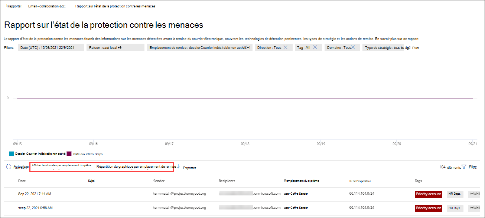

# Afficher les rapports de sécurité de messagerie dans le portail Microsoft 365 Defender messagerie

[!INCLUDE [Microsoft 365 Defender rebranding](../includes/microsoft-defender-for-office.md)]

**S’applique à**
- [Exchange Online Protection](exchange-online-protection-overview.md)
- [Microsoft Defender pour Office 365 : offre 1 et offre 2](defender-for-office-365.md)
- [Microsoft 365 Defender](../defender/microsoft-365-defender.md)

De nombreux rapports sont disponibles sur le portail Microsoft 365 Defender pour vous aider à voir comment les fonctionnalités de sécurité du courrier électronique, telles que les fonctionnalités <https://security.microsoft.com> anti-courrier indésirable, anti-programme malveillant et chiffrement dans Microsoft 365 protègent votre organisation. Si vous avez les [autorisations](#what-permissions-are-needed-to-view-these-reports)nécessaires, vous pouvez afficher ces  rapports dans le portail Microsoft 365 Defender en allant à Rapports e-mail & \> **collaboration** \> **e-mail & rapports de collaboration.** Pour aller directement à la page **e-mail & rapports** de collaboration, ouvrez <https://security.microsoft.com/emailandcollabreport> .

> [!NOTE]
>
> Certains rapports de la page rapports de **collaboration** & courrier électronique nécessitent Microsoft Defender pour Office 365. Pour plus d’informations sur ces rapports, voir [View Defender pour Office 365 rapports dans le portail Microsoft 365 Defender.](view-reports-for-mdo.md)
>
> Les rapports liés au flux de messagerie sont désormais dans le Centre d’administration Exchange(EAC). Pour plus d’informations sur ces rapports, voir Rapports de flux de messagerie dans [le nouveau centre Exchange’administration.](/exchange/monitoring/mail-flow-reports/mail-flow-reports)

## Rapport utilisateurs compromis

> [!NOTE]
> Ce rapport est disponible dans les organisations Microsoft 365 avec Exchange Online boîtes aux lettres. Il n’est pas disponible dans les organisations Exchange Online Protection autonomes (EOP).

Le **rapport Utilisateurs** compromis indique le nombre de  comptes  d’utilisateurs marqués comme suspects ou restreints au cours des 7 derniers jours. Les comptes dans l’un de ces états sont problématiques, voire compromis. Avec une utilisation fréquente, vous pouvez utiliser le rapport pour repérer des pics, voire des tendances, dans des comptes suspects ou restreints. Pour plus d’informations sur les utilisateurs compromis, voir [Répondre à un compte de messagerie compromis.](responding-to-a-compromised-email-account.md)

L’affichage agrégé affiche les données des 90 derniers jours et l’affichage détail affiche les données des 30 derniers jours.

Pour afficher le rapport dans le portail  Microsoft 365 Defender, consultez l’adresse e-mail rapports & \> **collaboration** \> **e-mail & rapports de collaboration.** Dans la page **& de collaboration,** recherchez les utilisateurs **compromis,** puis cliquez sur Afficher **les détails.** Pour aller directement dans le rapport, ouvrez <https://security.microsoft.com/reports/CompromisedUsers> .

Dans la page **Utilisateurs** compromis, le graphique affiche les informations suivantes pour la plage de dates spécifiée :

- **Restreint :** le compte d’utilisateur n’a pas pu envoyer de courrier électronique en raison de modèles hautement suspects.
- **Suspect**: le compte d’utilisateur a envoyé des messages suspects et risque d’être limité à l’envoi de courriers électroniques.

Le tableau de détails sous le graphique présente les informations suivantes :

- **Heure de création**
- **ID d'utilisateur**
- **Action**

Vous pouvez filtrer le graphique et le tableau de détails en cliquant sur **Filtrer** et en sélectionnant une ou plusieurs des valeurs suivantes dans le volant qui s’affiche :

- **Date (UTC)**: **date de début** et date de **fin.**
- **Activité**: **restreint ou** **suspect**

Lorsque vous avez terminé la configuration des filtres, cliquez sur **Appliquer,** **Annuler** ou **Effacer les filtres.**

## Exchange de règles de transport

Le **rapport Exchange** règles de transport de messagerie indique l’effet des règles de flux de messagerie (également appelées règles de transport) sur les messages entrants et sortants dans votre organisation.

Pour afficher le rapport dans le portail  Microsoft 365 Defender, consultez l’adresse e-mail rapports & \> **collaboration** \> **e-mail & rapports de collaboration.** Dans la page **Rapports de collaboration &** courrier électronique, recherchez Exchange de **transport,** puis cliquez sur **Afficher les détails.** Pour aller directement dans le rapport, ouvrez <https://security.microsoft.com/reports/ETRRuleReport> .

Dans la page Exchange de règles de **transport,** les graphiques et données disponibles sont décrits dans les sections suivantes.

### Répartition du graphique par direction

Si vous sélectionnez **répartition des graphiques par direction,** les graphiques suivants sont disponibles :

- **Afficher les données par Exchange de** transport  : nombre de **messages** entrants et sortants affectés par les règles de flux de messagerie.
- Afficher les **données par DLP Exchange transport**  : nombre de **messages** entrants et sortants affectés par les règles de flux de messagerie de protection contre la perte de données (DLP).

Les informations suivantes sont affichées dans le tableau de détails sous le graphique :

- **Date**
- **Stratégie DLP** ( Afficher **les données par DLP Exchange de transport uniquement)**
- **Règle de transport**
- **Sujet**
- **Adresse de l’expéditeur**
- **Adresse du destinataire**
- **Gravité**
- **Direction**

Vous pouvez filtrer le graphique et le tableau de détails en cliquant sur **Filtrer** et en sélectionnant une ou plusieurs des valeurs suivantes dans le volant qui s’affiche :

- **Date (UTC)** **Date de début et** date de **fin**
- **Direction**: **sortant et** **entrant**
- **Gravité :** **gravité élevée,** **gravité moyenne** et gravité **faible**

Lorsque vous avez terminé la configuration des filtres, cliquez sur **Appliquer,** **Annuler** ou **Effacer les filtres.**

### Répartition du graphique par gravité

Si vous sélectionnez **répartition des graphiques par gravité,** les graphiques suivants sont disponibles :

- **Afficher les données par Exchange de transport**: nombre de messages de gravité **élevée,** moyenne et **faible.** Vous définissez le niveau de gravité en tant qu’action dans la règle (**Auditez** cette règle avec le niveau de gravité _ou SetAuditSeverity_). Pour plus d’informations, voir [Actions de règle de flux](/Exchange/security-and-compliance/mail-flow-rules/mail-flow-rule-actions)de messagerie dans Exchange Online .

- Afficher les données **par DLP Exchange de transport**: nombre de **messages** de gravité **élevée,** moyenne et faible qui ont été affectés par les règles de flux de messagerie DLP.

Les informations suivantes sont affichées dans le tableau de détails sous le graphique :

- **Date**
- **Stratégie DLP** ( Afficher **les données par DLP Exchange de transport uniquement)**
- **Règle de transport**
- **Sujet**
- **Adresse de l’expéditeur**
- **Adresse du destinataire**
- **Gravité**
- **Direction**

Vous pouvez filtrer le graphique et le tableau de détails en cliquant sur **Filtrer** et en sélectionnant une ou plusieurs des valeurs suivantes dans le volant qui s’affiche :

- **Date (UTC)** **Date de début et** date de **fin**
- **Direction**: **sortant et** **entrant**
- **Gravité :** **gravité élevée,** **gravité moyenne** et gravité **faible**

Lorsque vous avez terminé la configuration des filtres, cliquez sur **Appliquer,** **Annuler** ou **Effacer les filtres.**

## Rapport de forwarding

> [!NOTE]
> Le **rapport de forwarding** est désormais disponible dans le EAC. Pour plus d’informations, [reportez-vous au](/exchange/monitoring/mail-flow-reports/mfr-auto-forwarded-messages-report)rapport des messages transmis automatiquement dans le nouveau EAC.

## Rapport d’état du flux de messagerie

Le  rapport d’état du flux de messagerie est un rapport intelligent qui affiche des informations sur le courrier électronique entrant et sortant, les détections de courrier indésirable, les programmes malveillants, les e-mails identifiés comme « bons » et les informations sur les messages électroniques autorisés ou bloqués sur le edge. Il s’agit du seul rapport qui contient des informations sur la protection edge et qui indique la quantité de messages électroniques bloqués avant d’être autorisé à entrer dans le service pour évaluation par Exchange Online Protection (EOP). Il est important de comprendre que si un message est envoyé à cinq destinataires, nous le compterons comme cinq messages différents et pas un seul message.

Pour afficher le rapport dans le portail  Microsoft 365 Defender, consultez l’adresse e-mail rapports & \> **collaboration** \> **e-mail & rapports de collaboration.** Dans la page **Rapports de collaboration &** courrier électronique, recherchez le résumé **de** l’état du flux de messagerie, puis cliquez sur Afficher **les détails.** Pour aller directement dans le rapport, ouvrez <https://security.microsoft.com/reports/mailflowStatusReport> .

### Affichage des types pour le rapport d’état du flux de messagerie

Dans la page **Rapport d’état du** flux de messagerie, l’onglet **Type** est sélectionné par défaut. Le graphique affiche les informations suivantes pour la plage de dates spécifiée :

- **Bon courrier**
- **Total**
- **Programme malveillant**
- **Courriers hameçons**
- **Courrier indésirable**
- **Protection Edge**
- **Messages de règle**

Le tableau de détails sous le graphique présente les informations suivantes :

- **Direction**
- **Type (Type)**
- **24 heures**
- **3 jours**
- **7 jours**
- **15 jours**
- **30 jours**

Vous pouvez filtrer le graphique et le tableau de détails en cliquant sur **Filtrer** et en sélectionnant une ou plusieurs des valeurs suivantes dans le volant qui s’affiche :

- **Date (UTC)**: **date de début et date** de **fin**
- **Direction du courrier**:
  - **Entrant**
  - **Sortant**
  - **Intra-organisation**: messages envoyés au sein du même client. Par exemple, chris@contoso.com envoie un message à michelle@contso.com.
- **Tapez**:
  - **Bon courrier**
  - **Programme malveillant**
  - **Courrier indésirable**
  - **Protection Edge**
  - **Messages de règle**
  - **Courriers hameçons**
- **Domaine**: **Tous**

Lorsque vous avez terminé la configuration des filtres, cliquez sur **Appliquer,** **Annuler** ou **Effacer les filtres.**

Si vous cliquez **sur Choisir une catégorie pour plus de détails,** vous pouvez choisir parmi les valeurs suivantes :

- **E-mail de hameçonnage**: cette sélection vous place dans le rapport d’état [de la protection contre les menaces.](view-email-security-reports.md#threat-protection-status-report)
- **Programmes malveillants dans les e-mails**: cette sélection vous place dans le rapport d’état [de la protection contre les menaces.](view-email-security-reports.md#threat-protection-status-report)
- **Détections de courrier indésirable**: cette sélection vous permet d’envoyer le rapport [détections de courrier indésirable.](view-email-security-reports.md#spam-detections-report)
- **Courrier indésirable bloqué edge**: cette sélection vous permet d’envoyer le rapport [détections de courrier indésirable.](view-email-security-reports.md#spam-detections-report)

#### Exporter à partir de l’affichage Type

Pour l’affichage détaillé, vous ne pouvez exporter les données que pour une journée. Par exemple, si vous souhaitez exporter des données pendant 7 jours, vous devez faire 7 actions d’exportation différentes.

Chaque fichier .csv exporté est limité à 150 000 lignes. Si les données de ce jour contiennent plus de 150 000 lignes, plusieurs fichiers .csv seront créés.

### Affichage direction pour le rapport d’état du flux de messagerie

Si vous cliquez sur **l’onglet Direction,** le graphique affiche les informations suivantes pour la plage de dates spécifiée :

- **Entrant**
- **Sortant**
- **Intra-organisation**

Le tableau de détails sous le graphique contient les mêmes informations que **l’affichage Type.**

Vous pouvez filtrer à la fois le graphique et le tableau des détails en cliquant sur **Filtre.** Les mêmes filtres de **l’affichage Type** sont disponibles.

La **sélection d’une catégorie pour plus d’informations** sur les sélections disponibles et le comportement sont identiques à l’affichage **Type.**

#### Exporter à partir du mode Direction

Pour l’affichage détaillé, vous ne pouvez exporter les données que pour une journée. Par exemple, si vous souhaitez exporter des données pendant 7 jours, vous devez faire 7 actions d’exportation différentes.

Chaque fichier .csv exporté est limité à 150 000 lignes. Si les données de ce jour contiennent plus de 150 000 lignes, plusieurs fichiers .csv seront créés.

### Affichage en entonnoir pour le rapport d’état du flux de messagerie

La **vue Entonnoir** vous montre comment les fonctionnalités de protection contre les menaces de courrier électronique de Microsoft filtrent le courrier électronique entrant et sortant dans votre organisation. Il fournit des détails sur le nombre total de messages électroniques et sur la façon dont les fonctionnalités de protection contre les menaces configurées, y compris la protection edge, la protection contre les programmes malveillants, l’anti-hameçonnage, le courrier indésirable et la détection d’usurpation d’accès affectent ce nombre.

L’affichage agrégé et le tableau détails autorisent 90 jours de filtrage.

Si vous  cliquez sur l’onglet Entonnoir, le graphique affiche les messages organisés dans les catégories suivantes pour la plage de dates spécifiée :

- **Nombre total de** messages électroniques : cette valeur est toujours affichée en premier. Les valeurs restantes sont affichées par ordre décroit par nombre de messages.
- **Courrier électronique après la protection Edge**
- **Règle de messagerie après transport** (règle de flux de messagerie)
- **Courrier électronique après anti-programme malveillant, réputation du fichier, bloc de type de fichier**
  - **Réputation du** fichier : messages filtrés en raison de l’identification d’un fichier joint par d’autres clients Microsoft.
  - **Bloc de type de** fichier : messages filtrés en raison du type de fichier malveillant identifié dans le message.
- **Courrier électronique après anti-hameçonnage, réputation d’URL, emprunt d’identité de marque, anti-usurpation d’identité**
  - **Réputation de l’URL**: messages filtrés en raison de l’identification de l’URL par d’autres clients Microsoft.
  - **Emprunt d’identité de marque**: messages filtrés en raison du message provenant de la marque connue usurpant l’identité des expéditeurs.
  - **Anti-usurpation**: messages filtrés en raison de la tentative d’usurpation d’un domaine appartenant au destinataire ou d’un domaine que l’expéditeur du message ne possède pas.
- **Courrier électronique après filtrage du courrier indésirable en bloc**
  - **Filtrage du courrier en bloc**: messages filtrés en fonction du seuil bcl (seuil de plainte en bloc) dans une stratégie anti-courrier indésirable.
- **Courrier électronique après l’emprunt d’identité de l’utilisateur et du domaine**
  - Emprunt d’identité d’utilisateur : messages filtrés en raison d’une tentative d’emprunt d’identité d’un utilisateur (expéditeur de message) défini dans les paramètres de protection contre l’emprunt d’identité d’une stratégie anti-hameçonnage dans Defender pour Office 365.
  - **Emprunt d’identité** de domaine : messages filtrés en raison d’une tentative d’emprunt d’identité d’un domaine défini dans les paramètres de protection contre l’emprunt d’identité d’une stratégie anti-hameçonnage dans Defender for Office 365.
- **E-mail après détonation du fichier et de l’URL**
  - **Détonation de fichier**: messages filtrés par une stratégie Coffre pièces jointes.
  - **Détonation d’URL**: message filtré par une stratégie Coffre liens.
- **Courrier électronique détecté comme étant anodin après la remise (protection de temps de clic d’URL)**

Les catégories sont codées en couleur par **EOP** ou **Defender pour Office 365**. Pour filtrer les catégories du graphique, cliquez sur **EOP** ou Defender pour **Office 365** dans la légende du graphique (un clic pour éliminer , un deuxième clic pour revenir).

Le tableau de détails sous le graphique contient les mêmes informations que le graphique, mais avec différentes descriptions (plus courtes) :

- **Nombre total de messages électroniques**
- **Protection Edge**
- **Messages de règle**
- **Anti-programme malveillant, réputation de fichier, type de fichier, bloc de fichiers**
- **Anti-hameçonnage, réputation d’URL, emprunt d’identité de marque, anti-usurpation**
- **Anti-courrier indésirable, filtrage du courrier en bloc**
- **Emprunt d’identité d’utilisateur et de domaine**
- **Détonation de fichiers et d’URL :** Defender pour Office 365
- **Protection post-remise et ZAP (ATP)**: Defender for Office 365

Si vous sélectionnez une ligne dans le tableau de détails, une répartition supplémentaire du nombre de messages est affichée dans le volant.

Vous pouvez filtrer le graphique et le tableau de détails en cliquant sur **Filtrer** et en sélectionnant une ou plusieurs des valeurs suivantes dans le volant qui s’affiche :

- **Date (UTC)**: **date de début et date** de **fin**
- **Direction du courrier**:
  - **Entrant**
  - **Sortant**
  - **Intra-organisation**: messages envoyés au sein du même client. Par exemple, chris@contoso.com envoie un message à michelle@contso.com.

Lorsque vous avez terminé la configuration des filtres, cliquez sur **Appliquer,** **Annuler** ou **Effacer les filtres.**

#### Exporter à partir du affichage Entonnoir

Après avoir cliqué **sur Exporter** sous **Options,** vous pouvez sélectionner l’une des valeurs suivantes :

- **Résumé (avec des données pour les 90 derniers jours au maximum)**
- **Détails (avec des données pour les 30 derniers jours au maximum)**

Sous **Date**, choisissez une plage, puis cliquez sur **Appliquer**. Les données des filtres actuels sont exportées vers un .csv de données.

Chaque fichier .csv exporté est limité à 150 000 lignes. Si les données contiennent plus de 150 000 lignes, plusieurs .csv fichiers seront créés.

### Affichage technique pour le rapport d’état du flux de messagerie

La **vue Tech est** similaire à la vue Entonnoir, fournissant des détails plus détaillés pour les fonctionnalités de protection contre les menaces configurées.  À partir du graphique, vous pouvez voir comment les messages sont classés aux différentes étapes de la protection contre les menaces.

Le tableau d’affichage agrégé et de détails autorise 90 jours de filtrage.

Si vous cliquez sur **l’onglet Affichage** Technique, le graphique affiche les messages organisés dans les catégories suivantes pour la plage de dates spécifiée :

- **Nombre total de messages électroniques**
- **Edge autoriser** et **edge filtré**
- **Règles de transport d’autoriser** et **de transport filtrées** (règles de flux de messagerie)
- **Pas de programmes** **malveillants, Coffre détection des pièces jointes** \* et détection du moteur **anti-programme malveillant**
- **Pas de hameçonnage,**  **d’échec DMARC,** de détection d’emprunt d’identité, de détection d’usurpation \* d’identité et de détection **d’hameçonnage** 
- **Aucune détection avec détection de détonation d’URL** et **de détonation d’URL**\*
- **Pas de courrier indésirable** et  **de courrier indésirable**
- **E-mail** non malveillant, **détection Coffre liens et** \* **ZAP**

\*Defender for Office 365

Lorsque vous pointez sur une catégorie dans le graphique, vous pouvez voir le nombre de messages dans cette catégorie.

Le tableau de détails sous le graphique contient les informations suivantes :

- **Date (UTC)**
- **Nombre total de messages électroniques**
- **Edge filtré**
- **Messages de règle**: messages filtrés en raison de règles de flux de messagerie (également appelées règles de transport).
- **Moteur anti-programme malveillant, Coffre pièces jointes** \* :
- **DMARC, emprunt d’identité,** \* **usurpation** d’identité, **hameçonnage filtré**:
  - **DMARC**: messages filtrés en raison de l’échec de la vérification de l’authentification DMARC.
- **Détection de détonation d’URL**\*
- **Filtrage anti-courrier indésirable**
- **ZAP supprimé**
- **Détection par liens Coffre de détection**\*

\*Defender for Office 365

Si vous sélectionnez une ligne dans le tableau de détails, une répartition supplémentaire du nombre de messages est affichée dans le volant.

Vous pouvez filtrer le graphique et le tableau de détails en cliquant sur **Filtrer** et en sélectionnant une ou plusieurs des valeurs suivantes dans le volant qui s’affiche :

- **Date (UTC)**: **date de début et date** de **fin**
- **Direction du courrier**:
  - **Entrant**
  - **Sortant**
  - **Intra-organisation**: messages envoyés au sein du même client. Par exemple, chris@contoso.com envoie un message à michelle@contso.com.

Lorsque vous avez terminé la configuration des filtres, cliquez sur **Appliquer,** **Annuler** ou **Effacer les filtres.**

#### Exporter à partir d’un affichage tech

En cliquant **sur Exporter,** sous **Options,** vous pouvez sélectionner l’une des valeurs suivantes :

- **Résumé (avec des données pour les 90 derniers jours au maximum)**
- **Détails (avec des données pour les 30 derniers jours au maximum)**

Sous **Date**, choisissez une plage, puis cliquez sur **Appliquer**. Les données des filtres actuels sont exportées vers un .csv de données.

Chaque fichier .csv exporté est limité à 150 000 lignes. Si les données contiennent plus de 150 000 lignes, plusieurs .csv fichiers seront créés.

## Rapport sur les détections de programmes malveillants

Le rapport détections de programmes malveillants affiche des informations sur les détections de programmes malveillants dans les messages électroniques entrants et sortants (programmes **malveillants détectés** par Exchange Online Protection ou EOP). Pour plus d’informations sur la protection contre les programmes malveillants dans EOP, voir Protection contre les programmes [malveillants dans EOP.](anti-malware-protection.md)

Le filtre d’affichage agrégé autorise 90 jours, tandis que le filtre de tableau détails ne le permet que sur 10 jours.

Pour afficher le rapport dans le portail  Microsoft 365 Defender, consultez la & collaboration de rapports e-mail \>  \> **& rapports de collaboration.** Dans la page **& de collaboration,** recherchez les programmes malveillants détectés dans le courrier **électronique,** puis cliquez sur Afficher **les détails.** Pour aller directement dans le rapport, ouvrez <https://security.microsoft.com/reports/MalwareDetections> .

Dans la page Du rapport détections de programmes **malveillants,** le graphique affiche les informations suivantes pour la plage de dates spécifiée :

- **Sortant**
- **Entrant**

Le tableau de détails sous le graphique présente les informations suivantes :

- **Date**
- **Adresse de l’expéditeur**
- **Adresse du destinataire**
- **ID de message**: disponible dans le champ d’en-tête **Message-ID** dans l’en-tête du message et doit être unique. Un exemple de valeur est `<08f1e0f6806a47b4ac103961109ae6ef@server.domain>` (notez les crochets).
- **Sujet**
- **Filename**
- **Nom du programme malveillant**

Vous pouvez filtrer le graphique et le tableau de détails en cliquant sur **Filtrer** et en sélectionnant l’une des valeurs suivantes :

- **Date (UTC)** **Date de début et** date de **fin**
- **Direction**: **entrant et** **sortant**

Lorsque vous avez terminé la configuration des filtres, cliquez sur **Appliquer,** **Annuler** ou **Effacer les filtres.**

## Rapport de latence du courrier

Le **rapport de latence de messagerie** dans Defender pour Office 365 contient des informations sur la remise et la latence de détonation du courrier au sein de votre organisation. Pour plus d’informations, voir [Rapport de latence de messagerie.](view-reports-for-mdo.md#mail-latency-report)

## Rapport sur la détection des courriers indésirables

> [!NOTE]
> Le **rapport de détection du courrier** indésirable va finir par disparaître. Les mêmes informations sont disponibles dans le rapport d’état [de la protection contre les menaces.](#threat-protection-status-report)

## Rapport sur les détections d’usurpation d’usurpation

> [!NOTE]
> Le rapport sur les détections d’usurpation d’usurpation d’informations amélioré, tel que décrit dans cet article, est disponible en prévisualisation, peut faire l’objet de changements et n’est pas disponible dans toutes les organisations. L’ancienne version du rapport affiche uniquement les messages **de bonne qualité** et les courriers **indésirables**.

Le **rapport sur les détections d’usurpation d’informations** affiche des informations sur les messages qui ont été bloqués ou autorisés en raison de l’usurpation d’informations. Pour plus d’informations sur l’usurpation d’adresse, voir Protection contre l’usurpation [d’adresses dans EOP.](anti-spoofing-protection.md)

L’affichage agrégé du rapport autorise 45 jours de filtrage, tandis que l’affichage détaillé ne permet que dix jours \* de filtrage.

\* Au final, vous pourrez utiliser jusqu’à 90 jours de filtrage.

Pour afficher le rapport dans le portail  Microsoft 365 Defender, consultez la & collaboration de rapports e-mail \>  \> **& rapports de collaboration.** Dans la page **& de collaboration,** recherchez les détections d’usurpation **d’adresse,** puis cliquez sur **Afficher les détails.** Pour aller directement dans le rapport, ouvrez <https://security.microsoft.com/reports/SpoofMailReportV2> .

Le graphique présente les informations suivantes :

- **Pass**
- **Échec**
- **SoftPass**
- **Aucune**
- **Other**

Lorsque vous pointez sur un jour (point de données) dans le graphique, vous pouvez voir combien de messages usurpés ont été détectés et pourquoi.

Dans la page **Rapport** de courrier usurpation d’adresse, vous pouvez  filtrer à la fois le graphique et le tableau de détails en cliquant sur Filtrer et en sélectionnant une ou plusieurs des valeurs suivantes :

- **Date (UTC)** **Date de début et** date de **fin**
- **Résultat**:
  - **Pass**
  - **Échec**
  - **SoftPass**
  - **Aucune**
  - **Other**
- **Type d’usurpation :** **interne** et **externe**

Le tableau de détails sous le graphique présente les informations suivantes :

- **Date**
- **Utilisateur usurpé**
- **Infrastructure d’envoi**
- **Type d’usurpation**
- **Résultat**
- **Code de résultat**
- **SPF**
- **DKIM**
- **DMARC**
- **Nombre de messages**

Pour plus d’informations sur les codes de résultats d’authentification composite, consultez les [en-têtes de message anti-courrier](anti-spam-message-headers.md)indésirable Microsoft 365 .

## Rapport des soumissions

Le **rapport Soumissions** affiche des informations sur les éléments que les administrateurs ont signalés à Microsoft pour analyse. Pour plus d’informations, voir Utiliser la soumission d’administrateur pour soumettre des messages suspects de courrier indésirable, d’hameçonnage, d’URL et [de fichiers à Microsoft.](admin-submission.md)

Pour afficher le rapport dans le portail  Microsoft 365 Defender, consultez la & collaboration de rapports e-mail \>  \> **& rapports de collaboration.** Dans la page **& de collaboration,** recherchez **Soumissions,** puis cliquez sur **Afficher les détails.** Pour aller directement dans le rapport, ouvrez <https://security.microsoft.com/adminSubmissionReport> . Pour aller aux [soumissions d’administrateur dans le portail Microsoft 365 Defender,](admin-submission.md)cliquez **sur Go to Submissions**. Les administrateurs pourront afficher le rapport pour les 30 derniers jours. 

Le graphique présente les informations suivantes :

- **Pending**
- **Terminée**

Dans la page **Soumissions,** vous pouvez filtrer le graphique  et le tableau de détails en cliquant sur Filtrer et en sélectionnant une ou plusieurs des valeurs suivantes :

- **Date signalée :** **heure de début** et heure de **fin**
- **Type de soumission**:
  - **Courrier électronique**
  - **URL**
  - **Fichier**
- **ID de soumission**
- **ID de message réseau**
- **Sender**
- **Nom**
- **Soumis par**
- **Raison de l’envoi**:
  - **Non indésirable**
  - **Hameçonnage**
  - **Programme malveillant**
  - **Courrier indésirable**
- **État de rescan :**
  - **Pending**
  - **Terminée**

Le tableau de détails sous le graphique  présente les mêmes informations  et possède les  mêmes **options** de colonnes De groupe ou de personnalisation que sous l’onglet Soumis pour analyse dans envois de collaboration & courrier \> **électronique.** Pour plus d’informations, voir [Afficher les soumissions d’administrateurs à Microsoft.](admin-submission.md#view-admin-submissions-to-microsoft)

## Rapport sur l’état de la protection contre les menaces

Le **rapport d’état de la protection** contre les menaces est disponible dans EOP et Defender pour Office 365 ; toutefois, les rapports contiennent des données différentes. Par exemple, les clients EOP peuvent afficher des informations sur les programmes malveillants détectés dans le courrier électronique, mais pas sur les fichiers [malveillants détectés](mdo-for-spo-odb-and-teams.md)par les pièces jointes Coffre pour SharePoint, OneDrive et Microsoft Teams .

Le rapport fournit le nombre de messages électroniques avec du contenu malveillant, tels que des fichiers ou des adresses web (URL) bloqués par le moteur anti-programme malveillant, la purge automatique d’heure zéro [(ZAP)](zero-hour-auto-purge.md)et Defender pour des fonctionnalités de Office 365 telles que les liens [Coffre,](safe-links.md)les pièces [jointes Coffre](safe-attachments.md)et les fonctionnalités de protection contre l’emprunt d’identité dans les stratégies [anti-hameçonnage.](set-up-anti-phishing-policies.md#exclusive-settings-in-anti-phishing-policies-in-microsoft-defender-for-office-365) Vous pouvez utiliser ces informations pour identifier les tendances ou déterminer si des stratégies d’organisation doivent être ajuster.

**Remarque**: il est important de comprendre que si un message est envoyé à cinq destinataires, nous le compterons comme cinq messages différents et pas un seul message.

Pour afficher le rapport dans le portail  Microsoft 365 Defender, consultez la & collaboration de rapports e-mail \>  \> **& rapports de collaboration.** Dans la page **Rapports de collaboration & courrier** électronique, recherchez l’état de la **protection** contre les menaces, puis cliquez sur Afficher **les détails.** Pour aller directement dans le rapport, ouvrez l’une des URL suivantes :

- Defender pour Office 365 :<https://security.microsoft.com/reports/TPSAggregateReportATP>
- EOP : <https://security.microsoft.com/reports/TPSAggregateReport>

Par défaut, le graphique affiche les données des 7 derniers jours. Si vous cliquez sur **Filtrer** dans la page rapport d’état de la **protection** contre les menaces, vous pouvez sélectionner une plage de dates de 90 jours (les abonnements d’essai peuvent être limités à 30 jours). Le tableau de détails autorise le filtrage pendant 30 jours.

Les vues disponibles sont décrites dans les sections suivantes.

### Afficher les données par vue d’ensemble

Dans **l’affichage Des données par vue d’ensemble,** les informations de détection suivantes sont affichées dans le graphique :

- **Programme malveillant de messagerie**
- **Hameçonnage par e-mail**
- **Programme malveillant de contenu**

Aucun tableau de détails n’est disponible sous le graphique.

Si vous cliquez **sur Filtre,** les filtres suivants sont disponibles :

- **Date (UTC)** **Date de début et** date de **fin**
- **Détection :** programme **malveillant de messagerie,** **hameçonnage de messagerie** ou programme malveillant de **contenu**
- **Protégé par**: **MDO** (Defender for Office 365) ou **EOP**
- **Balise**: filtrer les résultats par utilisateurs ou groupes pour lesquels la balise utilisateur spécifiée a été appliquée (y compris les comptes de priorité). Pour plus d’informations sur les balises utilisateur, voir [Balises utilisateur.](user-tags.md)
- **Direction**
- **Domaine**
- **Type de stratégie**

Lorsque vous avez terminé la configuration des filtres, cliquez sur **Appliquer,** **Annuler** ou **Effacer les filtres.**

### Afficher les données par hameçonnage de \> messagerie électronique et répartition des graphiques par technologie de détection

Dans **l’affichage \> des données par hameçonnage de** messagerie électronique et répartition du graphique par technologie de détection, les informations suivantes sont affichées dans le graphique : 

- **Réputation malveillante d’URL**: réputation d’URL malveillante générée à partir de \* Defender pour Office 365 détonations dans d’autres Microsoft 365 clients.
- **Filtre avancé :** signaux de hameçonnage basés sur l’apprentissage automatique.
- **Filtre général :** signaux de hameçonnage basés sur des règles d’analyste.
- **Usurpation d’adresse intra-organisation**: l’expéditeur tente d’usurper le domaine du destinataire.
- **Usurpation d’un domaine externe**: l’expéditeur tente d’usurper un autre domaine.
- **Usurpation d’identité DMARC**: échec de l’authentification DMARC sur les messages.
- **Marque d’emprunt d’identité**: emprunt d’identité de marques connues basées sur des expéditeurs.
- **Détection d’analyse mixte**
- **Réputation des fichiers**
- **Correspondance de l’empreinte**
- **Réputation de détonation d’URL**\*
- **Détonation d’URL**\*
- **Utilisateur de l’emprunt d’identité**\*
- **Domaine d’emprunt d’identité**: emprunt d’identité des domaines que le client \* possède ou définit.
- **Emprunt d’identité d’intelligence de** boîte aux lettres : emprunt d’identité des utilisateurs définis par l’administrateur ou appris par le biais de l’intelligence \* des boîtes aux lettres.
- **Détonation de fichier**\*
- **Campagne**\*

Dans le tableau de détails sous le graphique, les informations suivantes sont disponibles :

- **Date**
- **Sujet**
- **Expéditeur**
- **Destinataires**
- **Détecté par**
- **État de remise**
- **Source de compromis**
- **Tags**

Si vous cliquez **sur Filtre,** les filtres suivants sont disponibles :

- **Date (UTC)** **Date de début et** date de **fin**
- **Détection**
- **Protégé par**: **MDO** (Defender for Office 365) ou **EOP**
- **Direction**
- **Balise**: filtrer les résultats par utilisateurs ou groupes pour lesquels la balise utilisateur spécifiée a été appliquée (y compris les comptes de priorité). Pour plus d’informations sur les balises utilisateur, voir [Balises utilisateur.](user-tags.md)
- **Domaine**
- **Type de stratégie**
- **Nom de la stratégie** (tableau de détails uniquement)
- **Recipients**

Lorsque vous avez terminé la configuration des filtres, cliquez sur **Appliquer,** **Annuler** ou **Effacer les filtres.**

### Afficher les données par programme malveillant et \> répartition des graphiques par technologie de détection

Dans **l’affichage \> des données par programme** malveillant par courrier électronique et **répartition des** graphiques par technologie de détection, les informations suivantes sont affichées dans le graphique :

- **Détonation de fichier** \* : détection par Coffre pièces jointes.
- **Réputation de détonation de fichier**: toutes les réputations de fichiers \* malveillants générées par Defender pour Office 365 détonations.
- **Réputation des fichiers**
- **Moteur anti-programme malveillant :** détection à partir de moteurs \* anti-programme malveillant.
- Blocage du type de fichier de stratégie **anti-programme** malveillant : il s’adresse aux messages électroniques filtrés en raison du type de fichier malveillant identifié dans le message.
- **Réputation d’URL malveillante**
- **Détonation d’URL**
- **Réputation de détonation d’URL**
- **Campagne**

Dans le tableau de détails sous le graphique, les informations suivantes sont disponibles :

- **Date**
- **Sujet**
- **Expéditeur**
- **Destinataires**
- **Détecté par**
- **État de remise**
- **Source de compromis**
- **Tags**

Si vous cliquez **sur Filtre,** les filtres suivants sont disponibles :

- **Date (UTC)** **Date de début et** date de **fin**
- **Détection**
- **Protégé par**: **MDO** (Defender for Office 365) ou **EOP**
- **Direction**
- **Balise**: filtrer les résultats par utilisateurs ou groupes pour lesquels la balise utilisateur spécifiée a été appliquée (y compris les comptes de priorité). Pour plus d’informations sur les balises utilisateur, voir [Balises utilisateur.](user-tags.md)
- **Domaine**
- **Type de stratégie**
- **Nom de la stratégie** (tableau de détails uniquement)
- **Recipients**

Lorsque vous avez terminé la configuration des filtres, cliquez sur **Appliquer,** **Annuler** ou **Effacer les filtres.**

### Répartition des graphiques par type de stratégie et affichage des données par hameçonnage de messagerie ou affichage des données par programme malveillant \> de \> messagerie

Dans la répartition **du graphique** par type de stratégie et l’affichage des données par hameçonnage de messagerie ou affichage des données par affichage des programmes malveillants de messagerie, les informations suivantes sont affichées dans les graphiques : **\>** **\>**

- **Anti-programme malveillant**
- **Coffre Pièces jointes**\*
- **Anti-hameçonnage**
- **Anti-courrier indésirable**
- **Règle de flux de messagerie** (également appelée règle de transport)
- **Autres**

Dans le tableau de détails sous le graphique, les informations suivantes sont disponibles :

- **Date**
- **Sujet**
- **Expéditeur**
- **Destinataires**
- **Détecté par**
- **État de remise**
- **Source de compromis**
- **Tags**

Si vous cliquez **sur Filtre,** les filtres suivants sont disponibles :

- **Date (UTC)** **Date de début et** date de **fin**
- **Détection**
- **Protégé par**: **MDO** (Defender for Office 365) ou **EOP**
- **Direction**
- **Balise**: filtrer les résultats par utilisateurs ou groupes pour lesquels la balise utilisateur spécifiée a été appliquée (y compris les comptes de priorité). Pour plus d’informations sur les balises utilisateur, voir [Balises utilisateur.](user-tags.md)
- **Domaine**
- **Type de stratégie**
- **Nom de la stratégie** (tableau de détails uniquement)
- **Recipients**

Lorsque vous avez terminé la configuration des filtres, cliquez sur **Appliquer,** **Annuler** ou **Effacer les filtres.**

### Répartition des graphiques par état de remise et affichage des données par hameçonnage de messagerie ou affichage des données par programme malveillant \> de \> messagerie

Dans la répartition **du graphique** par état de remise et affichage des données par hameçonnage de messagerie ou affichage des données par affichage des programmes malveillants de messagerie, les informations suivantes sont affichées dans les graphiques : **\>** **\>**

- **Boîte aux lettres hébergée : Boîte de réception**
- **Boîte aux lettres hébergée : courrier indésirable**
- **Boîte aux lettres hébergée : dossier personnalisé**
- **Boîte aux lettres hébergée : éléments supprimés**
- **Forwarded**
- **Serveur local : remis**
- **Mise en quarantaine**
- **Échec de remise**
- **Dropped**

Dans le tableau de détails sous le graphique, les informations suivantes sont disponibles :

- **Date**
- **Sujet**
- **Expéditeur**
- **Destinataires**
- **Détecté par**
- **État de remise**
- **Source de compromis**
- **Tags**

Si vous cliquez **sur Filtre,** les filtres suivants sont disponibles :

- **Date (UTC)** **Date de début et** date de **fin**
- **Détection**
- **Protégé par**: **MDO** (Defender for Office 365) ou **EOP**
- **Direction**
- **Balise**: filtrer les résultats par utilisateurs ou groupes pour lesquels la balise utilisateur spécifiée a été appliquée (y compris les comptes de priorité). Pour plus d’informations sur les balises utilisateur, voir [Balises utilisateur.](user-tags.md)
- **Domaine**
- **Type de stratégie**
- **Nom de la stratégie** (tableau de détails uniquement)
- **Recipients**

Lorsque vous avez terminé la configuration des filtres, cliquez sur **Appliquer,** **Annuler** ou **Effacer les filtres.**

### Afficher les données par programme malveillant de \> contenu

Dans la **vue \> Afficher les données par programme** malveillant de contenu, les informations suivantes sont affichées dans le graphique de Microsoft Defender pour Office 365 organisations :

- **Moteur anti-programme** malveillant : fichiers malveillants détectés dans SharePoint, OneDrive et Microsoft Teams par la détection de virus intégrée dans [Microsoft 365](virus-detection-in-spo.md).
- **Détonation de fichiers**: fichiers malveillants détectés par les Coffre pièces jointes pour [SharePoint, OneDrive et Microsoft Teams](mdo-for-spo-odb-and-teams.md).

Dans le tableau de détails sous le graphique, les informations suivantes sont disponibles :

- **Date (UTC)** **Date de début et** date de **fin**
- **Emplacement**
- **Détecté par**
- **Nom du programme malveillant**

Si vous cliquez **sur Filtre,** les filtres suivants sont disponibles :

- **Date (UTC)** **Date de début et** date de **fin**
- **Détection**: **moteur anti-programme malveillant** ou **détonation de fichiers**

Lorsque vous avez terminé la configuration des filtres, cliquez sur **Appliquer,** **Annuler** ou **Effacer les filtres.**

### Afficher les données par substitution du système et répartition du graphique par raison

Dans **l’affichage des données par remplacement** du système et la **répartition** du graphique par l’affichage Raison, les informations de motif de remplacement suivantes sont affichées dans le graphique :

- **Ignorer l’local**
- **Ip allow**
- **Exchange de transport de messagerie** (règle de flux de messagerie)
- **Expéditeurs autorisés par l’organisation**
- **Domaines autorisés par l’organisation**
- **ZAP non activé**
- **Expéditeur Coffre utilisateur**
- **Domaine Coffre utilisateur**
- **Simulation de hameçonnage**: pour plus d’informations, voir Configurer la remise de simulations de hameçonnage tierces aux utilisateurs et de messages non filtrés à des boîtes aux lettres [SecOps.](configure-advanced-delivery.md)
- **Filtre tiers**

Dans le tableau de détails sous le graphique, les informations suivantes sont disponibles :

- **Date**
- **Sujet**
- **Expéditeur**
- **Destinataires**
- **Remplacement du système**
- **Source de compromis**
- **Tags**

Si vous cliquez **sur Filtre,** les filtres suivants sont disponibles :

- **Date (UTC)** **Date de début et** date de **fin**
- **Raison**
- **Direction**:
  - **All**
  - **Entrant**
  - **Sortant**
- **Balise**: filtrer les résultats par utilisateurs ou groupes pour lesquels la balise utilisateur spécifiée a été appliquée (y compris les comptes de priorité). Pour plus d’informations sur les balises utilisateur, voir [Balises utilisateur.](user-tags.md)
- **Domaine**
- **Type de stratégie**:
  - **All**
  - **Anti-programme malveillant**
  - **Coffre Pièces jointes**\*
  - **Anti-hameçonnage**
  - **Anti-courrier indésirable**
  - **Règle de flux de messagerie** (règle de transport)
  - **Autres**
- **Nom de la stratégie** (tableau de détails uniquement)
- **Recipients**

\*Defender pour Office 365 uniquement

Lorsque vous avez terminé la configuration des filtres, cliquez sur **Appliquer,** **Annuler** ou **Effacer les filtres.**

### Afficher les données par substitution du système et répartition du graphique par emplacement de remise

Dans **l’affichage Afficher les données par substitution** système et répartition du graphique par emplacement de remise, les informations de motif de remplacement suivantes sont affichées dans le graphique : 

- **Dossier Courrier indésirable non activé**
- Boîte aux lettres **SecOps**: pour plus d’informations, voir Configurer la remise de simulations de hameçonnage tierces aux utilisateurs et de messages non filtrés aux boîtes aux lettres [SecOps.](configure-advanced-delivery.md)

Dans le tableau de détails sous le graphique, les informations suivantes sont disponibles :

- **Date**
- **Sujet**
- **Expéditeur**
- **Destinataires**
- **Remplacement du système**
- **Source de compromis**
- **Tags**

Si vous cliquez **sur Filtre,** les filtres suivants sont disponibles :

- **Date (UTC)** **Date de début et** date de **fin**
- **Raison**
- **Direction**:
  - **All**
  - **Entrant**
  - **Sortant**
- **Balise**: filtrer les résultats par utilisateurs ou groupes pour lesquels la balise utilisateur spécifiée a été appliquée (y compris les comptes de priorité). Pour plus d’informations sur les balises utilisateur, voir [Balises utilisateur.](user-tags.md)
- **Domaine**
- **Type de stratégie**:
  - **All**
  - **Anti-programme malveillant**
  - **Coffre Pièces jointes**\*
  - **Anti-hameçonnage**
  - **Anti-courrier indésirable**
  - **Règle de flux de messagerie** (règle de transport)
  - **Autres**
- **Nom de la stratégie** (tableau de détails uniquement)
- **Recipients**

\*Defender pour Office 365 uniquement

Lorsque vous avez terminé la configuration des filtres, cliquez sur **Appliquer,** **Annuler** ou **Effacer les filtres.**

## Principaux rapports sur les programmes malveillants

Le **rapport des principaux programmes** malveillants présente les différents types de programmes malveillants détectés par la protection [anti-programme malveillant dans EOP.](anti-malware-protection.md)

Pour afficher le rapport dans le portail  Microsoft 365 Defender, consultez l’adresse e-mail rapports & \> **collaboration** \> **e-mail & rapports de collaboration.** Dans la page **Rapports de collaboration & courrier** électronique, recherchez **les** principaux programmes malveillants, puis cliquez sur Afficher **les détails.** Pour aller directement dans le rapport, ouvrez <https://security.microsoft.com/reports/TopMalware> .

Lorsque vous pointez sur une souris dans le graphique en secteurs, vous pouvez voir le nom d’un type de programme malveillant et le nombre de messages détectés comme ayant ce programme malveillant.

Dans la page **Rapport de programmes malveillants supérieure,** une version plus grande du graphique en secteurs s’affiche sur la page de rapport. Le tableau de détails sous le graphique présente les informations suivantes :

- **Principaux programmes malveillants**
- **Count**

Si vous cliquez **sur Filtre,** vous pouvez spécifier une plage de dates avec la **date de** début et la date **de fin.**

## Rapport sur la protection contre les menaces d’URL

Le **rapport sur la protection contre les menaces d’URL** est disponible uniquement dans Microsoft Defender Office 365. Pour plus d’informations, voir le rapport sur la [protection contre les menaces d’URL.](view-reports-for-mdo.md#url-threat-protection-report)

## Rapport des messages signalés par l’utilisateur

> [!IMPORTANT]
> Pour que le rapport des **messages** signalés par l’utilisateur fonctionne correctement, l’enregistrement **d’audit** doit être Microsoft 365 votre environnement. Cette tâche est généralement effectuée par une personne dont le rôle Journaux d’audit est Exchange Online. Pour plus d’informations, [voir Turn Microsoft 365 audit log search on or off](../../compliance/turn-audit-log-search-on-or-off.md).

Le rapport des **messages** signalés par l’utilisateur affiche des informations sur les messages électroniques que les utilisateurs ont signalés comme courrier indésirable, tentatives d’hameçonnage ou courrier de qualité à l’aide du module complémentaire Signaler un [message](enable-the-report-message-add-in.md) ou signaler le hameçonnage. 

Pour afficher le rapport dans le portail  Microsoft 365 Defender, consultez l’adresse e-mail rapports & \> **collaboration** \> **e-mail & rapports de collaboration.** Dans la page **& de collaboration,** recherchez les **messages** signalés par l’utilisateur, puis cliquez sur Afficher **les détails.** Pour aller directement dans le rapport, ouvrez <https://security.microsoft.com/reports/userSubmissionReport> . Pour aller aux [soumissions d’administrateur dans le portail Microsoft 365 Defender,](admin-submission.md)cliquez **sur Go to Submissions**.

Dans **la** page Messages signalés par l’utilisateur, vous pouvez  filtrer à la fois le graphique et le tableau de détails en cliquant sur Filtrer et en sélectionnant une ou plusieurs des valeurs suivantes dans le volant qui s’affiche :

- **Date signalée :** **heure de début** et heure de **fin**
- **Auteur du rapport**
- **Sujet de l’e-mail**
- **ID de message signalé**
- **ID de message réseau**
- **Sender**
- **Raison signalée**
  - **Non indésirable**
  - **Hameçonnage**
  - **Courrier indésirable**
- **Simulation de hameçonnage**: **Oui** ou **Non**

Lorsque vous avez terminé la configuration des filtres, cliquez sur **Appliquer,** **Annuler** ou **Effacer les filtres.**

Pour grouper les entrées, cliquez sur **Grouper** et sélectionnez l’une des valeurs suivantes dans la liste suivante :

- **Aucune**
- **Raison**
- **Sender**
- **Auteur du rapport**
- **Résultat rescan**
- **Simulation de hameçonnage**

Le tableau de détails sous le graphique présente les informations suivantes :

- **Sujet de l’e-mail**
- **Auteur du rapport**
- **Date de rapport**
- **Sender**
- **Raison signalée**
- **Résultat rescan**
- **Tags**

Pour envoyer un message à Microsoft pour analyse, sélectionnez l’entrée du message dans le tableau, cliquez sur Envoyer à **Microsoft** pour analyse, puis sélectionnez l’une des valeurs suivantes dans la liste liste suivante :

- **Signaler propre**
- **Signaler le hameçonnage**
- **Signaler un programme malveillant**
- **Signaler le courrier indésirable**'
- **Examen du déclencheur** (Defender for Office 365)

## Quelles autorisations sont nécessaires pour afficher ces rapports ?

Pour afficher et utiliser les rapports décrits dans cet article, vous devez être membre de l’un des groupes de rôles suivants dans le portail Microsoft 365 Defender:

- **Gestion de l'organisation**
- **Administrateur de sécurité**
- **Lecteur de sécurité**
- **Lecteur global**

Pour plus d’informations, consultez [Autorisations dans le portail Microsoft 365 Defender](permissions-microsoft-365-security-center.md).

**Remarque**: l’ajout d’utilisateurs au rôle Azure Active Directory correspondant dans le Centre d’administration Microsoft 365 donne aux  utilisateurs les autorisations requises dans le portail Microsoft 365 Defender et les autorisations pour d’autres fonctionnalités dans Microsoft 365. Pour plus d’informations, consultez la rubrique [À propos des rôles d’administrateur](../../admin/add-users/about-admin-roles.md).

## Que se passe-t-il si les rapports n’affichent pas de données ?

Si vous ne voyez pas de données dans vos rapports, vérifiez que vos stratégies sont correctement définies. Pour en savoir plus, [consultez La protection contre les menaces.](protect-against-threats.md)

## Voir aussi

[Protection contre le courrier indésirable et les programmes malveillants dans EOP](anti-spam-and-anti-malware-protection.md)

[Rapports intelligents et informations sur le portail Microsoft 365 Defender web](reports-and-insights-in-security-and-compliance.md)

[Afficher les rapports de flux de messagerie dans le portail Microsoft 365 Defender messagerie](view-mail-flow-reports.md)

[Afficher des rapports pour Defender pour Office 365](view-reports-for-mdo.md)
