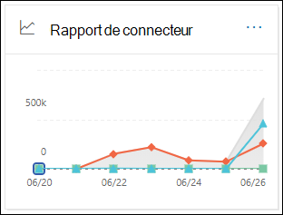
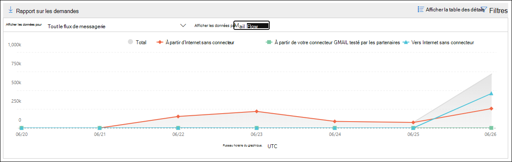
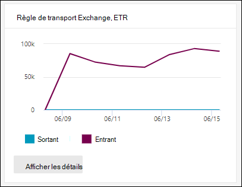
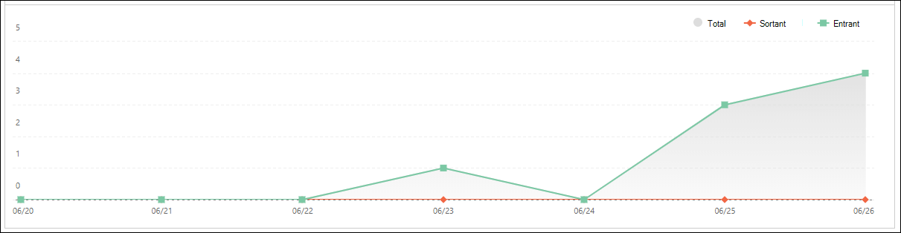
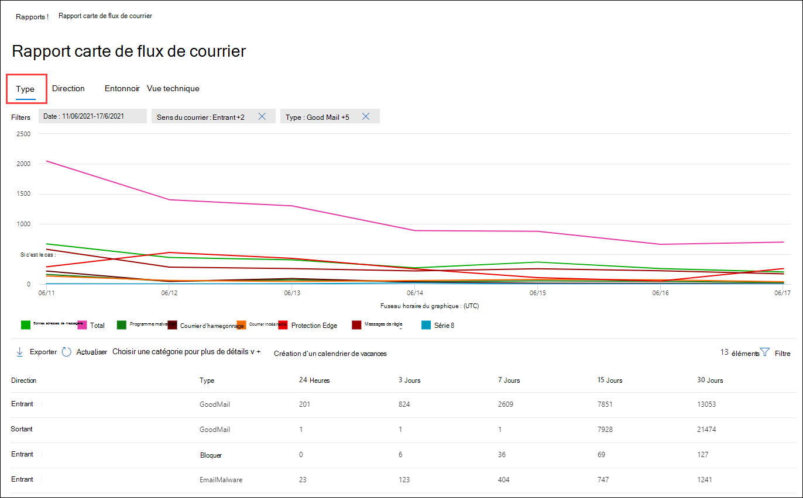
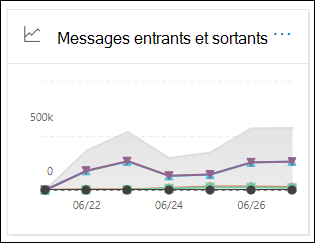
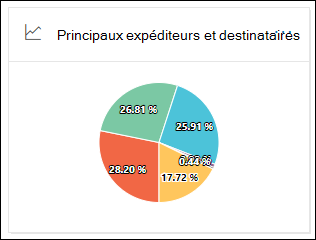

# Afficher les rapports de flux de messagerie dans le tableau de bord Rapports du Centre de sécurité & conformité

[!INCLUDE [Microsoft 365 Defender rebranding](../includes/microsoft-defender-for-office.md)]

**S’applique à**
- [Exchange Online Protection](exchange-online-protection-overview.md)
- [Microsoft Defender pour Office 365 : offre 1 et offre 2](defender-for-office-365.md)
- [Microsoft 365 Defender](../defender/microsoft-365-defender.md)

Outre les rapports de flux de  messagerie disponibles dans le tableau de bord de flux de messagerie du Centre de sécurité & conformité, plusieurs rapports de flux de messagerie supplémentaires sont disponibles dans le tableau de bord Rapports pour vous aider à surveiller votre organisation Microsoft 365.

Si vous avez les [autorisations](#what-permissions-are-needed-to-view-these-reports)nécessaires, vous pouvez afficher ces rapports dans le Centre de sécurité [& conformité](https://protection.office.com) en allant au Tableau de bord **des** \> **rapports.** Pour aller directement au tableau de bord Rapports, ouvrez <https://protection.office.com/insightdashboard> .

## Rapport sur le connecteur

Le **rapport Connecteur indique** l’activité de flux de messagerie sur les connecteurs entrants et [sortants configurés](/Exchange/mail-flow-best-practices/use-connectors-to-configure-mail-flow/use-connectors-to-configure-mail-flow) pour votre organisation.

Pour afficher le rapport, ouvrez le Centre  de sécurité [& conformité,](https://protection.office.com)allez au tableau de bord rapports \>  et sélectionnez le **rapport connecteur.** Pour aller directement dans le rapport, ouvrez <https://protection.office.com/reportv2?id=ConnectorReport> .

### Affichage du rapport pour le rapport connecteur

Les graphiques suivants sont disponibles en affichage état :

- **Afficher les données par : Flux de messagerie**: ce graphique affiche le nombre de messages entrants et sortants organisés par :

  - **Total**
  - **À partir d’Internet sans connecteur**
  - **Vers Internet sans connecteur**
  - Connecteur spécifique que vous avez configuré.

  Pour isoler les données dans le graphique, utilisez l’option **Afficher** les données pour le contrôle afin de sélectionner l’une de ces options ou tout **le flux de messagerie.**

  

- **Afficher les données par : utilisation de TLS**: ce graphique affiche le pourcentage d’utilisation de la version TLS (Transport Layer Security) pour le flux de messagerie.

  Pour isoler les données dans le graphique, utilisez l’option **Afficher les** données pour le contrôle pour sélectionner l’une des options suivantes :

  - **Tout le flux de messagerie**
  - **À partir d’Internet sans connecteur**
  - **Vers Internet sans connecteur**
  - Connecteur spécifique que vous avez configuré.

  

Si vous cliquez sur **Filtres** dans un affichage de rapport, vous pouvez spécifier une plage de dates avec la **date de** début et la date **de fin.**

### Vue de table Détails pour le rapport Connecteur

Si vous cliquez **sur Afficher le tableau des détails** dans un affichage de rapport, les informations suivantes sont affichées :

- **Date**
- **Direction et nom du connecteur**
- **Type de connecteur**
- **TLS forcé ?**: la valeur **True** ou **False**.
- **Pas de TLS** (pourcentage)
- **TLS 1.0** (pourcentage)
- **TLS 1.1** (pourcentage)
- **TLS 1.2** (pourcentage)
- **Volume**: nombre de messages.

Si vous cliquez sur **Filtres** dans une vue de tableau de détails, vous pouvez spécifier une plage de dates avec la **date** de début et la **date de fin.**

Pour revenir à l’affichage du rapport, cliquez **sur Afficher le rapport.**

## Exchange de règles de transport

Le Exchange de règles de **transport** de messagerie affiche l’effet des règles de flux de messagerie (également appelées règles de transport) sur les messages entrants et sortants dans votre organisation.

Pour afficher le rapport, ouvrez le Centre  de sécurité [& conformité,](https://protection.office.com)allez au tableau de bord rapports et sélectionnez Exchange \>  règle **de transport.** Pour aller directement dans le rapport, ouvrez <https://protection.office.com/reportv2?id=ETRRuleReport> .

### Affichage du rapport pour le rapport Exchange règles de transport

Les graphiques suivants sont disponibles en affichage état :

- **Afficher les données par : Exchange transport** \> **Décomposer par : Direction**: ce  graphique affiche le nombre de **messages** entrants et sortants affectés par les règles de transport.

- **Afficher les données par : Exchange transport** \> **Décomposez par : Gravité :** ce  graphique affiche le nombre de messages de gravité élevée, moyenne et **faible.** Vous définissez le niveau de gravité en tant qu’action dans la règle (**Auditez** cette règle avec le niveau de gravité _ou SetAuditSeverity_). Pour plus d’informations, voir [Actions de règle de flux](//Exchange/security-and-compliance/mail-flow-rules/mail-flow-rule-actions)de messagerie dans Exchange Online .

- Afficher les données par : règles de transport **Exchange DLP** \> **Décomposer par : Direction**: ce  graphique affiche le nombre de **messages** entrants et sortants affectés par les règles de transport de protection contre la perte de données (DLP). Vous pouvez affiner davantage le graphique en sélectionnant l’une des options suivantes :

  - **Afficher les données pour : toutes les règles de transport DLP**
  - **Afficher les données pour : utilisateurs compromis**
  - **Afficher les données pour : faible volume de contenu détecté pour le Patriot Act des États-Unis**

- Afficher les données par : règles de transport **Exchange DLP** \> **Décomposez par : Direction**: cet  affichage indique le nombre de **messages** de gravité élevée et moyenne **et** faible qui ont été affectés par les règles de transport DLP. Vous pouvez affiner davantage le graphique en sélectionnant l’une des options suivantes :

  - **Afficher les données pour : toutes les règles de transport DLP**
  - **Afficher les données pour : utilisateurs compromis**
  - **Afficher les données pour : faible volume de contenu détecté pour le Patriot Act des États-Unis**

Si vous cliquez **sur Filtres** dans un affichage de rapport, vous pouvez modifier les résultats avec les filtres suivants :

- **Date de début** et **date de fin**
- Valeurs de direction
- Valeurs de gravité

### Vue de table Détails pour le rapport Exchange règle de transport

Si vous cliquez sur Afficher le tableau des **détails,** les informations affichées dépendent du graphique que vous regardiez :

- **Afficher les données par : Exchange transport :**

  - **Date**
  - **Règle de transport**
  - **Subject**
  - **Adresse de l’expéditeur**
  - **Adresse du destinataire**
  - **Gravité**
  - **Direction**

- **Afficher les données par : DLP Exchange de transport**:

  - **Date**
  - **Stratégie DLP**
  - **Règle de transport**
  - **Subject**
  - **Adresse de l’expéditeur**
  - **Adresse du destinataire**
  - **Gravité**
  - **Direction**

Si vous cliquez **sur Filtres** dans une vue de tableau de détails, vous pouvez modifier les résultats avec les filtres suivants :

- **Date de début** et **date de fin**
- Valeurs de direction
- Valeurs de gravité

Pour revenir à l’affichage du rapport, cliquez **sur Afficher le rapport.**

## Rapport de forwarding

Le **rapport de forwarding** affiche les messages automatiquement transmis par votre organisation à des domaines externes à partir Exchange Online boîtes aux lettres. Les messages transmis peuvent présenter un risque de sécurité ou de conformité, et peuvent indiquer un compte compromis.

Pour afficher le rapport, ouvrez le Centre de  sécurité [& conformité,](https://protection.office.com)allez au Tableau de bord des rapports \>  et sélectionnez Rapport **de report.** Pour aller directement dans le rapport, ouvrez <https://protection.office.com/reportv2?id=MailFlowForwarding> .

### Affichage du rapport pour le rapport de report

Les graphiques suivants sont disponibles dans l’affichage de rapport :

- **Afficher les données pour : Méthodes de forwarding**: les méthodes suivantes sont affichées :

  - **Règle de transport**: également appelée règles [de flux de messagerie.](/Exchange/security-and-compliance/mail-flow-rules/mail-flow-rules)
  - **Règle de boîte** aux lettres : également [appelées règles de boîte de réception.](https://support.microsoft.com/office/c24f5dea-9465-4df4-ad17-a50704d66c59)

  

- **Afficher les données pour : Domaines de forwarding**: cet affichage affiche les domaines destinataires qui sont les destinations pour le forwarding.

  

- **Afficher les données pour : Forwarders**: les forwardeurs suivants sont affichés :

  - **Règle de transport**
  - Boîte aux lettres contenant la règle de boîte de réception de forwarding.

  

Si vous cliquez sur **Filtres** dans un affichage de rapport, vous pouvez spécifier une plage de dates avec la **date de** début et la date **de fin.**

### Vue de table Détails pour le rapport de report

Si vous cliquez **sur Afficher le tableau des détails** dans un affichage de rapport, les informations suivantes sont affichées :

- **Forwarders**: règle de **transport de valeur** ou boîte aux lettres qui contient la règle de boîte de réception de transport.
- **Type de transport :** la règle de boîte **aux lettres de valeur** ou la règle **de transport**.
- **Nom du destinataire**
- **Domaine du destinataire**
- **Détails**: il s’agit de la valeur GUID de la règle de flux de messagerie ou de la valeur RuleIdentity de la règle de boîte de réception.
- **Count**
- **Première date d’avance**

Si vous cliquez sur **Filtres** dans une vue de tableau de détails, vous pouvez spécifier une plage de dates avec la **date** de début et la **date de fin.**

Pour revenir à l’affichage Rapports, cliquez **sur Afficher le rapport.**

## Rapport d’état du flux de messagerie

Le **rapport d’état du** flux de messagerie est similaire au rapport de courrier électronique envoyé et reçu, avec des informations supplémentaires sur le courrier électronique autorisé ou bloqué sur le edge.  Il s’agit du seul rapport qui contient des informations sur la protection edge et qui indique la quantité de messages électroniques bloqués avant d’être autorisé à entrer dans le service pour évaluation par Exchange Online Protection (EOP). Il est important de comprendre que si un message est envoyé à cinq destinataires, nous le compterons comme cinq messages différents et pas un seul message.
Pour afficher le rapport, ouvrez le Centre de  sécurité [& conformité,](https://protection.office.com)puis sélectionnez Tableau de bord rapports et sélectionnez Rapport d’état du \>  flux **de messagerie.** Pour aller directement au rapport d’état du **flux de messagerie,** ouvrez <https://protection.office.com/mailflowStatusReport> .

### Affichage des types pour le rapport d’état du flux de messagerie

Lorsque vous ouvrez l’état, **l’onglet Type** est sélectionné par défaut. Par défaut, cet affichage contient un graphique et une table de données configurés avec les filtres suivants :

- **Date**: 7 derniers jours.
- **Direction**:

  - **Entrant**
  - **Sortant**
  - **Intra-organisation**: ce nombre est pour les messages au sein d’un client, c’est-à-dire sender abc@domain.com sends to recipient xyz@domain.com (counted separately from **Inbound** and **Outbound**)

- **Tapez**:

  - **Bon courrier**
  - **Programme malveillant**
  - **Courrier indésirable**
  - **Protection Edge**
  - **Messages de règle**
  - **Courriers hameçons**

Le graphique est organisé par les valeurs **Type.**

Vous pouvez modifier ces filtres en cliquant sur **Filtre** ou en cliquant sur une valeur dans la légende du graphique.

La table de données contient les informations suivantes :

- **Direction**
- **Type (Type)**
- **24 heures**
- **3 jours**
- **7 jours**
- **15 jours**
- **30 jours**

Si vous cliquez **sur Choisir une catégorie pour plus d’informations,** vous pouvez sélectionner l’une des valeurs suivantes :

- **E-mail de hameçonnage**: cette sélection vous place dans le rapport d’état [de la protection contre les menaces.](view-email-security-reports.md#threat-protection-status-report)
- **Programmes malveillants dans les e-mails**: cette sélection vous place dans le rapport d’état [de la protection contre les menaces.](view-email-security-reports.md#threat-protection-status-report)
- **Détections de courrier indésirable**: cette sélection vous permet d’envoyer le rapport [détections de courrier indésirable.](view-email-security-reports.md#spam-detections-report)
- **Courrier indésirable bloqué edge**: cette sélection vous permet d’envoyer le rapport [détections de courrier indésirable.](view-email-security-reports.md#spam-detections-report)

**Exporter**:

Pour l’affichage détaillé, vous ne pouvez exporter les données que pour une journée. Par exemple, si vous souhaitez exporter des données pendant 7 jours, vous devez faire 7 actions d’exportation différentes.

Chaque fichier .csv exporté est limité à 150 000 lignes. Si les données de ce jour contiennent plus de 150 000 lignes, plusieurs fichiers .csv seront créés.

### Affichage direction pour le rapport d’état du flux de messagerie

Si vous cliquez sur **l’onglet Direction,** les mêmes filtres par défaut de **l’affichage Type** sont utilisés.

Le graphique est organisé par **valeurs direction.**

Vous pouvez modifier ces filtres en cliquant sur **Filtre** ou en cliquant sur une valeur dans la légende du graphique. Les mêmes filtres de **l’affichage Type** sont utilisés.

La table de données contient les mêmes informations que **l’affichage Type.**

La **sélection d’une catégorie pour plus d’informations** sur les sélections disponibles et le comportement sont identiques à l’affichage **Type.**

**Exporter**:

Pour l’affichage détaillé, vous ne pouvez exporter les données que pour une journée. Par exemple, si vous souhaitez exporter des données pendant 7 jours, vous devez faire 7 actions d’exportation différentes.

Chaque fichier .csv exporté est limité à 150 000 lignes. Si les données de ce jour contiennent plus de 150 000 lignes, plusieurs fichiers .csv seront créés.

### Affichage en entonnoir pour le rapport d’état du flux de messagerie

La **vue Entonnoir** vous montre comment les fonctionnalités de protection contre les menaces de courrier électronique de Microsoft filtrent le courrier électronique entrant et sortant dans votre organisation. Il fournit des détails sur le nombre total de messages électroniques et sur la façon dont les fonctionnalités de protection contre les menaces configurées, y compris la protection edge, la protection contre les programmes malveillants, l’anti-hameçonnage, le courrier indésirable et la détection d’usurpation d’accès affectent ce nombre.

Si vous  cliquez sur l’onglet Entonnoir, par défaut, cet affichage contient un graphique et une table de données configurés avec les filtres suivants :

- **Date**: 7 derniers jours.

- **Direction**:

  - **Entrant**
  - **Sortant**
  - **Intra-organisation**: ce nombre est le nombre de messages envoyés au sein d’un client ; Autrement dit, l’expéditeur abc@domain.com envoyé au destinataire xyz@domain.com (comptabilisé séparément des messages entrants et sortants).

L’affichage agrégé et l’affichage de table de données autorisent 90 jours de filtrage.

Si vous cliquez **sur Filtre,** vous pouvez filtrer le graphique et la table de données.

Ce graphique indique le nombre de messages électroniques organisés par :

- **Nombre total de messages électroniques**
- **Courrier électronique après protection edge**
- **Courrier électronique après anti-programme malveillant, réputation du fichier, bloc de type de fichier**
- **Courrier électronique après anti-hameçonnage, réputation d’URL, emprunt d’identité de marque, anti-usurpation d’identité**
- **Courrier électronique après filtrage du courrier indésirable en bloc**
- **Courrier électronique après l’emprunt d’identité d’utilisateur et de**domaine 1
- **Email after file and URL detonation**1
- **Courrier électronique détecté comme étant anodin après la remise (protection de temps de clic d’URL)**

1 Defender pour Office 365 uniquement

Pour afficher l’e-mail filtré par EOP ou Defender Office 365 séparément, cliquez sur la valeur dans la légende du graphique.

La table de données contient les informations suivantes, indiquées dans l’ordre décroit de date :

- **Date**
- **Nombre total de messages électroniques**
- **Protection Edge**
- **Anti-programme malveillant, réputation de fichier, bloc de type de fichier**:
  - **Réputation du** fichier : messages filtrés en raison de l’identification d’un fichier joint par d’autres clients Microsoft.
  - **Bloc de type de** fichier : messages filtrés en raison du type de fichier malveillant identifié dans le message.
- **Anti-hameçonnage, réputation de l’URL, emprunt d’identité de marque, anti-usurpation d’identité**:
  - **Réputation de l’URL**: messages filtrés en raison de l’identification de l’URL par d’autres clients Microsoft.
  - **Emprunt d’identité de marque**: messages filtrés en raison du message provenant de la marque connue usurpant l’identité des expéditeurs.
  - **Anti-usurpation**: messages filtrés en raison de la tentative d’usurpation d’un domaine appartenant au destinataire ou d’un domaine que l’expéditeur du message ne possède pas.
- **Anti-courrier indésirable, filtrage du courrier en bloc**:
  - **Filtrage du courrier en nombre**: messages filtrés en raison d’une tentative de remettre des messages en nombre à ses destinataires.
- **Emprunt d’identité d’utilisateur et** de domaine (Defender pour Office 365) :
  - **Emprunt d’identité** d’utilisateur : messages filtrés en raison d’une tentative d’emprunt d’identité d’un utilisateur (expéditeur de message) défini dans les paramètres de protection contre l’emprunt d’identité d’une stratégie anti-hameçonnage.
  - **Emprunt d’identité** de domaine : messages filtrés en raison d’une tentative d’emprunt d’identité d’un domaine défini dans les paramètres de protection contre l’emprunt d’identité d’une stratégie anti-hameçonnage.
- **Détonation de fichier et d’URL (Defender pour Office 365)**:
  - **Détonation de fichier**: messages filtrés par une stratégie de pièces jointes sécurisées.
  - **Détonation d’URL**: message filtré par une stratégie de liens sécurisés.
- **Protection post-remise et ZAP (ATP) ou ZAP (EOP)**: ZAP indique une purge automatique de zéro heure.

Si vous sélectionnez une ligne dans la table de données, une répartition supplémentaire du nombre de messages électroniques est affichée dans le volant.

**Exporter**:

Après avoir cliqué **sur Exporter** sous **Options,** vous pouvez sélectionner l’une des valeurs suivantes :

- **Résumé (avec des données pour les 90 derniers jours au maximum)**
- **Détails (avec des données pour les 30 derniers jours au maximum)**

Sous **Date**, choisissez une plage, puis cliquez sur **Appliquer**. Les données des filtres actuels sont exportées vers un .csv de données.

Chaque fichier .csv exporté est limité à 150 000 lignes. Si les données contiennent plus de 150 000 lignes, plusieurs .csv fichiers seront créés.

 

### Affichage technique pour le rapport d’état du flux de messagerie

La **vue Tech est** similaire à la vue Entonnoir, fournissant des détails plus détaillés pour les fonctionnalités de protection contre les menaces configurées.  À partir du graphique, vous pouvez voir comment les messages sont classés aux différentes étapes de la protection contre les menaces.

Si vous cliquez sur **l’onglet Affichage** Technique, par défaut, cet affichage contient un graphique et une table de données configurés avec les filtres suivants :

- **Date**: 7 derniers jours.

- **Direction**:

  - **Entrant**
  - **Sortant**
  - **Intra-organisation**: ce nombre est pour les messages au sein d’un client, c’est-à-dire sender abc@domain.com sends to recipient xyz@domain.com (counted separately from Inbound and Outbound)

L’affichage agrégé et l’affichage de table de données autorisent 90 jours de filtrage.

Si vous cliquez **sur Filtre,** vous pouvez filtrer le graphique et la table de données.

Ce graphique présente les messages organisés dans les catégories suivantes :

- **Nombre total de messages électroniques**
- **Edge autoriser** et **edge filtré**
- **Pas de programmes** **malveillants, de détection de pièces jointes fiables,** de détection de moteur \* **anti-programme** malveillant et de **messages de règles**
- **Pas de hameçonnage,**  **d’échec DMARC,** de détection d’emprunt d’identité, de détection d’usurpation **d’identité** et de **détection d’hameçonnage**
- **Aucune détection avec détection de détonation d’URL** et **de détonation d’URL**\*
- **Pas de courrier indésirable** et  **de courrier indésirable**
- **Courrier non malveillant,** **détection de liens fiables** \* et **ZAP**

\*Defender for Office 365

Lorsque vous pointez sur une catégorie dans le graphique, vous pouvez voir le nombre de messages dans cette catégorie.

La table de données contient les informations suivantes, indiquées dans l’ordre décroit de date :

- **Date**
- **Nombre total de messages électroniques**
- **Edge filtré**
- **Moteur anti-programme malveillant, pièces jointes sécurisées, règle filtrée**:
  - **Règle filtrée**: messages filtrés en raison de règles de flux de messagerie (également appelées règles de transport).
- **DMARC, emprunt d’identité, usurpation d’identité, hameçonnage filtré**:
  - **DMARC**: messages filtrés en raison de l’échec de la vérification de l’authentification DMARC.
- **Détection de détonation d’URL**
- **Filtrage anti-courrier indésirable**
- **ZAP supprimé**
- **Détection par liens fiables**

Si vous sélectionnez une ligne dans la table de données, une répartition supplémentaire du nombre de messages électroniques est affichée dans le volant.

**Exporter**:

En cliquant **sur Exporter,** sous **Options,** vous pouvez sélectionner l’une des valeurs suivantes :

- **Résumé (avec des données pour les 90 derniers jours au maximum)**
- **Détails (avec des données pour les 30 derniers jours au maximum)**

Sous **Date**, choisissez une plage, puis cliquez sur **Appliquer**. Les données des filtres actuels sont exportées vers un .csv de données.

Chaque fichier .csv exporté est limité à 150 000 lignes. Si les données contiennent plus de 150 000 lignes, plusieurs .csv fichiers seront créés.

 

## Rapport de courrier électronique envoyé et reçu

Le **rapport de** courrier électronique envoyé et reçu est un rapport intelligent qui affiche des informations sur le courrier électronique entrant et sortant, y compris les détections de courrier indésirable, les programmes malveillants et les messages électroniques identifiés comme « bons ». La différence entre ce  rapport et le rapport d’état du flux de messagerie est la suivante : ce rapport n’inclut pas de données sur les messages bloqués par la protection Edge. Il est important de comprendre que si un message est envoyé à cinq destinataires, nous le compterons comme un seul message.

L’affichage agrégé et l’affichage détaillé du rapport autorisent 90 jours de filtrage.

Pour afficher le rapport, ouvrez le Centre de  sécurité [& conformité,](https://protection.office.com)allez au tableau de bord rapports et sélectionnez \>  Courrier électronique envoyé **et reçu.** Pour aller directement dans le rapport, ouvrez <https://protection.office.com/reportv2?id=SentAndReceivedMailATP> .

### Affichage du rapport pour le rapport de courrier électronique envoyé et reçu

Les graphiques suivants sont disponibles dans l’affichage de rapport :

- **Décomposez par : Type**: le graphique affiche toutes les catégories disponibles :

  - **Total**
  - **Bon courrier**
  - **Programmes malveillants (anti-programme malveillant)** (EOP)
  - **Détections de courrier indésirable**
  - **Messages de règle**
  - **Programmes malveillants** avancés (Microsoft Defender pour Office 365)

  Lorsque vous pointez sur un jour (point de données) dans le graphique, vous pouvez voir les détails de ce jour.

  

- **Décomposer par : Direction**: le graphique affiche **le total,** le trafic **entrant** et les **données sortantes.** Lorsque vous pointez sur un jour (point de données) dans le graphique, vous pouvez voir les détails de ce jour.

  

- **Descendre** \> **Programmes malveillants (anti-programme malveillant)**: cette sélection vous permet d’en savoir plus sur les détections de programmes [malveillants dans le rapport de courrier électronique.](view-email-security-reports.md#malware-detections-in-email-report)

- **Descendre** \> **Détections de courrier indésirable)**: cette sélection vous permet d’envoyer le rapport [détections de courrier indésirable.](view-email-security-reports.md#spam-detections-report)

Si vous cliquez **sur Filtres** dans un affichage de rapport, vous pouvez modifier les résultats avec les filtres suivants :

- **Date de début** et **date de fin**
- Valeurs de direction
- Valeurs de type

Pour revenir à l’affichage du rapport, cliquez **sur Afficher le rapport.**

### Affichage du tableau détails pour le rapport de courrier électronique envoyé et reçu

Si vous cliquez **sur Afficher les détails dans** le tableau Décomposer par : **Direction** ou Descendre en mode **Direction,** les informations suivantes sont affichées :

- **Date (UTC)**
- **Type (Type)**
- **Direction**
- **Nombre de messages**

Si vous cliquez **sur Filtres** dans une vue de tableau de détails, vous pouvez modifier les résultats avec les filtres suivants :

- **Date de début** et **date de fin**
- Valeurs de direction
- Valeurs de type

Pour revenir à l’affichage du rapport, cliquez **sur Afficher le rapport.**

## Rapport des principaux expéditeurs et destinataires

Le **rapport Des principaux expéditeurs et destinataires** est un graphique en secteurs montrant vos principaux expéditeurs et destinataires de courrier électronique.

Pour afficher le rapport, ouvrez le Centre de  sécurité [& conformité,](https://protection.office.com)puis sélectionnez Tableau de bord rapports et sélectionnez Principaux \>  **expéditeurs et destinataires.** Pour aller directement dans le rapport, ouvrez <https://protection.office.com/reportv2?id=TopSenderRecipientsATP> .

### Affichage du rapport pour le rapport des principaux expéditeurs et destinataires

Les graphiques suivants sont disponibles dans l’affichage de rapport :

- **Afficher les données pour \> les principaux expéditeurs de courrier**
- **Afficher les données pour \> les principaux destinataires du courrier**
- **Afficher les données des \> principaux destinataires du courrier indésirable**
- **Afficher les données pour \> Principaux destinataires de programmes malveillants** (EOP)
- **Afficher les données \> des principaux destinataires de programmes malveillants (Defender pour Office 365)**

La composition du graphique en secteurs change en fonction de ces sélections.

Lorsque vous pointez sur une souris dans le graphique en secteurs, vous pouvez voir le nombre de messages envoyés ou reçus.

Si vous cliquez sur **Filtres** dans un affichage de rapport, vous pouvez spécifier une plage de dates avec la **date de** début et la date **de fin.**

### Vue de table Détails pour le rapport des principaux expéditeurs et destinataires

Si vous cliquez sur Afficher le tableau des **détails,** les informations affichées dépendent du graphique que vous regardiez :

- **Afficher les données pour \> les principaux expéditeurs de courrier**

  - **Principaux expéditeurs de courrier**
  - **Count**

- **Afficher les données pour \> les principaux destinataires du courrier**

  - **Principaux destinataires du courrier**
  - **Count**

- **Afficher les données des \> principaux destinataires du courrier indésirable**

  - **Principaux destinataires du courrier indésirable**
  - **Count**

- **Afficher les données pour \> Principaux destinataires de programmes malveillants** (EOP)

  - **Principaux destinataires de programmes malveillants**
  - **Count**

- **Afficher les données \> des principaux destinataires de programmes malveillants (Defender pour Office 365)**

  - **Principaux destinataires de programmes malveillants (Defender pour Office 365)**
  - **Count**

Si vous cliquez sur **Filtres** dans une vue de tableau de détails, vous pouvez spécifier une plage de dates avec la **date** de début et la **date de fin.**

Pour revenir à l’affichage du rapport, cliquez **sur Afficher le rapport.**

## Quelles autorisations sont nécessaires pour afficher ces rapports ?

Pour afficher et utiliser les rapports décrits dans cet article, vous devez être membre de l’un des groupes de rôles suivants dans le Centre de sécurité & conformité :

- **Gestion de l'organisation**
- **Administrateur de sécurité**
- **Lecteur sécurité**
- **Lecteur global**

Pour en savoir plus, consultez [Autorisations dans le Centre de sécurité et de conformité](permissions-in-the-security-and-compliance-center.md).

> [!NOTE]
> L’ajout d’utilisateurs au rôle Azure Active Directory correspondant dans le Centre d’administration Microsoft 365 donne aux utilisateurs les autorisations requises dans le centre de sécurité et de conformité _et_ les autorisations pour les autres fonctionnalités de Microsoft 365. Pour plus d’informations, consultez [À propos des rôles d’administrateur](../../admin/add-users/about-admin-roles.md).

## Voir aussi

[Rapports intelligents et aperçus dans le Centre de sécurité et conformité](reports-and-insights-in-security-and-compliance.md)

[Informations sur le flux de messagerie dans le centre de sécurité et conformité](mail-flow-insights-v2.md)

[Afficher les rapports de sécurité de courrier dans le centre de sécurité et conformité](view-email-security-reports.md)

[Afficher des rapports pour Microsoft Defender pour Office 365](view-reports-for-mdo.md)
