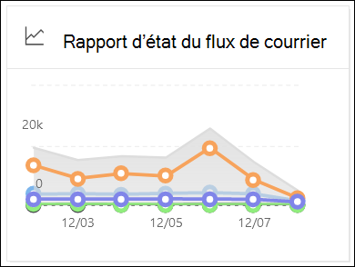

# Afficher les rapports de flux de messagerie dans le tableau de bord Rapports du Centre de sécurité & conformité

[!INCLUDE [Microsoft 365 Defender rebranding](../includes/microsoft-defender-for-office.md)]

**S’applique à**
- [Exchange Online Protection](exchange-online-protection-overview.md)
- [Microsoft Defender pour Office 365 : offre 1 et offre 2](defender-for-office-365.md)
- [Microsoft 365 Defender](../defender/microsoft-365-defender.md)

> [!NOTE]
>
> La plupart des rapports de cet article sont également disponibles dans le portail Microsoft 365 Defender ou le Centre d’administration Exchange (EAC). Pour plus d’informations, voir les rubriques suivantes :
>
> - [Rapports de flux de messagerie dans le nouveau centre Exchange’administration](/exchange/monitoring/mail-flow-reports/mail-flow-reports)
> - [Afficher les rapports de sécurité du courrier dans le portail Microsoft 365 Defender messagerie](view-email-security-reports.md)

Outre les rapports de flux de  messagerie disponibles dans le tableau de bord de flux de messagerie dans le Centre de sécurité & conformité, plusieurs rapports de flux de messagerie supplémentaires sont disponibles dans le tableau de bord Rapports pour vous aider à surveiller votre organisation Microsoft 365.

Si vous avez les [autorisations](#what-permissions-are-needed-to-view-these-reports)nécessaires, vous pouvez afficher ces rapports dans le Centre de sécurité & conformité en allant au Tableau de <https://protection.office.com> bord **des** \> **rapports.** Pour aller directement au tableau de bord Rapports, ouvrez <https://protection.office.com/insightdashboard> .

## Rapport sur le connecteur

> [!NOTE]
> Ce rapport a été remplacé par le rapport **Messages** entrants et le rapport **Messages sortants** dans le EAC. Pour plus d’informations, voir messages entrants et rapports de [messages sortants dans le nouveau EAC.](/exchange/monitoring/mail-flow-reports/mfr-inbound-messages-and-outbound-messages-reports)

## Exchange de règles de transport

> [!NOTE]
> Le **Exchange de règles de transport est** désormais disponible dans le EAC. Pour plus d’informations, Exchange rapport de règles de [transport dans le nouveau EAC.](/exchange/monitoring/mail-flow-reports/mfr-exchange-transport-rule-report)

## Rapport de forwarding

> [!NOTE]
> Le **rapport de forwarding** est désormais disponible dans le EAC. Pour plus d’informations, [reportez-vous au](/exchange/monitoring/mail-flow-reports/mfr-auto-forwarded-messages-report)rapport des messages transmis automatiquement dans le nouveau EAC.

## Rapport d’état du flux de messagerie

Le **rapport d’état du** flux de messagerie est similaire au rapport de courrier électronique envoyé et reçu, avec des informations supplémentaires sur le courrier électronique autorisé ou bloqué sur le edge.  Il s’agit du seul rapport qui contient des informations sur la protection edge et qui indique la quantité de messages électroniques bloqués avant d’être autorisé dans le service pour évaluation par Exchange Online Protection (EOP). Il est important de comprendre que si un message est envoyé à cinq destinataires, nous le compterons comme cinq messages différents et pas un seul message.

Pour afficher le rapport, ouvrez le Centre de  sécurité [& conformité,](https://protection.office.com)allez au tableau de bord rapports et sélectionnez Rapport d’état du \>  flux **de messagerie.** Pour aller directement au rapport d’état du **flux de messagerie,** ouvrez <https://security.microsoft.com/reports/mailflowStatusReport> .

> [!NOTE]
> Cliquer sur le widget pour ce rapport dans le Centre de sécurité & conformité (protection.office.com) vous permet désormais d’obtenir le rapport complet dans le portail Microsoft 365 Defender (security.microsoft.com). Pour plus d’informations sur le rapport, voir [Rapport d’état du flux de messagerie.](view-email-security-reports.md#mailflow-status-report)

## Rapport de courrier électronique envoyé et reçu

> [!NOTE]
> Ce rapport a été remplacé par le rapport [d’état du flux de messagerie.](#mailflow-status-report)

## Rapport sur les principaux expéditeurs et destinataires

Les principaux expéditeurs et destinataires indiquent les principaux **expéditeurs** de messages de votre organisation, ainsi que les principaux destinataires des messages détectés par EOP et Defender pour Office 365 protection.

Pour afficher le rapport, ouvrez le Centre de sécurité & conformité à l’adresse , go <https://protection.office.com> to **Reports** \> **Dashboard** and select **Top senders and recipients**. Pour aller directement dans le rapport, ouvrez l’une des URL suivantes :

- Defender pour Office 365 :<https://protection.office.com/TopSenderRecipientsATP>
- EOP : <https://protection.office.com/TopSenderRecipients>

> [!NOTE]
> Bien que le fait de cliquer sur le widget pour ce rapport dans le Centre de sécurité & conformité vous permet d’obtenir une page protection.office.com, le contenu de la page est à partir du portail Microsoft 365 Defender. Pour plus d’informations sur le rapport, consultez le rapport des [principaux expéditeurs et destinataires.](view-email-security-reports.md#top-senders-and-recipients-report)

## Quelles autorisations sont nécessaires pour afficher ces rapports ?

Pour afficher et utiliser les rapports décrits dans cet article, vous devez être membre de l’un des groupes de rôles suivants dans le Centre de sécurité & conformité :

- **Gestion de l'organisation**
- **Administrateur de sécurité**
- **Lecteur de sécurité**
- **Lecteur général**

Pour en savoir plus, consultez [Autorisations dans le Centre de sécurité et de conformité](permissions-in-the-security-and-compliance-center.md).

> [!NOTE]
> L’ajout d’utilisateurs au rôle Azure Active Directory correspondant dans le Centre d’administration Microsoft 365 donne aux utilisateurs les autorisations requises dans le centre de sécurité et de conformité _et_ les autorisations pour les autres fonctionnalités de Microsoft 365. Pour plus d’informations, consultez [À propos des rôles d’administrateur](../../admin/add-users/about-admin-roles.md).

## Voir aussi

[Rapports intelligents et aperçus dans le Centre de sécurité et conformité](reports-and-insights-in-security-and-compliance.md)

[Informations sur le flux de messagerie dans le centre de sécurité et conformité](mail-flow-insights-v2.md)

[Afficher les rapports de sécurité de courrier dans le centre de sécurité et conformité](view-email-security-reports.md)

[Afficher les rapports de Microsoft Defender pour Office 365](view-reports-for-mdo.md)
