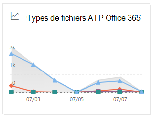
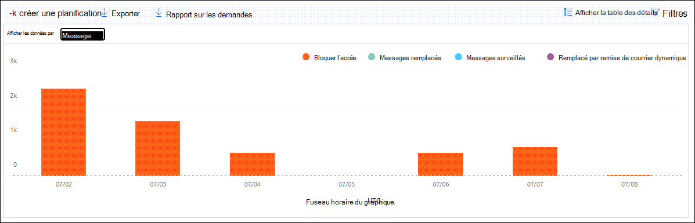

# Afficher les rapports Defender pour Office 365 dans le tableau de bord Rapports du Centre de sécurité & conformité

[!INCLUDE [Microsoft 365 Defender rebranding](../includes/microsoft-defender-for-office.md)]

**S’applique à**
- [Microsoft Defender pour Office 365 : offre 1 et offre 2](office-365-atp.md)
- [Microsoft 365 Defender](../mtp/microsoft-threat-protection.md)

Les organisations Microsoft Defender pour Office 365 (par exemple, les abonnements Microsoft 365 E5 ou Microsoft Defender pour Office 365 Plan 1 ou Microsoft Defender pour les modules de développement Office 365 Plan 2) contiennent une variété de rapports de sécurité. Si vous avez les [autorisations](#what-permissions-are-needed-to-view-the-defender-for-office-365-reports)nécessaires, vous pouvez afficher ces rapports dans le Centre de sécurité & conformité en allant au Tableau de bord **des** \> **rapports.** Pour aller directement au tableau de bord Rapports, ouvrez <https://protection.office.com/insightdashboard> .

## Rapport sur les types de fichiers de Defender pour Office 365

Le rapport des types de fichiers Defender pour **Office 365** indique le type de fichiers détectés comme malveillants par [les pièces jointes sécurisées.](atp-safe-attachments.md)

 L’affichage agrégé du rapport autorise 90 jours de filtrage, tandis que l’affichage détail ne permet que 10 jours de filtrage.

Pour afficher le rapport, ouvrez le Centre de  sécurité [& conformité,](https://protection.office.com)puis sélectionnez Tableau de bord rapports et sélectionnez Defender pour les types de fichiers \>  **Office 365.** Pour aller directement dans le rapport, ouvrez <https://protection.office.com/reportv2?id=ATPFileReport> .

> [!NOTE]
> Les informations de ce rapport sont également disponibles dans le rapport de disposition des [messages Defender pour Office 365.](#defender-for-office-365-message-disposition-report)

### Affichage des rapports pour le rapport des types de fichiers Defender pour Office 365

Les vues disponibles sont les suivantes :

- **Afficher les données par : Fichier**: le graphique contient les informations suivantes :

  - **Pièces jointes Excel malveillantes**
  - **Pièces jointes flash malveillantes**
  - **Pièces jointes PDF malveillantes**
  - **Pièces jointes PowerPoint malveillantes**
  - **URL malveillantes**
  - **Pièces jointes word malveillantes**
  - **Pièces jointes exécutables malveillantes**
  - **Autres**

  Lorsque vous pointez sur un jour donné (point de données), vous pouvez voir la répartition des types de fichiers [malveillants détectés](atp-safe-attachments.md) par les pièces jointes sécurisées et la protection contre les programmes malveillants dans [EOP.](anti-malware-protection.md)

  

  Si vous cliquez **sur Filtres,** vous pouvez modifier le rapport avec les filtres suivants :

  - **Date de début et** **date de fin**
  - Valeurs de type de fichier visibles dans le graphique.

- **Afficher les données par : Message**: le graphique contient les informations suivantes :

  - **Bloquer l’accès**
  - **Messages remplacés**
  - **Messages surveillés**
  - **Remplacé par la remise de courrier dynamique**: pour plus d’informations, voir Remise dynamique dans les [stratégies de pièces jointes sécurisées.](atp-safe-attachments.md#dynamic-delivery-in-safe-attachments-policies)

  

  Si vous cliquez **sur Filtres,** vous pouvez modifier le rapport avec les filtres suivants :

  - **Date de début et** **date de fin**
  - Valeurs de disposition des messages disponibles dans le graphique et valeur **messages transmises** supplémentaire.

### Vue de table Détails pour le rapport des types de fichiers Defender pour Office 365

Si vous cliquez sur Afficher le tableau des **détails,** le rapport fournit une vue en temps quasi réel de tous les clics qui se produisent au sein de l’organisation au cours des 10 derniers jours. Les informations affichées dépendent du graphique que vous regardiez :

- **Afficher les données par : Fichier**:

  - **Date**
  - **Adresse du destinataire**
  - **Adresse de l’expéditeur**
  - **ID de message**: disponible dans le champ d’en-tête **Message-ID** dans l’en-tête du message et doit être unique. Un exemple de valeur est `<08f1e0f6806a47b4ac103961109ae6ef@server.domain>` (notez les crochets).
  - **File**

  Si vous cliquez **sur Filtres,** vous pouvez modifier le rapport avec les filtres suivants :

  - **Date de début et** **date de fin**
  - Valeurs de type de fichier visibles dans le graphique.

- **Afficher les données par : Message**:

  - **Date**
  - **Adresse du destinataire**
  - **Adresse de l’expéditeur**
  - **ID de message**
  - **File**
  - **Subject**

  Si vous cliquez **sur Filtres,** vous pouvez modifier les résultats avec les filtres suivants :

  - **Date de début et** **date de fin**
  - Valeurs de disposition des messages disponibles dans le graphique et valeur **messages transmises** supplémentaire.

Pour revenir à l’affichage Rapports, cliquez **sur Afficher le rapport.**

## Rapport d’actions sur les messages de Defender pour Office 365

Le rapport de disposition des messages **atp** vous indique les actions qui ont été prises pour les messages électroniques détectés comme ayant un contenu malveillant.

Pour afficher le rapport, ouvrez le Centre de  sécurité [&](https://protection.office.com)conformité, puis sélectionnez Tableau de bord rapports et sélectionnez Defender pour la disposition des \>  messages **Office 365.** Pour aller directement dans le rapport, ouvrez <https://protection.office.com/reportv2?id=ATPMessageReport> .

> [!NOTE]
> Les informations de ce rapport sont également disponibles dans le rapport des types de fichiers [Defender pour Office 365.](#defender-for-office-365-file-types-report)

### Affichage du rapport pour le rapport de disposition des messages Defender pour Office 365

Les vues disponibles sont les suivantes :

- **Afficher les données par : Message**: le graphique contient les informations suivantes :

  - **Bloquer l’accès**
  - **Messages remplacés**
  - **Messages surveillés**
  - **Remplacé par la remise de courrier dynamique**: pour plus d’informations, voir Remise dynamique dans les [stratégies de pièces jointes sécurisées.](atp-safe-attachments.md#dynamic-delivery-in-safe-attachments-policies)

  

  Si vous cliquez **sur Filtres,** vous pouvez modifier le rapport avec les filtres suivants :

  - **Date de début et** **date de fin**
  - Valeurs de disposition des messages disponibles dans le graphique et valeur **messages transmises** supplémentaire.

- **Afficher les données par : Fichier**: le graphique contient les informations suivantes :

  - **Pièces jointes Excel malveillantes**
  - **Pièces jointes flash malveillantes**
  - **Pièces jointes PDF malveillantes**
  - **Pièces jointes PowerPoint malveillantes**
  - **URL malveillantes**
  - **Pièces jointes word malveillantes**
  - **Pièces jointes exécutables malveillantes**
  - **Autres**

  Lorsque vous pointez sur un jour donné (point de données), vous pouvez voir la répartition des types de fichiers [malveillants détectés](atp-safe-attachments.md) par les pièces jointes sécurisées et la protection contre les programmes malveillants dans [EOP.](anti-malware-protection.md)

  

  Si vous cliquez **sur Filtres,** vous pouvez modifier le rapport avec les filtres suivants :

  - **Date de début et** **date de fin**
  - Valeurs de type de fichier visibles dans le graphique.

### Affichage du tableau détails pour le rapport de disposition des messages Defender pour Office 365

Si vous cliquez sur Afficher le tableau des **détails,** le rapport fournit une vue en temps quasi réel de tous les clics qui se produisent au sein de l’organisation au cours des 10 derniers jours. Les informations affichées dépendent du graphique que vous regardiez :

- **Afficher les données par : Message**:

  - **Date**
  - **Adresse du destinataire**
  - **Adresse de l’expéditeur**
  - **ID de message**
  - **File**
  - **Subject**

  Si vous cliquez **sur Filtres,** vous pouvez modifier les résultats avec les filtres suivants :

  - **Date de début et** **date de fin**
  - Valeurs de disposition des messages disponibles dans le graphique et valeur **messages transmises** supplémentaire.

- **Afficher les données par : Fichier**:

  - **Date**
  - **Adresse du destinataire**
  - **Adresse de l’expéditeur**
  - **ID de message**
  - **File**

  Si vous cliquez **sur Filtres,** vous pouvez modifier le rapport avec les filtres suivants :

  - **Date de début et** **date de fin**
  - Valeurs de type de fichier visibles dans le graphique.

Pour revenir à l’affichage Rapports, cliquez **sur Afficher le rapport.**

## Rapport de latence du courrier

Le **rapport de latence de messagerie** vous présente une vue agrégée de la latence de remise et de détonation du courrier au sein de votre organisation. Les délais de remise du courrier dans le service sont affectés par un certain nombre de facteurs, et le délai de remise absolu en secondes n’est souvent pas un bon indicateur de réussite ou un problème. Un délai de remise lent d’un jour peut être considéré comme un délai de livraison moyen un autre jour, ou inversement. Le **rapport de latence de messagerie** tente de qualifier la remise des messages en fonction de données statistiques sur les délais de remise observés d’autres messages :

- **50e centile**: il s’agit du milieu pour les heures de remise des messages. Vous pouvez considérer cette valeur comme un délai de livraison moyen.
- **90e centile**: cela indique une latence élevée pour la remise des messages. Seuls 10 % des messages ont mis plus de temps que cette valeur à remettre.
- **99e centile**: cela indique la latence la plus élevée pour la remise des messages.

La latence côté client et réseau n’est pas incluse.

Pour afficher le rapport, ouvrez le Centre de  sécurité [& conformité,](https://protection.office.com)allez dans le tableau de bord rapports et sélectionnez Rapport \>  **de latence du courrier.** Pour aller directement dans le rapport, ouvrez <https://protection.office.com/mailLatencyReport?viewid=P50> .

### Affichage du rapport pour le rapport de latence de messagerie

Lorsque vous ouvrez le rapport, le **50e onglet centiles** est sélectionné par défaut.

Par défaut, cet affichage contient un graphique configuré avec les filtres suivants :

- **Date**: 7 derniers jours
- **Affichage des messages**:
  - Messages détonés

Ce graphique présente les messages organisés dans les catégories suivantes :

- **Latence de remise des messages**
- **Latence de détonation**

Lorsque vous pointez sur une catégorie dans le graphique, vous pouvez voir une répartition de la latence dans chaque catégorie.

Si vous cliquez **sur Filtrer** dans l’affichage du rapport, vous pouvez modifier les résultats avec les filtres suivants :

- Tous les messages
- Messages contenant des pièces jointes ou des URL

Si vous cliquez sur l’onglet **90e centiles** ou sur l’onglet **99e centiles,** les mêmes filtres par défaut de la vue **50e percentiles** sont utilisés.

### Vue de table Détails pour le rapport de latence de messagerie

Les informations suivantes sont affichées dans l’affichage Tableau des détails :

- **Date**
- **Percentiles**
- **Nombre de messages**
- **Latence globale**

L’exemple ci-dessus montre que le 14 novembre, la latence moyenne de tous les messages remis et détonés était **de 108,033** secondes.

Le tableau de détails contient les mêmes informations sur chaque onglet.

## Rapport sur l’état de la protection contre les menaces

Le rapport **d’état** de la protection contre les menaces est un affichage unique qui regroupe des informations sur le contenu malveillant et les e-mails malveillants détectés et bloqués par [Exchange Online Protection](exchange-online-protection-overview.md) (EOP) et Microsoft Defender pour Office 365. Pour plus d’informations, consultez [le rapport d’état de la protection contre les menaces.](view-email-security-reports.md#threat-protection-status-report)

## Rapport sur la protection contre les menaces d’URL

Le **rapport sur la protection contre** les menaces d’URL fournit des affichages récapitulatifs et des tendances pour les menaces détectées et les actions entreprises sur les clics d’URL dans le cadre des [liens sécurisés.](atp-safe-links.md) Ce rapport ne dispose pas des données de clic des utilisateurs pour lequel l’option Ne pas suivre les clics utilisateur est sélectionnée pour la stratégie de liens **sécurisés** appliquée.

Pour afficher le rapport, ouvrez le Centre  de sécurité [& conformité,](https://protection.office.com)allez au tableau de bord rapports et sélectionnez le rapport \>  de protection **des URL.** Pour aller directement dans le rapport, ouvrez <https://protection.office.com/reportv2?id=URLProtectionActionReport> .

> [!NOTE]
> Il s’agit *d’un rapport de tendance de protection,* ce qui signifie que les données représentent des tendances dans un jeu de données plus important. Par conséquent, les données dans l’affichage agrégé ne sont pas disponibles ici en temps réel, mais les données dans l’affichage Tableau détails sont, par conséquent, vous pouvez voir un léger décalage entre les deux affichages.

### Affichage du rapport pour le rapport de protection contre les menaces d’URL

Le **rapport sur la protection contre** les menaces d’URL possède deux affichages agrégés qui sont actualis s toutes les quatre heures et qui indiquent les données des 90 derniers jours :

- **Action de protection par clic d’URL**: affiche le nombre de clics d’URL par les utilisateurs de l’organisation et les résultats du clic :

  - **Bloqué** (l’accès à l’URL a été bloqué pour l’utilisateur)
  - **Bloqué et cliqué**
  - **Clics au cours de l’analyse**

  Un clic indique que l’utilisateur a cliqué sur la page d’accès au site web malveillant (les administrateurs peuvent désactiver le clic dans les stratégies de liens sécurisés).

  Si vous cliquez **sur Filtres,** vous pouvez modifier le rapport avec les filtres suivants :

  - **Date de début et** **date de fin**
  - Les actions de protection de clic disponibles, ainsi que la valeur **Autorisée** (l’utilisateur a été autorisé à accéder à l’URL).

  

- **Clic d’URL par application**: affiche le nombre de clics d’URL par applications qui la prise en charge des liens sécurisés :

  - **Client de messagerie**
  - **PowerPoint**
  - **Word**
  - **Excel**
  - **OneNote**
  - **Visio**
  - **Teams**
  - **Other**

  Si vous cliquez **sur Filtres,** vous pouvez modifier le rapport avec les filtres suivants :

  - **Date de début et** **date de fin**
  - Applications disponibles.

### Vue du tableau détails pour le rapport sur la protection contre les menaces d’URL

Si vous cliquez sur Afficher le tableau des **détails,** le rapport fournit une vue en temps quasi réel de tous les clics qui se produisent au sein de l’organisation au cours des 7 derniers jours avec les détails suivants :

- **Heure du clic**
- **Utilisateur**
- **URL**
- **Action**
- **App**

Si vous cliquez sur **Filtres** dans l’affichage Tableau détails, vous pouvez filtrer selon les mêmes critères que dans l’affichage du rapport, ainsi que par domaines ou **destinataires** **séparés** par des virgules.

> [!NOTE]
> Le **filtre Domaines** fait référence au domaine d’URL répertorié dans les résultats du rapport. 

Pour revenir à l’affichage Rapports, cliquez **sur Afficher le rapport.**

## Rapports supplémentaires à afficher

Outre les rapports décrits dans cet article, plusieurs autres rapports sont disponibles, comme décrit dans le tableau suivant :

****

|Rapport|Rubrique|
|---|---|
|**Détections** de l’Explorateur (Microsoft Defender pour  Office 365 Plan 2) ou en temps réel (Microsoft Defender pour Office 365 Plan 1)|[Explorateur de menaces (et détections en temps réel)](threat-explorer.md)|
|**Rapports de sécurité du** courrier électronique, tels que le rapport Sur les principaux expéditeurs et destinataires, le rapport sur les courriers électroniques usurpés et le rapport sur les détections de courrier indésirable.|[Afficher les rapports de sécurité de courrier dans le centre de sécurité et conformité](view-email-security-reports.md)|
|**Les rapports de flux de** messagerie, tels que le rapport de forwarding, le rapport d’état du flux de messagerie et le rapport des principaux expéditeurs et destinataires.|[Afficher les rapports de flux de messagerie dans le Centre de sécurité & conformité](view-mail-flow-reports.md)|
|**Suivi d’URL pour les liens sécurisés** (PowerShell uniquement). Le résultat de cette cmdlet vous présente les résultats des actions de liens sécurisés au cours des sept derniers jours.|[Get-UrlTrace](https://docs.microsoft.com/powershell/module/exchange/get-urltrace)|
|**Résultats du trafic de messagerie pour EOP et Microsoft Defender pour Office 365** (PowerShell uniquement). La sortie de cette cmdlet contient des informations sur le domaine, la date, le type d’événement, la direction, l’action et le nombre de messages.|[Get-MailTrafficATPReport](https://docs.microsoft.com/powershell/module/exchange/get-mailtrafficatpreport)|
|**Rapports détaillés sur les messages pour les détections EOP** et Defender pour Office 365 (PowerShell uniquement). La sortie de cette cmdlet contient des détails sur les fichiers ou URL malveillants, les tentatives d’hameçonnage, l’emprunt d’identité et d’autres menaces potentielles dans les e-mails ou les fichiers.|[Get-MailDetailATPReport](https://docs.microsoft.com/powershell/module/exchange/get-maildetailatpreport)|
|

## Quelles autorisations sont nécessaires pour afficher les rapports Defender pour Office 365 ?

Pour afficher et utiliser les rapports décrits dans cet article, vous devez être membre de l’un des groupes de rôles suivants dans le Centre de sécurité & conformité :

- **Gestion de l'organisation**
- **Administrateur de la sécurité**
- **Lecteur sécurité**
- **Lecteur global**

Si vous souhaitez en savoir plus, veuillez consulter la rubrique [Autorisations dans le Centre de sécurité et de conformité](permissions-in-the-security-and-compliance-center.md).

**Remarque**: l’ajout d’utilisateurs au rôle Azure Active Directory correspondant dans le Centre d’administration  Microsoft 365 donne aux utilisateurs les autorisations requises dans le Centre de sécurité & conformité et les autorisations pour d’autres fonctionnalités dans Microsoft 365. Pour plus d’informations, consultez [À propos des rôles d’administrateur](../../admin/add-users/about-admin-roles.md).

## Que se passe-t-il si les rapports n’affichent pas de données ?

Si vous ne voyez pas de données dans vos rapports Defender pour Office 365, vérifiez que vos stratégies sont correctement définies. Pour que  la protection Defender pour Office 365 soit en place, votre organisation doit avoir défini des stratégies de liens sécurisés et des stratégies de pièces [jointes](set-up-atp-safe-attachments-policies.md) sécurisées. Consultez également La protection contre [le courrier indésirable et les programmes malveillants.](anti-spam-and-anti-malware-protection.md)

## Voir aussi

[Rapports intelligents et aperçus dans le Centre de sécurité et conformité](reports-and-insights-in-security-and-compliance.md)

[Autorisations de rôle (Azure Active Directory)](https://docs.microsoft.com/azure/active-directory/users-groups-roles/directory-assign-admin-roles#role-permissions)
