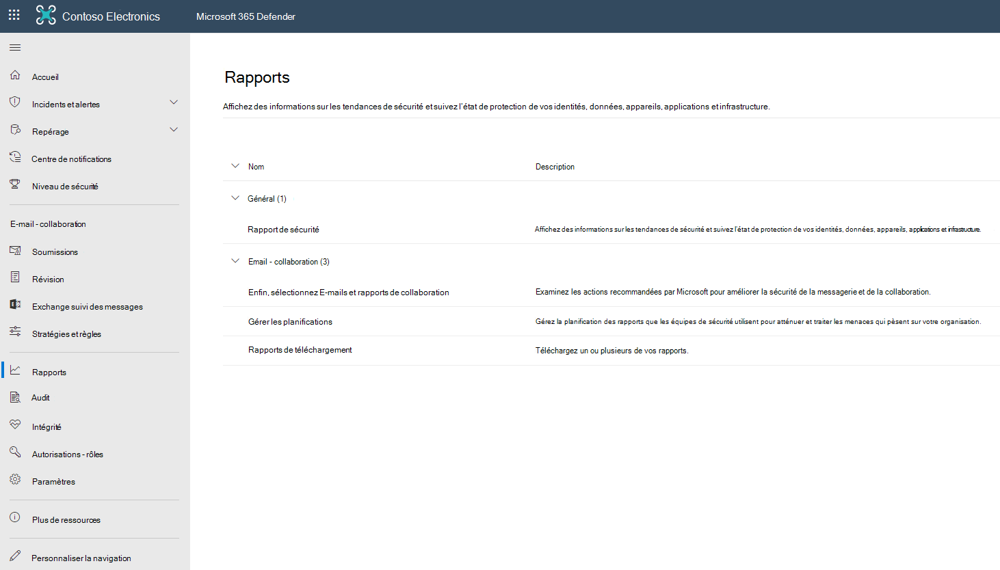
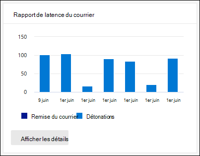
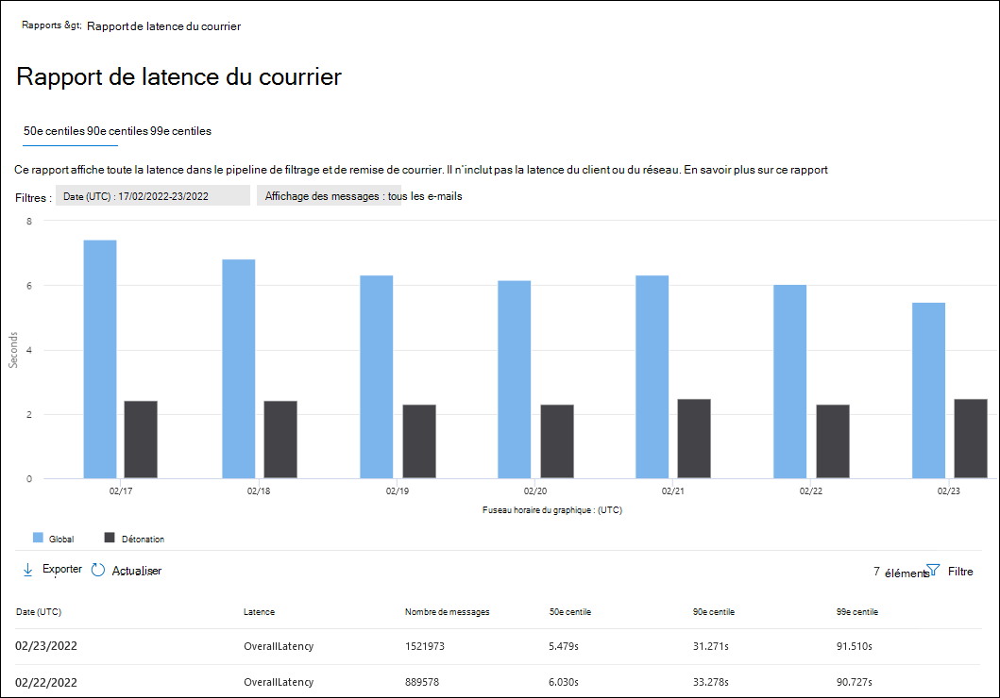
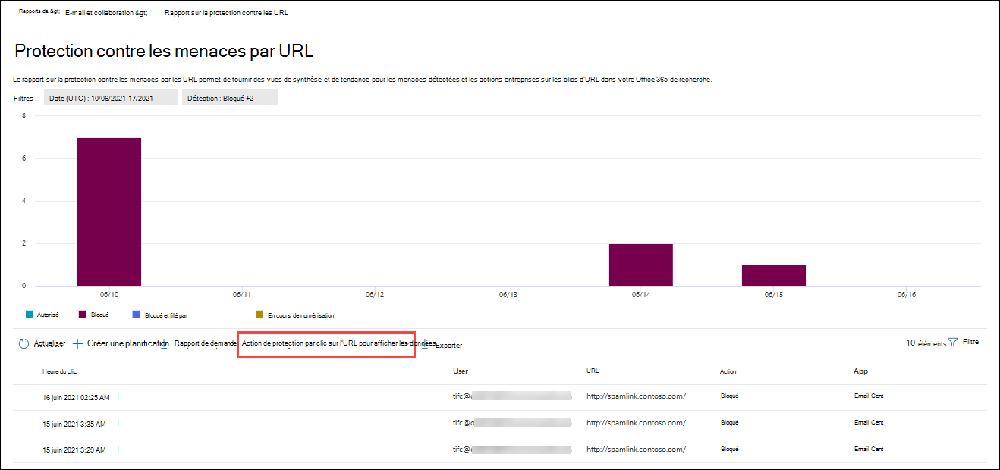
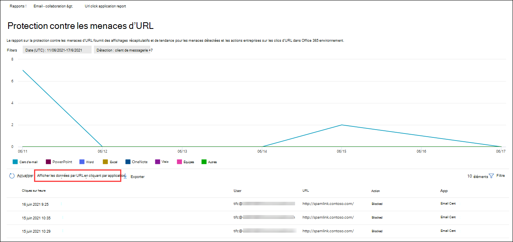

# Afficher les rapports de Office 365 Defender dans le portail Microsoft 365 Defender web

[!INCLUDE [Microsoft 365 Defender rebranding](../includes/microsoft-defender-for-office.md)]

**S’applique à**
- [Microsoft Defender pour Office 365 : offre 1 et offre 2](defender-for-office-365.md)
- [Microsoft 365 Defender](../defender/microsoft-365-defender.md)

Les organisations Microsoft Defender pour Office 365 (par exemple, les abonnements Microsoft 365 E5 ou Microsoft Defender pour Office 365 Plan 1 ou Microsoft Defender pour les modules de Office 365 Plan 2) contiennent de nombreux rapports de sécurité. Si vous avez les [autorisations nécessaires](#what-permissions-are-needed-to-view-the-defender-for-office-365-reports), vous pouvez afficher et télécharger ces rapports dans le portail Microsoft 365 Defender web.

## Consulter et télécharger les rapports

### Affichage des rapports

1. Dans le portail Microsoft 365 Defender à <https://security.microsoft.com>l’adresse , go to **Reports** \> **Email & collaboration** \> **Email & collaboration reports**. Pour aller directement à la page **e-mail & rapports de collaboration** , utilisez <https://security.microsoft.com/emailandcollabreport>.

1. Choisissez le rapport à afficher, puis sélectionnez **Afficher les détails**.  

### Télécharger des rapports existants

1. Dans le portail Microsoft 365 Defender à <https://security.microsoft.com>l’adresse , go to **ReportsEmail** >  **& collaboration** \> **Reports for download**. Pour aller directement à la page **Rapports de** téléchargement, utilisez <https://security.microsoft.com/ReportsForDownload?viewid=custom>.

> [!NOTE]
>
> Les rapports de sécurité de messagerie qui ne nécessitent pas Defender pour Office 365 sont décrits dans l’affichage des rapports de sécurité de messagerie dans [le portail Microsoft 365 Defender messagerie](view-email-security-reports.md).
>
> Les rapports liés au flux de messagerie sont désormais dans le Centre d’administration Exchange(EAC). Pour plus d’informations sur ces rapports, voir [Rapports de flux de messagerie dans le nouveau centre d Exchange’administration.](/exchange/monitoring/mail-flow-reports/mail-flow-reports)

## Coffre types de fichiers pièces jointes

> [!NOTE]
> Ce rapport a été supprimé. Les mêmes informations sont disponibles dans le rapport d’état [de la protection contre les menaces](#threat-protection-status-report).

## Coffre de disposition des messages de pièces jointes

> [!NOTE]
> Ce rapport a été supprimé. Les mêmes informations sont disponibles dans le rapport d’état [de la protection contre les menaces](#threat-protection-status-report).

## Rapport de latence du courrier

Le **rapport de latence de messagerie** vous présente une vue agrégée de la latence de remise et de détonation du courrier au sein de votre organisation. Les délais de remise du courrier dans le service sont affectés par un certain nombre de facteurs, et le temps de remise absolu en secondes n’est souvent pas un bon indicateur de réussite ou un problème. Un délai de remise lent d’un jour peut être considéré comme un délai de livraison moyen un autre jour, ou inversement. Cela tente de qualifier la remise des messages en fonction de données statistiques sur les délais de remise observés d’autres messages.

La latence côté client et réseau n’est pas incluse.

Pour afficher le rapport, ouvrez le portail Microsoft 365 Defender <https://security.microsoft.com>à l’adresse , go to **Reports** \> **Email & collaboration** \> **Email & collaboration reports**. Pour aller directement à la page **e-mail & rapports de collaboration** , utilisez <https://security.microsoft.com/emailandcollabreport>.

Dans la page **Rapports de collaboration &** courrier électronique, recherchez le rapport de **latence de messagerie** , puis cliquez sur **Afficher les détails**. Pour aller directement au rapport, utilisez <https://security.microsoft.com/mailLatencyReport>.

Dans la page **Rapport de latence de messagerie** , les onglets suivants sont disponibles dans la page Rapport de **latence de messagerie** :

- **50e centile** : il s’agit du milieu pour les heures de remise des messages. Vous pouvez considérer cette valeur comme un délai de livraison moyen. Cet onglet est sélectionné par défaut.
- **90e centile** : cela indique une latence élevée pour la remise des messages. Seuls 10 % des messages ont mis plus de temps que cette valeur à remettre.
- **99e centile** : cela indique la latence la plus élevée pour la remise des messages.

Quel que soit l’onglet que vous sélectionnez, le graphique affiche les messages organisés dans les catégories suivantes :

- **Latence de remise des messages**
- **Détonations**

Lorsque vous pointez sur une catégorie dans le graphique, vous pouvez voir une répartition de la latence dans chaque catégorie.

Si vous cliquez **sur Filtre**, vous pouvez filtrer à la fois le graphique et le tableau de détails selon les valeurs suivantes :

- **Date (UTC)** : **date de début et date** **de fin**
- **Affichage des messages** : l’une des valeurs suivantes :
  - **Tous les messages**
  - **Messages contenant des pièces jointes ou des URL**
  - **Messages détonés**

Lorsque vous avez terminé de configurer les filtres, cliquez sur **Appliquer**, **Annuler** ou **Effacer les filtres**.

Dans le tableau de détails sous le graphique, les informations suivantes sont disponibles :

- **Date (UTC)**
- **Percentiles** : **50**, **90** ou **99**
- **Nombre de messages**
- **Latence globale**

Dans la page principale du rapport, l’icône  **[Le bouton](view-email-security-reports.md#export-report)** Exporter est disponible.

## Rapport sur l’état de la protection contre les menaces

Le rapport d’état **de la protection** contre les menaces est un affichage unique qui regroupe des informations sur le contenu malveillant et les e-mails malveillants détectés et bloqués par [Exchange Online Protection](exchange-online-protection-overview.md) (EOP) et Microsoft Defender pour Office 365. Pour plus d’informations, consultez le [rapport d’état de la protection contre les menaces](view-email-security-reports.md#threat-protection-status-report).

## Rapport sur les principaux expéditeurs et destinataires

Le **rapport Sur les principaux expéditeurs et destinataires** affiche les principaux destinataires pour EOP et Defender pour les fonctionnalités Office 365 protection des données. Pour plus d’informations, consultez [le rapport des principaux expéditeurs et destinataires](view-email-security-reports.md#top-senders-and-recipients-report).

## Rapport sur la protection des URL

Le **rapport sur la protection des URL** fournit des affichages récapitulatifs et des tendances pour les menaces détectées et les actions entreprises sur les clics d’URL dans le cadre [Coffre liens.](safe-links.md) Ce rapport ne dispose pas des données de clic des utilisateurs pour lequel l’option Ne pas suivre les **clics** utilisateur est sélectionnée pour la stratégie de liens Coffre appliquée.

Pour afficher le rapport, ouvrez le [portail Microsoft 365 Defender](https://security.microsoft.com),  \>  \> et consultez la & collaboration **de rapports e-mail & rapports de collaboration**. Dans la page **& de collaboration** , recherchez la **page Protection des URL** , puis cliquez sur **Afficher les détails**. Pour aller directement dans le rapport, ouvrez <https://security.microsoft.com/reports/URLProtectionActionReport>.

Les vues disponibles sur la page du rapport **de protection des URL** sont décrites dans les sections suivantes.

> [!NOTE]
> Il s’agit *d’un rapport de tendance de protection*, ce qui signifie que les données représentent des tendances dans un jeu de données plus important. Par conséquent, les données des graphiques ne sont pas disponibles en temps réel ici, mais les données du tableau de détails le sont, vous pouvez donc voir une légère différence entre les deux. Les graphiques sont actualisé toutes les quatre heures et contiennent des données pour les 90 derniers jours.

### Afficher les données par action de protection par clic d’URL

**L’affichage des données par url de l’action de protection par clic** affiche le nombre de clics d’URL par les utilisateurs de l’organisation et les résultats du clic :

- **Autorisé :** clics autorisés.
- **Autorisé par l’administrateur client** : clics autorisés dans les stratégies Coffre liens.
- **Bloqué :** cliquez sur Bloqué.
- **Blocage par l’administrateur client** : clics bloqués dans les stratégies Coffre liens.
- **Bloqué et cliqué :** clics bloqués où les utilisateurs cliquent sur l’URL bloquée.
- **Bloqué par l’administrateur client et cliqué :** l’administrateur a bloqué le lien, mais l’utilisateur a cliqué.
- **Clicked through during scan**: Clicks where users click through the pending scan page to the URL.
- **Analyse en attente** : clique sur les URL en attente d’un verdict d’analyse.

Un clic indique que l’utilisateur a cliqué sur la page de blocage vers le site web malveillant (les administrateurs peuvent désactiver le clic dans les stratégies de liens Coffre web).

Si vous cliquez sur **Filtres**, vous pouvez modifier le rapport et le tableau des détails en sélectionnant une ou plusieurs des valeurs suivantes dans le volant qui s’affiche :

- **Date (UTC)** : **date de début et date** **de fin**
- **Action** :
  - **Autorisé**
  - **Bloqué**
  - **Autorisé par l’administrateur client**
  - **Bloqué et cliqué**
  - **Bloqué par l’administrateur client et cliqué**
  - **Clics au cours de l’analyse**
  - **Analyse en attente**
- **Domaines :** les domaines d’URL répertoriés dans les résultats du rapport.
- **Destinataires**

Lorsque vous avez terminé de configurer les filtres, cliquez sur **Appliquer**, **Annuler** ou **Effacer les filtres**.

Le tableau de détails sous le graphique fournit l’affichage en temps quasi réel suivant de tous les clics qui se sont produit au sein de l’organisation au cours des 7 derniers jours :

- **Heure du clic**
- **Utilisateur**
- **URL**
- **Action**
- **Application**

Dans la page principale du rapport, l’icône  **[Créer une planification](view-email-security-reports.md#schedule-report)**, icône  **[Demander un rapport](view-email-security-reports.md#request-report)** et icône  **[Les boutons d’exportation](view-email-security-reports.md#export-report)** sont disponibles.

### Afficher les données par URL en cliquant par application

**L’affichage des données par clic URL par vue d’application** indique le nombre de clics d’URL par les applications qui Coffre liens :

- **Client de messagerie**
- **Office document**
- **Teams**

Si vous cliquez sur **Filtres**, vous pouvez modifier le rapport et le tableau des détails en sélectionnant une ou plusieurs des valeurs suivantes dans le volant qui s’affiche :

- **Date (UTC)** : **date de début et date** **de fin**
- **Détection** : applications disponibles dans le graphique.
- **Domaines :** les domaines d’URL répertoriés dans les résultats du rapport.
- **Destinataires**

Lorsque vous avez terminé de configurer les filtres, cliquez sur **Appliquer**, **Annuler** ou **Effacer les filtres**.

Le tableau de détails sous le graphique fournit l’affichage en temps quasi réel suivant de tous les clics qui se sont produit au sein de l’organisation au cours des 7 derniers jours :

- **Heure du clic**
- **Utilisateur**
- **URL**
- **Action**
- **Application**

Dans la page principale du rapport, l’icône  **[Créer une planification](view-email-security-reports.md#schedule-report)**, icône  **[Demander un rapport](view-email-security-reports.md#request-report)** et icône  **[Les boutons d’exportation](view-email-security-reports.md#export-report)** sont disponibles.

## Rapports supplémentaires à afficher

Outre les rapports décrits dans cet article, plusieurs autres rapports sont disponibles, comme décrit dans le tableau suivant :

 

****

|Rapport|Rubrique|
|---|---|
|**Explorateur** (Microsoft Defender pour Office 365 Plan 2) ou **détections** en temps réel (Microsoft Defender pour Office 365 Plan 1)|[Explorateur de menaces (et détections en temps réel)](threat-explorer.md)|
|Rapports de sécurité de messagerie qui ne nécessitent pas Defender pour Office 365|[Afficher les rapports de sécurité de messagerie dans le portail Microsoft 365 Defender messagerie](view-email-security-reports.md)|
|Rapports de flux de messagerie dans le Centre Exchange’administration Centrale (EAC)|[Rapports de flux de messagerie dans le nouveau centre Exchange’administration](/exchange/monitoring/mail-flow-reports/mail-flow-reports)|
|

Cmdlets de rapports PowerShell :

 

****

|Rapport|Rubrique|
|---|---|
|Principaux expéditeurs et destinataires|[Get-MailTrafficTopReport](/powershell/module/exchange/get-mailtraffictopreport) 
 [Get-MailTrafficSummaryReport](/powershell/module/exchange/get-mailtrafficsummaryreport)|
|Principaux programmes malveillants|[Get-MailTrafficSummaryReport](/powershell/module/exchange/get-mailtrafficsummaryreport)|
|Trafic de messagerie|[Get-MailTrafficATPReport](/powershell/module/exchange/get-mailtrafficatpreport) 
 [Get-MailDetailATPReport](/powershell/module/exchange/get-maildetailatpreport)|
|Liens sûrs|[Get-SafeLinksAggregateReport](/powershell/module/exchange/get-safelinksaggregatereport) 
 [Get-SafeLinksDetailReport](/powershell/module/exchange/get-safelinksdetailreport)|
|Utilisateurs compromis|[Get-CompromisedUserAggregateReport](/powershell/module/exchange/get-compromiseduseraggregatereport) 
 [Get-CompromisedUserDetailReport](/powershell/module/exchange/get-compromiseduserdetailreport)|
|État du flux de messagerie|[Get-MailflowStatusReport](/powershell/module/exchange/get-mailflowstatusreport)|
|Utilisateurs usurpés|[Get-SpoofMailReport](/powershell/module/exchange/get-spoofmailreport)|
|

## Quelles autorisations sont nécessaires pour afficher les rapports Defender for Office 365 ?

Pour afficher et utiliser les rapports décrits dans cet article, vous devez être membre de l’un des groupes de rôles suivants dans le portail Microsoft 365 Defender:

- **Gestion de l'organisation**
- **Administrateur de la sécurité**
- **Lecteur de sécurité**
- **Lecteur général**

Pour plus d’informations, consultez [Autorisations dans le portail Microsoft 365 Defender](permissions-microsoft-365-security-center.md).

**Remarque** : l’ajout d’utilisateurs au rôle Azure Active Directory correspondant dans le Centre d'administration Microsoft 365 donne aux utilisateurs les autorisations requises dans le portail Microsoft 365 Defender  et les autorisations pour d’autres fonctionnalités dans Microsoft 365. Pour plus d’informations, consultez la rubrique [À propos des rôles d’administrateur](../../admin/add-users/about-admin-roles.md).

## Que se passe-t-il si les rapports n’affichent pas de données ?

Si vous ne voyez pas de données dans votre defender pour Office 365 rapports, vérifiez que vos stratégies sont correctement définies. Votre organisation doit avoir [défini des stratégies Coffre](set-up-safe-links-policies.md) liens et des [stratégies Coffre pièces jointes](set-up-safe-attachments-policies.md) pour que Defender pour Office 365 protection soit en place. Consultez également [La protection contre le courrier indésirable et les programmes malveillants](anti-spam-and-anti-malware-protection.md).

## Sujets associés

[Rapports intelligents et informations sur le portail Microsoft 365 Defender web](reports-and-insights-in-security-and-compliance.md)

[Azure AD rôles intégrés](/azure/active-directory/roles/permissions-reference)
