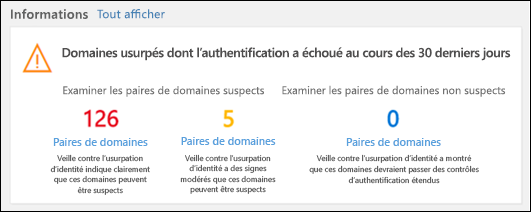
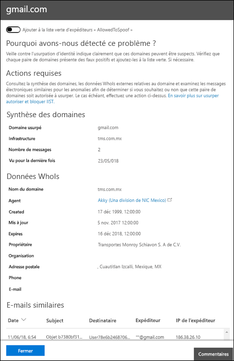

# Walkthrough - Spoof intelligence insight in Microsoft Defender for Office 365

[!INCLUDE [Microsoft 365 Defender rebranding](../includes/microsoft-defender-for-office.md)]

**S’applique à**
- [Microsoft Defender pour Office 365 : offre 1 et offre 2](office-365-atp.md)
- [Microsoft 365 Defender](../mtp/microsoft-threat-protection.md)

Dans les organisations Microsoft 365 avec Defender pour Office 365, vous pouvez utiliser la veille contre l’usurpation d’identité pour déterminer rapidement les expéditeurs externes qui vous envoient légitimement du courrier non authentifié (messages provenant de domaines qui ne passent pas les vérifications SPF, DKIM ou DMARC).

En permettant aux expéditeurs externes connus d’envoyer des messages usurpés à partir d’emplacements connus, vous pouvez réduire les faux positifs (e-mail de qualité marqué comme faux). En surveillant les expéditeurs usurpés autorisés, vous fournissez une couche de sécurité supplémentaire pour empêcher les messages non sécurisés d’arriver dans votre organisation.

Pour plus d’informations sur les rapports et les informations, voir Rapports et informations dans le Centre de [sécurité & conformité.](reports-and-insights-in-security-and-compliance.md)

Cette walkthrough est l’une des nombreuses pour le Centre de sécurité & conformité. Pour plus d’informations sur la navigation dans les rapports et les informations, voir les walkthroughs dans la section [Rubriques connexes.](#related-topics)

> [!NOTE]
> La veille contre l’usurpation d’informations affiche les données des 7 derniers jours. La [stratégie de veille](learn-about-spoof-intelligence.md) contre l’usurpation d’informations et la cmdlet [Get-PhishFilterPolicy](https://docs.microsoft.com/powershell/module/exchange/get-phishfilterpolicy) correspondante dans Exchange Online PowerShell affiche les données des 30 derniers jours. [Get-SpoofMailReport](https://docs.microsoft.com/powershell/module/exchange/get-spoofmailreport) affiche les données pendant 90 jours au plus.

## Ce qu'il faut savoir avant de commencer

- Vous ouvrez le Centre de conformité et sécurité sur <https://protection.office.com/>. Pour aller directement à la page du tableau **de bord de sécurité,** utilisez <https://protection.office.com/searchandinvestigation/dashboard> .

  Vous pouvez afficher les informations sur l’usurpation d’informations à partir de plusieurs tableaux de bord dans le Centre de sécurité & conformité. Quel que soit le tableau de bord que vous regardez, l’aperçu fournit les mêmes détails et vous permet d’effectuer rapidement les mêmes tâches.

- Pour pouvoir utiliser ce cmdlet, vous devez disposer des autorisations dans le centre de sécurité et conformité Office 365.
  - **Gestion de l'organisation**
  - **Administrateur de la sécurité**
  - **Lecteur de sécurité**
  - **Lecteur général**

  Si vous souhaitez en savoir plus, veuillez consulter la rubrique [Autorisations dans le Centre de sécurité et de conformité](permissions-in-the-security-and-compliance-center.md).

  **Remarque**: l’ajout d’utilisateurs au rôle Azure Active Directory correspondant dans le Centre d’administration  Microsoft 365 donne aux utilisateurs les autorisations requises dans le Centre de sécurité & conformité et les autorisations pour d’autres fonctionnalités dans Microsoft 365. Pour plus d’informations, consultez [À propos des rôles d’administrateur](../../admin/add-users/about-admin-roles.md).

- Vous activez et désactivez la veille contre l’usurpation d’informations dans les stratégies anti-hameçonnage dans Microsoft Defender pour Office 365. La veille contre l’usurpation d’informations est activée par défaut. Pour plus d’informations, voir Configurer des [stratégies anti-hameçonnage dans Microsoft Defender pour Office 365.](configure-atp-anti-phishing-policies.md)

- Pour utiliser la veille contre l’usurpation d’adresse pour surveiller et gérer les expéditeurs qui vous envoient des messages non authentifiés, voir Configurer la veille contre l’usurpation d’adresses dans [Microsoft 365.](learn-about-spoof-intelligence.md)

## Ouvrez les informations sur l’usurpation d'& conformité

1. Dans le Centre de sécurité & conformité, allez au Tableau de **bord de gestion des** \> **menaces.**

2. Dans la **ligne Insights,** recherchez l’un des éléments suivants :

   - **Domaines usurpés probables** au cours des sept derniers jours : cette information indique que la veille contre l’usurpation d’informations est activée (activée par défaut).
   - **Activer la protection contre** l’usurpation d’informations : cette information indique que la veille contre l’usurpation d’informations est désactivée, et le fait de cliquer sur l’information vous permet d’activer la veille contre l’usurpation d’informations.

3. L’aperçu du tableau de bord vous présente des informations telles que les présentes :

   

   Cette information a deux modes :

   - **Mode Insight**: si la veille contre l’usurpation d’informations est activée, elle vous montre le nombre de messages qui ont été touchés par nos fonctionnalités de veille contre l’usurpation d’informations au cours des sept derniers jours.
   - **Que** se passe-t-il si le mode : si la veille contre l’usurpation d’informations est désactivée, l’analyse vous montre le nombre de *messages* qui auraient été touchés par nos fonctionnalités de veille contre l’usurpation d’informations au cours des sept derniers jours.

   Dans les deux cas, les domaines usurpés affichés dans l’insight sont séparés en deux **catégories** : domaines suspects et domaines **non suspects.**

   - **Les domaines suspects sont** les suivants :

     - Usurpation d’un niveau de confiance élevé : en fonction des modèles d’envoi historiques et du score de réputation des domaines, nous sommes très certains que les domaines sont usurpés et que les messages provenant de ces domaines sont plus susceptibles d’être malveillants.

     - Usurpation de confiance modérée : en fonction des modèles d’envoi historiques et du score de réputation des domaines, nous sommes modérément certains que les domaines sont usurpés et que les messages envoyés à partir de ces domaines sont légitimes. Les faux positifs sont plus probables dans cette catégorie que l’usurpation d’identité à haut niveau de confiance.

   **Domaines non suspects**: le domaine a échoué aux vérifications explicites de l’authentification de courrier électronique [SPF,](how-office-365-uses-spf-to-prevent-spoofing.md) [DKIM](use-dkim-to-validate-outbound-email.md)et [DMARC](use-dmarc-to-validate-email.md). Toutefois, le domaine a réussi nos vérifications d’authentification de messagerie implicites[(authentification composite).](email-validation-and-authentication.md#composite-authentication) Par conséquent, aucune action anti-usurpation n’a été prise sur le message.

### Afficher des informations détaillées sur les domaines suspects à partir des informations sur l’usurpation d’informations

1. Dans la veille contre l’usurpation d’informations, cliquez sur **Domaines suspects** ou **Domaines non suspects** pour aller à la page Informations sur l’usurpation **d’intelligence.** La page **Informations sur l’usurpation d’intelligence** contient les informations suivantes :

   - **Domaine usurpé**: domaine de l’utilisateur usurpé qui s’affiche dans la zone De des clients de messagerie.  Cette adresse est également appelée `5322.From` adresse.
   - **Infrastructure**: également appelée infrastructure _d’envoi._ Domaine trouvé dans une recherche DNS inversée (enregistrement PTR) de l’adresse IP du serveur de messagerie source. Si l’adresse IP source n’a pas d’enregistrement PTR, l’infrastructure d’envoi est identifiée comme \<source IP\> /24 (par exemple, 192.168.100.100/24).
   - **Nombre de** messages : nombre de messages de l’infrastructure d’envoi à votre organisation qui contiennent le domaine usurpé spécifié au cours des 7 derniers jours.
   - **Dernière vue**: date de la dernière réception d’un message de l’infrastructure d’envoi qui contient le domaine usurpé.
   - **Type d’usurpation**: cette valeur est **Externe**.
   - **Autorisé à usurper ? :** les valeurs que vous voyez ici sont :
     - **Oui**: les messages provenant de la combinaison du domaine de l’utilisateur usurpé et de l’infrastructure d’envoi sont autorisés et ne sont pas traités comme des e-mails usurpés.
     - **Non**: les messages provenant de la combinaison du domaine de l’utilisateur usurpé et de l’infrastructure d’envoi sont marqués comme usurpés. L’action est contrôlée par la stratégie anti-hameçonnage par défaut ou les stratégies anti-hameçonnage personnalisées (la valeur par défaut est Déplacer le message vers le dossier **Courrier indésirable).**

     Pour plus d’informations, voir Configurer des [stratégies anti-hameçonnage dans Microsoft Defender pour Office 365.](configure-atp-anti-phishing-policies.md)

2. Sélectionnez un élément dans la liste pour afficher les détails sur la paire de domaines/d’infrastructure d’envoi dans un volant. Les informations comprennent :
   - Pourquoi nous l’avons capturé.
   - Ce que vous devez faire.
   - Résumé du domaine.
   - WhoIs data about the sender.
   - Messages similaires que nous avons vus dans votre client à partir du même expéditeur.

   À partir de là, vous pouvez également choisir d’ajouter ou de supprimer la paire domaine/infrastructure d’envoi de la liste d’expéditeurs autorisés à usurper l’adresse.  Définissez simplement le basculement en conséquence.

   

### Ajout d’un domaine à la liste des usurpations d’usurpation d’accès

L’ajout d’un domaine à la liste des personnes autorisées à usurper des  informations sur l’usurpation d’informations permet uniquement la combinaison du domaine usurpé et de l’infrastructure d’envoi. Il n’autorise pas le courrier électronique provenant du domaine usurpé d’aucune source, ni le courrier provenant de l’infrastructure d’envoi pour n’importe quel domaine.

Par exemple, vous autorisez le domaine suivant à la liste des usurpations d’usurpation d’accès :

- **Domaine**: gmail.com
- **Infrastructure**: tms.mx.com

Seul le courrier électronique provenant de cette paire d’infrastructure de domaine/d’envoi est autorisé à usurper l’adresse. Les autres expéditeurs qui tentent d’usurper gmail.com ne sont pas autorisés. Les messages provenant d’autres domaines tms.mx.com sont vérifiés par la veille contre l’usurpation d’informations.

## Rubriques connexes

[Protection contre l’usurpation d’usurpation dans Microsoft 365](anti-spoofing-protection.md)
