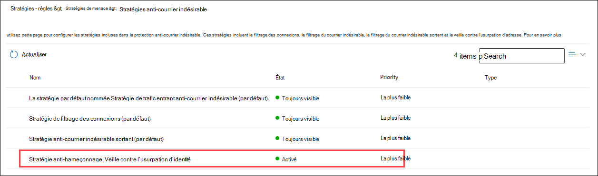
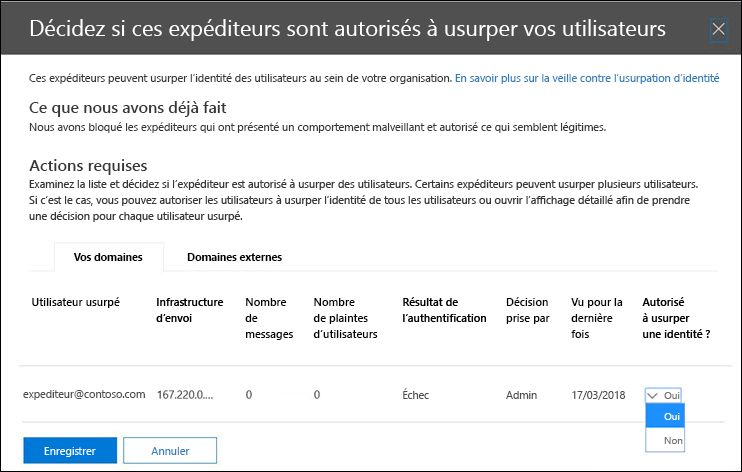

# <a name="manage-spoofed-senders-using-the-spoof-intelligence-policy-and-spoof-intelligence-insight-in-eop"></a>Gérer les expéditeurs usurpés à l’aide de la stratégie de veille contre l’usurpation d’informations et des informations sur l’usurpation d’informations dans EOP

[!INCLUDE [Microsoft 365 Defender rebranding](../includes/microsoft-defender-for-office.md)]

**S’applique à**
- [Microsoft Defender pour Office 365 : offre 1 et offre 2](defender-for-office-365.md)
- [Microsoft 365 Defender](../defender/microsoft-365-defender.md)

> [!NOTE]
> Cet article décrit l’ancienne expérience de gestion des expéditeurs usurpés qui est remplacée. Pour plus d’informations sur la nouvelle expérience, voir Informations sur [l’usurpation d’intelligence dans EOP](learn-about-spoof-intelligence.md)

Dans Microsoft 365 organisations avec des boîtes aux lettres en Exchange Online ou des organisations Exchange Online Protection autonomes (EOP) sans boîtes aux lettres Exchange Online, les messages électroniques entrants sont automatiquement protégés contre l’usurpation d’adresse par EOP à partir d’octobre 2018. EOP utilise **la veille contre** l’usurpation d’adresse dans le cadre de la protection globale de votre organisation contre le hameçonnage. Pour plus d’informations, voir [Protection contre l’usurpation d’adresse dans EOP.](anti-spoofing-protection.md)

La stratégie de veille contre l’usurpation d’informations par défaut (et **uniquement)** permet de s’assurer que les messages électroniques usurpés envoyés par des expéditeurs légitimes ne sont pas pris en compte dans les filtres de courrier indésirable EOP tout en protégeant vos utilisateurs contre les attaques de courrier indésirable ou de hameçonnage. Vous pouvez également  utiliser la veille contre l’usurpation d’identité pour déterminer rapidement les expéditeurs externes qui vous envoient légitimement des messages électroniques non authentifiés (messages provenant de domaines ne réussissant pas les vérifications SPF, DKIM ou DMARC).

Vous pouvez gérer la veille contre l’usurpation d’adresse dans le Centre de sécurité & conformité ou dans PowerShell (Exchange Online PowerShell pour les organisations Microsoft 365 avec des boîtes aux lettres en Exchange Online ; EOP PowerShell autonome pour les organisations sans boîtes aux lettres Exchange Online).

## <a name="what-do-you-need-to-know-before-you-begin"></a>Ce qu'il faut savoir avant de commencer

- Vous ouvrez le Centre de conformité et sécurité sur <https://protection.office.com/>.
  - Pour aller directement à la page des **paramètres anti-courrier** indésirable pour la stratégie de veille contre l’usurpation d’adresse, utilisez <https://protection.office.com/antispam> .
  - Pour aller directement à la page du tableau de **bord de** sécurité pour obtenir des informations sur l’usurpation d’intelligence, utilisez <https://protection.office.com/searchandinvestigation/dashboard> .

- Pour vous connecter à Exchange Online PowerShell, voir [Connexion à Exchange Online PowerShell](/powershell/exchange/connect-to-exchange-online-powershell). Pour vous connecter à un service Exchange Online Protection PowerShell autonome, voir [Se connecter à Exchange Online Protection PowerShell](/powershell/exchange/connect-to-exchange-online-protection-powershell).

- Des autorisations doivent vous avoir été attribuées dans **Exchange Online** pour que vous puissiez effectuer les procédures décrites dans cet article :
  - Pour modifier la stratégie de veille contre l’usurpation d’informations ou activer  ou  désactiver la veille contre l’usurpation d’informations, vous devez être membre des groupes de rôles Gestion de l’organisation ou Administrateur de la sécurité.
  - Pour accéder en lecture seule à la stratégie d’intelligence contre  l’usurpation d’informations, vous devez être membre des groupes de rôles Lecteur global ou Lecteur **de** sécurité.

  Pour plus d'informations, voir [Permissions en échange en ligne](/exchange/permissions-exo/permissions-exo).

  **Remarques** :

  - L’ajout d’utilisateurs au rôle Azure Active Directory correspondant dans le Centre d’administration Microsoft 365 donne aux utilisateurs les autorisations requises _et_ les autorisations pour les autres fonctionnalités de Microsoft 365. Pour plus d’informations, consultez [À propos des rôles d’administrateur](../../admin/add-users/about-admin-roles.md).
  - Le groupe de rôles **Gestion de l’organisation en affichage seul** dans [Exchange Online](/Exchange/permissions-exo/permissions-exo#role-groups) permet également d’accéder en lecture seule à la fonctionnalité.

- Les options de veille contre l’usurpation d’informations sont décrites dans les paramètres d’usurpation d’informations dans les [stratégies anti-hameçonnage.](set-up-anti-phishing-policies.md#spoof-settings)

- Vous pouvez activer, désactiver et configurer les paramètres de veille contre l’usurpation d’informations dans les stratégies anti-hameçonnage. Pour obtenir des instructions basées sur votre abonnement, consultez l’une des rubriques suivantes :

  - [Configurer des stratégies anti-hameçonnage dans EOP.](configure-anti-phishing-policies-eop.md)
  - [Configurer des stratégies anti-hameçonnage dans Microsoft Defender pour Office 365](configure-mdo-anti-phishing-policies.md).

- Pour obtenir nos paramètres recommandés pour la veille contre l’usurpation d’adresse, consultez les paramètres de stratégie [anti-hameçonnage EOP.](recommended-settings-for-eop-and-office365.md#eop-anti-phishing-policy-settings)

## <a name="manage-spoofed-senders"></a>Gérer les expéditeurs usurpés

Il existe deux façons d’autoriser et de bloquer les expéditeurs usurpés :

- [Utiliser la stratégie de veille contre l’usurpation d’informations](#manage-spoofed-senders-in-the-spoof-intelligence-policy)
- [Utiliser la veille contre l’usurpation d’informations](#manage-spoofed-senders-in-the-spoof-intelligence-insight)

### <a name="manage-spoofed-senders-in-the-spoof-intelligence-policy"></a>Gérer les expéditeurs usurpés dans la stratégie de veille contre l’usurpation d’adresse

1. Dans le Centre de sécurité et conformité, accédez à **Gestion des menaces** \> **Stratégie** \> **Anti-courrier indésirable**.

2. Dans la page **Paramètres anti-courrier** indésirable, cliquez sur Développer l’icône pour développer la stratégie de  **l’usurpation d’adresse .**

   

3. Faites l’une des sélections suivantes :

   - **Passer en revue les nouveaux expéditeurs**
   - **Afficher les expéditeurs que j’ai déjà examinés**

4. Dans **l’onglet Décider si ces** expéditeurs sont autorisés à usurper l’usurpation de vos utilisateurs qui s’affiche, sélectionnez l’un des onglets suivants :

   - **Vos domaines : expéditeurs** usurpant des utilisateurs dans vos domaines internes.
   - **Domaines externes : expéditeurs** usurpant des utilisateurs dans des domaines externes.

5. Cliquez  l’icône dans **la colonne Usurpation d’usurpation d’accès.** Choisissez **Oui** pour autoriser l’expéditeur usurpé  ou non pour marquer le message comme usurpant l’usurpation. L’action est contrôlée par la stratégie anti-hameçonnage par défaut ou les stratégies anti-hameçonnage personnalisées (la valeur par défaut est Déplacer le message dans le dossier **Courrier indésirable).** Si vous souhaitez en savoir plus, consultez l’article [Paramètres d’usurpation dans les stratégies anti-hameçonnage](set-up-anti-phishing-policies.md#spoof-settings).

   

   Les colonnes et les valeurs que vous voyez sont expliquées dans la liste suivante :

   - **Utilisateur usurpé :** compte d’utilisateur usurpé. Il s’agit de l’expéditeur du message dans l’adresse de provenance (également appelée adresse) qui est affichée dans les `5322.From` clients de messagerie. La validité de cette adresse n’est pas vérifiée par SPF.
     - Sous **l’onglet** Vos domaines, la valeur contient une seule adresse de messagerie, ou si le serveur de messagerie source usurpe plusieurs comptes d’utilisateur, il en contient **plusieurs.**
     - Sous **l’onglet Domaines externes,** la valeur contient le domaine de l’utilisateur usurpé, et non l’adresse de messagerie complète.

   - **Infrastructure d’envoi**: domaine trouvé dans une recherche DNS inversée (enregistrement PTR) de l’adresse IP du serveur de messagerie source. Si l’adresse IP source n’a pas d’enregistrement PTR, l’infrastructure d’envoi est identifiée comme \<source IP\> /24 (par exemple, 192.168.100.100/24).

     Pour plus d’informations sur les sources de messages et les expéditeurs de messages, voir [une vue d’ensemble des normes de message électronique.](how-office-365-validates-the-from-address.md#an-overview-of-email-message-standards)

   - **# des messages**: nombre de messages de l’infrastructure d’envoi à votre organisation qui contiennent l’expéditeur ou les expéditeurs usurpés spécifiés au cours des 30 derniers jours.

   - **# des réclamations des utilisateurs**: réclamations déposées par vos utilisateurs contre cet expéditeur au cours des 30 derniers jours. Les réclamations se font généralement sous la forme de soumissions de courrier indésirable à Microsoft.

   - **Résultat de l’authentification**: l’une des valeurs suivantes :
      - **Réussi :** l’expéditeur a réussi les vérifications d’authentification de courrier électronique de l’expéditeur (SPF ou DKIM).
      - **Échec :** l’expéditeur a échoué aux vérifications d’authentification de l’expéditeur EOP.
      - **Inconnu**: le résultat de ces vérifications est inconnu.

   - **Décision définie par**: indique qui a déterminé si l’infrastructure d’envoi est autorisée à usurper l’utilisateur :
       - **Stratégie de veille contre l’usurpation** d’informations (automatique)
       - **Administrateur** (manuel)

   - **Dernière vue**: date de la dernière réception d’un message de l’infrastructure d’envoi contenant l’utilisateur usurpé.

   - **Autorisé à usurper l’usurpation d’accès ?**: les valeurs que vous voyez ici sont les :
     - **Oui**: les messages provenant de la combinaison de l’utilisateur usurpé et de l’infrastructure d’envoi sont autorisés et ne sont pas traités comme des e-mails usurpés.
     - **Non**: les messages provenant de la combinaison de l’utilisateur usurpé et de l’infrastructure d’envoi sont marqués comme usurpés. L’action est contrôlée par la stratégie anti-hameçonnage par défaut ou les stratégies anti-hameçonnage personnalisées (la valeur par défaut est Déplacer le message dans le dossier **Courrier indésirable).** Pour plus d’informations, voir la section suivante.

     - **Certains utilisateurs** (onglet Vos domaines uniquement) : une infrastructure d’envoi usurpe plusieurs **utilisateurs,** où certains utilisateurs usurpés sont autorisés et d’autres non. Utilisez **l’onglet Détails** pour voir les adresses spécifiques.

6. En bas de la page, cliquez sur **Enregistrer.**

#### <a name="use-powershell-to-manage-spoofed-senders"></a>Utiliser PowerShell pour gérer les expéditeurs usurpés

Pour afficher les expéditeurs autorisés et bloqués dans la veille contre l’usurpation d’adresse, utilisez la syntaxe suivante :

```powershell
Get-PhishFilterPolicy [-AllowedToSpoof <Yes | No | Partial>] [-ConfidenceLevel <Low | High>] [-DecisionBy <Admin | SpoofProtection>] [-Detailed] [-SpoofType <Internal | External>]
```

Cet exemple renvoie des informations détaillées sur tous les expéditeurs autorisés à usurper des noms d’utilisateurs dans vos domaines.

```powershell
Get-PhishFilterPolicy -AllowedToSpoof Yes -Detailed -SpoofType Internal
```

Pour obtenir des informations détaillées sur la syntaxe et les paramètres, [voir Get-PhishFilterPolicy.](/powershell/module/exchange/get-phishfilterpolicy)

Pour configurer les expéditeurs autorisés et bloqués dans la veille contre l’usurpation d’adresse, suivez les étapes suivantes :

1. Capturez la liste actuelle des expéditeurs usurpés détectés en écrivant la sortie de l’cmdlet **Get-PhishFilterPolicy** dans un fichier CSV en exécutant la commande suivante :

   ```powershell
   Get-PhishFilterPolicy -Detailed | Export-CSV "C:\My Documents\Spoofed Senders.csv"
   ```

2. Modifiez le fichier CSV pour ajouter ou modifier les valeurs suivantes :
   - **Expéditeur** (domaine dans l’enregistrement PTR ou l’adresse IP/24 du serveur source)
   - **SpoofedUser :** l’une des valeurs suivantes :
     - Adresse de messagerie de l’utilisateur interne.
     - Domaine de messagerie de l’utilisateur externe.
     - Valeur vide qui indique que vous souhaitez bloquer ou autoriser tous les messages usurpés de l’expéditeur **spécifié,** quelle que soit l’adresse e-mail usurpée.
   - **AllowedToSpoof** (Oui ou Non)
   - **SpoofType** (interne ou externe)

   Enregistrez le fichier, lisez-le et stockez le contenu en tant que variable nommée `$UpdateSpoofedSenders` en exécutant la commande suivante :

   ```powershell
   $UpdateSpoofedSenders = Get-Content -Raw "C:\My Documents\Spoofed Senders.csv"
   ```

3. Utilisez la variable pour configurer la stratégie d’intelligence contre l’usurpation `$UpdateSpoofedSenders` d’informations en exécutant la commande suivante :

   ```powershell
   Set-PhishFilterPolicy -Identity Default -SpoofAllowBlockList $UpdateSpoofedSenders
   ```

Pour obtenir des informations détaillées sur la syntaxe et les paramètres, voir [Set-PhishFilterPolicy.](/powershell/module/exchange/set-phishfilterpolicy)

### <a name="manage-spoofed-senders-in-the-spoof-intelligence-insight"></a>Gérer les expéditeurs usurpés dans l’aperçu de l’usurpation d’intelligence

1. Dans le Centre de sécurité & conformité, allez au Tableau de **bord de gestion des** \> **menaces.**

2. Dans la **Informations,** recherchez l’un des éléments suivants :

   - **Domaines usurpés probables** au cours des sept derniers jours : cette information indique que la veille contre l’usurpation d’informations est activée (activée par défaut).
   - **Activer la protection contre** l’usurpation d’informations : cette information indique que la veille contre l’usurpation d’informations est désactivée, et le fait de cliquer sur l’information vous permet d’activer la veille contre l’usurpation d’informations.

3. Les informations du tableau de bord vous montrent des informations telles que :

   

   Cette information a deux modes :

   - **Mode Insight**: si la veille contre l’usurpation d’informations est activée, elle vous montre le nombre de messages qui ont été touchés par nos fonctionnalités de veille contre l’usurpation d’informations au cours des sept derniers jours.
   - **Que** se passe-t-il si le mode : si la veille contre l’usurpation d’informations est désactivée, l’analyse vous montre le nombre de *messages* qui auraient été touchés par nos fonctionnalités de veille contre l’usurpation d’informations au cours des sept derniers jours.

   Dans les deux cas, les domaines usurpés affichés dans l’aperçu sont séparés en deux **catégories** : domaines suspects et domaines **non suspects.**

   - **Domaines suspects**:
     - Usurpation d’un niveau de confiance élevé : en fonction des modèles d’envoi historiques et du score de réputation des domaines, nous sommes très certains que les domaines sont usurpés et que les messages provenant de ces domaines sont plus susceptibles d’être malveillants.
     - Usurpation de confiance modérée : en fonction des modèles d’envoi historiques et du score de réputation des domaines, nous sommes modérément certains que les domaines sont usurpés et que les messages envoyés à partir de ces domaines sont légitimes. Les faux positifs sont plus probables dans cette catégorie que l’usurpation d’identité à haut niveau de confiance.
   - **Domaines non suspects**: le domaine a échoué aux vérifications explicites de l’authentification de courrier électronique [SPF,](how-office-365-uses-spf-to-prevent-spoofing.md) [DKIM](use-dkim-to-validate-outbound-email.md)et [DMARC](use-dmarc-to-validate-email.md). Toutefois, le domaine a réussi nos vérifications d’authentification de messagerie implicites[(authentification composite).](email-validation-and-authentication.md#composite-authentication) Par conséquent, aucune action anti-usurpation n’a été prise sur le message.

#### <a name="view-detailed-information-about-suspicious-and-nonsuspicious-domains"></a>Afficher des informations détaillées sur les domaines suspects et non utiles

1. Dans la veille contre l’usurpation d’informations, cliquez sur **Domaines suspects** ou **Domaines non suspects** pour aller à la page Informations sur l’usurpation **d’informations sur l’usurpation d’informations.** La page **Informations sur l’usurpation d’intelligence** contient les informations suivantes :

   - **Domaine usurpé**: domaine de l’utilisateur usurpé qui s’affiche dans la zone De des clients de messagerie.  Cette adresse est également appelée `5322.From` adresse.
   - **Infrastructure**: également appelée infrastructure _d’envoi._ Domaine trouvé dans une recherche DNS inversée (enregistrement PTR) de l’adresse IP du serveur de messagerie source. Si l’adresse IP source n’a pas d’enregistrement PTR, l’infrastructure d’envoi est identifiée comme \<source IP\> /24 (par exemple, 192.168.100.100/24).
   - **Nombre de** messages : nombre de messages de l’infrastructure d’envoi à votre organisation qui contiennent le domaine usurpé spécifié au cours des 7 derniers jours.
   - **Dernière vue**: date de la dernière réception d’un message de l’infrastructure d’envoi contenant le domaine usurpé.
   - **Type d’usurpation**: cette valeur est **Externe**.
   - **Autorisé à usurper l’usurpation d’accès ?**: les valeurs que vous voyez ici sont les :
     - **Oui**: les messages provenant de la combinaison du domaine de l’utilisateur usurpé et de l’infrastructure d’envoi sont autorisés et ne sont pas traités comme des e-mails usurpés.
     - **Non**: les messages provenant de la combinaison du domaine de l’utilisateur usurpé et de l’infrastructure d’envoi sont marqués comme usurpés. L’action est contrôlée par la stratégie anti-hameçonnage par défaut ou les stratégies anti-hameçonnage personnalisées (la valeur par défaut est Déplacer le message dans le dossier **Courrier indésirable).**

2. Sélectionnez un élément dans la liste pour afficher les détails sur la paire de domaines/d’infrastructure d’envoi dans un volant. Les informations comprennent :
   - Pourquoi nous l’avons capturé.
   - Ce que vous devez faire.
   - Résumé du domaine.
   - WhoIs data about the sender.
   - Messages similaires que nous avons vus dans votre client à partir du même expéditeur.

   À partir de là, vous pouvez également choisir d’ajouter ou de supprimer la paire domaine/infrastructure d’envoi de la liste d’expéditeurs autorisés à usurper l’adresse de l’expéditeur autorisé.  Définissez simplement le basculement en conséquence.

   

## <a name="how-do-you-know-these-procedures-worked"></a>Comment savoir si ces procédures ont fonctionné ?

Pour vérifier que vous avez configuré la veille contre l’usurpation d’identité avec des expéditeurs autorisés et non autorisés à usurper l’identité, utilisez l’une des étapes suivantes :

- In the Security & Compliance Center, go to **Threat management** \> **Policy** \> **Anti-spam** \> expand **Spoof intelligence policy** select Show me \> **senders I already reviewed** select the Your \> **Domains** or External **Domains** tab, and verify the **Allowed to spoof?** value for the sender.

- Dans PowerShell, exécutez les commandes suivantes pour afficher les expéditeurs autorisés et non autorisés à usurper :

  ```powershell
  Get-PhishFilterPolicy -AllowedToSpoof Yes -SpoofType Internal
  Get-PhishFilterPolicy -AllowedToSpoof No -SpoofType Internal
  Get-PhishFilterPolicy -AllowedToSpoof Yes -SpoofType External
  Get-PhishFilterPolicy -AllowedToSpoof No -SpoofType External
  ```

- Dans PowerShell, exécutez la commande suivante pour exporter la liste de tous les expéditeurs usurpés vers un fichier CSV :

   ```powershell
   Get-PhishFilterPolicy -Detailed | Export-CSV "C:\My Documents\Spoofed Senders.csv"
   ```
