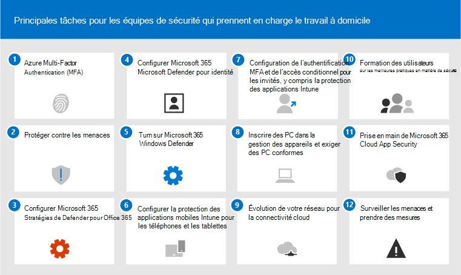

# 12 tâches principales pour les équipes de sécurité pour prendre en charge le travail à domicile

Si vous êtes comme [Microsoft](https://www.microsoft.com/microsoft-365/blog/2020/03/10/staying-productive-while-working-remotely-with-microsoft-teams/) et que vous vous retrouvez soudainement à prendre en charge un personnel principalement basé à domicile, nous voulons vous aider à vous assurer que votre organisation travaille en toute sécurité. Cet article hiérarchise les tâches pour aider les équipes de sécurité à implémenter les fonctionnalités de sécurité les plus importantes aussi rapidement que possible.

Si vous êtes une petite ou moyenne entreprise utilisant l’une des plans d’entreprise de Microsoft, consultez plutôt les ressources ci-après :

- [10 principales façons de sécuriser les plans Office 365 et Microsoft 365 pour les entreprises](../admin/security-and-compliance/secure-your-business-data.md)
- [Microsoft 365 campagnes](../campaigns/index.md) (inclut une configuration de sécurité recommandée pour Microsoft 365 Business)

Pour les clients qui utilisent nos plans d’entreprise, Microsoft vous recommande d’effectuer les tâches répertoriées dans le tableau suivant qui s’appliquent à votre plan de service. Si, au lieu d’acheter une offre Microsoft 365'entreprise, vous combinez des abonnements, notez les remarques suivantes :

- Microsoft 365 E3 inclut Enterprise Mobility + Security (EMS) E3 et Azure AD P1
- Microsoft 365 E5 ems E5 et Azure AD P2

****

|Étape|Tâche|Toutes les Office 365 Entreprise plan|Microsoft 365 E3|Microsoft 365 E5|
|---|---|---|---|---|
|1|[Activer l’authentification multifacteur Azure AD (MFA)](#1-enable-azure-ad-multi-factor-authentication-mfa)||||
|2|[Se protéger contre les menaces](#2-protect-against-threats)||||
|3|[Configurer Microsoft Defender pour Office 365](#3-configure-microsoft-defender-for-office-365)||||
|4 |[Configurer Microsoft Defender pour l’identité](#4-configure-microsoft-defender-for-identity)||||
|5 |[Activer Microsoft 365 Defender](#5-turn-on-microsoft-365-defender)||||
|6 |[Configurer la protection des applications mobiles Intune pour les téléphones et les tablettes](#6-configure-intune-mobile-app-protection-for-phones-and-tablets)||||
|7 |[Configurer l' approbation de la MFA et l’accès conditionnel pour les invités, y compris la protection des applications Intune](#7-configure-mfa-and-conditional-access-for-guests-including-intune-mobile-app-protection)||||
|8 |[Inscrire des PC dans la gestion des appareils et exiger des PC conformes](#8-enroll-pcs-into-device-management-and-require-compliant-pcs)||||
|9 |[Optimiser votre réseau pour la connectivité cloud](#9-optimize-your-network-for-cloud-connectivity)||||
|10|[Former les utilisateurs](#10-train-users)||||
|11|[Pris en main de Microsoft Cloud App Security](#11-get-started-with-microsoft-cloud-app-security)||||
|12 |[Surveiller les menaces et prendre des mesures](#12-monitor-for-threats-and-take-action)||||
|

Avant de commencer, vérifiez votre score [de Microsoft 365 dans](./defender/microsoft-secure-score.md) le centre Microsoft 365 sécurité. À partir d’un tableau de bord centralisé, vous pouvez surveiller et améliorer la sécurité de votre Microsoft 365, données, applications, appareils et infrastructure. Des points vous sont attribués pour configurer les fonctionnalités de sécurité recommandées, effectuer des tâches liées à la sécurité (telles que l’affichage de rapports) ou répondre à des recommandations avec une application ou un logiciel tiers. Les tâches recommandées dans cet article augmenteront votre score.

## 1 : activer l’authentification multifacteur Azure AD (MFA)

La meilleure chose que vous pouvez faire pour améliorer la sécurité pour les employés qui travaillent à domicile consiste à activer l’mfmf. Si vous n’avez pas encore de processus en place, traitez-le comme un pilote d’urgence et assurez-vous que les personnes du support sont prêtes à aider les employés bloqués. Comme vous ne pouvez probablement pas distribuer de périphériques de sécurité matériels, utilisez Windows la biométrie Hello et les applications d’authentification de smartphone comme Microsoft Authenticator.

Normalement, Microsoft vous recommande de donner aux utilisateurs 14 jours pour inscrire leur appareil pour l’authentification multifacteur avant de demander l’authentification multifacteur. Toutefois, si votre personnel travaille soudainement à partir de chez vous, allez de l’avant et exigez l' mba comme priorité de sécurité et soyez prêt à aider les utilisateurs qui en ont besoin.

L’application de ces stratégies ne prendra que quelques minutes, mais soyez prêt à prendre en charge vos utilisateurs au cours des prochains jours.

****

|Planification|Recommandation|
|---|---|
|Microsoft 365 (sans Azure AD P1 ou P2)|[Activer les paramètres de sécurité par défaut dans Azure AD](/azure/active-directory/fundamentals/concept-fundamentals-security-defaults). La sécurité par défaut d’Azure AD inclut l’authentification multifacteur pour les utilisateurs et les administrateurs.|
|Microsoft 365 E3 (avec Azure AD P1)|Utilisez les [Stratégies d’accès conditionnel courantes](/azure/active-directory/conditional-access/concept-conditional-access-policy-common) pour configurer les stratégies suivantes :  - [Exiger l’authentification multifacteur pour les administrateurs](/azure/active-directory/conditional-access/howto-conditional-access-policy-admin-mfa)  - [Exiger l’authentification multifacteur pour tous les utilisateurs](/azure/active-directory/conditional-access/howto-conditional-access-policy-all-users-mfa)   - [Bloquer l’authentification héritée](/azure/active-directory/conditional-access/howto-conditional-access-policy-block-legacy)|
|Microsoft 365 E5 (avec Azure AD P2)|Pour tirer parti de la protection d’identité Azure AD Identity Protection, commencez à implémenter la [série recommandée concernant l’accès conditionnel et les stratégies associées](./office-365-security/identity-access-policies.md) en créant les deux stratégies suivantes :  - [Exiger l’authentification multifacteur lorsque le risque de connexion est moyen ou élevé](./office-365-security/identity-access-policies.md#require-mfa-based-on-sign-in-risk)  - [Bloquer les clients ne prenant pas en charge l’authentification moderne](./office-365-security/identity-access-policies.md#block-clients-that-dont-support-multi-factor) - [Les utilisateurs à risque élevé doivent modifier leur mot de passe](./office-365-security/identity-access-policies.md#high-risk-users-must-change-password)|
|

## 2 : se protéger contre les menaces

Tous les plans Microsoft 365 incluent une variété de fonctionnalités de protection contre les menaces. La protection de ces fonctionnalités ne prend que quelques minutes.

- Protection anti-programme malveillant
- Protection contre les URL et fichiers malveillants
- Protection anti-hameçonnage
- Protection anti-courrier indésirable

Consultez [La protection contre les menaces Office 365](office-365-security/protect-against-threats.md) pour obtenir des conseils que vous pouvez utiliser comme point de départ.

## 3 : Configurer Microsoft Defender pour Office 365

Microsoft Defender pour Office 365, inclus avec Microsoft 365 E5 et Office 365 E5, protège votre organisation contre les menaces malveillantes posées par les messages électroniques, les liens (URL) et les outils de collaboration. La configuration peut prendre plusieurs heures.

Microsoft Defender pour Office 365 :

- Protège votre organisation contre les menaces de messagerie inconnues en temps réel à l’aide de systèmes intelligents qui inspectent les pièces jointes et les liens pour le contenu malveillant. Ces systèmes automatisés incluent une plateforme de détonation robuste, des heuristiques et des modèles d’apprentissage automatique.
- Protège votre organisation lorsque les utilisateurs collaborent et partagent des fichiers, en identifiant et en bloquant les fichiers malveillants dans les sites d’équipe et les bibliothèques de documents.
- Applique des modèles d’apprentissage automatique et des algorithmes avancés de détection de l’emprunt d’identité pour éviter les attaques par hameçonnage.

Pour obtenir une vue d’ensemble, y compris un résumé des plans, voir [Defender pour Office 365](./office-365-security/defender-for-office-365.md).

Votre administrateur général peut configurer ces protections :

- [Configuration des stratégies de liens fiables](office-365-security/set-up-safe-links-policies.md)
- [Configurer les paramètres globaux pour les liens sécurisés](office-365-security/configure-global-settings-for-safe-links.md)
- [Définir des stratégies de pièces jointes fiables](office-365-security/set-up-safe-attachments-policies.md)

Vous devez travailler avec votre administrateur Exchange Online et votre administrateur SharePoint Online pour configurer Defender pour Office 365 charges de travail :

- [Microsoft Defender pour le point de terminaison pour SharePoint, OneDrive et Microsoft Teams](office-365-security/mdo-for-spo-odb-and-teams.md)

## 4 : Configurer Microsoft Defender pour l’identité

[Microsoft Defender pour Identity](/azure-advanced-threat-protection/what-is-atp) est une solution de sécurité basée sur le cloud qui exploite vos signaux Active Directory sur site pour identifier, détecter et examiner les menaces avancées, les identités compromises et les actions des utilisateurs malveillants ciblant votre organisation. Concentrez-vous sur cette étape suivante, car elle protège votre infrastructure locale et votre infrastructure cloud, n’a pas de dépendances ou de conditions préalables et peut fournir des avantages immédiats.

- Voir [Microsoft Defender for Identity Quickstarts](/azure-advanced-threat-protection/install-atp-step1) pour obtenir rapidement une installation
- Regarder [la vidéo : Présentation de Microsoft Defender pour l’identité](https://www.youtube.com/watch?reload=9&v=EGY2m8yU_KE)
- Passer en [revue les trois phases du déploiement de Microsoft Defender pour l’identité](/azure-advanced-threat-protection/what-is-atp#whats-next)

## 5 : activer Microsoft 365 Defender

Maintenant que Microsoft Defender pour Office 365 et Microsoft Defender pour l’identité sont configurés, vous pouvez afficher les signaux combinés de ces fonctionnalités dans un tableau de bord. [Microsoft 365 Defender](./defender/microsoft-365-defender.md) regroupe les alertes, les incidents, les enquêtes et réponses automatisées, ainsi que le recherche avancée sur les charges de travail (Microsoft Defender pour l’identité, Defender pour Office 365, Microsoft Defender pour le point de terminaison et Microsoft Cloud App Security) dans un seul volet sur [security.microsoft.com](https://security.microsoft.com).

Une fois que vous avez configuré un ou plusieurs de vos services Defender pour Office 365, activer MTP. De nouvelles fonctionnalités sont continuellement ajoutées à MTP . envisagez d’opter pour la réception des fonctionnalités d’aperçu.

- [En savoir plus sur MTP](./defender/microsoft-365-defender.md)
- [Activer MTP](./defender/m365d-enable.md)
- [Opter pour les fonctionnalités d’aperçu](./defender/preview.md)

## 6 : Configurer la protection des applications mobiles Intune pour les téléphones et les tablettes

Microsoft Intune La gestion des applications mobiles (MAM) vous permet de gérer et de protéger les données de votre organisation sur des téléphones et des tablettes sans gérer ces appareils. Voici le principe de fonctionnement :

- Vous créez une stratégie de protection des applications (APP) qui détermine les applications gérées sur un appareil et les comportements autorisés (par exemple, empêcher la copie des données d’une application gérée vers une application non gérée). Vous créez une stratégie pour chaque plateforme (iOS, Android).
- Après avoir créé les stratégies de protection des applications, vous les appliquez en créant une règle d’accès conditionnel dans Azure AD pour exiger une protection approuvée des applications et des données d’APPLICATION.

Les stratégies de protection des applications incluent de nombreux paramètres. Heureusement, vous n’avez pas besoin d’en savoir plus sur chaque paramètre et d’évaluer les options. Microsoft facilite l’application d’une configuration de paramètres en recommandant des points de départ. [L’infrastructure de protection des données utilisant des](/mem/intune/apps/app-protection-framework) stratégies de protection des applications inclut trois niveaux parmi les différents niveaux que vous pouvez choisir.

Mieux encore, Microsoft coordonne cette infrastructure de protection des applications avec un ensemble d’accès conditionnel et de stratégies connexes que nous recommandons à toutes les organisations d’utiliser comme point de départ. Si vous avez implémenté l' mba à l’aide des instructions de cet article, vous êtes à mi-chemin !

Pour configurer la protection des applications mobiles, utilisez les instructions des stratégies communes d’accès aux identités [et aux appareils](./office-365-security/identity-access-policies.md):

 1. Utilisez les [instructions d’application des stratégies de protection des](./office-365-security/identity-access-policies.md#apply-app-data-protection-policies) données APP pour créer des stratégies pour iOS et Android. Le niveau 2 (protection améliorée des données) est recommandé pour la protection de référence.
 2. Créez une règle d’accès conditionnel pour [exiger les applications approuvées et la protection des applications.](./office-365-security/identity-access-policies.md#require-approved-apps-and-app-protection)

## 7 : Configurer l’achème de pertinence et l’accès conditionnel pour les invités, y compris la protection des applications mobiles Intune

Ensuite, nous allons nous assurer que vous pouvez continuer à collaborer et à travailler avec des invités. Si vous utilisez le plan de Microsoft 365 E3 et implémenté l’mfmf pour tous les utilisateurs, vous êtes prêt.

Si vous utilisez le plan Microsoft 365 E5 et que vous tirez parti d’Azure Identity Protection pour l’ation MFA basée sur les risques, vous devez effectuer quelques ajustements (car Azure AD Identity Protection ne s’étend pas aux invités) :

- Créez une règle d’accès conditionnel pour exiger l' approbation de mfa toujours pour les invités et les utilisateurs externes.
- Mettez à jour la règle d’accès conditionnel MFA basée sur les risques pour exclure les invités et les utilisateurs externes.

Utilisez les instructions de [mise](./office-365-security/identity-access-policies-guest-access.md) à jour des stratégies courantes pour autoriser et protéger l’accès invité et externe afin de comprendre le fonctionnement de l’accès invité avec Azure AD et de mettre à jour les stratégies affectées.

Les stratégies de protection des applications mobiles Intune que vous avez créées, ainsi que la règle d’accès conditionnel pour exiger des applications approuvées et la protection des applications, s’appliquent aux comptes invités et vous aideront à protéger les données de votre organisation.

> [!NOTE]
> Si vous avez déjà inscrit des PC dans la gestion des appareils pour exiger des PC conformes, vous devez également exclure les comptes invités de la règle d’accès conditionnel qui applique la conformité des appareils.

## 8 : inscrire des PC dans la gestion des appareils et exiger des PC conformes

Il existe plusieurs méthodes pour inscrire les appareils de votre personnel. Chaque méthode dépend de la propriété de l’appareil (personnel ou entreprise), du type d’appareil (iOS, Windows, Android) et de la configuration requise (réinitialisations, affinité, verrouillage). Le tri peut prendre un peu de temps. Voir : [Inscrire des appareils dans Microsoft Intune](/mem/intune/enrollment/).

Le moyen le plus rapide d’y aller consiste à configurer l’inscription automatique [pour Windows 10 appareils mobiles.](/mem/intune/enrollment/quickstart-setup-auto-enrollment)

Vous pouvez également tirer parti des didacticiels suivants :

- [Utiliser Autopilot pour inscrire des Windows dans Intune](/mem/intune/enrollment/tutorial-use-autopilot-enroll-devices)
- [Utiliser les fonctionnalités d’inscription d’appareils d’entreprise d’Apple dans Apple Business Manager (ABM) pour inscrire des appareils iOS/iPadOS dans Intune](/mem/intune/enrollment/tutorial-use-device-enrollment-program-enroll-ios)

Après avoir inscrit des appareils, utilisez les instructions des stratégies communes d’accès aux identités et aux appareils [pour](./office-365-security/identity-access-policies.md) créer ces stratégies :

- [Définir des stratégies de conformité des](./office-365-security/identity-access-policies.md#define-device-compliance-policies) appareils : les paramètres recommandés pour Windows 10 l’obligation d’une protection antivirus. Si vous avez Microsoft 365 E5, utilisez Microsoft Defender pour le point de terminaison pour surveiller l’état d’état des appareils des employés. Assurez-vous que les stratégies de conformité pour les autres systèmes d’exploitation incluent la protection antivirus et les logiciels de protection de point de fin.
- [Exiger des PC conformes](./office-365-security/identity-access-policies.md#require-compliant-pcs-but-not-compliant-phones-and-tablets) : il s’agit de la règle d’accès conditionnel dans Azure AD qui applique les stratégies de conformité des appareils.

Une seule organisation peut gérer un appareil, donc n’oubliez pas d’exclure les comptes invités de la règle d’accès conditionnel dans Azure AD. Si vous n’excluez pas les utilisateurs invités et externes des stratégies qui nécessitent la conformité des appareils, ces stratégies bloqueront ces utilisateurs. Pour plus d’informations, voir Mise à jour des stratégies courantes [pour autoriser et protéger l’accès invité et externe.](./office-365-security/identity-access-policies-guest-access.md)

## 9 : optimiser votre réseau pour la connectivité cloud

Si vous activez rapidement la plupart de vos employés à travailler à partir de leur domicile, ce changement soudain de modèles de connectivité peut avoir un impact significatif sur l’infrastructure réseau de l’entreprise. De nombreux réseaux ont été mis à l’échelle et conçus avant l’adoption des services cloud. Dans de nombreux cas, les réseaux sont à tolérance de travailleurs à distance, mais n’ont pas été conçus pour être utilisés à distance par tous les utilisateurs simultanément.

Les éléments réseau tels que les constructeurs VPN, les équipements de sortie du réseau central (tels que les proxies et les périphériques de protection contre la perte de données), la bande passante Internet centrale, les circuits MPLS de backhaul, la fonctionnalité NAT, etc., sont soudainement mis sous une pression considérable en raison de la charge de toute l’entreprise qui les utilise. Le résultat final est une baisse des performances et de la productivité associée à une expérience utilisateur médiocre pour les utilisateurs qui s’adaptent à travailler à partir de leur domicile.

Certaines des protections habituellement fournies par le routage du trafic via un réseau d’entreprise sont fournies par les applications cloud accessibles par vos utilisateurs. Si vous avez atteint cette étape de cet article, vous avez implémenté un ensemble de contrôles de sécurité cloud sophistiqués pour Microsoft 365 services et données. Une fois ces contrôles en place, vous pouvez être prêt à router le trafic des utilisateurs distants directement vers Office 365. Si vous avez toujours besoin d’un lien VPN pour accéder à d’autres applications, vous pouvez considérablement améliorer vos performances et votre expérience utilisateur en implémentant la tunnellation fractionner. Une fois que vous avez conclu un accord au sein de votre organisation, cette opération peut être réalisée en un jour par une équipe réseau bien coordonnée.

Pour plus d’informations, consultez ces ressources sur docs :

- [Vue d’ensemble : optimiser la connectivité pour les utilisateurs distants à l’aide de la tunneling fractionnement VPN](/Office365/Enterprise/office-365-vpn-split-tunnel)
- [Implémentation d'un tunnel VPN partagé pour Office 365](/Office365/Enterprise/office-365-vpn-implement-split-tunnel)

Articles de blog récents sur cette rubrique :

- [Comment optimiser rapidement le trafic pour les employés & réduire la charge sur votre infrastructure](https://techcommunity.microsoft.com/t5/office-365-blog/how-to-quickly-optimize-office-365-traffic-for-remote-staff-amp/ba-p/1214571#)
- [Autres moyens pour les professionnels de la sécurité et les services informatiques d’obtenir des contrôles de sécurité modernes dans les scénarios de travail à distance uniques d’aujourd’hui](https://www.microsoft.com/security/blog/2020/03/26/alternative-security-professionals-it-achieve-modern-security-controls-todays-unique-remote-work-scenarios/)

## 10 : Former les utilisateurs

La formation des utilisateurs peut faire gagner beaucoup de temps et de frustration à vos utilisateurs et à votre équipe en matière d’opérations de sécurité. Les utilisateurs expérimentés sont moins susceptibles d’ouvrir des pièces jointes ou de cliquer sur des liens dans des messages électroniques douteux, et ils sont plus susceptibles d’éviter les sites web suspects.

Le manuel de campagne de [cyber-sécurité](https://go.microsoft.com/fwlink/?linkid=2015598&amp;clcid=0x409) de l’établissement de Contrôles School fournit d’excellents conseils sur l’établissement d’une culture forte de sensibilisation à la sécurité au sein de votre organisation, y compris la formation des utilisateurs pour identifier les attaques par hameçonnage.

Microsoft 365 fournit les ressources suivantes pour aider à informer les utilisateurs de votre organisation :

****

|Concept|Ressources|
|---|---|
|Microsoft 365|[Parcours d’apprentissage personnalisables](/office365/customlearning/) 
Ces ressources peuvent vous aider à mettre en place une formation pour les utilisateurs finaux de votre organisation.|
|Sécurité Microsoft 365|[Module d’apprentissage : sécuriser votre organisation avec une sécurité intégrée et intelligente à partir de Microsoft 365](/learn/modules/security-with-microsoft-365) 
Ce module vous permet de décrire comment les fonctionnalités de sécurité Microsoft 365 fonctionnent ensemble et d’articuler les avantages de ces fonctionnalités de sécurité.|
|Authentification multifacteur|[Vérification en deux étapes : quelle est la page de vérification supplémentaire ?](/azure/active-directory/user-help/multi-factor-authentication-end-user-first-time) 
Cet article aide les utilisateurs finaux à comprendre ce qu’est l’authentification multifacteur et pourquoi elle est utilisée au niveau de votre organisation.|
|

En plus de ces conseils, Microsoft recommande à vos utilisateurs d’prendre les mesures décrites dans cet article : Protéger votre compte et vos appareils contre les pirates [informatiques et les programmes malveillants.](https://support.office.com/article/066d6216-a56b-4f90-9af3-b3a1e9a327d6.aspx) Ces actions incluent :

- Utilisation de mots de passe forts
- Protection des appareils
- Activation des fonctionnalités de sécurité sur Windows 10 mac et pc (pour les appareils non utilisés)

Microsoft recommande également aux utilisateurs de protéger leurs comptes de messagerie personnels en prenant les mesures recommandées dans les articles suivants :

- [Protéger votre compte Outlook.com](https://support.microsoft.com/office/a4f20fc5-4307-4ece-8231-6d4d4bd8a9ba)

- [Protéger votre compte Gmail avec la vérification en deux étapes](https://go.microsoft.com/fwlink/p/?linkid=2015688)

## 11 : Prendre en Microsoft Cloud App Security

[Microsoft Cloud App Security](/cloud-app-security) offre une visibilité enrichie, un contrôle sur les déplacements de données et des analyses sophistiquées pour identifier et lutter contre les cybermenaces dans tous vos services cloud. Une fois que vous avez commencé avec Sécurité des applications cloud, les stratégies de détection des anomalies sont automatiquement activées, mais Sécurité des applications cloud a une période d’apprentissage initiale de sept jours au cours de laquelle toutes les alertes de détection des anomalies ne sont pas activées.

Vous pouvez commencer Sécurité des applications cloud maintenant. Par la suite, vous pourrez configurer des contrôles et des contrôles plus sophistiqués.

- [Démarrage rapide : prendre en Sécurité des applications cloud](/cloud-app-security/getting-started-with-cloud-app-security)
- [Obtenir une analyse comportementale instantanée et la détection d’anomalies](/cloud-app-security/anomaly-detection-policy)
- [En savoir plus sur Microsoft Cloud App Security](/cloud-app-security/what-is-cloud-app-security)
- [Passer en revue les nouvelles fonctionnalités](/cloud-app-security/release-notes)
- [Voir les instructions de configuration de base](/cloud-app-security/general-setup)

## 12 : surveiller les menaces et prendre des mesures

Microsoft 365 plusieurs méthodes pour surveiller l’état et prendre les mesures appropriées. Votre meilleur point de départ est le centre de sécurité Microsoft 365 ( ), où vous pouvez afficher le Score de sécurité Microsoft de votre organisation, ainsi que les alertes ou entités qui nécessitent votre [https://security.microsoft.com](https://security.microsoft.com) attention. 

- [Mise en place du centre de Microsoft 365 de sécurité](./defender/overview-security-center.md)
- [Surveiller et afficher les rapports](./defender/overview-security-center.md)
- [Consultez les portails de sécurité dans Microsoft 365](./defender/portals.md)

## Étapes suivantes

Félicitations ! Vous avez implémenté rapidement certaines des protections de sécurité les plus importantes et votre organisation est beaucoup plus sécurisée. Vous êtes maintenant prêt à aller encore plus loin avec les fonctionnalités de protection contre les menaces (y compris Microsoft Defender pour le point de terminaison), la classification et la protection des données, ainsi que la sécurisation des comptes d’administration. Pour obtenir un ensemble plus approfondi et méthodique de recommandations de sécurité pour Microsoft 365, voir [Microsoft 365 Security for Business Decision Makers (BDMs)](Microsoft-365-security-for-bdm.md).

Visitez également le nouveau centre de sécurité de Microsoft [sur docs.microsoft.com/security](/security).