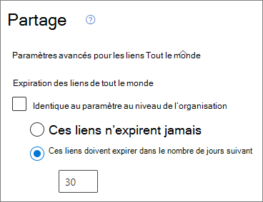
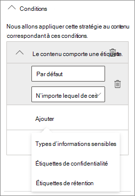

# Meilleures pratiques relatives au partage de fichiers et de dossiers avec des utilisateurs non authentifiés

Le partage non authentifié (liens *Tout le monde* ) est pratique et utile dans différents scénarios. Les liens *Tout le monde* sont la méthode la plus simple pour partager : les personnes peuvent ouvrir le lien sans authentification et sont libres de le transmettre à d’autres personnes.

En règle générale, l’ensemble du contenu d’une organisation ne nécessite pas de partage non authentifié. Cet article décrit les options possibles pour vous aider à créer un environnement dans lequel vos utilisateurs peuvent partager des fichiers et des dossiers de manière non authentifiée, mais où des éléments de protection sont mis en place pour protéger le contenu de votre organisation.

> [!NOTE]
> Pour que le partage non authentifié puisse fonctionner, vous devez l’activer pour votre organisation et pour le site ou l’équipe qui sera concerné. Pour plus d’informations sur le scénario que vous souhaitez mettre en place, voir [Collaborer avec des personnes extérieures à votre organisation](collaborate-with-people-outside-your-organization.md).

## Définir une date d’expiration pour les liens Tout le monde

Les fichiers sont souvent stockés dans des sites, des groupes et des équipes pendant une période prolongée. Il peut arriver qu’une stratégie de rétention des données nécessite la conservation des fichiers pendant plusieurs années. Si ces fichiers sont partagés avec des personnes non authentifiées, cela peut entraîner un accès inattendu et des modifications aux fichiers dans le futur. Pour atténuer cette possibilité, vous pouvez configurer un délai d’expiration pour les liens *Tout le monde*.

Une fois qu' un lien *Tout le monde* arrive à expiration, il ne peut plus être utilisé pour accéder au contenu.

Pour définir une date d’expiration pour les liens Tout le monde dans l’organisation

1. Ouvrez le [Centre d’administration SharePoint](https://admin.microsoft.com/sharepoint).
2. Dans la barre de navigation de gauche, cliquez sur **Partage**.
3. Sous **Sélectionnez les options d’expiration et d’autorisations pour tous les liens** , sélectionnez la case à cocher **Ces liens doivent expirer dans ce nombre de jours**. 
   
4. Tapez un nombre de jours dans la zone, puis cliquez sur **Enregistrer**.

Pour définir une date d’expiration pour les liens Tout le monde sur un site spécifique

1. Ouvrez le [Centre d’administration SharePoint](https://admin.microsoft.com/sharepoint).
2. Dans le volet de navigation gauche, développez **Sites** , puis cliquez sur **Sites actifs**.
3. Sélectionnez le site à modifier, puis cliquez sur **Partager**.
4. Sous **Paramètres avancés pour les liens Tout le monde** , sous **Expiration des liens Tout le monde** , désactivez la case à cocher **Identique au paramètre de niveau organisation** . 
   
5. Sélectionnez l’option **Ces liens doivent expirer dans ce nombre de jours** , puis tapez un nombre de jours dans la zone.
6. Cliquez sur **Enregistrer**.

Notez qu’une fois qu' un lien *Tout le monde* arrive à expiration, le fichier ou dossier peut être repartagé avec un nouveau lien *Tout le monde*.

Vous pouvez définir l'expiration du lien *Tout le monde* d’un OneDrive spécifique à l’aide de [Set-SPOSite](https://docs.microsoft.com/powershell/module/sharepoint-online/set-sposite).

## Définir les autorisations de lien

Par défaut, les liens *Tout le monde* d’un fichier permettent aux utilisateurs de modifier le fichier, et les liens *Tout le monde* d’un dossier permettent aux utilisateurs de modifier et d’afficher des fichiers, mais aussi de charger de nouveaux fichiers dans le dossier. Vous pouvez modifier ces autorisations pour les fichiers et les dossiers indépendamment de la lecture seule.

Si vous voulez autoriser le partage non authentifié, mais que vous craignez que des personnes non authentifiées modifient le contenu de votre organisation, vous pouvez définir les autorisations des fichiers et des dossiers sur **Vue**.

Pour définir des autorisations pour les liens Tout le monde dans l’organisation

1. Ouvrez le [Centre d’administration SharePoint](https://admin.microsoft.com/sharepoint).
2. Dans la barre de navigation de gauche, cliquez sur **Partage**.
3. Sous **Paramètres avancés pour les liens Tout le monde** , sélectionnez les autorisations d’accès aux fichiers et dossiers que vous souhaitez. 
   

Lorsque les liens *Tout le monde* sont paramétrés sur **Vue** , les utilisateurs peuvent encore partager des fichiers et des dossiers avec des invités et leur octroyer des autorisations de modification à l’aide des liens *Personnes spécifiques*. Ces liens nécessitent que les personnes extérieures à votre organisation s’authentifient en tant qu’invités. Vous pouvez effectuer le suivi et l’audit de l’activité des invités sur les fichiers et dossiers partagés avec ces liens.

## Définir le type de lien par défaut de sorte qu’il fonctionne uniquement pour les membres de votre organisation

Lorsque le partage *Tout le monde* est activé pour votre organisation, le lien de partage par défaut est normalement réglé sur **Tout le monde**. Bien que cette fonctionnalité soit commode pour les utilisateurs, elle peut augmenter le risque d’un partage non authentifié involontaire. Si un utilisateur oublie de modifier le type de lien lors du partage d’un document sensible, il peut créer sans le vouloir un lien de partage qui ne nécessite pas d’authentification.

Vous pouvez réduire ce risque en modifiant le paramètre de lien par défaut en un lien qui fonctionne uniquement pour les personnes internes à votre organisation. Les utilisateurs qui souhaitent partager des documents avec des personnes non authentifiées doivent ensuite sélectionner cette option.

Pour définir le lien de partage de fichier et de dossier par défaut pour l’organisation
1. Ouvrez le [Centre d’administration SharePoint](https://admin.microsoft.com/sharepoint).
2. Dans la barre de navigation de gauche, cliquez sur **Partage**.
3. Sous **Liens de fichier et de dossier** , sélectionnez **Uniquement les membres de votre organisation**.

   

4. Cliquez sur **Enregistrer**

Pour définir le lien de partage de fichier et de dossier par défaut pour un site spécifique
1. Ouvrez le [Centre d’administration SharePoint](https://admin.microsoft.com/sharepoint).
2. Dans le volet de navigation gauche, développez **Sites** , puis cliquez sur **Sites actifs**.
3. Sélectionnez le site à modifier, puis cliquez sur **Partager**.
4. Sous **Type de lien de partage par défaut** , désactivez la case à cocher **Identique au paramètre de niveau organisation**.

   

5. Sélectionnez l’option **Uniquement les membres de votre organisation** , puis cliquez sur **Enregistrer**.

## Empêcher le partage non authentifié de contenu sensible

Vous pouvez utiliser la [protection contre la perte de données (DLP)](https://docs.microsoft.com/microsoft-365/compliance/data-loss-prevention-policies) pour empêcher le partage non authentifié de contenu sensible. La protection contre la perte de données peut prendre des mesures basées sur l’étiquette de confidentialité, l’étiquette de rétention ou les informations sensibles d’un fichier proprement dit.

Création d’une stratégie DLP
1. Dans le Centre de conformité Microsoft 365, accédez à la [page de protection contre la perte de données](https://compliance.microsoft.com/datalossprevention).
2. Cliquez sur la stratégie **Créer**.
3. Sélectionnez **Personnaliser** , puis cliquez sur **Suivant**.
4. Tapez un nom pour la stratégie, puis cliquez sur **Suivant**.
5. Dans la page **Emplacements pour appliquer la stratégie** , désactivez tous les paramètres, sauf **Sites SharePoint** et **Comptes OneDrive** , puis cliquez sur **Suivant**.
6. Sur la page **Définir les paramètres de stratégie** , cliquez sur **Suivant**.
7. Sur la page **Personnaliser les règles avancées de protection contre la perte de données** , cliquez sur **Créer une règle** , puis tapez un nom pour la règle.
8. Sous **Conditions** , cliquez sur **Ajouter une condition** , puis sélectionnez **Le contenu contient**.
9. Cliquez sur **Ajouter** , puis choisissez le type d’informations pour lesquelles vous souhaitez empêcher le partage non authentifié.

   

10. Sous **Actions** cliquez sur **Ajouter une action** , puis sélectionnez **Restreindre l’accès ou chiffrer le contenu dans des emplacements Microsoft 365**.
11. Activez la case à cocher **Restreindre l’accès ou chiffrer le contenu dans des emplacements Microsoft 365** , puis sélectionnez l’option **Uniquement les personnes autorisées à accéder au contenu via les options « Tout le monde avec lien »**.

      

12. Cliquez sur **Enregistrer** , puis sur **Suivant**.
13. Sélectionnez vos options de test, puis cliquez sur **Suivant**.
14. Cliquez sur **Envoyer** , puis sur **Terminé**.

## Se protéger contre les fichiers malveillants

Lorsque vous autorisez des utilisateurs anonymes à télécharger des fichiers, vous accroissez le risque de charger un fichier malveillant. Dans Microsoft 365, vous pouvez utiliser la fonctionnalité *Pièces jointes fiables* de Defender pour Office 365 pour analyser automatiquement les fichiers chargés et mettre en quarantaine les fichiers jugés dangereux.

Activer les pièces jointes fiables
1. Ouvrez la [page des Pièces jointes fiables ATP](https://protection.office.com/safeattachmentv2) dans le Centre d’administration de la sécurité et de la conformité.
2. Cliquez sur **Paramètres globaux**.
3. Activer ATP pour SharePoint, OneDrive et Microsoft Teams.

   

4. Vous pouvez également activer les Documents sécurisés, puis cliquer sur **Enregistrer**

Pour obtenir plus d’informations, voir [ATP pour SharePoint, OneDrive et Microsoft Teams](https://docs.microsoft.com/microsoft-365/security/office-365-security/atp-for-spo-odb-and-teams) et [Activer ATP pour SharePoint, OneDrive et Microsoft Teams](https://docs.microsoft.com/microsoft-365/security/office-365-security/turn-on-atp-for-spo-odb-and-teams) .

## Ajouter des informations de copyright à vos fichiers

Si vous utilisez des étiquettes de confidentialité dans le centre d’administration de la conformité Microsoft 365, vous pouvez configurer vos étiquettes pour ajouter automatiquement un filigrane, un en-tête ou un pied de page aux documents Office de votre organisation. De cette façon, vous pouvez vous assurer que les fichiers partagés contiennent des informations de copyright ou de propriété.

Pour ajouter un pied de page à un fichier étiqueté

1. Ouvrez le [centre d’administration de la conformité Microsoft 365](https://compliance.microsoft.com).
2. Dans le volet de navigation gauche, sous **Solutions** , cliquez sur **Protection des informations**.
3. Cliquez sur l’étiquette à laquelle vous voulez ajouter un pied de page, puis sur **Modifier l'étiquette**.
4. Cliquez sur **Suivant** pour atteindre l’onglet **Marquage du contenu** , puis réglez l’option marquage du contenu sur **Activé**.
5. Cochez la case correspondant au type de texte à ajouter, puis cliquez sur **Personnaliser le texte**.
6. Tapez le texte que vous souhaitez ajouter à vos documents, sélectionnez les options de texte souhaitées, puis cliquez sur **Enregistrer**. 
   
7. Cliquez sur **Suivant** pour atteindre la fin de l’Assistant, puis cliquez sur **Enregistrer l’étiquette**.

Avec l’option marquage de contenu activée pour l’étiquette, le texte spécifié est ajouté aux documents Office lorsqu’un utilisateur applique cette étiquette.

## Voir aussi

[Vue d’ensemble des étiquettes de confidentialité](https://docs.microsoft.com/Office365/SecurityCompliance/sensitivity-labels)

[Limiter l’exposition accidentelle aux fichiers lors du partage avec des invités](share-limit-accidental-exposure.md)

[Créer un environnement de partage sécurisé avec des invités](create-secure-guest-sharing-environment.md)
