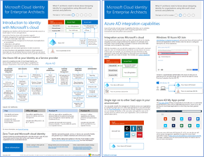
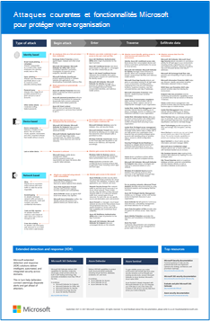

# Illustrations du cloud Microsoft pour les architectes informatiques

Ces affiches d’architecture cloud vous donnent des informations sur les services cloud de Microsoft, notamment Microsoft 365, Azure Active Directory (Azure AD), Microsoft Intune, Microsoft Dynamics 365, ainsi que les solutions hybrides locales et cloud. 

Les décideurs informatiques et les architectes peuvent utiliser ces ressources pour déterminer les solutions idéales pour leurs charges de travail et prendre des décisions sur les composants d’infrastructure principaux tels que la mise en réseau, l’identité et la sécurité.

### Identité cloud Microsoft pour les architectes informatiques

Découvrez tout ce que les architectes informatiques doivent savoir sur la conception d’identité pour les organisations utilisant des plateformes et des services de cloud computing Microsoft.
  
|**Élément**|**Description**|
|:-----|:-----|
|   [Affichage au format PDF](../downloads/MSFT_cloud_architecture_identity.pdf) \| [Téléchargement au format PDF](https://github.com/MicrosoftDocs/microsoft-365-docs/raw/public/microsoft-365/downloads/MSFT_cloud_architecture_identity.pdf) \| [Téléchargement en tant que Visio](https://github.com/MicrosoftDocs/microsoft-365-docs/raw/public/microsoft-365/downloads/MSFT_cloud_architecture_identity.vsdx)    Mise à jour de septembre 2020 | Ce modèle contient :  <ul> <li> Introduction aux identités avec le cloud de Microsoft </li><li> Fonctions IDaaS d’Azure AD </li><li> Intégration de comptes AD DS (Active Directory Domain Services) locaux à Azure AD </li><li> Mise en place de composants d’annuaire dans Azure IaaS </li><li> Options AD DS pour les charges de travail dans Azure IaaS </li></ul>    |

### Sécurité cloud Microsoft pour les architectes informatiques

Découvrez tout ce que les architectes informatiques doivent savoir sur la sécurité dans les plateformes et les services de cloud computing Microsoft.
  
|**Élément**|**Description**|
|:-----|:-----|
|.pdf)   [PDF](https://download.microsoft.com/download/6/D/F/6DFD7614-BBCF-4572-A871-E446B8CF5D79/MSFT_cloud_architecture_security%20(1).pdf)  \|  Mise à jour d’avril 2021 | Ce modèle contient : <ul><li>Responsabilités de Microsoft et de sécurité client</li><li>Accès aux identités et appareils</li><li>Protection contre les menaces</li><li>Protection des informations </ul> |
   

### Mise en réseau cloud Microsoft pour les architectes informatiques

Découvrez tout ce que les architectes informatiques doivent savoir sur la mise en réseau pour les plateformes et les services de cloud computing Microsoft.
  
|**Élément**|**Description**|
|:-----|:-----|
|    [Affichage au format PDF](../downloads/MSFT_cloud_architecture_networking.pdf) \| [Téléchargement au format PDF](https://github.com/MicrosoftDocs/microsoft-365-docs/raw/public/microsoft-365/downloads/MSFT_cloud_architecture_networking.pdf) \| [Téléchargement en tant que Visio](https://github.com/MicrosoftDocs/microsoft-365-docs/raw/public/microsoft-365/downloads/MSFT_cloud_architecture_networking.vsdx)    Mise à jour d’août 2020 | Ce modèle contient : <ul><li> Évolution de votre réseau pour la connectivité cloud </li><li> Éléments courants de connectivité du cloud Microsoft </li><li> ExpressRoute pour la connectivité au cloud de Microsoft </li><li> Conception de réseaux pour Microsoft SaaS, Azure PaaS et Azure IaaS </li></ul>    |

### Cloud hybride Microsoft pour les architectes informatiques

Tout ce que les architectes informatiques doivent savoir sur l’hybridation du cloud pour les plateformes et services Microsoft.
  
|**Élément**|**Description**|
|:-----|:-----|
|   [Affichage au format PDF](../downloads/MSFT_cloud_architecture_hybrid.pdf) \| [Téléchargement au format PDF](https://github.com/MicrosoftDocs/microsoft-365-docs/raw/public/microsoft-365/downloads/MSFT_cloud_architecture_hybrid.pdf) \| [Téléchargement en tant que Visio](https://github.com/MicrosoftDocs/microsoft-365-docs/raw/public/microsoft-365/downloads/MSFT_cloud_architecture_hybrid.vsdx)      Mise à jour d’août 2020 | Ce modèle contient : <ul><li> Offres du cloud Microsoft (SaaS, Azure PaaS et Azure IaaS) et leurs éléments communs </li><li> Architecture de Cloud hybride pour les offres Cloud de Microsoft </li><li> Scénarios de cloud hybride pour les services SaaS Microsoft (Office 365), Azure PaaS et Azure IaaS </li></ul> |

### Approches d’architecture pour les migrations client-client de Microsoft Cloud 
Cette série de rubriques illustre plusieurs approches d’architecture pour les fusions, les acquisitions, les scissions et d’autres scénarios susceptibles de vous amener à migrer vers un nouveau client cloud. Ces rubriques fournissent des conseils de départ pour la planification des ressources d’entreprise. 

|**Élément**|**Description**|
|:-----|:-----|
|   [PDF](https://download.microsoft.com/download/b/a/1/ba19dfe7-96e2-4983-8783-4dcff9cebe7b/microsoft-365-tenant-to-tenant-migration.pdf) \| [Visio](https://github.com/MicrosoftDocs/microsoft-365-docs/raw/public/microsoft-365/downloads/Microsoft-365-tenant-to-tenant-migration.vsdx)  Mise à jour de février 2021    |Ce modèle contient : <ul><li>Un mappage des scénarios d’entreprises aux approches de l’architecture</li><li>Considérations en matière de conception</li><li>Exemple de flux de migration d’événements unique</li><li>Exemple de flux de migration par phases</li><li>Exemple de déplacement de client ou de flux fractionnement</li></ul>|

### Attaques courantes et fonctionnalités Microsoft pour protéger votre organisation
Découvrez les cyberattaques les plus courantes et comment Microsoft peut aider votre organisation à chaque étape d’une attaque. 

|**Élément**|**Description**|
|:-----|:-----|
|   [PDF](https://download.microsoft.com/download/F/A/C/FACFC1E9-FA35-4DF1-943C-8D4237B4275B/MSFT_Cloud_architecture_security_commonattacks.pdf) \| [Visio](https://download.microsoft.com/download/F/A/C/FACFC1E9-FA35-4DF1-943C-8D4237B4275B/MSFT_Cloud_architecture_security_commonattacks.vsdx)   Mise à jour d’août 2017 | Cette affiche illustre le chemin des attaques courantes et décrit les fonctionnalités qui aident à arrêter les pirates à chaque étape d’une attaque.  |

