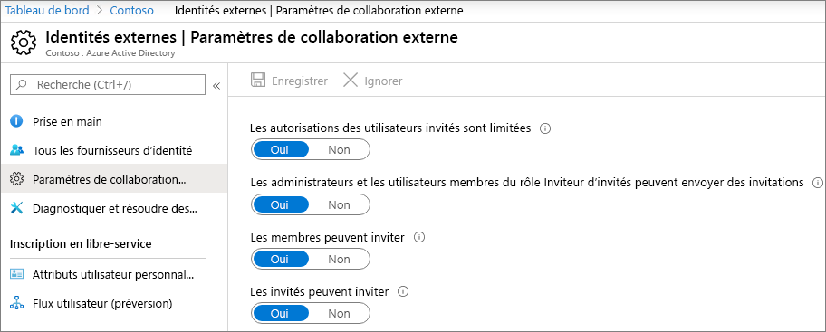
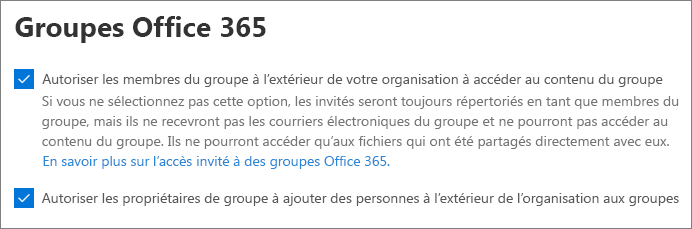
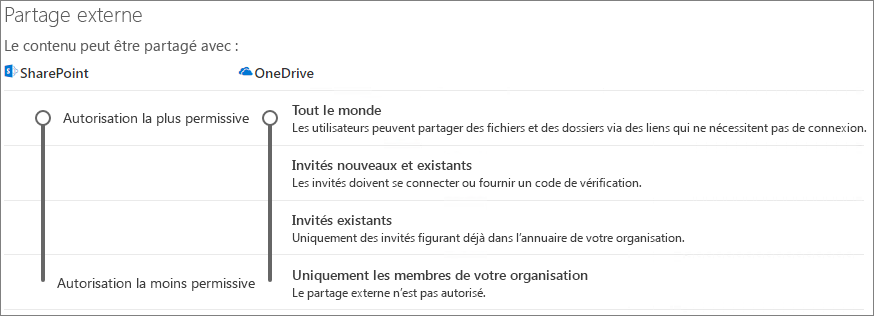
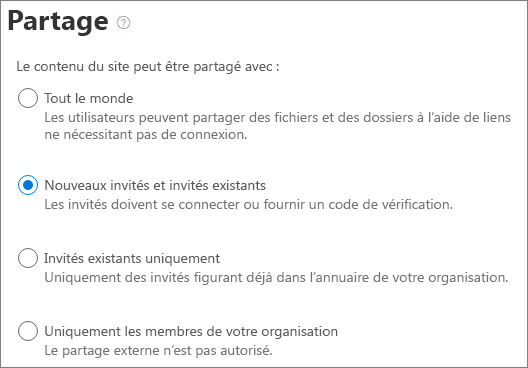

# Collaborer avec des invités sur un site

Si vous devez collaborer avec des invités sur des documents, des données et des listes, vous pouvez utiliser un site SharePoint. Les sites SharePoint modernes sont connectés à Groupes Microsoft 365 et peuvent gérer l’appartenance au site et fournir des outils de collaboration supplémentaires tels qu’une boîte aux lettres partagée et un calendrier.

Dans cet article, nous allons parcourir les étapes de configuration de Microsoft 365 nécessaires à la configuration d’un site SharePoint pour la collaboration avec les invités.

## Démonstration vidéo

Cette vidéo décrit les étapes de configuration décrites dans ce document. 

> [!VIDEO https://www.microsoft.com/videoplayer/embed/RE44Llg?autoplay=false]

## Paramètres de collaboration externe Azure

Le partage dans Microsoft 365 est régi à son niveau le plus élevé par les [paramètres de collaboration externe B2B dans Azure Active Directory](/azure/active-directory/external-identities/delegate-invitations). Si le partage invité est désactivé ou restreint dans Azure AD, ce paramètre remplace les paramètres de partage que vous configurez dans Microsoft 365.

Vérifiez les paramètres de collaboration externe B2B pour vous assurer que le partage avec les invités n’est pas bloqué.

Pour définir les paramètres de collaboration externe

1. Connectez-vous à Azure Active Directory sur [https://aad.portal.azure.com](https://aad.portal.azure.com).
2. Dans le volet de navigation gauche, cliquez sur **Azure Active Directory**.
3. Cliquez sur **Identités externes**.
4. Dans l’écran **Prise en main**, dans le volet de navigation gauche, cliquez sur **Paramètres de collaboration externe**.
5. Assurez-vous que **Les utilisateurs membres et les utilisateurs affectés à des rôles d’administrateur spécifiques peuvent inviter des utilisateurs invités, y compris des invités disposant d’autorisations de membre** ou **Tous les membres de l’organisation peuvent inviter des utilisateurs invités, y compris des invités et des non-administrateurs** est sélectionné.
6. Si vous avez effectué des modifications, cliquez sur **Enregistrer**.

Notez les paramètres dans la section **Restrictions de collaboration**. Assurez-vous que les domaines des invités avec qui vous voulez collaborer ne sont pas bloqués.

Si vous travaillez avec des invités de plusieurs organisations, vous souhaiterez peut-être restreindre leur capacité à accéder aux données d’annuaire. Cela les empêche de voir qui d’autre est invité dans l’annuaire. Pour ce faire, sous **Restrictions d’accès des utilisateurs invités**, sélectionnez **Les utilisateurs invités ont un accès limité aux propriétés et à l’appartenance aux paramètres des objets d’annuaire** ou **L’accès des utilisateurs invités est limité aux propriétés et à l’appartenance à leurs propres objets d’annuaire**.

## Paramètres invités des groupes Microsoft 365

Les sites SharePoint modernes utilisent Groupes Microsoft 365 pour contrôler l’accès au site. Les paramètres invités Groupes Microsoft 365 doivent être activés pour que l’accès invité dans les sites SharePoint fonctionne.

Pour définir les paramètres invités des groupes Microsoft 365

1. Dans le Centre d’administration Microsoft 365, dans le volet de navigation gauche, développez **Paramètres**.
2. Cliquez sur **Paramètres de l’organisation**.
3. Dans la liste, cliquez sur **Groupes Microsoft 365**.
4. Assurez-vous que les cases à cocher **Permettre aux propriétaires de groupe d’ajouter des personnes externes à votre organisation à des groupes Microsoft 365 en tant qu'invités** et **Permettre aux membres du groupe invités d’accéder au contenu du groupe** sont cochées.
5. Si vous avez effectué des modifications, cliquez sur **Enregistrer**.

## Paramètres de partage au niveau de l’organisation SharePoint

Pour que les invités aient accès aux sites SharePoint, les paramètres de partage au niveau de l’organisation SharePoint doivent autoriser le partage avec les invités.

Les paramètres au niveau de l’organisation déterminent les paramètres qui seront disponibles pour des sites individuels. Les paramètres de site ne peuvent pas être plus permissifs que les paramètres au niveau de l’organisation.

Si vous souhaitez autoriser le partage de fichiers et de dossiers non authentifié, choisissez **Tout le monde**. Si vous souhaitez vous assurer que toutes les personnes extérieures à votre organisation doivent s’authentifier, choisissez **Invités nouveaux et existants**. Choisissez le paramètre le plus permissif qui sera nécessaire pour n’importe quel site de votre organisation.

Pour définir les paramètres de partage SharePoint au niveau de l’organisation

1. Dans le Centre d'administration Microsoft 365, dans le volet de navigation gauche, sous **Administration centres**, sélectionnez **SharePoint**.
2. Dans le centre d’administration SharePoint, dans le volet de navigation gauche, sous **Stratégies**, sélectionnez <a href="https://go.microsoft.com/fwlink/?linkid=2185222" target="_blank">**Partage**</a>.
3. Assurez-vous que le partage externe pour SharePoint est **Tout le monde** ou **Invités nouveaux et existants**.
4. Si vous avez apporté des modifications, sélectionnez **Enregistrer**.

## Créer un site

L’étape suivante consiste à créer le site que vous prévoyez d’utiliser pour collaborer avec des invités.

Pour créer un site
1. Dans le Centre d’administration SharePoint, sous **Sites**, sélectionnez <a href="https://go.microsoft.com/fwlink/?linkid=2185220" target="_blank">**Sites actifs**</a>.
2. Sélectionnez **Créer**.
3. Sélectionnez **Site d’équipe**.
4. Tapez un nom de site et entrez un nom pour le propriétaire du groupe (propriétaire du site).
5. Sous **Paramètres avancés**, choisissez si vous souhaitez que ce site soit public ou privé.
6. Sélectionnez **Suivant**.
7. Sélectionnez **Terminer**.

Nous inviterons des utilisateurs plus tard. Ensuite, il est important de vérifier les paramètres de partage au niveau du site pour ce site.

## Paramètres de SharePoint au niveau du site

Vérifiez les paramètres de partage au niveau du site pour vous assurer qu’ils autorisent le type d’accès souhaité pour ce site. Par exemple, si vous définissez les paramètres au niveau de l’organisation sur **Tout** le monde, mais que vous souhaitez que tous les invités s’authentifient pour ce site, assurez-vous que les paramètres de partage au niveau du site sont définis sur **Nouveaux invités et invités existants**.

Notez que le site ne peut pas être partagé avec des personnes non authentifiées (paramètre **Tout le monde** ), mais que des fichiers et dossiers individuels le peuvent.

Vous pouvez également utiliser [des étiquettes de confidentialité pour contrôler les paramètres de partage externe pour les sites SharePoint](../compliance/sensitivity-labels-teams-groups-sites.md).

Pour définir les paramètres au niveau du site
1. Dans le Centre d’administration SharePoint, dans la navigation de gauche, développez **Sites**, puis sélectionnez <a href="https://go.microsoft.com/fwlink/?linkid=2185220" target="_blank">**Sites actifs**</a>.
2. Sélectionnez le site que vous souhaitez partager.
3. Sélectionnez ..., puis **Partage**.
4. Assurez-vous que le partage est paramétré sur **Tout le monde** ou **Invités nouveaux et existants**.
5. Si vous avez apporté des modifications, sélectionnez **Enregistrer**.

## Inviter des utilisateurs

Les paramètres de partage d’invités sont maintenant configurés. Vous pouvez donc commencer à ajouter des utilisateurs internes et des invités à votre site. L’accès au site étant contrôlé par le biais du groupe Microsoft 365 associé, nous y ajouterons des utilisateurs.

Pour inviter des utilisateurs internes à un groupe

1. Accédez au site où vous souhaitez ajouter des utilisateurs.
2. Sélectionnez **le lien Membres** dans le coin supérieur droit qui indique le nombre de membres.
3. Sélectionnez **Ajouter des membres**.
4. Tapez les noms ou adresses e-mail des utilisateurs que vous souhaitez inviter sur le site, puis **sélectionnez Enregistrer**.

Les invités ne peuvent pas être ajoutés au groupe Microsoft 365 à partir du site. Pour plus d’informations sur l’ajout d’invités à un groupe, consultez [Ajout d’invités à Groupes Microsoft 365](https://support.microsoft.com/office/bfc7a840-868f-4fd6-a390-f347bf51aff6).

## Voir aussi

[Meilleures pratiques relatives au partage de fichiers et de dossiers avec des utilisateurs non authentifiés](best-practices-anonymous-sharing.md)

[Limiter l’exposition accidentelle aux fichiers lors du partage avec des invités](share-limit-accidental-exposure.md)

[Créer un environnement de partage sécurisé avec des invités](create-secure-guest-sharing-environment.md)

[Créer un extranet B2B avec des invités gérés](b2b-extranet.md)

[Intégration de SharePoint et de OneDrive à Azure AD B2B](/sharepoint/sharepoint-azureb2b-integration-preview)
