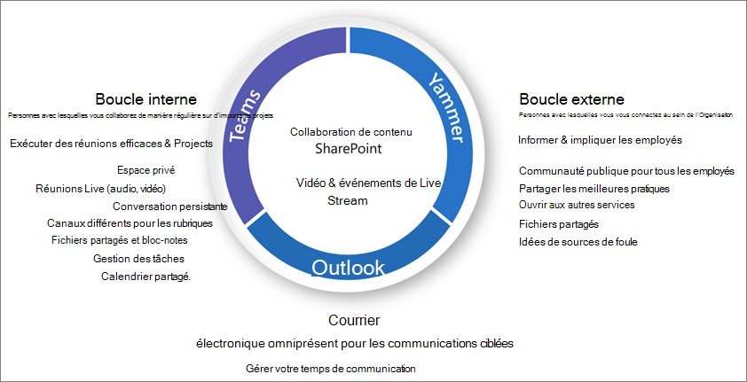

# Qu’est-ce que la gouvernance de collaboration ?

La gouvernance de collaboration vous permet de gérer l’accès des utilisateurs aux ressources, de respecter les normes de votre entreprise et de garantir la sécurité de vos données.

Les organisations actuelles utilisent un ensemble d’outils diversifié. Il existe une équipe de développeurs qui utilisent la conversation d’équipe, les cadres qui envoient du courrier électronique et l’ensemble de l’organisation qui se connecte via le réseau social de l’entreprise. Plusieurs outils de collaboration sont en cours d’utilisation, car chaque groupe est unique et possède ses propres besoins fonctionnels et son propre style de travail. Certains utiliseront uniquement le courrier électronique, tandis que d’autres seront principalement en conversation. 

Si les utilisateurs dispensent que les outils fournis par le service informatique ne répondent pas à leurs besoins, ils téléchargeront probablement leur application de consommateur favorite qui prend en charge leurs scénarios. Bien que ce processus permette aux utilisateurs de commencer rapidement, il se traduit par une expérience utilisateur frustrante au sein de l’organisation avec plusieurs connexions, des difficultés de partage et des emplacements uniques pour afficher du contenu. Ce concept est appelé « détourage » et représente un risque significatif pour les organisations. Elle réduit la possibilité de gérer uniformément l’accès utilisateur, de garantir la sécurité et les besoins en matière de conformité des services.

Les services, tels que les groupes Microsoft 365, les équipes et Yammer permettent aux utilisateurs d’effectuer des clichés instantanés en fournissant les outils nécessaires à la collaboration. Microsoft 365 dispose d’un ensemble complet d’outils permettant d’implémenter les fonctionnalités de gouvernance dont votre organisation peut avoir besoin. 

Cette série d’articles vous aidera à comprendre comment les groupes, les équipes et les paramètres SharePoint interagissent, quelles sont les fonctionnalités de gouvernance disponibles et comment créer et mettre en œuvre un plan de gouvernance pour les fonctionnalités de collaboration de Microsoft 365.

## Qu’est-ce que les groupes Microsoft 365 ?

Les groupes Microsoft 365 vous permettent de choisir un ensemble de personnes avec lesquelles vous souhaitez collaborer, et de configurer facilement une collection de ressources à partager pour ces personnes. L’ajout de membres au groupe accorde automatiquement les autorisations nécessaires à tous les biens fournis par le groupe. Teams et Yammer utilisent des groupes Microsoft 365 pour gérer leur appartenance.

Les groupes Microsoft 365 incluent une suite de ressources liées que les utilisateurs peuvent utiliser pour la communication et la collaboration. Les groupes incluent toujours un site SharePoint, un planificateur, un espace de travail Power BI, une boîte aux lettres et un calendrier, ainsi qu’un flux. En fonction de la façon dont vous créez le groupe, vous pouvez éventuellement ajouter d’autres services, tels que Teams, Yammer et Project.

|Ressource|Description|
|:------|:----------|
|[Calendar](https://support.office.com/article/schedule-a-meeting-on-a-group-calendar-in-outlook-0cf1ad68-1034-4306-b367-d75e9818376a)|Pour la planification des événements associés au groupe|
|[Boîte de réception](https://support.office.com/article/have-a-group-conversation-in-outlook-a0482e24-a769-4e39-a5ba-a7c56e828b22)|Pour les conversations par courrier électronique entre les membres du groupe. Cette boîte de réception dispose d’une adresse de messagerie et peut être configurée pour accepter les messages provenant de personnes extérieures au groupe et même en dehors de votre organisation, comme une liste de distribution traditionnelle.|
|[bloc-notes OneNote ;](https://support.office.com/article/get-started-with-onenote-e768fafa-8f9b-4eac-8600-65aa10b2fe97)|Pour recueillir des idées, des recherches et des informations|
|[Planner](https://support.office.com/article/microsoft-planner-help-4a9a13c6-3adf-4a60-a6fc-15c0b15e16fc)|Pour affecter et gérer des tâches de projet entre les membres de votre groupe|
|[Espace de travail Power BI](https://docs.microsoft.com/power-bi/collaborate-share/service-new-workspaces)|Un espace de collaboration de données avec des tableaux de bord et des rapports|
|[Projet et feuille de route](https://support.microsoft.com/project)|Outils de gestion de projets basés sur le Web|
|[site d’équipe SharePoint ;](https://support.office.com/article/what-is-a-sharepoint-team-site-75545757-36c3-46a7-beed-0aaa74f0401e)|Un référentiel central pour les informations, les liens et le contenu liés à votre groupe|
|[Stream](https://support.microsoft.com/microsoft-stream)|Un service de diffusion en continu vidéo|
|[Teams](https://support.microsoft.com/teams)|Un espace de travail de conversation dans Microsoft 365|
|[Groupe Yammer](https://support.office.com/article/Learn-about-Office-365-groups-b565caa1-5c40-40ef-9915-60fdb2d97fa2)|Emplacement commun pour les conversations et les informations de partage|

Les groupes Microsoft 365 incluent divers contrôles de gouvernance, notamment une stratégie d’expiration, des conventions d’affectation de noms et une stratégie de mots bloqués, pour vous aider à gérer les groupes dans votre organisation. Étant donné que les groupes contrôlent l’appartenance et l’accès à cette suite de ressources, la gestion des groupes est une partie essentielle de la gestion de la collaboration dans Microsoft 365.

## Définition d’une stratégie de collaboration pour votre organisation

Il existe plusieurs emplacements de collaboration et des conversations dans Microsoft 365. Comprendre où les utilisateurs peuvent démarrer des conversations peut vous aider à définir une stratégie de communication.

Il existe trois méthodes de communication principales prises en charge par Microsoft 365 :

- Outlook : collaboration par courrier électronique avec une boîte aux lettres et un calendrier de groupe partagé
- Microsoft teams : un espace de travail de conversation permanente dans lequel vous pouvez avoir des conversations informelles, en temps réel, autour de plusieurs sujets, organisés par sous-groupes spécifiques
- Yammer : expérience sociale d’entreprise pour la collaboration

- Équipes : espace de travail de conversation (collaboration à haute vitesse) – boucle interne
  - Conçu pour la collaboration avec les personnes avec lesquelles vos utilisateurs travaillent quotidiennement
  - Met des informations à portée de main sur les utilisateurs en une seule expérience
  - Ajouter des onglets, des connecteurs et des bots
  - Conversation en direct, conférence audio/vidéo, réunions enregistrées

- Yammer : se connecter à l’échelle de l’organisation (entreprise social) – boucle externe
  - Communautés de personnes : groupes interfonctionnels de personnes qui partagent un intérêt ou une expertise commune, mais qui ne travaillent pas nécessairement ensemble sur une base quotidienne
  - Connexion de leadership, formation de communautés, communautés basées sur des rôles

- Boîte aux lettres et calendrier (collaboration par messagerie électronique)
  - Utilisé pour la communication ciblée avec un groupe de personnes
  - Calendrier partagé pour les réunions avec d’autres membres du groupe
 
Lorsque vous déterminez comment utiliser les fonctionnalités de collaboration dans Microsoft 365, envisagez ces méthodes de communication et les utilisateurs susceptibles de l’utiliser dans différents scénarios.

> [!NOTE]
> Lorsqu’un nouveau groupe Office 365 est créé via Yammer ou Teams, le groupe n’est pas visible dans Outlook ou dans le carnet d’adresses, car la communication principale entre ces utilisateurs se produit dans leurs clients respectifs. Les groupes Yammer ne peuvent pas être connectés à Teams.

## Meilleures pratiques

Lorsque vous commencez votre processus de planification de la gouvernance, gardez à l’esprit les meilleures pratiques suivantes :

- **Discutez avec vos utilisateurs** -Identifiez vos utilisateurs les plus importants des fonctionnalités de collaboration et rencontrez-les pour comprendre les principaux besoins de l’entreprise et les scénarios d’utilisation.

- **Équilibre des risques et des avantages** : Vérifiez les besoins de votre entreprise, de la réglementation, de la justice et de la conformité et planifiez une solution qui optimise tous les résultats.

- **S’adapter à différentes organisations et différents types de contenu et de scénarios** : prenez en compte les différents besoins pour différents groupes ou services et différents types de contenu, tels que le contenu intranet et le contenu OneDrive d’un utilisateur.

- **Aligner sur les priorités** de l’entreprise : les objectifs de l’entreprise vous aideront à définir le temps et l’énergie dont vous avez besoin pour investir dans la gouvernance.

- **Incorporer les décisions de gouvernance directement dans les solutions que vous créez** -de nombreuses décisions de gouvernance peuvent être implémentées en activant ou désactivant les fonctionnalités dans Microsoft 365.

- **Renforcez les** solutions de formation, telles que les [voies d’apprentissage Microsoft 365](https://docs.microsoft.com/office365/customlearning) , pour vous assurer que les attentes propres à votre organisation sont renforcées par la formation fournie par Microsoft.

- **Disposer d’une stratégie de communication des stratégies de gouvernance et des directives dans votre organisation** : créez un centre d’Adoption Microsoft 365 dans un site de communication SharePoint pour communiquer des stratégies et des procédures.

- **Définir les rôles et les responsabilités** : Identifiez votre équipe principale de gouvernance et les décisions clés relatives à la gouvernance en matière de mise en service et d’affectation de noms et d’accès externe, puis utilisez les autres décisions.

- Reprenez **vos décisions en tant que modifications professionnelles et technologiques** -répondez régulièrement pour examiner les nouvelles fonctionnalités et les nouvelles attentes de l’entreprise.

Pour en savoir plus sur ces pratiques, lisez [la rubrique Create Your collaboration Governance plan](collaboration-governance-first.md).

## Impact de l’utilisateur final et gestion des modifications

Étant donné que les groupes et les équipes peuvent être créés de plusieurs façons, nous vous recommandons de former vos utilisateurs à l’utilisation de la méthode qui convient le mieux à votre organisation :

- Si votre organisation utilise la plupart de ses communications par courrier électronique, demandez à vos utilisateurs de créer des groupes dans Outlook.
- Si votre organisation utilise principalement SharePoint ou migre à partir de SharePoint en local, demandez à vos utilisateurs de créer des sites d’équipe SharePoint pour la collaboration.
- Si votre organisation a déployé Teams, demandez à vos utilisateurs de créer une équipe lorsqu’ils ont besoin d’un espace de collaboration.

Cela permet d’éviter toute confusion si les utilisateurs ne sont pas familiarisés avec la relation entre les groupes et leurs services connexes. Pour plus d’informations sur la façon de communiquer avec vos utilisateurs sur les groupes, consultez [la rubrique explication des groupes Microsoft 365 à vos utilisateurs](../admin/create-groups/explain-groups-knowledge-worker.md).

## Principales exigences en matière de gestion des licences et des fonctionnalités de gouvernance

Les fonctionnalités de gouvernance pour la collaboration dans Microsoft 365 incluent des fonctionnalités dans Microsoft 365, teams, SharePoint et Azure Active Directory.

| Fonctionnalité | Description | Licence |
|:----------------------|:------------|:----------|
|Partage d’équipe et de site|Contrôler si des équipes, des groupes et des sites peuvent être partagés avec des personnes extérieures à votre organisation.|Microsoft 365 E5 ou E3|
|Bloc autorisé de domaine|Limitez le partage avec des personnes extérieures à votre organisation à des personnes provenant de domaines spécifiques.|Microsoft 365 E5 ou E3|
|Création de sites libre-service|Autoriser ou empêcher les utilisateurs de créer leurs propres sites SharePoint.|Microsoft 365 E5 ou E3|
|Partage de fichiers et de sites restreint|Limiter le partage de site, de fichier et de dossier aux membres d’un groupe de sécurité spécifique.|Microsoft 365 E5 ou E3|
|Création de groupe restreint|Limitez la création d’équipes et de groupes aux membres d’un groupe de sécurité spécifique.|Microsoft 365 E5 ou E3 avec des licences Azure AD Premium ou Microsoft Azure AD basique EDU|
|Stratégie de noms de groupes|Appliquer des préfixes ou suffixes sur les noms de groupe et d’équipe.|Microsoft 365 E5 ou E3 avec des licences Azure AD Premium ou Microsoft Azure AD basique EDU|
|Stratégie d’expiration de groupe|Définir les groupes et les équipes inactifs de sorte qu’ils expirent et soient supprimés après une période de temps spécifiée.|Microsoft 365 E5 ou E3 avec des licences Azure AD Premium|
|Accès invité par groupe|Autoriser ou interdire le partage d’équipe et de groupe avec des personnes extérieures à votre organisation, par groupe.|Microsoft 365 E5 ou E3|

## Création de votre plan de gouvernance

Suivez ces étapes de base pour créer votre plan de gouvernance :

1. Prenez en compte les principaux objectifs et processus commerciaux : [Créez votre plan de gouvernance](collaboration-governance-first.md) afin de répondre aux besoins de votre entreprise.
2. Comprendre les paramètres des services- [paramètres dans les groupes et SharePoint](groups-sharepoint-governance.md) interagissent les uns avec les autres, en tant que [paramètres dans Groups, SharePoint et teams](groups-sharepoint-teams-governance.md) et d' [autres services](groups-services-interactions.md). Veillez à bien comprendre ces interactions lors de la planification de votre stratégie de gouvernance.
3. Planifier la gestion de l’accès des utilisateurs : planifiez [le niveau d’accès que vous souhaitez accorder aux utilisateurs dans les groupes, SharePoint et teams](groups-teams-access-governance.md).
4. Planifier la gestion des paramètres de conformité : consultez les [options de conformité disponibles pour les groupes Microsoft 365, teams et collaboration SharePoint](groups-teams-compliance-governance.md).
5. Planifier la gestion des communications : consultez les [options de gouvernance des communications disponibles pour les scénarios de collaboration](groups-teams-communication-governance.md).
6. Planifier la gouvernance d’entreprise et du cycle de vie : choisissez [les stratégies à utiliser pour la création, l’affectation de noms, l’expiration et l’archivage des groupes et des équipes](plan-organization-lifecycle-governance.md). Découvrez également la [fin des options de cycle de vie pour les groupes, les équipes et Yammer](end-life-cycle-groups-teams-sites-yammer.md)

## Formation pour les administrateurs

Ces modules de formation de Microsoft apprennent peuvent vous aider à découvrir les fonctionnalités de collaboration dans teams et SharePoint.

#### Teams

|Pensée|Gérer la collaboration en équipe avec Microsoft Teams|
|:---|:---|
||Gérer la collaboration en équipe avec Microsoft Teams vous présente les fonctionnalités et possibilités de Microsoft Teams, le Hub central pour la collaboration en équipe dans Microsoft 365. Vous découvrirez comment utiliser Teams pour simplifier le travail en équipe et la communication au sein de votre organisation, à la fois en local et hors site, sur un large éventail d’appareils (des bureaux aux tablettes et téléphones), tout en tirant parti des fonctionnalités enrichies des applications Office 365. Vous pourrez ainsi comprendre comment Teams fournit un environnement complet et flexible pour la collaboration entre les applications et les appareils. Cette rubrique d’apprentissage peut vous aider à vous préparer à la certification Certification Microsoft 365 : Administrateur Teams associé.  2 h 17-apprentissage de la mini-formation : 5 modules|

> [!div class="nextstepaction"]
> [Démarrer >](https://docs.microsoft.com/learn/modules/m365-teams-collab-prepare-deployment/introduction/)

#### SharePoint

|Pensée|Collaborer avec SharePoint dans Microsoft 365|
|:---|:---|
||Gérer le contenu partagé avec Microsoft SharePoint vous présente les fonctionnalités de SharePoint, ainsi que son fonctionnement avec Microsoft 365. Vous découvrirez les différents types de sites SharePoint, notamment les sites hub, ainsi que la protection des informations, la création de rapports et la surveillance. En outre, vous apprendrez à utiliser le partage de fichiers et de dossiers SharePoint pour optimiser la collaboration, à partager des fichiers en externe et à gérer des sites SharePoint dans le Centre d’administration SharePoint. Cette rubrique d’apprentissage peut vous aider à vous préparer à la certification Certification Microsoft 365 : Administrateur de travail d’équipe associé.  1 pour HR 14-apprentissage min formation-4 modules|

> [!div class="nextstepaction"]
> [Démarrer >](https://docs.microsoft.com/learn/modules/m365-teams-sharepoint-plan-sharepoint/introduction/)

## Formation pour les utilisateurs finaux

Ces modules de formation peuvent aider vos utilisateurs à utiliser Teams, les groupes et SharePoint pour la collaboration dans Microsoft 365.

|Teams|SharePoint|
|:---|:---|
| **[Configurer et personnaliser votre équipe](https://support.microsoft.com/office/702a2977-e662-4038-bef5-bdf8ee47b17b)**| **[Partage et synchronisation](https://support.microsoft.com/office/98cb2ff2-c27e-42ea-b055-c2d895f8a5de)**|
| **[Charger et Rechercher des fichiers](https://support.microsoft.com/office/57b669db-678e-424e-b0a0-15d19215cb12)**||
| **[Collaborer dans teams et les canaux](https://support.microsoft.com/office/c3d63c10-77d5-4204-a566-53ddcf723b46)**|||

## Illustre

Ces illustrations vous aideront à comprendre comment les groupes et les équipes interagissent avec les autres services de Microsoft 365 et quelles sont les fonctionnalités de gouvernance et de conformité disponibles pour vous aider à gérer ces services dans votre organisation.

### Groupes dans Microsoft 365 pour les architectes informatique
Quels sont les besoins des architectes informatique concernant les groupes dans Microsoft 365

|**Item**|**Description**|
|:-----|:-----|
|   [PDF](https://github.com/MicrosoftDocs/microsoft-365-docs/raw/public/microsoft-365/downloads/msft-m365-groups.pdf) \| [Visio](https://github.com/MicrosoftDocs/OfficeDocs-Enterprise/raw/live/Enterprise/downloads/msft-m365-groups.vsdx)   Mise à jour de juin 2019|Ces illustrations décrivent les différents types de groupes, la manière dont ceux-ci sont créés et gérés et quelques recommandations en matière de gouvernance.|

### Microsoft Teams et services de productivité connexes dans Microsoft 365 pour les architectes informatique
L’architecture logique de services de productivité dans Microsoft 365, fonctionnant avec Microsoft Teams.

|**Item**|**Description**|
|:-----|:-----|
|   [PDF](https://github.com/MicrosoftDocs/microsoft-365-docs/raw/public/microsoft-365/downloads/msft-m365-teams-logical-architecture.pdf) \| [Visio](https://github.com/MicrosoftDocs/OfficeDocs-Enterprise/raw/live/Enterprise/downloads/msft-m365-teams-logical-architecture.vsdx)   Mise à jour d’avril 2019   |Microsoft fournit une suite de services de productivité qui fonctionnent ensemble pour fournir une expérience de collaboration avec la gouvernance des données, la sécurité et la conformité.    Cette série d’illustrations fournit une visibilité de l’architecture logique de services de productivité pour les architectes d’entreprise, fonctionnant avec Microsoft Teams.|

### Fonctionnalités de protection et de conformité des informations Microsoft 365

Microsoft 365 inclut un large éventail de fonctionnalités de protection et de conformité des informations. En plus des outils de productivité de Microsoft, ces fonctionnalités sont conçues pour aider les organisations à collaborer en temps réel tout en adhérant à des structures rigoureuses de conformité réglementaire. 

Cet ensemble d’illustrations utilise l’un des secteurs les plus réglementés, les services financiers, pour montrer comment ces fonctionnalités peuvent être appliquées afin de répondre aux exigences réglementaires courantes. N’hésitez pas à adapter ces illustrations pour votre propre usage. 

| Item | Description |
|:-----|:-----|
|   Anglais : [Télécharger en tant que PDF](https://download.microsoft.com/download/3/a/6/3a6ab1a3-feb0-4ee2-8e77-62415a772e53/m365-compliance-illustrations.pdf) Télécharger en tant \| [que fichier Visio](https://download.microsoft.com/download/3/a/6/3a6ab1a3-feb0-4ee2-8e77-62415a772e53/m365-compliance-illustrations.vsdx)     Japonais : [Télécharger en tant que PDF](https://download.microsoft.com/download/6/f/1/6f1a7d0e-dd8e-442e-b073-8e94327ae4f8/m365-compliance-illustrations.pdf) Télécharger en tant \| [que fichier Visio](https://download.microsoft.com/download/6/f/1/6f1a7d0e-dd8e-442e-b073-8e94327ae4f8/m365-compliance-illustrations.vsdx)     Mise à jour du 2020 novembre|TTC <ul><li>  Protection des informations Microsoft et protection contre la perte de données</li><li>Stratégies de rétention et étiquettes de rétention. </li><li>Obstacles aux informations</li><li>Conformité des communications</li><li>Risque pour les initiés</li><li>Réception de données tierces</li>|

## Sessions de conférence

Regardez ces sessions de conférence pour en savoir plus sur la gouvernance pour les groupes et les équipes Microsoft 365.

**Notions**

Découvrez les notions de base et les nouvelles innovations dans les groupes Microsoft 365, y compris la gestion et la gouvernance à l’envergure, les meilleures pratiques en matière d’utilisation et d’adoption, ainsi que en libre-service.

- [Adopter les groupes Microsoft 365](https://www.youtube.com/watch?v=dAamBF1gb7M)

**Governance**

Découvrez comment configurer le cycle de vie de vos groupes, les stratégies d’attribution de noms, les étiquettes de classification, la collaboration avec des invités externes et la gestion des autorisations de création de groupe.

- [Transformation de la collaboration et lutter contre l’ombre avec les groupes Office 365](https://www.youtube.com/watch?v=Bhf_bKx3lAg)

**Exemple de client**

Retrouvez un exemple en arrière-plan illustrant la façon dont les groupes Microsoft 365, SharePoint, teams et Yammer travaillent ensemble pour fournir une plateforme de collaboration globale.

- [Recherche de votre collaboration sur les groupes Office 365, SharePoint, teams et Yammer](https://www.youtube.com/watch?v=Rx9eVwqXeQk)
