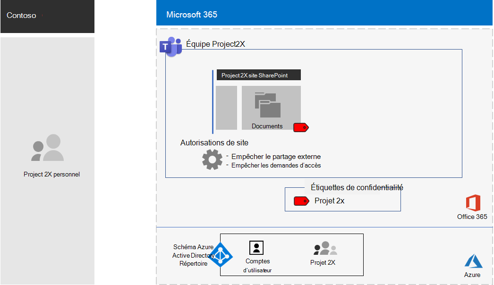
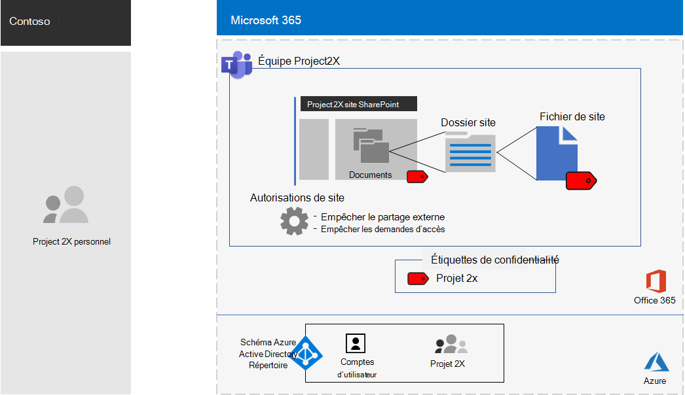

# Équipe isolée pour un projet à secret supérieur de Contoso Corporation

Après un cadre hors site, le PDG de Contoso a ordonné le développement d’une nouvelle suite de produits et de services qui pourrait doubler les bénéfices de contoso au cours des cinq prochaines années. Le projet de secret principal pour développer l’entreprise, l’ingénierie et le plan de marché a été nommé **Project 2x** et le personnel clé de l’entreprise ont été recrutés. 

Les chronologies de recherche et de développement étaient étroites, ce qui signifiait que la collaboration devait être efficace et fournir des réunions sécurisées, des conversations en cours et le stockage de fichiers.

Les livrables résultants pour Project 2X étaient des offres professionnelles, des spécifications de produits et d’ingénierie, ainsi que des documents et des plans de marketing sous forme de fichiers Word, Excel et PowerPoint. 

En raison de leur nature confidentielle, l’accès à ces fichiers était :

- Limité à Project 2X membres de l’équipe et leadership senior.
- Chiffrés et protégés par des autorisations pour permettre l’accès uniquement aux membres de l’équipe Project 2X et aux dirigeants, même si les fichiers ont été distribués en dehors de leurs dossiers sécurisés.

Le personnel informatique de Contoso a utilisé une [équipe avec l’isolation de sécurité](secure-teams-security-isolation.md) pour Project 2x et ces étapes.

## Étape 1 : création d’une équipe privée

Tout d’abord, pour protéger l’accès au site SharePoint sous-jacent pour l’équipe, les administrateurs informatiques de contoso ont configuré les [stratégies d’accès SharePoint recommandées](../security/office-365-security/sharepoint-file-access-policies.md).

Ensuite, un administrateur informatique de Contoso a créé une nouvelle équipe privée appelée Project 2X et a ajouté les comptes d’utilisateur de Project 2X personnel en tant que membres. Ils ont également configuré l’équipe de sorte que seuls les propriétaires d’équipe Project 2X puissent créer des canaux privés.

Pour plus d’informations sur la configuration, consultez la rubrique [Create a private Team](secure-teams-security-isolation.md#create-a-private-team).

## Étape 2 : création d’une étiquette de critère de diffusion pour l’équipe Project 2X

Les administrateurs contoso ont créé une étiquette de sensibilité nommée **Project 2x** qui :

- Chiffrement activé.
- Autorisations Co-Author autorisées pour le projet 2X groupe Microsoft 365.
- Autorisations de la visionneuse autorisées pour le groupe de leadership senior.
- Blocage de l’accès aux appareils non gérés.

Les fichiers de la section **documents** du projet sous-jacent 2 SharePoint ont été protégés par :

- Les autorisations de site, qui autorisent uniquement les autorisations maximales pour les membres du projet 2X groupe Microsoft 365 et les autorisations de lecture sur le groupe de leadership senior.
- L’étiquette de sensibilité Project 2X, avec le chiffrement et les autorisations qui transitent avec le fichier s’il est déplacé ou copié à partir du site.

Pour plus d’informations sur la configuration, consultez la rubrique [Create a Sensitivity label](secure-teams-security-isolation.md#create-a-sensitivity-label).

## Étape 3 : configuration du site SharePoint sous-jacent

Tout d’abord, pour protéger l’accès au site SharePoint sous-jacent pour l’équipe, les administrateurs informatiques de contoso ont configuré les [stratégies d’accès SharePoint recommandées](../security/office-365-security/sharepoint-file-access-policies.md).

Ensuite, ils ont configuré des paramètres d’autorisation supplémentaires pour le site :

- Pour empêcher Project 2X membres du groupe de partager l’accès au site. Pour plus d’informations sur la configuration, consultez la rubrique [paramètres SharePoint pour une équipe avec isolation de sécurité](secure-teams-security-isolation.md#sharepoint-settings).
- Pour les autorisations de lecture pour le groupe de leadership senior.

Ensuite, ils ont configuré des paramètres d’autorisation supplémentaires pour le site afin d’empêcher Project 2X membres du groupe de partager l’accès au site. 

Comme les canaux privés pour le projet 2X ont été créés, le propriétaire du groupe a désactivé le partage d’invité et définit le lien de partage par défaut sur la valeur de **personnes spécifiques** .

Voici la configuration obtenue de l’équipe Project 2X avec l’isolation de sécurité.

 ## Étape 4 : projet formé 2X membres de l’équipe

Le personnel de sécurité de Contoso a formé le projet 2 membres d’équipe dans un cours obligatoire qui les a exécutés par les utilisateurs :

- Comment accéder au nouveau projet 2 équipe, utiliser des réunions et des conversations et collaborer sur des fichiers d’équipe.
- Comment créer des fichiers dans l’équipe et télécharger de nouveaux fichiers créés localement.
- Comment étiqueter les fichiers avec l’étiquette de sensibilité Project 2X.
- Démonstration de la façon dont l’étiquette Project 2X protège un fichier même lorsqu’il quitte l’équipe.

Le résultat final était un environnement sécurisé dans lequel Project 2 membres de l’équipe ont collaboré dans un environnement sécurisé pour les conversations, les réunions et les fichiers.

Voici un exemple de fichier stocké dans le site du projet 2 sous-jacent avec l’étiquette de sensibilité de projet 2 affectée.

Dans quelques exemples, Project 2X les membres de l’équipe ont téléchargé des fichiers protégés par l’étiquette Project 2X sur un lecteur local pour le travail hors connexion. 

Toutefois, une fois que vous êtes invité à entrer les informations d’identification lors de leur ouverture, elles ont fait l’erreur et les ont supprimées.

En raison de l’environnement de collaboration de teams et des fonctionnalités de sécurité de Microsoft 365, les détails du projet 2X étaient secrets pendant toute la durée du projet. Contoso a annoncé ses plans et est en train de déployer les nouveaux produits et services à l’esprit de ses clients et investisseurs, ainsi que les chagrin de ses concurrents.

## Étape suivante

[Déployer une équipe avec l’isolation de sécurité](secure-teams-security-isolation.md) dans votre organisation.

