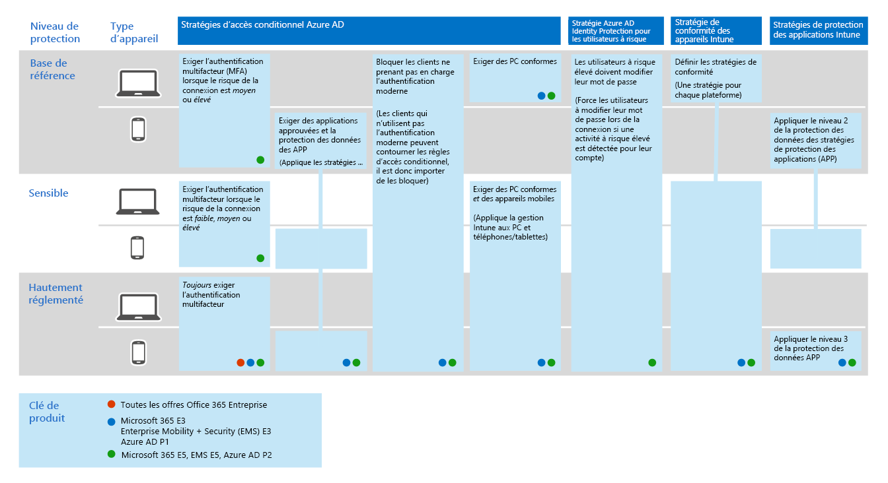

# Déployer les fonctionnalités de protection contre les menaces sur Microsoft 365

Les [programmes malveillants](https://docs.microsoft.com/windows/security/threat-protection/intelligence/understanding-malware)et les cyberattaques sophistiqués, tels que [les menaces en fichiers](https://docs.microsoft.com/windows/security/threat-protection/intelligence/fileless-threats), sont une occurrence fréquente. Les entreprises doivent se protéger elles-mêmes et leurs clients. De telles attaques peuvent entraîner des problèmes majeurs pour votre organisation, allant d’une perte de confiance à l’Woes financière, d’un temps d’arrêt menaçant pour les entreprises et bien plus encore. Il est important de se protéger contre les menaces, mais il peut être difficile de déterminer l’importance du temps, des efforts et des ressources de votre organisation. 

Les solutions de sécurité Microsoft sont intégrées à nos produits et services. Les fonctionnalités d’automatisation et d’apprentissage automatique réduisent la charge de vos équipes de sécurité afin de s’assurer que les éléments corrects sont traités. La force des solutions de sécurité Microsoft est basée sur les milliards de signaux que nous traitent tous les jours dans notre [graphique de sécurité intelligent](https://cloud-platform-assets.azurewebsites.net/intelligent-security-graph). Les solutions de sécurité Microsoft 365 incluent la [protection Microsoft contre les menaces](https://docs.microsoft.com/microsoft-365/security/mtp/microsoft-threat-protection), une solution qui rassemble les signaux de vos courriers électroniques, données, périphériques et identités pour peindre une image des menaces avancées contre votre organisation.

Regardez cette vidéo pour obtenir une vue d’ensemble du processus de déploiement.

> [!VIDEO https://www.microsoft.com/videoplayer/embed/RE4vsI7]

Utilisez cet article pour vous aider à implémenter votre solution de protection contre les menaces.

## Protection contre les menaces dans Microsoft 365 E5

[Microsoft 365 E5](https://www.microsoft.com/microsoft-365/enterprise-e5-business-software?activetab=pivot%3aoverviewtab) vous permet de protéger votre organisation grâce à une intelligence intégrée et intégrée. Les fonctionnalités de protection contre les menaces de Microsoft 365 E5 vous permettent de détecter et d’examiner les menaces avancées, les identités compromises et les actions malveillantes dans vos environnements locaux et Cloud.

Dans Microsoft 365 E5, les fonctionnalités de protection contre les menaces sont intégrées par défaut. Les signaux de chaque fonctionnalité ajoutent une force à la capacité globale à détecter les menaces et à y répondre. L’ensemble de fonctionnalités combiné offre la meilleure protection pour les organisations, en particulier pour les organisations multinationales, par rapport à l’exécution de produits non-Microsoft. L’image suivante décrit les services et les fonctionnalités de protection contre les menaces dans Microsoft 365 E5 qui sont décrits dans cet article.

Dès que vous déployez l’une des fonctionnalités de protection avancée contre les menaces, vous pouvez activer Microsoft Threat Protection, ce qui permet de regrouper les signaux et les données à un seul endroit. 

L’illustration suivante représente un chemin d’accès recommandé pour le déploiement de ces fonctionnalités individuelles. 

|Solution/fonctionnalités  |Description  |
|---------|---------|
|Authentification multifacteur et accès conditionnel     |Protégez-vous contre les identités et les appareils compromis. Commencez par cette protection, car elle est fondamentale. La configuration recommandée dans ce guide inclut la protection des identités Azure AD comme condition préalable.     |
|Azure Advanced Threat Protection     |  Solution de sécurité basée sur le Cloud qui tire parti de vos signaux Active Directory sur site pour identifier, détecter et examiner les menaces avancées, les identités compromises et les actions malveillantes dirigées vers votre organisation. Concentrez-vous sur cette étape, car elle protège votre infrastructure local et votre infrastructure cloud, ne dispose d’aucune dépendance ou prérequis et peut fournir des avantages immédiats.       | 
|Office 365-Protection avancée contre les menaces     | Protège votre organisation contre les menaces malveillantes posées par les messages électroniques, les liens (URL) et les outils de collaboration. Protections contre les programmes malveillants, le hameçonnage, l’usurpation d’identité et d’autres types d’attaques. Cette étape est recommandée en raison du fait que le contrôle des modifications, la migration des paramètres du système en place et d’autres considérations peuvent mettre plus de temps à déployer.   Remarque : Vérifiez également que vous configurez les fonctionnalités de protection contre les menaces incluses dans tous les abonnements Office 365 (Exchange Online Protection).       |
|Microsoft Defender – Protection avancée contre les menaces    | Une plateforme de protection des points de terminaison qui permet de prévenir, de détecter, d’examiner et de répondre aux menaces avancées. Le déploiement prend plus de temps, mais peut être réalisé en parallèle avec les autres fonctionnalités si d’autres administrateurs sont responsables.   |
|Microsoft Cloud App Security     |   Un courtier en matière de sécurité d’accès au Cloud pour la découverte, l’enquête et la gouvernance. Vous pouvez activer ce début avant de commencer à collecter des données et des informations. L’implémentation d’informations et d’autres protections ciblées dans vos applications SaaS implique une planification et peut prendre plus de temps.       | 

> [!TIP]
> Les organisations avec plusieurs équipes de sécurité peuvent implémenter ces fonctionnalités en parallèle.

## Déployer votre solution de protection contre les menaces

Pour vous assurer que votre organisation dispose de la meilleure protection possible, configurez et déployez votre solution de sécurité pour inclure les étapes suivantes :

1. [Configurer l’authentification multifacteur et les stratégies d’accès conditionnel](#step-1-set-up-multi-factor-authentication-and-conditional-access-policies)
2. [Configuration d’Azure protection avancée contre les menaces](#step-2-configure-azure-advanced-threat-protection)
3. [Activer la Protection Microsoft contre les menaces](#step-3-turn-on-microsoft-threat-protection)
4. [Configurer la protection avancée contre les menaces Office 365](#step-4-configure-office-365-advanced-threat-protection)
5. [Configurer Microsoft Defender-protection avancée contre les menaces](#step-5-configure-microsoft-defender-advanced-threat-protection)
6. [Configurer la sécurité des applications Cloud Microsoft](#step-6-configure-microsoft-cloud-app-security)
7. [Surveiller l’État et prendre des mesures](#step-7-monitor-status-and-take-actions)
8. [Former les utilisateurs](#step-8-train-users)

Vos fonctionnalités de protection contre les menaces peuvent être configurées en parallèle, de sorte que si vous avez plusieurs équipes de sécurité responsables de différents services, elles peuvent configurer les fonctionnalités de protection de votre organisation en même temps. Le diagramme suivant illustre le processus de haut niveau pour le déploiement des fonctionnalités de protection contre les menaces. 

 

## Étape 1 : configurer l’authentification multifacteur et les stratégies d’accès conditionnel

[L’authentification multifacteur](https://docs.microsoft.com/azure/active-directory/authentication/concept-mfa-howitworks) (MFA) exige que les utilisateurs vérifient leur identité auprès d’un appel téléphonique ou d’une application d’authentificateur. Les [stratégies d’accès conditionnel](https://docs.microsoft.com/azure/active-directory/conditional-access/overview) définissent certaines exigences qui doivent être satisfaites pour permettre aux utilisateurs d’accéder aux applications et aux données dans Microsoft 365. Les stratégies MFA et d’accès conditionnel fonctionnent conjointement pour protéger votre organisation. Par exemple, si une personne tente de se connecter à partir d’un appareil mobile à l’aide d’un compte qui n’est pas activé pour l’authentification multifacteur et qu’une stratégie d’accès conditionnel exige l’application de l’authentification multifacteur, il ne pourra pas se connecter.  

Microsoft a testé et recommande un ensemble spécifique d’accès conditionnel et de stratégies associées pour protéger l’accès à toutes les applications SaaS, en particulier Microsoft 365. Les stratégies sont recommandées pour la protection des données de référence, sensibles et hautement réglementées. Commencez par implémenter les stratégies pour la protection de base. 

appareils[voir une version plus grande de cette image](https://github.com/MicrosoftDocs/microsoft-365-docs/raw/public/microsoft-365/media/Identity_device_access_policies_byplan.png)

### Pour implémenter la protection de base pour Microsoft 365

 

1. [Configurez les composants requis, y compris Azure Identity Protection](../enterprise/identity-access-prerequisites.md).
2. [Configurez les stratégies courantes d’identité et d’accès aux appareils](../enterprise/identity-access-policies.md) pour la protection de base.
3. Configurez [les stratégies pour les utilisateurs invités](../enterprise/identity-access-policies-guest-access.md), [Microsoft teams](../enterprise/teams-access-policies.md), [Exchange Online](../enterprise/secure-email-recommended-policies.md)et [OneDrive](../enterprise/sharepoint-file-access-policies.md).

### Plus d’informations sur la protection des identités

- [Configurations des identités et de l’accès aux appareils](../enterprise/microsoft-365-policies-configurations.md)
- [Conseils de sécurité pour Azure MFA](https://docs.microsoft.com/azure/active-directory/authentication/multi-factor-authentication-security-best-practices)

## Étape 2 : configurer Azure protection avancée contre les menaces

[Azure Advanced Threat Protection](https://docs.microsoft.com/azure-advanced-threat-protection/what-is-atp) (Azure ATP) est une solution de sécurité basée sur le Cloud qui fonctionne avec vos signaux [Azure Active Directory](https://docs.microsoft.com/azure/active-directory/fundamentals/active-directory-whatis) locaux pour identifier, détecter et examiner les menaces avancées, les identités compromises et les actions malveillantes dirigées vers votre organisation.

Azure ATP permet aux analystes et aux professionnels de la sécurité des opérations de sécurité (secopss) de détecter les attaques avancées dans les environnements hybrides :
- Surveiller les utilisateurs, le comportement de l’entité et les activités à l’aide d’une analyse basée sur l’apprentissage.
- Protéger les identités des utilisateurs et informations d’identification stockées dans Active Directory.
- Identifier et examiner les activités suspectes des utilisateurs et les attaques avancées tout au long de la chaîne de terminaison.
- Fournir des informations claires sur les incidents reposant sur une chronologie simple pour un triage rapide.

### Pour configurer Azure ATP

 

1. [Configurez Azure ATP](https://docs.microsoft.com/azure-advanced-threat-protection/install-atp-step1) pour protéger vos environnements principaux.
2. Protégez tous vos [contrôleurs de domaine](https://docs.microsoft.com/azure-advanced-threat-protection/atp-sensor-monitoring) et [forêts](https://docs.microsoft.com/azure-advanced-threat-protection/atp-multi-forest).
3. Intégrer des [alertes Azure ATP](https://docs.microsoft.com/azure-advanced-threat-protection/suspicious-activity-guide?tabs=external) à votre flux de travail opérations de sécurité (SECOPS).

### Plus d’informations sur Azure ATP

- [Qu’est-ce que Azure ATP ?](https://docs.microsoft.com/azure-advanced-threat-protection/what-is-atp)
- [Vidéo : présentation de l’ATP Azure](https://www.youtube.com/watch?reload=9&v=EGY2m8yU_KE)
- [Déploiement Azure ATP](https://docs.microsoft.com/azure-advanced-threat-protection/what-is-atp#whats-next)

## Étape 3 : activer la protection contre les menaces Microsoft

[Microsoft Threat Protection](https://docs.microsoft.com/microsoft-365/security/mtp/microsoft-threat-protection) combine les fonctionnalités dans une solution unique. Avec la solution de protection Microsoft contre les menaces intégrée, les professionnels de la sécurité peuvent combiner les signaux de menace que chacun de ces produits reçoit et déterminer l’étendue et l’impact complets de la menace ; la manière dont il entre dans l’environnement, ce qu’il est affecté et la façon dont il influe actuellement sur l’organisation. Microsoft Threat Protection effectue une action automatique pour empêcher ou bloquer les boîtes aux lettres, les points de terminaison et les identités utilisateur affectés autoréparation.

Microsoft Threat Protection unifie les alertes, les incidents, l’analyse et la réponse automatiques, ainsi que la recherche avancée sur les charges de travail (Azure ATP, Office 365 ATP, Microsoft Defender ATP et Microsoft Cloud App Security) dans un seul volet d’expérience. Une fois que vous avez configuré un ou plusieurs services de protection avancée contre les menaces, activez la protection contre les menaces Microsoft. De nouvelles fonctionnalités sont ajoutées en permanence à la protection contre les menaces Microsoft. envisagez d’opter pour recevoir des fonctionnalités d’aperçu.

### Pour configurer la protection contre les menaces Microsoft

 

1. [Passez en revue les conditions préalables](https://docs.microsoft.com/microsoft-365/security/mtp/prerequisites).
2. [Activez la protection contre les menaces Microsoft](https://docs.microsoft.com/microsoft-365/security/mtp/mtp-enable).
3. [Abonnez-vous aux fonctionnalités d’aperçu](https://docs.microsoft.com/microsoft-365/security/mtp/preview).

### Plus d’informations sur la protection contre les menaces Microsoft

- [Qu’est-ce que la protection Microsoft contre les menaces ?](https://docs.microsoft.com/microsoft-365/security/mtp/microsoft-threat-protection)
- [Nouveautés de la protection Microsoft contre les menaces](https://docs.microsoft.com/microsoft-365/security/mtp/whats-new)

## Étape 4 : configurer Office 365 protection avancée contre les menaces

[Office 365 Advanced Threat Protection](https://docs.microsoft.com/microsoft-365/security/office-365-security/office-365-atp) (Office 365 ATP) protège votre organisation contre les menaces malveillantes dans les messages électroniques (pièces jointes et URL), les documents Office et les outils de collaboration. Le tableau suivant répertorie les fonctionnalités et fonctionnalités ATP d’Office 365 incluses dans Microsoft 365 E5 :

|||
|---|---|
|Fonctionnalités de configuration, de protection et de détection|Fonctionnalités d’automatisation, d’enquête, de correction et d’éducation|
|[Pièces jointes fiables](https://docs.microsoft.com/microsoft-365/security/office-365-security/atp-safe-attachments) [Liens fiables](https://docs.microsoft.com/microsoft-365/security/office-365-security/atp-safe-links) [Documents approuvés](https://docs.microsoft.com/microsoft-365/security/office-365-security/safe-docs) [ATP pour SharePoint, OneDrive et Microsoft Teams](https://docs.microsoft.com/microsoft-365/security/office-365-security/atp-for-spo-odb-and-teams) [Protection contre le hameçonnage ATP](https://docs.microsoft.com/microsoft-365/security/office-365-security/set-up-anti-phishing-policies#exclusive-settings-in-atp-anti-phishing-policies)|[Suivi des menaces](https://docs.microsoft.com/microsoft-365/security/office-365-security/threat-trackers) [Threat Explorer](https://docs.microsoft.com/microsoft-365/security/office-365-security/threat-explorer) [Examen et réponse automatisés](https://docs.microsoft.com/microsoft-365/security/office-365-security/office-365-air) [Simulateur d’attaques](https://docs.microsoft.com/microsoft-365/security/office-365-security/attack-simulator)|
|

Avec la protection avancée contre les menaces Office 365, les personnes de votre organisation peuvent communiquer et collaborer de manière plus sécurisée, avec protection contre les menaces pour leur contenu de messagerie et leurs documents Office.

### Pour configurer la protection avancée contre les menaces Office 365

 

1. [Installez et configurez vos stratégies ATP Office 365](https://docs.microsoft.com/microsoft-365/security/office-365-security/protect-against-threats).
2. [Afficher et utiliser vos rapports ATP Office 365](https://docs.microsoft.com/microsoft-365/security/office-365-security/view-reports-for-atp).
3. [Utiliser les fonctionnalités d’enquête et de réponse aux menaces](https://docs.microsoft.com/microsoft-365/security/office-365-security/office-365-ti).

### Plus d’informations sur la protection avancée contre les menaces Office 365

- [Vue d’ensemble d’Office 365 – Protection avancée contre les menaces](https://docs.microsoft.com/microsoft-365/security/office-365-security/office-365-atp)
- [Nouveautés d’Office 365 - Protection avancée contre les menaces](https://docs.microsoft.com/microsoft-365/security/office-365-security/whats-new-in-office-365-atp)

## Étape 5 : configurer la protection avancée contre les menaces Microsoft Defender

[Microsoft Defender Advanced Threat Protection](https://docs.microsoft.com/windows/security/threat-protection) (Microsoft Defender ATP) protège les appareils de votre organisation (également appelés points de terminaison) de cyber, les attaques avancées et les violations de données. Les équipes de sécurité peuvent être plus efficaces pour gérer la sécurité de leurs points de terminaison. Des outils puissants aident les organisations à suivre les systèmes dépourvus de correctifs à l’aide de la détection de vulnérabilité avec la [gestion des menaces et des vulnérabilités](https://docs.microsoft.com/windows/security/threat-protection/microsoft-defender-atp/next-gen-threat-and-vuln-mgt). Les fonctionnalités de détection et de correction automatisées, telles que la réduction de la [surface d’attaque](https://docs.microsoft.com/windows/security/threat-protection/microsoft-defender-atp/overview-attack-surface-reduction), la [protection nouvelle génération](https://docs.microsoft.com/windows/security/threat-protection/windows-defender-antivirus/windows-defender-antivirus-in-windows-10), la [détection et la réponse du point de terminaison](https://docs.microsoft.com/windows/security/threat-protection/microsoft-defender-atp/overview-endpoint-detection-response), ainsi que l’analyse et la [Correction automatisées](https://docs.microsoft.com/windows/security/threat-protection/microsoft-defender-atp/automated-investigations) vous aident à protéger vos appareils contre les programmes malveillants. En plus de ces fonctionnalités, les clients peuvent obtenir des notifications proactives et consulter les experts Microsoft Threat à la demande, dans le cadre du service de chasse à la responsabilité gérée. 

### Configurer Microsoft Defender ATP

 

1. [Préparez votre déploiement ATP Microsoft Defender](https://docs.microsoft.com/windows/security/threat-protection/microsoft-defender-atp/deployment-phases).
2. [Configurer le déploiement ATP de Microsoft Defender](https://docs.microsoft.com/windows/security/threat-protection/micros.oft-defender-atp/production-deployment)
3. [Intégré au service ATP de Microsoft Defender](https://docs.microsoft.com/windows/security/threat-protection/microsoft-defender-atp/onboarding).
4. [Effectuez les principales tâches d’administration de la sécurité](https://docs.microsoft.com/windows/security/threat-protection/microsoft-defender-atp/tvm-security-recommendation).

### Plus d’informations sur Microsoft Defender ATP

- [En savoir plus sur Microsoft Defender ATP](https://docs.microsoft.com/windows/security/threat-protection).
- [Essayez l’atelier d’évaluation de Microsoft Defender ATP](https://docs.microsoft.com/windows/security/threat-protection/microsoft-defender-atp/evaluation-lab).

## Étape 6 : configurer la sécurité des applications Cloud Microsoft

[Microsoft Cloud App Security](https://docs.microsoft.com/cloud-app-security) est un courtier de sécurité d’accès au Cloud qui prend en charge la collecte de journaux, les connecteurs d’API et le proxy inverse. Microsoft Cloud App Security offre une visibilité riche, un contrôle sur le déplacement des données et des analyses sophistiquées pour identifier et combattre Cyber dans tous vos services Cloud. Avec Microsoft Cloud App Security, vos opérations de sécurité peuvent protéger les informations sensibles de votre organisation, se protéger contre les cyber et les anomalies, découvrir et surveiller les applications qui accèdent aux données de votre organisation, et vous assurer que les applications Cloud de votre organisation répondent aux exigences de conformité.

### Configuration de la sécurité des applications Cloud Microsoft

 

1. [Configurez le portail et d’autres exigences de base](https://docs.microsoft.com/cloud-app-security/general-setup).
2. [Configurez la détection](https://docs.microsoft.com/cloud-app-security/set-up-cloud-discovery) sur le Cloud et les [applications de connexion](https://docs.microsoft.com/cloud-app-security/enable-instant-visibility-protection-and-governance-actions-for-your-apps).
3. [Déployer le contrôle d’application d’accès conditionnel pour les applications proposées](https://docs.microsoft.com/cloud-app-security/proxy-deployment-aad).
4. [Utiliser les outils d’enquête et les tableaux de bord](https://docs.microsoft.com/cloud-app-security/investigate).

### Rubrique relative aux informations supplémentaires concernant Microsoft Cloud App Security

- [Passez en revue les nouvelles fonctionnalités et](https://docs.microsoft.com/cloud-app-security/release-notes)fonctionnalités.
- [En savoir plus sur la sécurité des applications Cloud de Microsoft](https://docs.microsoft.com/cloud-app-security/what-is-cloud-app-security).

## Étape 7 : surveiller l’État et prendre des mesures

Une fois que vous avez configuré et déployé vos services et fonctionnalités de protection contre les menaces, l’étape suivante consiste à surveiller les détections de menaces et à prendre les mesures appropriées. Le meilleur point de départ est le centre de sécurité Microsoft[https://security.microsoft.com](https://security.microsoft.com)365 (), où vous pouvez surveiller et gérer la sécurité dans vos identités, données, périphériques, applications et infrastructure Microsoft. 

:::image type="content" source="../media/solutions-architecture-center/m365-security-center.png" alt-text="Centre de sécurité Microsoft 365":::

Le centre de sécurité Microsoft 365 est spécifiquement destiné aux équipes de sécurité et aux administrateurs de sécurité. Dans le centre de sécurité Microsoft 365, vous pouvez :
- Afficher l’état de sécurité global de votre organisation avec le [score sécurisé](https://docs.microsoft.com/microsoft-365/security/mtp/microsoft-secure-score).
- [Surveillez et affichez des rapports](https://docs.microsoft.com/microsoft-365/security/mtp/monitoring-and-reporting) sur l’état de vos identités, données, périphériques, applications et infrastructure.
- Reliez les points sur les alertes par le biais d' [incidents](https://docs.microsoft.com/microsoft-365/security/mtp/incident-queue).
- Utilisez l’analyse [et la correction automatisées](https://docs.microsoft.com/microsoft-365/security/mtp/mtp-autoir) pour résoudre les menaces.
- [Recherche proactive de menaces](https://docs.microsoft.com/microsoft-365/security/mtp/advanced-hunting-overview), telles que des tentatives d’intrusion ou une activité de violation affectant votre courrier électronique, vos données, vos périphériques et vos identités.
- [Comprenez les dernières campagnes](https://docs.microsoft.com/microsoft-365/security/mtp/latest-attack-campaigns) et techniques d’attaque avec l’analyse des menaces.
- ... et bien plus encore !

### Plus d’informations sur le centre de sécurité Microsoft 365

- [Prise en main du centre de sécurité Microsoft 365](https://docs.microsoft.com/microsoft-365/security/mtp/overview-security-center).
- [Surveiller et afficher les rapports](https://docs.microsoft.com/microsoft-365/security/mtp/monitoring-and-reporting).
- [Consultez les portails de sécurité dans Microsoft 365](https://docs.microsoft.com/microsoft-365/security/mtp/portals).

## Étape 8 : former les utilisateurs

Les utilisateurs de la formation peuvent enregistrer les utilisateurs et les opérations de sécurité de votre équipe de manière plus longue et plus frustrante. Les utilisateurs chevronnés sont moins susceptibles d’ouvrir des pièces jointes ou de cliquer sur des liens dans des messages électroniques douteux, et ils sont plus susceptibles d’éviter les sites Web suspects. 

Le manuel de la [campagne](https://go.microsoft.com/fwlink/?linkid=2015598&amp;clcid=0x409) Harvard Kennedy School Cybersecurity fournit des conseils excellents sur l’établissement d’une culture forte de la sensibilisation à la sécurité au sein de votre organisation, y compris la formation des utilisateurs pour identifier les attaques par hameçonnage. 

Microsoft 365 fournit les ressources suivantes pour aider les utilisateurs au sein de votre organisation :

|Concept  |Ressources  |
|---------|---------|
|Microsoft 365     |[Voies de formation personnalisables](https://docs.microsoft.com/office365/customlearning/) 
Ces ressources peuvent vous aider à réunir des formations pour les utilisateurs finaux de votre organisation.        |
|Sécurité Microsoft 365 |[Module d’apprentissage : sécurisez votre organisation à l’aide de la sécurité intégrée et intelligente de Microsoft 365](https://docs.microsoft.com/learn/modules/security-with-microsoft-365) 
Ce module vous permet de décrire les fonctionnalités de sécurité de Microsoft 365 et d’expliquer les avantages de ces fonctionnalités de sécurité. |
|Authentification multifacteur     | [Vérification en deux étapes : qu’est-ce que la page de vérification supplémentaire ?](https://docs.microsoft.com/azure/active-directory/user-help/multi-factor-authentication-end-user-first-time) 
Cet article permet aux utilisateurs finaux de comprendre ce qu’est l’authentification multifacteur et pourquoi elle est utilisée au sein de votre organisation.    |

En plus de ces conseils, Microsoft recommande à vos utilisateurs d’effectuer les actions décrites dans cet article : [protéger votre compte et vos appareils contre les pirates et les programmes malveillants](https://support.office.com/article/066d6216-a56b-4f90-9af3-b3a1e9a327d6.aspx). Ces actions incluent :
- Utilisation de mots de passe forts
- Protection des appareils 
- Activation des fonctionnalités de sécurité sur les PC Windows 10 et Mac (pour les appareils non gérés)
    
Microsoft recommande également aux utilisateurs de protéger leurs comptes de messagerie personnels en effectuant les actions recommandées dans les articles suivants :
- [Protéger votre compte de messagerie Outlook.com](https://support.office.com/article/a4f20fc5-4307-4ece-8231-6d4d4bd8a9ba.aspx)
- [Protégez votre compte Gmail à l’aide de la vérification en deux étapes](https://go.microsoft.com/fwlink/?linkid=2015688&amp;clcid=0x409)
