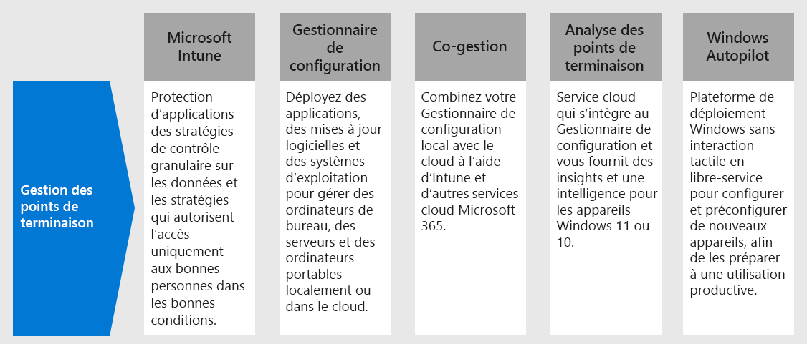

# Étape 4. Déployer la gestion des points de terminaison pour vos appareils, PC et autres points de terminaison

Avec les travailleurs à distance, vous devez prendre en charge un nombre croissant d’appareils personnels. La gestion des points de terminaison est une approche de sécurité, basée sur des stratégies, qui exige que les appareils respectent des critères spécifiques avant de pouvoir accéder aux ressources. Microsoft Endpoint Manager offre des capacités de gestion modernes pour sécuriser vos données dans le cloud et en local. 

Endpoint Manager fournit des services et des outils pour gérer les appareils mobiles, les ordinateurs de bureau, les machines virtuelles, les appareils intégrés et les serveurs, en combinant les services suivants, que vous connaissez peut-être déjà et que vous utilisez.

## Microsoft Intune

Microsoft Intune est un service basé sur le cloud qui se concentre sur la gestion des périphériques mobiles (MDM) et la gestion des applications mobiles (MAM) incluses dans Microsoft 365. 

- **Gestion des périphériques mobiles (MDM) :** Pour les appareils appartenant à l’organisation, vous pouvez exercer un contrôle total, y compris les paramètres, les fonctionnalités et la sécurité. Les appareils sont « inscrits » dans Intune et reçoivent ses stratégies avec les règles et les paramètres. Par exemple, vous pouvez définir les critères de mot de passe et de code confidentiel, créer une connexion VPN, configurer la protection contre les menaces, et bien plus encore.

- **Gestion des applications mobiles (MAM) :** les travailleurs distants ne souhaitent peut-être pas que vous disposiez d’un contrôle total sur leurs appareils personnels, appelés également appareils Apportez votre propre appareil (BYOD). Vous pouvez fournir des options à vos employés distants tout en continuant de protéger votre organisation. Par exemple, les employés à distance peuvent inscrire leurs appareils s’ils veulent obtenir un accès total aux ressources de votre organisation. Vous pouvez également utiliser les stratégies de protection des applications qui requièrent l’authentification multifacteur (MFA) pour utiliser ces applications si ces utilisateurs souhaitent seulement accéder à la messagerie ou Microsoft Teams.

Si vous souhaitez en savoir plus, consultez la page [Présentation de Microsoft Intune](https://docs.microsoft.com/intune/fundamentals/what-is-intune).

## Configuration Manager

Configuration Manager est une solution de gestion locale qui vous permet de gérer les ordinateurs de bureau, les serveurs et les ordinateurs portables qui se trouvent sur votre réseau ou sur Internet. Utilisez Configuration Manager pour déployer des applications, des mises à jour logicielles et des systèmes d’exploitation. Vous pouvez également surveiller la conformité, interroger et agir sur les clients en temps réel, et bien plus encore. Vous pouvez l’activer dans le cloud pour l’intégrer à Intune, Azure AD, Microsoft Defender - Protection avancée contre les menaces, et d’autres services cloud. 

Si vous souhaitez en savoir plus, consultez la page [Présentation de Configuration Manager](https://docs.microsoft.com/mem/configmgr/core/understand/introduction).

## Cogestion

La cogestion combine votre investissement Configuration Manager local existant avec le cloud, à l’aide d’Intune et d’autres services cloud Microsoft 365. Vous devez choisir entre Configuration Manager ou Intune et décidez lequel doit être l’autorité de gestion pour les charges de travail différentes. 

La co-gestion utilise les fonctionnalités cloud basées sur Intune, y compris l’accès conditionnel et l’application de la conformité des appareils. Vous conservez certaines tâches en local, tout en exécutant d’autres tâches dans le cloud.

Si vous souhaitez en savoir plus, consultez la page [Présentation de la cogestion](https://docs.microsoft.com/mem/configmgr/comanage/overview).

## Analyses du bureau

L’Analyse du bureau est un service basé sur le cloud, qui s’intègre à Configuration Manager et vous fournit des informations et des renseignements, afin que vous puissiez prendre des décisions éclairées concernant vos clients Windows. Elle combine des données de votre organisation à des données cumulées à partir de millions d’appareils connectés à des services cloud de Microsoft. 

Avec les Analyses de bureau, vous pouvez :

- Créez un inventaire des applications exécutées au sein de votre organisation.
- Évaluer la compatibilité des applications avec les dernières mises à jour de fonctionnalités Windows 10.
- Identifier les problèmes de compatibilité et recevoir des suggestions d’atténuation en fonction des analyses de données basées sur le cloud.
- Créer des groupes pilotes représentant l’ensemble de l’application et du pilote dans un groupe minimal d’appareils.
- Déployer Windows 10 sur des appareils pilotes et gérés en production.

Si vous souhaitez en savoir plus, consultez la page [Présentation de l’Analyse du bureau](https://docs.microsoft.com/mem/configmgr/desktop-analytics/overview).

## Windows Autopilot

Windows Autopilot offre une plateforme de déploiement Windows sans intervention et en libre-service. C’est un ensemble de technologies, utilisées pour configurer et préconfigurer de nouveaux appareils, de manière à les préparer à une utilisation productive. Vous pouvez également utiliser Windows Autopilot pour réinitialiser, réaffecter et récupérer des appareils. 

Windows Autopilot permet à un service informatique de pré-configurer des appareils avec peu ou pas d’infrastructure à gérer et avec un processus simple et facile. 

- En ce qui concerne l’utilisateur, seulement quelques opérations sont nécessaires pour avoir un appareil prêt à l’emploi. 
- Du point de vue des professionnels de l’informatique, la seule interaction requise de l’utilisateur final est de se connecter à un réseau et de vérifier ses informations d’identification.

Si vous souhaitez en savoir plus, consultez la page [Présentation de Windows Autopilot](https://docs.microsoft.com/windows/deployment/windows-autopilot/windows-autopilot).

## Ressources techniques dédiées aux administrateurs pour la gestion des points de terminaison

- [La Partie 3 de la vidéo sur la gestion des appareils Windows 10 pour les employés à distance](https://resources.techcommunity.microsoft.com/enabling-remote-work/#security)
- [La Partie 5 de la vidéo sur la gestion des navigateurs et des ordinateurs de bureau des utilisateurs pour les employés à distance](https://resources.techcommunity.microsoft.com/enabling-remote-work/#security)
- [Déployer une infrastructure de mobilité pour Microsoft 365](https://docs.microsoft.com/microsoft-365/enterprise/mobility-infrastructure)
- [Comment inscrire différents types d’appareils pour la gestion des périphériques mobiles](https://docs.microsoft.com/mem/intune/enrollment/device-enrollment)
- [Comment former vos utilisateurs finaux à Microsoft Intune](https://docs.microsoft.com/mem/intune/fundamentals/end-user-educate)
 
## Résultats de l’étape 3

Vous utilisez la suite des fonctionnalités et des capacités de Endpoint Manager pour gérer les appareils mobiles, les ordinateurs de bureau, les machines virtuelles, les appareils incorporés et les serveurs.

## Étape suivante

Passez à l’[étape 5](empower-people-to-work-remotely-teams-productivity-apps.md) pour encourager vos employés à distance à utiliser des applications de productivité Microsoft 365 telles que Microsoft Teams.
