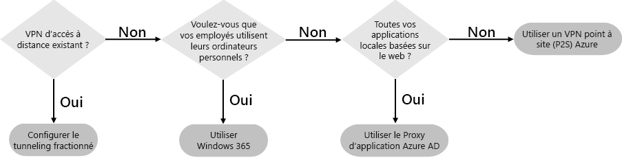
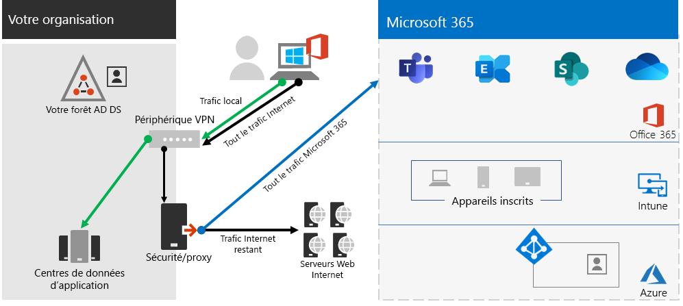
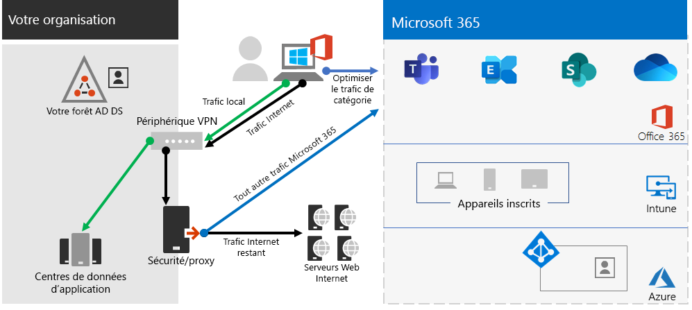
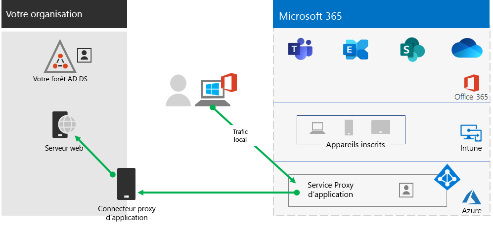
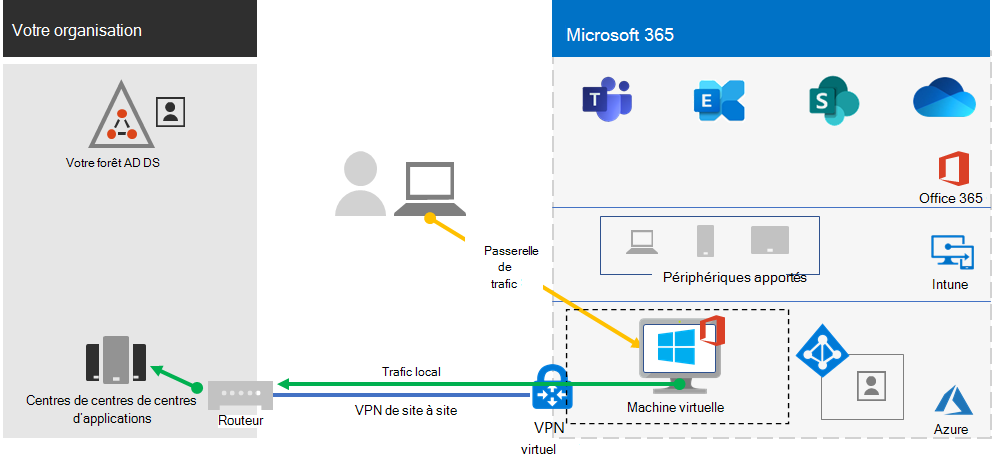
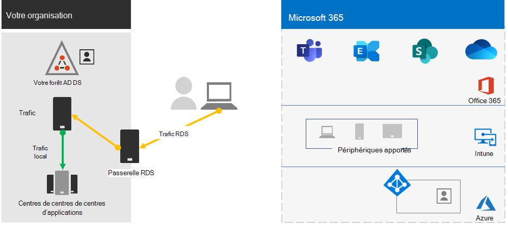
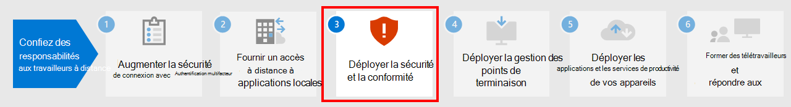

# Étape 2 : fournir l’accès à distance aux applications et services locaux

Si votre organisation utilise une solution VPN d’accès à distance, généralement avec les serveurs VPN sur la périphérie de votre réseau et les clients VPN installés sur les appareils de vos utilisateurs, vos utilisateurs peuvent utiliser les connexions VPN d’accès à distance pour accéder aux applications et serveurs locaux. Mais vous pouvez avoir besoin d’optimiser le trafic vers les services Microsoft 365 dans le cloud.

Si vos utilisateurs n’utilisent pas de solution VPN, vous pouvez utiliser le proxy d’application Azure Active Directory (Azure AD) et le VPN Azure Point-to-Site (P2S) pour fournir un accès, si toutes vos applications sont basées sur le web.

Voici les principales configurations pour l’accès à distance :

- Vous utilisez déjà une solution VPN d’accès à distance.
- Vous n’utilisez pas de solution VPN d’accès à distance et vous souhaitez que vos employés distants utilisent leur ordinateur personnel.
- Vous n’utilisez pas une solution VPN d’accès à distance, vous avez une identité hybride, et vous avez besoin d’un accès à distance uniquement pour les applications web locales.
- Vous n’utilisez pas de solution VPN d’accès à distance et vous avez besoin d’accéder à des applications locales, dont certaines ne sont pas basées sur le web.

Consultez cet organigramme pour accéder aux options de configuration de l’accès à distance décrites dans cet article.

Avec les connexions d’accès à distance, vous pouvez également utiliser le [Bureau à distance](https://support.microsoft.com/help/4028379/windows-10-how-to-use-remote-desktop) pour connecter vos utilisateurs à un PC local. Par exemple, un employé distant peut utiliser le Bureau à distance pour se connecter au PC de son bureau depuis son appareil Windows, iOS ou Android. Lorsqu’il est connecté à distance, il peut l’utiliser comme s’il était assis face à son PC.

## Optimiser les performances des clients VPN d’accès à distance aux services cloud de Microsoft 365

Si vos employés à distance utilisent un client VPN traditionnel pour obtenir l’accès à distance au réseau de votre organisation, vérifiez que le client VPN a une prise en charge de la segmentation de tunnel.

Sans cette segmentation, l’ensemble de votre trafic de travail à distance est envoyé sur la connexion VPN, où il doit être transféré vers les appareils Microsoft Edge de votre organisation, être traité, puis envoyé sur Internet.

Le trafic Microsoft 365 doit emprunter une route indirecte au sein de votre organisation, qui peut être transférée vers un point d’entrée réseau Microsoft éloigné loin de l’emplacement physique du client VPN. Ce chemin d'accès indirect ajoute une latence au trafic du réseau et diminue les performances générales.

La segmentation de tunnel vous permet de configurer votre client VPN pour empêcher l’envoi de certains types de trafic sur la connexion VPN vers le réseau de l’organisation.

Pour optimiser l’accès aux ressources cloud de Microsoft 365, configurez vos clients VPN avec la segmentation de tunnel afin d’exclure le trafic vers la catégorie **Optimiser** des points de terminaison Microsoft 365 sur la connexion VPN. Pour plus d’informations, consultez [Catégories de points de terminaison Office 365](../enterprise/microsoft-365-network-connectivity-principles.md#new-office-365-endpoint-categories). Consultez [cette liste](../enterprise/urls-and-ip-address-ranges.md) des points de terminaison de catégorie Optimiser.

Voici le flux de trafic qui en résulte, dans lequel la plupart du trafic vers les applications cloud Microsoft 365 contournent la connexion VPN.

Cela permet au client VPN d’envoyer et de recevoir du trafic de service cloud Microsoft 365 crucial directement via Internet et vers le point d’entrée le plus proche dans le réseau Microsoft.

Pour plus d’informations et de conseils, voir [Optimiser la connectivité d’Office 365 pour les utilisateurs à distance à l’aide de la segmentation de tunnel de VPN](../enterprise/microsoft-365-vpn-split-tunnel.md).

## Déployer l’accès à distance lorsque toutes vos applications sont des applications web et que vous avez une identité hybride

Si vos employés distants n’utilisent pas de client VPN classique et que vos comptes d’utilisateurs et groupes locaux sont synchronisés avec Azure AD, vous pouvez utiliser le proxy d’application Azure AD pour fournir un accès à distance sécurisé pour les applications web hébergées sur des serveurs intranet locaux. Les applications web incluent les sites SharePoint Server, les serveurs Outlook Web Access ou toute autre application métier basée sur le web.

Voici les composants du proxy d’application Azure AD.

Si vous souhaitez en savoir plus, consultez la page [Présentation du proxy d’application Azure AD](/azure/active-directory/manage-apps/application-proxy).

> [!NOTE]
> Le proxy d’application Azure AD ne fait pas partie de l’abonnement Microsoft 365. Vous devez payer pour son utilisation avec un abonnement Azure distinct.

## Déployer l’accès à distance lorsque l’ensemble de vos applications ne sont pas des applications web

Si vos employés distants n’utilisent pas de client VPN classique et que vous avez des applications qui ne sont pas basée sur le web, vous pouvez utiliser un réseau privé virtuel (P2S) Azure.

Une connexion VPN P2S crée une connexion sécurisée entre un appareil de travail distant et le réseau de votre organisation via un réseau virtuel Azure.

Si vous souhaitez en savoir plus, consultez la page [Présentation de P2S VPN](/azure/vpn-gateway/point-to-site-about).

> [!NOTE]
> Azure P2S VPN n’est pas inclus dans l’abonnement Microsoft 365. Vous devez payer pour son utilisation avec un abonnement Azure distinct.

## Déployer l’application de Windows Virtual Desktop pour fournir l’accès distant aux travailleurs à distance en utilisant des appareils personnels

Pour prendre en charge les travailleurs distants qui peuvent uniquement utiliser leurs appareils personnels et non gérés, utilisez l’application de Windows Virtual Desktop dans Azure pour créer et attribuer des bureaux virtuels à vos utilisateurs pour qu’ils les utilisent à partir de leur domicile. Les PC virtualisés peuvent agir exactement comme des PC connectés au réseau de votre organisation.

Si vous souhaitez en savoir plus, consultez la page [Présentation de Windows Virtual Desktop](/azure/virtual-desktop/overview).

> [!NOTE]
>Windows Virtual Desktop n’est pas inclus dans l’abonnement Microsoft 365. Vous devez payer pour son utilisation avec un abonnement Azure distinct.

## Protéger vos connexions aux Services Bureau à distance avec la Passerelle des services Bureau à distance

Si vous utilisez les Services Bureau à distance (RDS) pour permettre aux employés de se connecter à des ordinateurs Windows sur votre réseau local, vous devez utiliser une Passerelle des services Bureau à distance Microsoft dans votre réseau de périmètre. La passerelle utilise TLS (Transport Layer Security) pour chiffrer le trafic et empêche l’ordinateur local hébergeant les services Bureau à distance d’être directement exposé à Internet.

Si vous souhaitez plus d’informations, consultez [cet article](https://www.microsoft.com/security/blog/2020/04/16/security-guidance-remote-desktop-adoption/).

## Ressources techniques dédiées aux administrateurs pour l’accès à distance

- [Comment optimiser rapidement le trafic Office 365 pour les membres du personnel à distance et réduire la charge sur votre infrastructure](https://techcommunity.microsoft.com/t5/office-365-blog/how-to-quickly-optimize-office-365-traffic-for-remote-staff-amp/ba-p/1214571)
- [Optimiser la connectivité d’Office 365 pour les utilisateurs à distance à l’aide de la segmentation de tunnel VPN](../enterprise/microsoft-365-vpn-split-tunnel.md)

## Résultats de l’étape 2

Après le déploiement d’une solution d’accès à distance pour vos employés à distance :

| Configuration de l’accès à distance | Résultats |
|:-------|:-----|
| Une solution VPN d’accès à distance est en place | Vous avez configuré votre client VPN d’accès distant pour la segmentation de tunnel et pour la catégorie Optimiser des points de terminaison Microsoft 365. |
| Aucune solution VPN d’accès à distance et vous avez besoin d’un accès à distance uniquement pour les applications web locales | Vous avez configuré l’application proxy Azure. |
| Aucune solution VPN d’accès à distance et vous avez besoin d’accéder à des applications locales, dont certaines ne sont pas basées sur le web | Vous avez configuré Azure P2S VPN. |
| Les employés à distance utilisent leurs appareils personnels chez eux | Vous avez configuré Windows Virtual Desktop. |
| Les employés distants utilisent les connexions aux services Bureau à distance vers des systèmes locaux | Vous avez déployé une passerelle des services Bureau à distance sur votre réseau de périmètre. |
|||

## Étape suivante

Continuez avec l’[Étape 3](empower-people-to-work-remotely-security-compliance.md) pour déployer les services de sécurité et de conformité Microsoft 365 pour protéger vos applications, données et appareils.