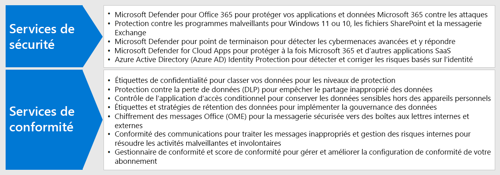
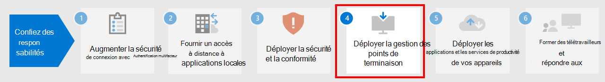

# Étape 3 : déployer la sécurité et la conformité pour les travailleurs distants

Pour les employés à distance, dont certains ne sont jamais ou que très rarement au bureau, la sécurité et la conformité constituent un élément important de la solution globale. Toutes leurs communications se produisent sur Internet au lieu d’être limitées à un intranet d’organisation. 

Vos employés et vous-même pouvez accomplir différentes tâches pour rester productifs tout en réduisant les risques en matière de cyber-sécurité et en respectant les réglementations internes ainsi que les réglementations relatives aux données.

Le travail à distance nécessite les éléments suivants en matière de sécurité et de conformité :

- Accès contrôlé aux applications de productivité utilisées par les employés distants, par exemple Microsoft Teams 
- Accès contrôlé et protection des données que les employés à distance créent et utilisent, telles que les conversations ou les fichiers partagés
- Protection des appareils Windows 10 contre les programmes malveillants et les autres types de cyberattaques
- Protection des courriers électroniques, des fichiers et des sites avec un étiquetage cohérent pour les niveaux de confidentialité et de protection
- Prévention des fuites d’informations
- Respect des réglementations régionales relatives aux données

Voici les fonctionnalités de Microsoft 365 qui fournissent des services de sécurité et de conformité aux travailleurs à distance.

## Sécurité

Protégez vos applications et données grâce aux fonctionnalités de sécurité de Microsoft 365.

| Fonctionnalité | Pourquoi en ai-je besoin ? | Licence |
|:-------|:-----|:-------|
| Microsoft Defender pour Office 365 | Protégez vos applications et données Microsoft 365 (par exemple, messages électroniques, documents Office et outils de collaboration) contre les attaques.    Microsoft Defender pour Office 365 recueille et analyse les signaux de vos applications afin de détecter, examiner et corriger les risques de sécurité. Elle protège également votre organisation contre les menaces posées par les e-mails, les liens (URL) et les outils de collaboration. Il offre également des outils automatisés d’évaluation et de configuration de client pour des mesures de sécurité strictes et standard. | Microsoft 365 E3 ou E5 | 
| Protection contre les programmes malveillants | ‎L’antivirus Microsoft Defender et Device Guard fournissent une protection contre les programmes malveillants basée sur l’appareil.    SharePoint‎ Online analyse automatiquement les chargements de fichiers pour détecter les programmes malveillants connus. ‎   Exchange Online Protection‎ (‎EOP‎) sécurise les boîtes aux lettres cloud. | Microsoft 365 E3 ou E5 |
| Microsoft Defender pour point de terminaison | Protégez les appareils de votre organisation contre les cyber-menaces et les violations de données. Détectez, examinez et répondez aux menaces avancées. | Microsoft 365 E5 |
| Cloud App Security | Protégez vos services cloud (Microsoft 365 et autres applications SaaS) contre les attaques. | Microsoft 365 E5 ou licences de sécurité d’application cloud individuelles |
| Azure AD Identity Protection  | Automatisez la détection et la correction des risques basés sur l’identité.   Créez des stratégies d’accès conditionnel basées sur le risque qui requièrent l’authentification multifacteur (MFA) pour les connexions à risque. | Microsoft 365 E5 ou E3 avec les licences Azure AD Premium P2 |
||||

Si vous souhaitez en savoir plus, veuillez consulter la rubrique [12 premières tâches pour les équipes de sécurité qui prennent en charge le travail à domicile](../security/top-security-tasks-for-remote-work.md).

## Conformité

Respectez les stratégies internes ou les exigences réglementaires avec ces fonctionnalités de conformité de Microsoft 365.

| Fonctionnalité | Pourquoi en ai-je besoin ? | Licence |
|:-------|:-----|:-------|
| Étiquettes de confidentialité | Classifiez et protégez les données de votre organisation sans entraver la productivité des utilisateurs ni leur capacité à collaborer en plaçant des étiquettes avec différents niveaux de protection sur les messages électroniques, les fichiers et les sites. | Microsoft 365 E3 ou E5 |
| Protection contre la perte de données (DLP) | Détectez, signalez et bloquez le partage risqué, accidentel ou inapproprié, tel que le partage de données contenant des informations personnelles, à la fois en interne et en externe. | Microsoft 365 E3 ou E5 | 
| Contrôle d’application d’accès conditionnel | Empêchez le téléchargement de données sensibles sur les appareils personnels des utilisateurs. | Microsoft 365 E3 ou E5 |
| Étiquettes et stratégies de rétention des données | Mettez en place des contrôles de gouvernance des informations, tels que la durée de conservation des données ainsi que des exigences sur le stockage de données personnelles sur les clients, pour vous conformer aux stratégies de votre organisation ou aux réglementations relatives aux données. | Microsoft 365 E3 ou E5 |
| Chiffrement des messages Office (OME) | Envoyez et recevez entre des personnes à l’intérieur et à l’extérieur de votre organisation des messages électroniques chiffrés qui contiennent des données réglementées, telles que des données personnelles relatives aux clients. | Microsoft 365 E3 ou E5 |
| Gestionnaire de conformité | Gérez les activités de conformité réglementaire liées aux services cloud Microsoft avec cet outil d’évaluation des risques basé sur les flux de travail dans le portail d’approbation de services Microsoft. | Microsoft 365 E3 ou E5 |
| Gestionnaire de conformité | Obtenez un score global concernant votre configuration de conformité actuelle avec des recommandations pour l’améliorer dans le centre de conformité Microsoft 365. | Microsoft 365 E3 ou E5 |
| Conformité des communications  | Détectez, capturez et prenez des actions de correction pour les messages inappropriés au sein de votre organisation. | Microsoft 365 E5 ou Microsoft 365 E3 avec les modules complémentaires de conformité ou de gestion des risques internes |
| Gestion des risques internes |  Détectez, examinez et agissez sur des risques malveillants et involontaires au sein de votre organisation. Microsoft 365 peut détecter ces types de risque, même lorsqu’un employé utilise un appareil non géré. | Microsoft 365 E5 ou Microsoft 365 E3 avec les modules complémentaires de conformité ou de gestion des risques internes |
||||

Si vous souhaitez en savoir plus, veuillez consulter la rubrique [Tâches rapides pour démarrer avec la conformité Microsoft 365](../compliance/compliance-quick-tasks.md).

## Résultats de l’étape 3

Pour vos employés à distance, vous avez implémenté les éléments suivants :

- Sécurité
  - Accès contrôlé aux applications et aux données utilisés par les employés à distance pour communiquer et collaborer
  - Protection contre les programmes malveillants pour les données de services cloud, les courriers électroniques et les appareils Windows 10 
- Conformité
  - Étiquetage cohérent pour les niveaux de confidentialité et de protection
  - Stratégies de prévention des fuites d’informations
  - Respect des réglementations régionales relatives aux données

## Étape suivante

Poursuivez avec l’[étape 4](empower-people-to-work-remotely-manage-endpoints.md) pour gérer vos appareils, PC et autres points de terminaison.
