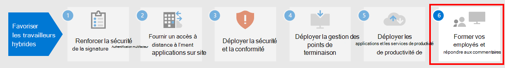

# Étape 5 : déployer les applications et les services de productivité des travailleurs à distance

Pour être productifs, les employés doivent communiquer et collaborer les uns avec les autres. Ils doivent pouvoir se réunir, discuter par voie vocale ou textuelle, créer du contenu, partager des informations et des fichiers, échanger des messages électroniques et gérer les calendriers et les tâches. Microsoft 365 fournit des services cloud pour toutes ces fonctions essentielles :

| Fonction TI | Composants de Microsoft 365 | Description |
|:-------|:-----|:-------|
| Services de messagerie | Exchange Online | Messagerie Exchange et gestion des calendriers, des contacts et des tâches avec le client Outlook. |
| Conversation d’entreprise, protocole voix sur IP (VOIP) et collaboration en équipe | Microsoft Teams | Maintenez le contact entre vos employés, alors qu’ils doivent travailler séparément grâce à un centre commun de communication pour les réunions, les conversations et le stockage de fichiers pour l’organisation et les départements, mais aussi pour les petites équipes et les particuliers. |
| Sites intranet, collaboration sur des documents | SharePoint et OneDrive | Stocker et collaborer sur des fichiers dans un navigateur web ou au sein de Teams. |
| Applications Office de bureau et appareil mobile | Microsoft 365 Apps | Crez de contenu ou collaborez sur du contenu existant avec les versions de Word, PowerPoint, Excel et Outlook, installées sur votre ordinateur local, et qui reçoivent des mises à jour de fonctionnalité et de sécurité régulières. |
||||

## Rester en contact grâce à Microsoft Teams

Teams avec Microsoft Teams permet à votre organisation de discuter, de se rencontrer, d’appeler et de collaborer au même endroit. Des millions de personnes travaillent chaque jour avec des équipes, car il rassemble tout ce dont vous avez besoin pour travailler sur site ou à distance dans un hub pour le travail d’équipe. 

Pour obtenir des instructions détaillées, voir [Prise en charge des travailleurs à distance avec Microsoft Teams](/microsoftteams/support-remote-work-with-teams). 

Regardez les webdiffusions [Permettre le travail hybride avec Microsoft Teams](https://resources.techcommunity.microsoft.com/enabling-hybrid-work/) pour obtenir des instructions et des démonstrations sur l’utilisation de Teams pour le travail hybride.

### Chat et conversations

Les chats et les conversations thématiques sont au cœur de Teams, avec la prise en charge des conversations à deux et des chats et conversations de groupe. Les télétravailleurs peuvent partager des informations, des opinions et leur personnalité en utilisant des images, des autocollants et des emojis dans des discussions de groupe ou des messages individuels.

### Réunions et conférences 

Teams vous permet de gérer les communications et le partage d’informations avec les travailleurs hybrides, en particulier pour les réunions qui prennent en charge jusqu’à 250 personnes. Les réunions dans Teams permettent de mettre en place des réunions interactives et collaboratives, avec des personnes internes ou externes à votre organisation. Les travailleurs à distance peuvent utiliser les réunions Teams pour les activités quotidiennes, notamment pour faire le point régulièrement sur les projets, pour retrouver leurs collègues, pour les séances de brainstorming ainsi que pour faciliter les conversations avec les clients. 

### Appel

Teams prend en charge les appels VoIP directs entre les utilisateurs, et même avec d’autres organisations, en utilisant fédération. Il utilise les mêmes codecs que les réunions et offre un excellent son dans le monde entier sans frais PSTN supplémentaires. Certains utilisateurs peuvent toutefois avoir besoin d’un numéro de téléphone dédié pour prendre des appels externes lorsqu’ils travaillent sur site à distance. Teams peut fournir un service de téléphonie en ligne pour permettre à ces utilisateurs de passer et recevoir des appels téléphoniques.

### Applications et flux de travail

Teams fournit une plateforme pour les applications et les flux de travail, qui est accessible depuis les versions de bureau, web et mobile de Teams. Teams fournit des centaines d’applications, publiées par Microsoft et par des tiers, pour impliquer les utilisateurs, soutenir la productivité et intégrer les services commerciaux couramment utilisés dans Teams. Les utilisateurs et les administrateurs peuvent également créer des applications personnalisées et des flux de travail automatisés pour Teams à l’aide des outils de développement low-code Power Apps et Power Automate.

Les applications et les flux de travail permettent aux travailleurs hybrides d’être plus productifs dans Teams, en collectant et partageant des informations essentielles, en automatisant les tâches répétitives et en leur permettant de converser avec un robot interactif. Le fait d’épingler des applications à un canal ou à la barre de l’application Teams est un excellent moyen pour les utilisateurs d’accéder facilement à ces applications dans un espace pertinent. Les administrateurs, eux, peuvent épingler des applications pour sensibiliser les utilisateurs et promouvoir les applications qui doivent être utilisées.

## Messagerie Exchange et gestion des calendriers, des contacts et des tâches avec Exchange Online et Outlook

Avec Outlook, les travailleurs hybrides peuvent rester connectés et organisés avec le courrier électronique, les calendriers, les contacts, les tâches et bien plus encore, le tout, dans un seul et même endroit. Outlook vous permet de rester informé et de hiérarchiser votre journée en fonction de ce qui est important pour vous. Outlook vous permet de partager des pièces jointes directement à partir de OneDrive, de planifier et de participer à des réunions Teams, d’afficher et de partager des calendriers, et de fournir des autorisations de délégué. Le fait de connaître les évènements à venir, aussi bien pour leurs engagements professionnels que personnels, et ce qui nécessite leur attention, permet aux travailleurs hybrides de se concentrer sur les aspects les plus importants. Outlook permet aux travailleurs hybrides de gérer leur temps et de trouver facilement ce dont ils ont besoin, notamment les fichiers, les autres membres de l’organisation et bien plus encore. 

Consultez [cet article](../security/office-365-security/secure-email-recommended-policies.md) sur les stratégies recommandées d’identité et d’accès aux appareils pour vous aider à sécuriser les e-mails d’une organisation, ainsi que les clients d’e-mail qui prennent en charge l’authentification moderne et l’accès conditionnel.

## Stockez et collaborez sur des fichiers avec SharePoint et OneDrive

Pour la collaboration de contenu, les travailleurs hybrides peuvent utiliser les dossiers SharePoint et OneDrive comme emplacement central dans le cloud pour stocker et partager des fichiers, co-créer, communiquer et collaborer. Les employés à distance peuvent travailler en toute sécurité, de n’importe quel endroit, à partir d’un navigateur web, de Teams et des applications Office.

Vous devrez peut-être migrer vos documents vers SharePoint ou OneDrive à partir de :

- [Sites d’équipes SharePoint Server](/sharepointmigration/sp-teams-sites-migration-guide)
- [MySites](/sharepointmigration/mysites-to-onedrive-migration-guide)
- [Partages de fichiers](/sharepointmigration/fileshare-to-odsp-migration-guide)
- [Box](/sharepointmigration/box-to-onedrive-and-sharepoint-migration-guide)

Pour protéger SharePoint et OneDrive, consultez [cet article](../security/office-365-security/sharepoint-file-access-policies.md). Vous y trouverez les stratégies d’accès aux identités et aux appareils recommandées.

## Créez et collaborez sur du contenu avec les applications Microsoft 365

Les applications Microsoft 365 constituent l’expérience Office la plus productive et sécurisée pour les entreprises, ce qui permet aux utilisateurs de collaborer en toute transparence, en tout lieu et à tout moment. Les employés à distance peuvent collaborer sur un document avec plusieurs personnes en même temps, voir les modifications en temps réel, et co-créer des documents avec d’autres personnes en utilisant un ordinateur portable, un PC ou un appareil mobile.

Pour plus d’informations, voir le [Guide de déploiement des Applications Microsoft 365](/deployoffice/deployment-guide-microsoft-365-apps).

## Ressources techniques dédiées aux administrateurs pour les applications et les services de productivité

- [Prise en charge des travailleurs à distance avec Microsoft Teams](/microsoftteams/support-remote-work-with-teams)
- [Action du travail hybride avec les émissions vidéo Microsoft Teams](https://resources.techcommunity.microsoft.com/enabling-hybrid-work/)
- [Kit de réussite des clients de Microsoft Teams](https://www.microsoft.com/download/details.aspx?id=54244)
- [Outils pour favoriser l’adoption de Teams](/microsoftteams/adopt-tools-and-downloads) 
- [Créer une stratégie de gestion des modifications pour Microsoft Teams](/MicrosoftTeams/change-management-strategy)
- [Teams avec trois niveaux de protection](configure-teams-three-tiers-protection.md)

## Ressources de formation dédiées aux utilisateurs pour les applications et les services de productivité

- [Former vos utilisateurs sur Office et Microsoft 365](https://support.microsoft.com/office/train-your-users-on-office-and-microsoft-365-7cba3c97-7f19-46ed-a1c6-763971a26c27)
- [Utiliser Office pour le web](https://support.microsoft.com/office/get-started-with-office-for-the-web-in-microsoft-365-5622c7c9-721d-4b3d-8cb9-a7276c2470e5)

## Étape suivante

Passez à l’[Étape 6](empower-people-to-work-remotely-train-monitor-usage.md) pour former vos utilisateurs et surveiller leur réussite.