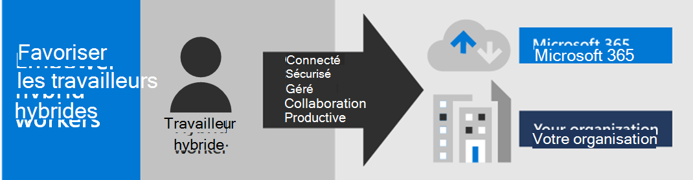

# Confier des responsabilités aux travailleurs à distance avec Microsoft 365

Votre entreprise devra sans doute autoriser vos employés à bénéficier d’un accès sécurisé aux informations, outils et ressources en local et sur le cloud de votre organisation depuis leur domicile. Permettre aux employés de travailler à distance est important pour de nombreuses organisations :

- Économisez sur l’espace de bureau.
- Embaucher et retenir les travailleurs qui ne sont pas disposés à se déplacer.
- Réduire les déplacements des travailleurs, en leur laissant plus de temps pour être productifs et pour des activités de réduction du stress en dehors du travail.

Microsoft 365 offre les fonctionnalités qui permettent à vos employés de travailler à distance.

Regardez cette vidéo de présentation du processus de déploiement.
 
> [!VIDEO https://www.microsoft.com/videoplayer/embed/RE4F1af]

Cette solution fournit ces fonctionnalités clés.

- Connecté

  Où que vous soyez et à tout moment, les travailleurs distants peuvent accéder aux éléments suivants : 

  - Services et données dans le cloud de votre abonnement Microsoft 365. 

  - Ressources d’organisation, telles celles proposées par les centres de données d’application locaux.

- Sécurisé

  Les connexions sont sécurisées par une authentification multifacteur (MFA) et les fonctionnalités de sécurité intégrées de Microsoft 365 et Windows 10 protègent contre les logiciels malveillants, les attaques malveillantes et la perte de données.

- Géré

  Les appareils de votre employé distant peuvent être gérés à partir du cloud avec les paramètres de sécurité, les applications autorisées et la conformité avec l’état d’intégrité du système.

- Collaboration et productivité

  Vos employés distants peuvent être productifs en local de façon très collaborative avec :

  - Réunions en ligne et sessions de conversation avec Teams. 

  - Les espaces de travail partagés pour le stockage de fichiers dans le Cloud avec une accessibilité globale et une collaboration en temps réel avec SharePoint et OneDrive.

  - Les tâches partagées et flux de travail pour répartir le travail et accomplir les tâches. 

Pour une expérience de connexion transparente, vos comptes d’utilisateur Services de domaine Active Directory (AD DS) locaux doivent être synchronisés avec Azure Active Directory (Azure AD). Pour protéger vos appareils Windows 10, ils doivent être inscrits dans Intune. Voici un aperçu général de l’infrastructure.

Pour activer les fonctionnalités de Microsoft 365 pour vos télétravailleurs, utilisez ces fonctionnalités Microsoft 365.

| Fonctionnalité | Description | Licence |
|:-------|:-----|:-------|
| Authentification multifacteur appliquée avec paramètres de sécurité par défaut   | Protégez-vous contre les identités compromises et les appareils en imposant une deuxième forme d’authentification pour les connexions. La sécurité par défaut nécessite l’authentification multifacteur pour tous les comptes d’utilisateurs.   | Microsoft 365 E3 ou E5 |
| Authentification multifacteur appliquée avec accès conditionnel| Requiert une authentification multifacteur sur la base des propriétés de la connexion avec les stratégies d’accès conditionnel.    | Microsoft 365 E3 ou E5 | 
| Authentification multifacteur appliquée avec accès conditionnel basé sur les risques   | Requiert une authentification multifacteur basée sur le risque de connexion de l’utilisateur avec Microsoft Defender pour identité. | Microsoft 365 E5 ou E3 avec les licences Azure AD Premium P2 | 
| Réinitialisation du mot de passe libre-service (SSPR)    | Autoriser vos utilisateurs à réinitialiser ou déverrouiller leur mot de passe ou leur compte.  | Microsoft 365 E3 ou E5 |
| Proxy d’application Azure AD    | Fournir un accès à distance sécurisé pour les applications web hébergées sur les serveurs intranet.   | Nécessite un abonnement Azure payé séparément |
| VPN point à site Azure   | Créer une connexion sécurisée à partir de l’appareil d’un employé distant sur votre intranet via un réseau virtuel Azure.   | Nécessite un abonnement Azure payé séparément |
| Windows Virtual Desktop   | Prise en charge de travailleurs distants qui peuvent uniquement utiliser leurs appareils personnels et non gérés avec des bureaux virtuels exécutés dans Azure. | Nécessite un abonnement Azure payé séparément |
| Services Bureau à distance (RDS) | Autoriser les employés à se connecter à des ordinateurs Windows sur votre intranet. | Microsoft 365 E3 ou E5 | 
| Passerelle des services Bureau à distance   | Chiffrer les communications et empêcher les hôtes RDS d’être directement exposés à Internet. | Nécessite des licences Windows Server distinctes |
| Microsoft Intune | Gérer les appareils et les applications.   | Microsoft 365 E3 ou E5 | 
| Configuration Manager | Gérer les installations, mises à jour et paramètres logiciels de vos appareils | Nécessite des licences de gestionnaire de configuration distinctes |
| Analyses du bureau | Déterminer la disponibilité des mises à jour de vos clients Windows.   | Nécessite des licences de gestionnaire de configuration distinctes |
| Windows Autopilot | Installer et configurer de nouveaux appareils Windows 10 à des fins productives.   | Microsoft 365 E3 ou E5 |
| Microsoft Teams, Exchange Online, SharePoint Online et OneDrive, Microsoft 365 Apps, Microsoft Power Platform et Yammer | Créer, communiquer et collaborer. | Microsoft 365 E3 ou E5 |
||||

Pour plus d’informations sur la sécurité et la conformité, consultez [Déployer la sécurité et la conformité des travailleurs à distance.](empower-people-to-work-remotely-security-compliance.md)

 Pour un résumé de deux pages de cette solution, voir l’affiche [Confier des responsabilités aux télétravailleurs](../downloads/empower-remote-workers.pdf).

Vous pouvez également télécharger cette affiche au format [PDF](https://github.com/MicrosoftDocs/microsoft-365-docs/raw/public/microsoft-365/downloads/empower-remote-workers.pdf) et l’imprimer sur du papier au format lettre, légal ou tabloïd (11 x 17).

Procédez comme suit pour sécuriser et optimiser l’accès aux serveurs et aux services cloud de votre organisation, puis optimiser la productivité des télétravailleurs.

1. [Augmenter la sécurité de connexion avec l’authentification multifacteur](empower-people-to-work-remotely-secure-sign-in.md)
2. [Fournir l’accès à distance aux applications et services locaux](empower-people-to-work-remotely-remote-access.md)
3. [Déployer les services de sécurité et de conformité](empower-people-to-work-remotely-security-compliance.md)
4. [Déployer la gestion des points de terminaison pour vos appareils, PC et autres points de terminaison](empower-people-to-work-remotely-manage-endpoints.md)
5. [Déployer les applications et les services de productivité des travailleurs à distance](empower-people-to-work-remotely-teams-productivity-apps.md)
6. [Former des télétravailleurs et répondre aux commentaires sur l’utilisation](empower-people-to-work-remotely-train-monitor-usage.md)

Si vous souhaitez en savoir plus sur les informations Microsoft les plus récentes relatives à la prise en charge des travailleurs à distance, consultez [Activation du travail hybride avec le site de Microsoft Teams](https://resources.techcommunity.microsoft.com/enabling-hybrid-work/).

Pour découvrir comment une organisation multinationale représentative, bien que fictive, a responsabilisé ses employés à distance, consultez [Réponse COVID-19 et infrastructure de Contoso pour le travail à distance et sur site](contoso-remote-onsite-work.md).
