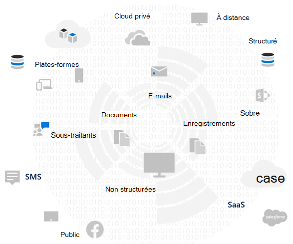

# Évaluer les risques de confidentialité des données et identifier les éléments sensibles à l’Microsoft 365

L’évaluation des réglementations et des risques liés à la confidentialité des données auxquels votre organisation est soumise est une première étape essentielle avant d’implémenter les actions d’amélioration connexes, y compris celles réalisables avec les fonctionnalités et les services Microsoft 365.

## Réglementations potentiellement applicables en matière de confidentialité des données

Pour obtenir une bonne référence sur l’infrastructure réglementaire plus large pour les réglementations en matière de confidentialité des données, voir le portail d’approbation des services [Microsoft](https://servicetrust.microsoft.com/) et la série d’articles sur le règlement général sur la protection des données [(R GDPR),](/compliance/regulatory/gdpr)ainsi que d’autres documents sur les réglementations que vous pouvez être soumis à votre secteur ou région.

### RGPD

Le R GDPR, le plus connu et le plus cité des réglementations en matière de confidentialité des données, régule la collecte, le stockage, le traitement et le partage de toutes les données personnelles liées à une personne naturelle identifiée ou identifiable qui réside dans l’Union européenne (UE).

Conformément à l’article 4 du R GDPR :

- « données personnelles » signifie toute information relative à une personne naturelle identifiée ou identifiable ( « personne objet de données » ; une personne physique identifiable est une personne qui peut être identifiée, directement ou indirectement, en particulier par référence à un identificateur tel qu’un nom, un numéro d’identification, des données de localisation, un identificateur en ligne ou à un ou plusieurs facteurs spécifiques à l’identité physique, génétique, génétique, génétique, économique, culturelle ou sociale de cette personne physique.

### ISO 27001

Le respect d’autres normes telles que la norme ISO 27001 a également été reconnu par plusieurs autorités de surveillance européennes comme un proxy valide d’intention au sein du spectre des personnes, des processus et des technologies. Les normes qu’il spécifie chevauchent et respectent les mécanismes de protection pilotés par iso-27001 peuvent être considérées comme un proxy qui remplit certaines obligations de confidentialité dans certaines circonstances.

### Autres réglementations en matière de confidentialité des données

D’autres réglementations importantes en matière de confidentialité des données spécifient également les exigences relatives à la gestion des données personnelles.

Aux États-Unis, il s’agit notamment du[CCPA](/compliance/regulatory/ccpa-faq)(California Consumer Protection Act), HIPAA-HITECH (Loi américaine sur la confidentialité des soins de santé) et de la loi GlBA (Leach Bliley Act). D’autres réglementations spécifiques à l’état sont également en place ou en cours de développement.

Dans le monde entier, d’autres exemples incluent la loi d’implémentation du RGPD (National GDPR Implementation Act) allemande, le LGPD (Brazil Data Protection Act) et bien d’autres encore.

## Mappage des réglementations Microsoft 365 catégories de contrôle technique

De nombreuses réglementations liées à la confidentialité des données ont des exigences qui se chevauchent. Vous devez donc comprendre les réglementations à laquelle elles sont soumises avant de développer un schéma de contrôle technique.

Pour référence ultérieure dans les articles de cette solution globale, ce tableau fournit des extraits d’un échantillonnage des réglementations en matière de confidentialité des données.

|Règlement|Article/section|Extrait|Catégories de contrôle technique applicables|
|---|---|---|---|
|RGPD|Article 5(1)(f)|Les données personnelles doivent être traitées d’une manière qui garantit la sécurité appropriée des données à caractère personnel, y compris la protection contre le traitement non autorisé ou illégal et contre les pertes, destructions ou dommages accidentels, à l’aide de mesures techniques ou organisationnelles appropriées (intégrité et confidentialité).|(Tous)   Identité   Appareil   Protection contre les menaces   Protéger les informations   Gérer les informations   Découvrir et répondre|
||Article (32)(1)(a)|En tenant compte de l’état de l’art, des coûts de mise en œuvre et de la nature, de l’étendue, du contexte et des objectifs du traitement, ainsi que du risque de probabilité et de gravité variables pour les droits et libertés des personnes physiques, le responsable du traitement et le sous-traitant doivent mettre en œuvre des mesures techniques et organisationnelles appropriées pour garantir un niveau de sécurité approprié au risque,  y compris, le cas échéant : (a) la pseudonymisation et le chiffrement des données personnelles.|Protéger les informations|
||Article (13)(2)(a)|"... le responsable du traitement doit, au moment où les données à caractère personnel sont obtenues, fournir à la sujet des données les informations supplémentaires suivantes nécessaires pour garantir un traitement équitable et transparent : (a) la période pendant laquelle les données à caractère personnel seront stockées, ou si cela n’est pas possible, les critères utilisés pour déterminer cette période.|Gérer les informations|
||Article (15)(1)(e)|La objet de données a le droit d’obtenir auprès du responsable du traitement la confirmation que des données personnelles la concernant sont en cours de traitement, et dans ce cas, l’accès aux données à caractère personnel et les informations suivantes : (e) l’existence du droit de demander au responsable du traitement la rectification ou l’effacement de données à caractère personnel ou la restriction du traitement des données à caractère personnel concernant la sujet des données ou de s’y objecter traitement|Découvrir et répondre|
|LGPD|Article 46|Les agents de traitement adoptent des mesures de sécurité, techniques et administratives capables de protéger les données personnelles contre les accès non autorisés et les situations accidentelles ou illégales de destruction, perte, modification, communication ou tout type de traitement inapproprié ou illégal.|Protéger les informations   Gérer les informations   Découvrir et répondre|
||Article 48|Le responsable du traitement doit informer l'autorité nationale et la personne concernée de la survenance d'un incident de sécurité susceptible de créer des risques ou des dommages importants pour les personnes concernées.|Découvrir et répondre|
|HIPPA-HITECH|45 CFR 164.312(e)(1)|Implémenter des mesures de sécurité techniques pour se prémunir contre l'accès non autorisé aux informations médicales électroniques protégées qui sont transmises sur un réseau de communication électronique.|Protéger les informations|
||45 C.F.R. 164.312(e)(2)(ii)|Implémenter un mécanisme de chiffrement des informations médicales électroniques protégées chaque fois que cela est jugé approprié.|Protéger les informations|
||45 CFR 164.312(c)(2)|Mettre en œuvre des mécanismes électroniques pour confirmer que les informations médicales électroniques protégées n'ont pas été altérées ou détruites de manière non autorisée.|Gérer les informations|
||45 CFR 164.316(b)(1)(i)|Si une action, une activité ou une évaluation est requise par cette sous-partie pour être documentée, conservez un enregistrement écrit (qui peut être électronique) de l’action, de l’activité ou de l’évaluation|Gérer les informations|
||45 CFR 164.316(b)(1)(ii)|Conserver la documentation requise par le paragraphe (b)(1) du présent article pendant 6 ans à compter de la date de sa création ou de la dernière date à laquelle elle a été en vigueur, si celle-ci est postérieure.|Gérer les informations|
||45 C.F.R. 164.308(a)(1)(ii)(D)|Implémenter des procédures pour passer régulièrement en revue les enregistrements de l’activité du système d’information, tels que les journaux d’audit, les rapports d’accès et les rapports de suivi des incidents de sécurité|Découvrir et répondre|
||45 C.F.R. 164.308(a)(6)(ii)|Identifier et répondre aux incidents de sécurité connus ou suspects ; atténuer, dans la mesure du possible, les effets néfastes des incidents de sécurité qui sont connus de l'entité couverte ou de l'associé commercial ; et documenter les incidents de sécurité et leurs résultats.|Découvrir et répondre|
||45 C.F.R. 164.312(b)|Implémenter des mécanismes matériels, logiciels et procédural qui enregistrent et examinent l’activité dans les systèmes d’information qui contiennent ou utilisent des informations de santé électroniques protégées.|Découvrir et répondre|
|CCPA|1798.105(c)|Une entreprise qui reçoit une demande vérifiable d’un consommateur pour supprimer ses informations personnelles conformément à la sous-section (a) du présente article supprime les informations personnelles du consommateur de ses enregistrements et demande à tous les fournisseurs de services de supprimer les informations personnelles du consommateur de ses enregistrements.|Découvrir et répondre|
||1798.105(d)|(exceptions à 1798.105(c)   Une entreprise ou un fournisseur de services ne doit pas être tenu de se conformer à la demande d’un consommateur de supprimer ses informations personnelles s’il est nécessaire que l’entreprise ou le fournisseur de services conserve les informations personnelles du consommateur afin de : (reportez-vous à la réglementation actuelle pour obtenir des informations supplémentaires).|Découvrir et répondre|
|||||

> [!IMPORTANT]
> Cette liste n’est pas exhaustive. Reportez-vous [au Gestionnaire](../compliance/compliance-manager.md) de conformité ou à votre conseiller juridique ou de conformité pour plus d’informations sur l’applicabilité des sections mentionnées dans les catégories de contrôle technique répertoriées.

## Connaissance de vos données

Quelles que soient les réglementations qui vous sont soumises, où différents types de données utilisateur à l’intérieur et à l’extérieur de votre organisation interagissent avec vos systèmes sont tous des facteurs importants qui peuvent avoir un impact sur votre stratégie globale de protection des données personnelles, sous réserve des réglementations gouvernementales et industrielles qui s’appliquent à votre organisation. Cela inclut l’endroit où les données personnelles sont stockées, leur type, leur quantité et dans quelles circonstances elles ont été collectées.

### Portabilité des données

Les données se déplacent également au fil du temps à mesure qu’elles sont traitées, affinées et que d’autres versions en sont dérivées. Une capture instantanée initiale n’est jamais suffisante. Il doit y avoir un processus continu pour connaître vos données. Cela représente l’un des plus grands défis pour les grandes organisations qui gèrent des volumes importants de données personnelles. Les organisations qui ne s’adressent pas au problème « connaissez vos données » peuvent potentiellement se retrouver avec des risques très élevés et des amendes éventuelles de la part des organismes de réglementation.

### Où se trouve les données personnelles

Pour répondre aux réglementations en matière de confidentialité des données, vous ne pouvez pas vous baser sur des notions générales sur l’endroit où vous pensez que des données personnelles peuvent exister, maintenant ou à l’avenir. Les réglementations en matière de confidentialité des données exigent que les organisations prouvent qu’elles connaissent l’endroit où se trouve régulièrement les données personnelles. Il est donc important de prendre un instantané initial de toutes vos sources de données pour le stockage possible d’informations personnelles, y compris votre environnement Microsoft 365, et d’établir des mécanismes de surveillance et de détection en continu.

Si vous n’avez pas déjà évalué votre préparation globale et les risques associés aux réglementations en matière de confidentialité des données, utilisez l’infrastructure en trois étapes suivante pour commencer.

> [!NOTE]
> Cet article et son contenu ne sont pas destinés à prendre la place des services d’avis juridiques. Il fournit simplement des conseils de base et des liens vers des outils qui peuvent vous être utiles lors des premières étapes de votre évaluation.

## Étape 1 : Développer une compréhension de base des scénarios de données personnelles de votre organisation

Vous devez évaluer l’exposition au risque de confidentialité des données en fonction du type de données personnelles qu’elle gère actuellement, de l’endroit où elle est stockée, des contrôles de protection qui lui sont placés, de la façon dont son cycle de vie est géré et des personnes qui y ont accès.

Comme point de départ, il est important d’inventorier les types de données personnelles qui existent dans Microsoft 365 environnement. Utilisez les catégories suivantes :

- Données des employés requises pour effectuer des fonctions professionnelles au quotidien
- Données de l’organisation concernant ses clients commerciaux, ses partenaires et d’autres relations dans le scénario B2B (business-to-business)
- Données de l’organisation sur les consommateurs qui fournissent des informations aux services en ligne que l’organisation gère dans le scénario B2C (business-to-customer)

Voici un exemple des différents types de données pour les services classiques d’une organisation.

La plupart des données personnelles soumises à la réglementation sur la confidentialité des données sont généralement collectées et stockées en dehors des Microsoft 365. Toutes les données personnelles provenant d’applications web ou mobiles grand public doivent avoir été exportées de ces applications vers Microsoft 365 afin d’être soumises à un examen de confidentialité des données au sein de Microsoft 365.

L’exposition à la confidentialité des Microsoft 365 données peut être plus limitée par rapport à vos applications web et systèmes CRM, que cette solution ne prend pas en compte.

Il est également important de réfléchir aux défis courants suivants en matière de conformité de la confidentialité des données lors de l’évaluation de votre profil de risque :

- **Distribution des données personnelles.** Quelle est la diffusion des informations sur un sujet donné ? Est-il suffisamment connu pour convaincre les organismes de réglementation que des contrôles appropriés sont en place ? Peut-il être examiné et corrigé si nécessaire ?
- **Protection contre l’exfiltration.** Comment protéger les données personnelles d’un type ou d’une source donné contre les compromissons et comment y répondre si c’était le cas ?
- **Protection et risque.** Quels mécanismes de protection des informations sont appropriés par rapport au risque et comment maintenir la continuité et la productivité de l’entreprise et minimiser l’impact sur les utilisateurs finaux si l’intervention de l’utilisateur final est nécessaire ? Par exemple, la classification ou le chiffrement manuel doit-il être utilisé ?
- **Rétention des données personnelles.** Combien de temps les informations contenant des données personnelles doivent-elles être conservées pour des raisons professionnelles valides et comment éviter les pratiques de conservation indéfinies passées, équilibrées avec les besoins de rétention pour la continuité de l’activité ?
- **Gestion des demandes des personnes qui traitent des données.** Quels mécanismes seront nécessaires pour gérer les demandes des personnes qui traitent des données (DSR) et les mesures correctives, telles que l’anonymisation, la suppression et la suppression ?
- **Surveillance et rapports continus.** Quels types de techniques d’analyse, d’investigation et de rapport au quotidien sont disponibles pour les différents types de données et sources ?
- **Limitations relatives au traitement des données.** Existe-t-il des restrictions sur l’utilisation des données pour les informations collectées ou stockées par le biais de ces méthodes que l’organisation doit refléter dans les contrôles de confidentialité ? Par exemple, l’engagement que les données personnelles ne seront pas utilisées par le personnel commercial peut obliger votre organisation à mettre en place des mécanismes pour empêcher le transfert ou le stockage de ces informations dans les systèmes associés à l’organisation commerciale.

### Données des employés requises pour effectuer des fonctions professionnelles au quotidien

Par nature, les organisations doivent collecter des données sur les employés à des fins d’identité électronique et de ressources humaines, sous réserve de ce qu’elles acceptent dans leurs contrats d’employé. Tant qu’une personne travaille pour une entreprise, ce n’est généralement pas un problème. L’organisation peut mettre en place des mécanismes pour empêcher les acteurs malveillants d’exfiltrer ou de fuiter des données personnelles des employés.

Si une personne quitte une entreprise, les organisations disposent généralement de processus, de procédures et de planifications de rétention et de suppression pour supprimer des comptes d’utilisateurs, désaffecter des boîtes aux lettres et des lecteurs personnels et modifier l’état des employés dans des éléments tels que les systèmes de ressources humaines. En cas de litige, un employé ou une autre partie à une enquête juridique peut avoir des raisons valides d’obtenir des informations sur les données personnelles stockées dans les systèmes de l’organisation. Dans certains cas, cette partie peut demander la suppression ou l’anonymisation de ces données.

Pour répondre à ces besoins, les organisations doivent mettre en place des processus et des procédures qui traitent les besoins de prévention, de recherche et de correction afin de faciliter ces demandes, notant que certaines informations sur un employé peuvent être raisonnablement considérées comme cruciales pour la continuité de l’activité. Par exemple, les informations qu’un individu a écrit un fichier ou a effectué une fonction.

> [!NOTE]
> Pour les techniques d’investigation et de correction des données personnelles dans Microsoft 365, consultez [l’article surveiller et répondre.](information-protection-deploy-monitor-respond.md) Vous pouvez également utiliser des schémas de classification et de protection automatisés pour vous assurer que les données personnelles sont contrôlées à l’intérieur de l’organisation, et empêcher celle-ci de quitter l’organisation dans des situations d’acteurs malveillants. Pour plus [d’informations, voir l’article](information-protection-deploy-protect-information.md) protéger les informations.

### Données de l’organisation concernant ses clients professionnels dans le scénario B2B

La collecte d’informations B2B est également un défi, car votre organisation peut avoir besoin de conserver des enregistrements des noms de clients et des transactions dans ses différents systèmes à des fins de continuité d’activité, tout en protégeant ces informations contre l’exfiltration accidentelle ou malveillante. Tout comme les données des employés, les organisations doivent avoir des stratégies, des procédures et des contrôles techniques en place pour protéger ces données, ainsi que les mettre à l’âge en fonction des planifications de rétention et de suppression définies.

En règle générale, les contrats avec des clients externes, des partenaires et les autres entités avec lesquelles l’organisation fait des affaires auront un langage de gestion de ces données, y compris la protection, la rétention et la suppression pendant et après que l’entité a une relation avec l’organisation.

### Données de l’organisation sur les consommateurs qui fournissent des informations aux services en ligne que l’organisation gère dans le scénario B2C

Cette catégorie est celle que l’on pense le plus à la confidentialité des données, en raison de nombreuses instances publiques de fuite de données client. Cela peut être intentionnel, tel qu’un tiers sous contrat avec le fournisseur, ou involontaire, tel qu’une exfiltration par un acteur malveillant. La protection des données grand public est l’une des principales raisons pour lesquelles l’UE et d’autres personnes ont adopté ces réglementations. Les réglementations en matière de confidentialité des données telles que le R GDPR et le CCPA vous obligent à planifier :

- [Plans d’action](/compliance/regulatory/gdpr-action-plan) [et listes de vérification de préparation sur la responsabilité](/compliance/regulatory/gdpr-arc-Office365)
- [Analyses d’impact sur la protection des données](/compliance/regulatory/gdpr-data-protection-impact-assessments)
- [Notifications de violation](/compliance/regulatory/gdpr-breach-Office365)
- [Demandes des personnes concernées](/compliance/regulatory/gdpr-dsr-Office365)

Si votre organisation ne collecte pas beaucoup de données directement auprès des consommateurs, cette catégorie peut être moins problématique. Toutefois, vous devrez peut-être encore passer en travers des processus décrits dans ces articles pour obtenir la conformité.

### Résumé de l’étape 1

Comprendre votre exposition aux risques et à la réglementation en matière de confidentialité des données est une première étape importante basée sur une compréhension de base des scénarios de données personnelles de votre organisation.

Si vous n’avez pas de données personnelles de consommateurs dans votre environnement Microsoft 365 ou si elle est limitée à certaines parties de l’environnement et que la nécessité d’un contrôle technique est prédicée sur l’exposition des données de type consommateur, ce contrôle technique ne devra peut-être être utilisé que dans les parties à risque élevé de l’environnement, et non partout.

Bien qu’une recommandation d’une organisation externe ou d’un ensemble de contrôles standard, tel que celui du Gestionnaire de conformité dans Microsoft 365, puisse vous aider à informer votre stratégie de contrôle, votre choix d’implémentation doit être piloté par la sensibilisation à l’inventaire des données afin de quantifier votre exposition réelle aux risques.

La plupart des organisations seront exposées à l’un des scénarios ci-dessus. Il est important d’adopter une approche globale de l’évaluation.

## Étape 2 : Évaluer votre préparation pour vous conformer aux réglementations en matière de confidentialité des données

Bien que spécifiques au R GDPR, les questions posées dans l’outil d’évaluation gratuit de [Microsoft R GDPR](https://www.microsoft.com/cyberassessment/en/gdpr/uso365) fournissent un bon départ pour comprendre la préparation globale à la confidentialité des données.

Les organisations soumises à d’autres réglementations en matière de confidentialité des données, telles que le CCPA aux États-Unis ou le LGPD du Brésil, peuvent également bénéficier de l’inventaire de préparation de cet outil en raison de dispositions qui se chevauchent avec le RGPD.

L’évaluation R GDPR se compose des sections suivantes :

|Section|Description|
|:-------|:-----|
|Gouvernance|<ol><li>Votre politique de confidentialité indique-t-elle explicitement quelles informations de données sont traitées ? </li><li>Exécutez-vous régulièrement des analyses d’impact sur la confidentialité (PIA) ? </li><li> Utilisez-vous un outil pour gérer les informations personnelles ? </li><li> Avez-vous l’autorité juridique de mener des activités à l’aide de données personnelles sur une personne donnée ? Suivez-vous le consentement pour les données ? </li><li> Suivez-vous, implémentez et gérez-vous les contrôles d’audit ? Surveillez-vous les fuites de données ? </li></ol>|
|Suppression et notification|<ol><li>Donnez-vous des instructions explicites sur la façon dont les données des utilisateurs sont accessibles ? </li><li> Avez-vous des processus documentés en place pour la gestion du consentement de désint resserrement ? </li><li> Avez-vous un processus de suppression automatique des données ? </li><li> Avez-vous un processus pour valider l’identité lors de l’implication d’un client ? </li></ol>|
|Atténuation des risques et sécurité des informations|<ol><li>Utilisez-vous des outils pour analyser des données non structurées ? </li><li>Tous les serveurs sont-ils à jour et tirez-vous parti des pare-feu pour les protéger ? </li><li>Exécutez-vous des sauvegardes régulières de vos serveurs ? </li><li>Surveillez-vous activement les fuites de données ? </li><li>Chiffrez-vous vos données au repos et en transmission ? </li></ol>|
|Gestion des stratégies|<ol><li>Comment gérez-vous vos règles d’entreprise de liaison (BCR) ? </li><li>Suivez-vous le consentement pour les données ? </li><li> Sur une échelle de 1 à 5, 5 étant entièrement couverte, vos contrats couvrent-ils les classifications de données et les exigences de gestion ? </li><li>Avez-vous et testez-vous régulièrement un plan de réponse aux incidents ? </li><li>Quelle stratégie utilisez-vous pour gérer l’accès ? </li></ol>|
|||

## Étape 3 : Identifier les types d’informations sensibles qui se produisent dans votre environnement Microsoft 365 de données

Cette étape implique l’identification de types d’informations sensibles particuliers soumis à des contrôles réglementaires spécifiques, ainsi que leur occurrence dans votre environnement Microsoft 365.

La recherche de contenu dans votre environnement contenant des données personnelles peut être une tâche formidable, impliquant auparavant une combinaison d’utilisation de la recherche de conformité, de la découverte électronique, de la Advanced eDiscovery, de la DLP et de l’audit.

Avec la nouvelle solution de **classification** des données dans le  Centre d’administration de conformité Microsoft, cela est devenu beaucoup plus facile avec la fonctionnalité Explorateur de contenu, qui fonctionne avec les types d’informations sensibles intégrés ou personnalisés, y compris ceux liés aux données personnelles.

### Types d’informations sensibles

Le Centre d’administration de conformité Microsoft est pré-chargé avec plus de 100 types d’informations sensibles, dont la plupart sont liés à l’identification et à la localisation des données personnelles. Ces types d’informations sensibles intégrés permettent d’identifier et de protéger les numéros de carte de crédit, les numéros de compte bancaire, les numéros de passeport, etc., en fonction des modèles définis par une expression régulière (regex) ou une fonction. Pour en savoir plus, voir [Éléments recherchés par les types d’informations sensibles](../compliance/sensitive-information-type-entity-definitions.md).

Si vous devez identifier et protéger un type régional ou spécifique à l’organisation d’éléments sensibles, comme un format personnalisé pour les ID d’employé ou d’autres informations personnelles non déjà couvertes par un type d’informations sensibles intégré, vous pouvez créer un type d’informations sensibles personnalisé avec les méthodes ci-après :

- PowerShell
- Règles personnalisées avec correspondance exacte des données (EDM)
- Via l’interface utilisateur d’administration du Centre de conformité, comme le souligne l’article Utiliser le Score de conformité et [le Gestionnaire de conformité](information-protection-deploy-compliance.md)

Vous pouvez également personnaliser un type d’informations sensibles intégré existant.

Pour plus d’informations, consultez les articles suivants :

- [Personnaliser un type d’informations sensibles intégré](../compliance/customize-a-built-in-sensitive-information-type.md)
- [En savoir plus sur les types d’informations confidentielles](../compliance/sensitive-information-type-learn-about.md).
- [Créer un type d’informations sensibles personnalisé dans le Centre de Conformité et Sécurité](../compliance/create-a-custom-sensitive-information-type.md)
- [Créer un type d’informations sensibles personnalisé dans l’interface PowerShell du Centre de sécurité et conformité](../compliance/create-a-custom-sensitive-information-type-in-scc-powershell.md)
- [Créez des types d’informations sensibles personnalisés à l’aide d’une classification Exact Data Match.](../compliance/create-custom-sensitive-information-types-with-exact-data-match-based-classification.md)

### Explorateur de contenu

Un outil important qui permet de déterminer l’occurrence  d’éléments sensibles dans votre environnement est le nouvel Explorateur de contenu dans le centre d’administration Microsoft 365 conformité. Il s’agit d’un outil automatisé pour l’analyse initiale et continue de l’intégralité de votre abonnement Microsoft 365 pour l’occurrence des types d’informations sensibles et l’affichage des résultats.

Le nouvel outil Explorateur de contenu vous permet d’identifier rapidement les emplacements des éléments sensibles dans votre environnement, à l’aide de types d’informations sensibles intégrés ou personnalisés. Cela peut impliquer l’établissement d’un processus et la responsabilité d’examiner régulièrement la présence et l’emplacement des éléments sensibles.

Outre les autres étapes mises en évidence dans cet article, cela fournit un point de départ pour identifier l’exposition globale aux risques, la préparation et l’emplacement des éléments sensibles à protéger par le biais de la configuration et de la surveillance Microsoft 365 planifiées.

### Autres méthodes pour identifier les données personnelles dans votre environnement

Outre l’Explorateur de contenu, les organisations ont accès à la fonctionnalité de recherche de contenu pour produire des recherches personnalisées afin de rechercher des données personnelles dans leur environnement, à l’aide de critères de recherche avancés et de filtres personnalisés.

Des instructions détaillées sur l’utilisation de la recherche de contenu pour la découverte de données personnelles sont fournies [dans cet article.](/compliance/regulatory/gdpr) La recherche de contenu et d’autres techniques de découverte sont également explorez dans les DPC pour [le R GDPR et le CCPA](/compliance/regulatory/gdpr-dsr-Office365#introduction-to-dsrs).

Des informations supplémentaires sur les techniques d’investigation et de correction des données personnelles dans Microsoft 365 sont fournies dans l’article surveiller [et répondre.](information-protection-deploy-monitor-respond.md)

> [!NOTE]
> Pour rechercher les informations sensibles dont vous avez dans les fichiers stockés en local, reportez-vous [à Azure Information Protection](/azure/information-protection/quickstart-findsensitiveinfo).
