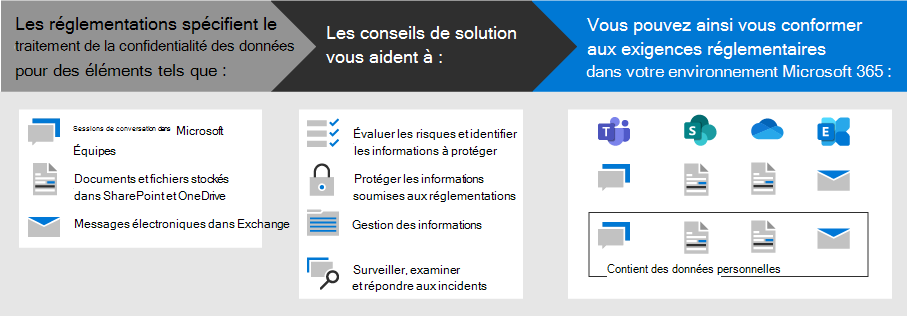

# Déployer la protection des informations pour les réglementations sur la confidentialité des données avec Microsoft 365

Votre organisation peut faire l’objet de réglementations régionales en matière de confidentialité des données qui nécessitent que vous protégez, gérez et fournissez des droits et un contrôle sur les informations personnelles stockées dans votre infrastructure informatique, y compris sur site et dans le Cloud. Le meilleur exemple de règlement de confidentialité des données est le règlement général sur la protection des données de l’Union européenne (RGPD). Le non-respect de la réglementation en matière de confidentialité des données peut entraîner des amendes importantes.

Des exemples de types de données dans Microsoft 365 incluent des sessions de conversation dans Microsoft Teams, des courriers électroniques dans Exchange et des fichiers dans SharePoint et OneDrive. Cette solution fournit des instructions sur l’évaluation des risques et l’identification des informations, la protection, la gestion et la réponse aux incidents de confidentialité des données pour les données personnelles stockées dans les services Microsoft 365, soumises à des réglementations en matière de confidentialité des données.

Des informations supplémentaires sont également fournies sur l’utilisation des contrôles Microsoft 365 Identity, Device et protection contre les menaces pour vos besoins en matière de confidentialité des données. 

Pour répondre aux critères de protection des informations en matière de conformité à la réglementation en matière de confidentialité des données, utilisez les fonctionnalités et fonctionnalités de Microsoft 365.

| Fonctionnalité | Description | Licence |
|:-------|:-----|:-------|
| Gestionnaire de conformité | Gérer les activités de conformité réglementaire, obtenir un score global de votre configuration de conformité actuelle et trouver des recommandations d’amélioration dans cet outil d’évaluation des risques basé sur un flux de travail dans le centre de conformité Microsoft 365. | Microsoft 365 E3 et E5 |
| Microsoft Defender pour Office 365 | Protégez vos applications et données Microsoft 365 (par exemple, messages électroniques, documents Office et outils de collaboration) contre les attaques. | Microsoft 365 E3 et E5 | 
| Étiquettes de confidentialité | Classifiez et protégez les données de votre organisation sans entraver la productivité des utilisateurs ni leur capacité à collaborer en plaçant des étiquettes avec différents niveaux de protection sur les messages électroniques, les fichiers et les sites. | Microsoft 365 E3 et E5 |
| Protection contre la perte de données (DLP) | Détectez, signalez et bloquez le partage risqué, accidentel ou inapproprié, tel que le partage de données contenant des informations personnelles, à la fois en interne et en externe. | Microsoft 365 E3 et E5 | 
| Étiquettes et stratégies de rétention des données | Mettez en place des contrôles de gouvernance des informations, tels que la durée de conservation des données ainsi que des exigences sur le stockage de données personnelles sur les clients, pour vous conformer aux stratégies de votre organisation ou aux réglementations relatives aux données. | Microsoft 365 E3 et E5 |
| Chiffrement du courrier électronique | Envoyez et recevez entre des personnes à l’intérieur et à l’extérieur de votre organisation des messages électroniques chiffrés qui contiennent des données réglementées, telles que des données personnelles relatives aux clients. | Microsoft 365 E3 et E5 |
||||

## Organisation des instructions de cette solution

Pour vous aider à comprendre les outils Microsoft 365 disponibles pour identifier, gérer, contrôler et surveiller les données personnelles soumises à une ou plusieurs réglementations liées à la confidentialité, ces instructions sont organisées en sections.
 

Chacune de ces sections correspond à un article distinct de cette solution.

>[!Note]
>Si vous êtes déjà familiarisé avec vos obligations de confidentialité des données et que vous exécutez votre projet sur une offre existante, vous souhaiterez peut-être vous concentrer sur les instructions de prévention, de protection, de rétention et d’enquête.

>[!Important]
>Ce guide ne vous permettra pas de vous conformer à la réglementation relative à la confidentialité des données, notamment en tenant compte du nombre d’étapes requises en dehors du contexte des fonctionnalités. Vous êtes chargé de vous assurer de votre conformité et de consulter vos équipes juridiques et de conformité, ou de rechercher des conseils et des conseils de tiers spécialisés en matière de conformité.
>

## Plan : évaluer les risques de confidentialité des données et identifier les éléments sensibles

L’évaluation des réglementations et des risques de confidentialité des données dont votre organisation est soumise est une première étape essentielle avant de commencer à implémenter les améliorations, notamment celles réalisables via la configuration Microsoft 365. Cela peut inclure une évaluation de la disponibilité globale ou l’identification d’un type d’informations sensibles particulier soumis aux contrôles réglementaires dont votre organisation a besoin pour se conformer, ainsi qu’à l’occurrence de celles-ci dans votre environnement Microsoft 365.

Pour plus d’informations, consultez la rubrique [évaluation des risques de confidentialité des données et identification des éléments sensibles](information-protection-deploy-assess.md).

## Track : exécuter les évaluations des risques et vérifier votre score de conformité

Le gestionnaire de conformité, disponible dans le centre de conformité Microsoft 365, vous offre une fonctionnalité intégrée permettant de suivre et de gérer les actions d’amélioration en général, ainsi que celles liées à plusieurs réglementations de confidentialité des données qui s’appliquent à vous.

Tirez parti des modèles d’évaluation intégrés spécifiques à chaque règle, qui vous permettent de suivre les éléments d’action pour chaque modèle d’évaluation sélectionné, ainsi que d’afficher des contrôles de réglementation spécifiques et de les associer à des actions spécifiques.

Pour plus d’informations, consultez [la rubrique utiliser le gestionnaire de conformité pour gérer les actions d’amélioration](information-protection-deploy-compliance.md).

## Empêcher : protéger les données personnelles

Microsoft 365 fournit un certain nombre de fonctionnalités d’identité, de protection des appareils et de protection contre les menaces que vous pouvez utiliser pour vous conformer à la conformité réglementaire des données en matière de confidentialité des données. 

Pour plus d’informations, voir [use Identity, Device, and Threat Protection for Data Privacy Regulation](information-protection-deploy-identity-device-threat.md).

Cet article décrit brièvement ce que les réglementations en matière de confidentialité des données appellent généralement dans ces domaines et fournit une liste de solutions Microsoft 365 connexes, ainsi que des liens vers des informations supplémentaires pour vous aider à répondre aux exigences de mise en œuvre. 

## Protéger les informations soumises au règlement de confidentialité des données

Les réglementations sur la confidentialité des données imposent un certain nombre de contrôles de protection des informations personnelles qui peuvent être employés dans votre environnement, dont plus de 40 protéger les contrôles des informations sur les quatre réglementations de confidentialité des données de notre exemple de RGPD, California Consumer Protection Act (CCPA), HIPAA-Hi (United Health Care Privacy Act) et le Brésil (Data Protection Act).

Pour plus d’informations, consultez [la rubrique protection des informations soumises au règlement de confidentialité des données dans votre organisation](information-protection-deploy-protect-information.md).

Cet article présente les principaux modèles de contrôle qui peuvent être utilisés pour répondre aux besoins en matière de protection des informations pour la confidentialité des données dans votre organisation.

## Conserver : régit les informations soumises au règlement de confidentialité des données

Les réglementations relatives à la confidentialité des données appellent des contrôles de la gouvernance des informations personnelles qui peuvent être employés dans votre environnement, dont plus de vingt-quatre contrôles parmi les quatre réglementations de confidentialité des données dans notre ensemble d’exemples de RGPD, CCPA, HIPAA-Hi et LGPD.

Pour plus d’informations, consultez la rubrique gestion des [informations relatives au règlement de confidentialité des données dans votre organisation](information-protection-deploy-govern.md).

Bien que les réglementations relatives à la confidentialité des données puissent être vagues en matière de gouvernance des informations &mdash; , telles que la rétention volontaire, la suppression et l’archivage &mdash; cet article présente les principaux modèles de contrôle que vous pouvez utiliser pour la confidentialité des données dans votre organisation.

## Enquête : surveiller, examiner et répondre aux incidents de confidentialité des données

Les fonctionnalités de Microsoft 365 sont disponibles pour vous aider à surveiller, examiner et répondre aux incidents de confidentialité des données au sein de votre organisation lorsque vous avez opérationnel les fonctionnalités connexes. 

L’existence de processus, de procédures et d’autres documents pour chacun de ces éléments peut être importante pour prouver la conformité aux organismes de réglementation.

Pour plus d’informations, consultez [la rubrique surveiller et répondre aux incidents de confidentialité des données dans votre organisation](information-protection-deploy-monitor-respond.md).
