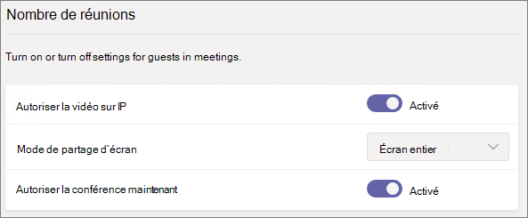
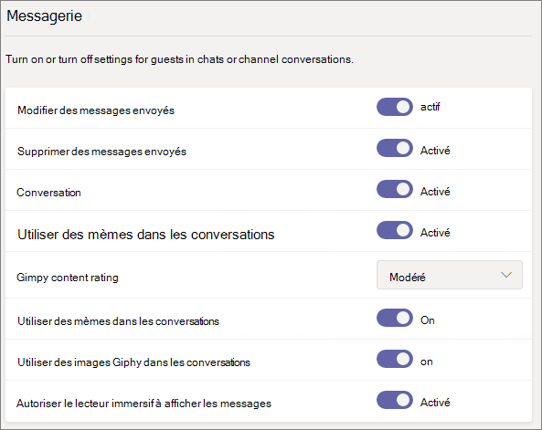
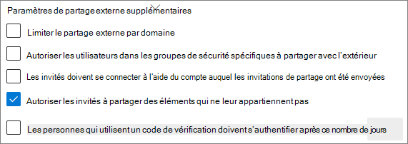

# Informations de référence sur les paramètres de partage d’invités de Microsoft 365

Cet article fournit des informations de référence sur les différents paramètres qui peuvent affecter le partage avec les personnes hors de l’organisation pour les charges de travail Microsoft 365 : Teams, Groupes Microsoft 365, SharePoint et OneDrive. Ces paramètres se retrouvent dans les centres d’administration Azure Active Directory, Microsoft 365, Teams et SharePoint.

## Azure Active Directory

**Rôle d’administrateur :** administrateur général

Azure Active Directory est le service d’annuaire utilisé par Microsoft 365. Les paramètres de relations organisationnelles Azure Active Directory affectent directement le partage dans Teams, Groupes Microsoft 365, SharePoint et OneDrive.

> [!NOTE]
> Ces paramètres n’affectent SharePoint que lorsque [l’intégration de SharePoint et OneDrive avec Azure AD B2B (préversion)](https://docs.microsoft.com/sharepoint/sharepoint-azureb2b-integration-preview) a été configurée. Le tableau ci-dessous part du principe que cette intégration a été configuré.

### Paramètres de relations organisationnelles

**Navigation :** [Centre d’administration Azure Active Directory](https://aad.portal.azure.com) > Azure Active Directory > Relations organisationnelles

|**Paramètre**|**Par défaut**|**Description**|
|:-----|:-----|:-----|
|Les autorisations des utilisateurs invités sont limitées|Oui|Ce paramètre affecte les tâches d’annuaire qu’un invité peut effectuer.|
|Les administrateurs et les utilisateurs membres du rôle Inviteur d’invités peuvent envoyer des invitations|Oui|Lorsque ce paramètre est défini sur **Oui**, les administrateurs peuvent inviter des invités via Azure AD et via des expériences de partage Microsoft 365 telles que Teams et SharePoint. Quand il est défini sur **Non**, ils ne le peuvent pas.|
|Les membres peuvent inviter|Oui|Lorsque ce paramètre est défini sur **Oui**, les membres Azure AD peuvent inviter des invités via Azure AD. Quand il est défini sur **Non**, ils ne le peuvent pas. Lorsqu’il est défini sur **Oui**, les membres de Groupes Microsoft 365 peuvent inviter des invités avec l’approbation du propriétaire. Quand il est défini sur **Non**, les membres de Groupes Microsoft 365 peuvent inviter des invités avec l’approbation du propriétaire, à la condition que celui-ci soit administrateur global.   Notez que l’option **Les membres peuvent inviter** fait référence aux membres d’Azure AD (par opposition aux invités), non à des membres de site ou de groupe dans Microsoft 365.   Elle produit le même effet que le paramètre **Autoriser les utilisateurs à ajouter de nouveaux invités à l’organisation** de Sécurité et confidentialité dans Microsoft 365.|
|Les invités peuvent inviter|Oui|Lorsque ce paramètre est défini sur **Oui**, les invités figurant dans l’annuaire peuvent inviter d’autres invités à collaborer sur des ressources Azure AD, ainsi que sur les fichiers et dossiers SharePoint et OneDrive. Quand il est défini sur **Non**, ils ne le peuvent pas.   Notez que, pour que les invités puissent partager des fichiers et dossiers avec d’autres invités, le paramètre **Permettre aux utilisateurs externes de trouver des comptes d’utilisateurs dans l’annuaire en tapant des correspondances d’adresse de courrier exactes** doit être activé dans le Centre d’administration SharePoint.|
|Activer le code secret à usage unique du courrier pour les invités (préversion)|Non|Lorsque ce paramètre est défini sur **Oui**, les invités ne disposant pas d’un compte de service administré (MSA) ou d’un compte professionnel ou scolaire peuvent s’[authentifier auprès d’Azure AD à l’aide d’un code secret à usage unique](https://docs.microsoft.com/azure/active-directory/b2b/one-time-passcode). Quand il est défini sur **Non**, les utilisateurs doivent créer un compte Microsoft pour s’authentifier. Pour fonctionner, ce paramètre doit être défini sur **Oui** pour l’[intégration de SharePoint et de OneDrive avec Azure AD B2B (préversion)](https://docs.microsoft.com/sharepoint/sharepoint-azureb2b-integration-preview).|
|Restrictions de collaboration|Autoriser l’envoi d’invitations à tout domaine|Ce paramètre vous permet de spécifier une liste de domaines dont le partage est autorisé ou bloqué. Lorsque des domaines autorisés sont spécifiés, des invitations de partage ne peuvent être envoyées qu’à ces domaines. Lorsque des domaines refusés sont spécifiés, des invitations de partage ne peuvent pas être envoyées à ces domaines.   Ce paramètre affecte les expériences de partage Microsoft 365 telles que Teams et SharePoint. Vous pouvez autoriser ou bloquer des domaines de façon plus précise à l’aide de la fonctionnalité de filtrage par domaine dans SharePoint ou Teams.|

Ces paramètres affectent la manière dont les utilisateurs sont invités à l’annuaire. Il n’affectent pas le partage avec des invités figurant déjà dans l’annuaire.

## Microsoft 365

**Rôle d’administrateur :** administrateur général

Le Centre d’administration Microsoft 365 comporte des paramètres de niveau organisation pour le partage et les Groupes Microsoft 365.

### Partage

**Navigation :**[Centre d’administration Microsoft 365](https://admin.microsoft.com) > Paramètres > Paramètres > Onglet Sécurité et confidentialité > Partage

|**Paramètre**|**Par défaut**|**Description**|
|:-----|:-----|:-----|
|Autoriser les utilisateurs à ajouter de nouveaux invités à l’organisation|Activé|Lorsque ce paramètre est défini sur **Oui**, les membres Azure AD peuvent inviter des invités via Azure AD. Quand il est défini sur **Non**, ils ne le peuvent pas. Lorsqu’il est défini sur **Oui**, les membres de Groupes Microsoft 365 peuvent inviter des invités avec l’approbation du propriétaire. Quand il est défini sur **Non**, les membres de Groupes Microsoft 365 peuvent inviter des invités avec l’approbation du propriétaire, à la condition que celui-ci soit administrateur global.   Notez que l’option **Les membres peuvent inviter** fait référence aux membres d’Azure AD (par opposition aux invités), non à des membres de site ou de groupe dans Microsoft 365.   Il produit le même effet que le paramètre **Les membres peuvent inviter** dans les paramètres de relations organisationnelles Azure Active Directory.|

### Groupes Microsoft 365

**Navigation :**[Centre d’administration Microsoft 365](https://admin.microsoft.com) > Paramètres > Paramètres > Groupes Microsoft 365

|**Paramètre**|**Par défaut**|**Description**|
|:-----|:-----|:-----|
|Permettre aux membres du groupe extérieurs à votre organisation d’accéder au contenu du groupe|Activé|Lorsque ce paramètre est défini sur **Activé**, les invités peuvent accéder au contenu des groupes. Quand il est défini sur **Désactivé**, ils ne le peuvent pas. Ce paramètre doit être **Activé** pour tout scénario dans lequel des utilisateurs invités interagissent avec Groupes Microsoft 365 ou Teams.|
|Permettre aux propriétaires de groupe d’ajouter des personnes en dehors de votre organisation aux groupes|Activé|Lorsque ce paramètre est **Activé**, les propriétaires de Groupes Microsoft 365 ou d’équipes Teams peuvent inviter de nouveaux invités à rejoindre le groupe. Quand il est **Désactivé**, les propriétaires peuvent inviter que des invités figurant déjà dans l’annuaire.|

Ces paramètres s’appliquent au niveau de l’organisation. Pour en savoir plus sur la modification de ces paramètres au niveau du groupe à l’aide de PowerShell, consultez [Créer des paramètres pour un groupe spécifique](https://docs.microsoft.com/azure/active-directory/users-groups-roles/groups-settings-cmdlets#create-settings-for-a-specific-group).

## Teams

Le commutateur d’accès invité principal de Teams, **Autoriser l’accès invité dans Teams**, doit être **Activé** pour que les autres paramètres d’invité soient disponibles.

**Rôle d’administrateur :** Administrateur du service Teams

### Accès invité

**Navigation :** [Centre d’administration Teams](https://admin.teams.microsoft.com) > Paramètres à l’échelle de l’organisation > Accès invité

|**Paramètre**|**Par défaut**|**Description**|
|:-----|:-----|:-----|
|Autoriser l’accès invité dans Teams|Désactivé|Active ou désactive l’accès invité dans Teams. Une fois ce paramètre modifié, la prise d’effet de la modification peut prendre jusqu’à 24 heures .|

### Appel d’invité

**Navigation :** [Centre d’administration Teams](https://admin.teams.microsoft.com) > Paramètres à l’échelle de l’organisation > Accès invité

|**Paramètre**|**Par défaut**|**Description**|
|:-----|:-----|:-----|
|Passer des appels privés|Activé|Lorsque ce paramètre est **Activé**, les invités peuvent passer des appels de poste à poste dans Teams. Quand il est **Désactivé**, ils ne le peuvent pas.|

### Réunion d’invité

**Navigation :** [Centre d’administration Teams](https://admin.teams.microsoft.com) > Paramètres à l’échelle de l’organisation > Accès invité

|**Paramètre**|**Par défaut**|**Description**|
|:-----|:-----|:-----|
|Autoriser la vidéo sur IP|Activé|Lorsque ce paramètre est **Activé**, les invités peuvent utiliser la vidéo pour leurs appels et réunions. Quand il est **Désactivé**, ils ne le peuvent pas.|
|Mode de partage d’écran|Écran entier|Lorsque ce paramètre est **Désactivé**, les invités ne peuvent pas partager leur écran dans Teams. Quand il est défini sur **Application unique**, les invités ne peuvent partager qu’une seule application sur leur écran. Quand il est défini sur **Écran entier**, les invités peuvent choisir de partager une application ou leur écran entier.|
|Autoriser la conférence maintenant|Activé|Lorsque ce paramètre est **Activé**, les invités peuvent utiliser la fonctionnalité Conférence maintenant dans Teams. Quand il est **Désactivé**, ils ne le peuvent pas.|

### Messagerie d’invité

**Navigation :** [Centre d’administration Teams](https://admin.teams.microsoft.com) > Paramètres à l’échelle de l’organisation > Accès invité

|**Paramètre**|**Par défaut**|**Description**|
|:-----|:-----|:-----|
|Modifier des messages envoyés|Activé|Lorsque ce paramètre est **Activé**, les invités peuvent modifier des messages qu’ils ont envoyés. Quand il est **Désactivé**, ils ne le peuvent pas.|
|Supprimer des messages envoyés|Activé|Lorsque ce paramètre est **Activé**, les invités peuvent supprimer des messages qu’ils ont envoyés. Quand il est **Désactivé**, ils ne le peuvent pas.|
|Conversation|Activé|Lorsque ce paramètre est **Activé**, les invités peuvent utiliser la conversation dans Teams. Quand il est **Désactivé**, ils ne le peuvent pas.|
|Utiliser des images Giphy dans les conversations|Activé|Lorsque ce paramètre est **Activé**, les invités peuvent utiliser des images Giphy dans les conversations. Quand il est **Désactivé**, ils ne le peuvent pas.|
|Évaluation du contenu Giphy|Modéré|Lorsque ce paramètre est défini sur **Autoriser tout le contenu**, les invités peuvent insérer les images Giphy de leur choix dans les conversations, quelle que soit l’évaluation du contenu. Lorsque ce paramètre est défini sur **Modéré**, les invités peuvent insérer des images Giphy dans les conversations, mais sont modérément restreints en lien avec le contenu adulte. Lorsque ce paramètre est défini sur **Strict**, les invités peuvent insérer des images Giphy dans les conversations, mais ne peuvent pas insérer de contenu adulte.|
|Utiliser des mèmes dans les conversations|Activé|Lorsque ce paramètre est **Activé**, les invités peuvent utiliser des mèmes dans les conversations. Quand il est **Désactivé**, ils ne le peuvent pas.|
|Utiliser des autocollants dans les conversations|Activé|Lorsque ce paramètre est **Activé**, les invités peuvent utiliser des autocollants dans les conversations. Quand il est **Désactivé**, ils ne le peuvent pas.|
|Autoriser le lecteur immersif à afficher les messages|Activé|Lorsque ce paramètre est **Activé**, les invités peuvent afficher des messages dans le lecteur immersif. Quand il est **Désactivé**, ils ne le peuvent pas.|

## SharePoint et OneDrive (niveau organisation)

**Rôle d’administrateur :** Administrateur SharePoint

Ces paramètres affectent tous les sites au sein de l’organisation. Ils n’affectent pas directement les solutions Groupes Microsoft 365 ou Teams, mais nous vous recommandons de les aligner sur les paramètres de ceux-ci afin d’éviter de perturber l’expérience utilisateur. (par exemple, si le partage d’invités est autorisé dans Teams mais pas dans SharePoint, les invités dans Teams n’ont pas accès à l’onglet Fichiers, car les fichiers de Teams sont stockés sur SharePoint).

### Paramètres de partage dans SharePoint et OneDrive

Étant donné que OneDrive est une hiérarchie de sites au sein de SharePoint, les paramètres de partage au niveau de l’organisation affectent directement OneDrive tout comme les autres sites SharePoint.

**Navigation :** Centre d’administration SharePoint > Partage

|**Paramètre**|**Par défaut**|**Description**|
|:-----|:-----|:-----|
|SharePoint|Tout le monde|Spécifie les autorisations de partage les plus permissives accordées pour les sites SharePoint.|
|OneDrive|Tout le monde|Spécifie les autorisations de partage les plus permissives accordées pour les sites OneDrive. Ce paramètre ne peut pas être plus permissif que le paramètre SharePoint.|

### Paramètres de partage avancé de SharePoint et OneDrive

**Navigation :** Centre d’administration SharePoint > Partage

|**Paramètre**|**Par défaut**|**Description**|
|:-----|:-----|:-----|
|Limiter le partage externe par domaine|Désactivé|Ce paramètre vous permet de spécifier une liste de domaines dont le partage est autorisé ou bloqué. Lorsque des domaines autorisés sont spécifiés, des invitations de partage ne peuvent être envoyées qu’à ces domaines. Lorsque des domaines refusés sont spécifiés, des invitations de partage ne peuvent pas être envoyées à ces domaines.   Ce paramètre affecte tous les sites SharePoint et OneDrive au sein de l’organisation.|
|Les invités doivent se connecter à l’aide du compte auquel les invitations de partage ont été envoyées|Désactivé|Empêche les invités d’utiliser des invitations de partage de sites à l’aide d’une envoyer un e-mail différente de celle à laquelle l’invitation a été envoyée.  L’[intégration de SharePoint et de OneDrive avec Azure AD B2B (préversion)](https://docs.microsoft.com/sharepoint/sharepoint-azureb2b-integration-preview) n’utilise pas ce paramètre parce que tous les invités sont ajoutés à l’annuaire en fonction de l’adresse e-mail à laquelle l’invitation a été envoyée. D’autres adresses e-mail ne peuvent pas être utilisées pour accéder au site.|
|Autoriser les invités à partager des éléments qui ne leur appartiennent pas|Activé|Lorsque ce paramètre est **Activé**, les invités peuvent partager des éléments dont ils ne sont pas propriétaires avec d’autres utilisateurs ou invités. Quand il est **Désactivé**, ils ne le peuvent pas. Les invités peuvent toujours partager des éléments sur lesquels ils disposent d’un contrôle total.|

### Paramètres de lien de fichier et de dossier SharePoint et OneDrive

Lorsque des fichiers et dossiers sont partagés sur SharePoint et OneDrive, les destinataires du partage reçoivent un lien contenant des autorisations sur ces fichiers ou dossiers, au lieu de se voir accorder un accès direct à ceux-ci. Plusieurs types de liens sont disponibles et vous pouvez choisir le type de lien par défaut présenté aux utilisateurs qui partagent un fichier ou dossier. Vous pouvez également définir des autorisations et des options d’expiration pour les liens *Tout le monde*.

**Navigation :** Centre d’administration SharePoint > Partage

|**Paramètre**|**Par défaut**|**Description**|
|:-----|:-----|:-----|
|Liens de fichiers et dossiers|Toute personne disposant du lien|Spécifie le lien de partage affiché par défaut quand un utilisateur partage un fichier ou dossier. Les utilisateurs peuvent modifier l’option avant de partager s’ils le souhaitent. Si le paramètre par défaut est **Toute personne disposant du lien** et que le mode de partage *Tout le monde* n’est pas autorisé pour un site donné, l’option par défaut **Uniquement les membres de votre organisation** est affichée pour ce site.|
|Ces liens doivent expirer dans le nombre de jours suivant|Désactivé (pas d’expiration)|Spécifie le nombre de jours à l’issue desquels un lien *Tout le monde* expire après sa création. Il n’est pas possible de renouveler des liens qui ont expiré. Si vous devez continuer à partager après l’expiration du lien, créez un nouveau lien.|
|Autorisations d’accès aux fichiers|Afficher et modifier|Spécifie les niveaux d’autorisation d’accès au fichier disponibles pour les utilisateurs lors de la création d’un lien accessible à *Tout le monde*. Si **Affichage** est sélectionné, les utilisateurs ne peuvent créer des liens de fichiers accessibles à *Tout le monde* qu’avec des autorisations d’affichage. Si l’option **Afficher et modifier** est activée, les utilisateurs ont le choix entre les autorisations Afficher et Afficher et modifier quand ils créent le lien.|
|Autorisations d’accès aux dossiers|Afficher, modifier et charger|Spécifie les niveaux d’autorisation d’accès au dossier disponibles pour les utilisateurs lors de la création d’un lien accessible à *Tout le monde*. Si **Affichage** est sélectionné, les utilisateurs ne peuvent créer des liens de dossiers accessibles à *Tout le monde* qu’avec des autorisations d’affichage. Si l’option **Afficher, modifier et charger** est activée, les utilisateurs ont le choix entre les autorisations Afficher, Modifier et Charger quand ils créent le lien.|

### Paramètres de groupe de sécurité dans SharePoint et OneDrive

Si vous souhaitez limiter le nombre de personnes pouvant partager avec des invités dans SharePoint et OneDrive, vous le pouvez en limitant le partage aux personnes appartenant à des groupes de sécurité spécifiés. Ces paramètres n’affectent pas le partage via Groupes Microsoft 365 et Teams. Des invités invités via un groupe ou une équipe auraient également accès au site associé, même si le partage de documents et de dossiers ne pourrait être effectué que par des personnes appartenant aux groupes de sécurité spécifiés.

**Navigation :** Centre d’administration SharePoint > Partage > Limiter le partage externe avec des groupes de sécurité spécifiques

|**Paramètre**|**Par défaut**|**Description**|
|:-----|:-----|:-----|
|Autoriser uniquement les membres des groupes de sécurité sélectionnés à partager du contenu avec des utilisateurs externes authentifiés|Désactivé|Lorsque ce paramètre est **Activé**, seules les personnes appartenant aux groupes de sécurité spécifiés peuvent partager avec des utilisateurs externes. Seuls des liens *Personnes spécifiques* sont disponibles. Le partage avec *Tout le monde* est désactivé sauf si le paramètre **Autoriser uniquement les membres des groupes de sécurité sélectionnés à partager du contenu avec des utilisateurs externes authentifiés ou disposant de liens anonymes** est également **Activé**.|
|Autoriser uniquement les membres des groupes de sécurité sélectionnés à partager du contenu avec des utilisateurs externes authentifiés ou disposant de liens anonymes|Désactivé|Lorsque le paramètre est **Activé**, seules les personnes appartenant aux groupes de sécurité spécifiés peuvent partager avec des invités. Les liens *Tout le monde* et *Personnes spécifiques* sont disponibles.|

Ces deux paramètres peuvent être utilisés en même temps. Si un utilisateur appartient à des groupes de sécurité spécifiés pour les deux paramètres, le niveau d’autorisation le plus élevé prévaut (*Tout le monde* plus *Utilisateur spécifique*).

## SharePoint (au niveau du site)

**Rôle d’administrateur :** Administrateur SharePoint

Étant donné que ces paramètres dépendent des paramètres définis à l’échelle de l’organisation pour SharePoint, le paramètre de partage effectif pour le site peut changer si le paramètre au niveau de l’organisation change. Si vous choisissez un paramètre ici et que le niveau de l’organisation est défini ultérieurement sur une valeur plus restrictive, ce site fonctionnera conformément à cette valeur plus restrictive. Par exemple, si vous choisissez **Tout le monde** et que le paramètre au niveau de l’organisation est défini ultérieurement sur **Invités nouveaux et existants**, ce site n’autorisera que des invités nouveaux et existants. Si le paramètre au niveau de l’organisation est ensuite redéfini sur **Tout le monde**, ce site autorisera de nouveau les liens *Tout le monde*.

### Partage de site

Vous pouvez définir des autorisations de partage d’invités pour chaque site dans SharePoint. Ce paramètre s’applique tant au partage de site qu’au partage de fichier et de dossier. (Le partage avec *Tout le monde* n’est pas disponible pour le partage de site. Si vous choisissez **Tout le monde**, les utilisateurs peuvent partager des fichiers et dossiers en utilisant des liens accessibles à *Tout le monde*, et le site proprement dit avec des invités nouveaux et existants.)

**Navigation :** Centre d’administration SharePoint > Sites actifs > sélectionnez le site> Onglet des stratégies > Modifier le partage externe

|**Paramètre**|**Par défaut**|**Description**|
|:-----|:-----|:-----|
|Le contenu du site peut être partagé avec|Varie en fonction du type de site (voir le tableau ci-dessous)|Indique le type de partage externe autorisé pour ce site. Les options disponibles dépendent des paramètres de partage au niveau de l’organisation pour SharePoint.|

### Paramètres des liens de fichier et de dossiers du site

Vous pouvez définir les valeurs par défaut pour le type de lien et les autorisations, ainsi que les paramètres d’expiration sur les liens *Tout le monde* de chaque site. Lorsqu’ils sont définis au niveau du site, ces paramètres remplacent les ceux au niveau de l’organisation. Notez que si les liens *Tout le monde* sont désactivés au niveau de l’organisation, *Tout le monde* n’est pas un type de lien disponible au niveau du site.

**Navigation :** Centre d’administration SharePoint > Sites actifs > sélectionnez le site> Onglet des stratégies > Modifier le partage externe

|**Paramètre**|**Par défaut**|**Description**|
|:-----|:-----|:-----|
|Limiter le partage par domaine|Désactivé|Ce paramètre vous permet de spécifier une liste de domaines dont le partage est autorisé ou bloqué. Lorsque des domaines autorisés sont spécifiés, des invitations de partage ne peuvent être envoyées qu’à ces domaines. Lorsque des domaines refusés sont spécifiés, des invitations de partage ne peuvent pas être envoyées à ces domaines.   Ce paramètre ne peut pas être utilisé pour remplacer les restrictions de domaine définies au niveau de l’organisation ou de Azure AD.|
|Type de lien de partage par défaut|Identique au paramètre au niveau de l’organisation|Ce paramètre vous permet de spécifier le lien de partage par défaut présenté aux utilisateurs de ce site. L’option *Identique au paramètre de niveau organisation* est définie par une combinaison de paramètres de partage organisation et site.|
|Paramètres avancés pour les liens Tout le monde|Identique au paramètre au niveau de l’organisation|Spécifie le nombre de jours à l’issue desquels un lien *Tout le monde* est créé pour un fichier qui expire dans ce site. Il n’est pas possible de renouveler des liens qui ont expiré. Si vous devez continuer à partager après l’expiration du lien, créez un nouveau lien.|
|Autorisation de lien par défaut|Identique au paramètre au niveau de l’organisation|Ce paramètre vous permet de spécifier l’autorisation par défaut (Afficher ou Modifier) pour les liens de partage créés pour les fichiers dans ce site.|

### Paramètres de partage de sites par défaut

Le tableau ci-dessous présente le paramètre de partage par défaut pour chaque type de site.

|**Type de site**|**Paramètre de partage par défaut**|
|:-----|:-----|
|Classique|**Uniquement les membres de votre organisation**|
|OneDrive|**Tout le monde**|
|Sites connectés au groupe (notamment Teams)|**Invités nouveaux et existants** si le paramètre de la solution Groupes Microsoft 365 **Autoriser les propriétaires de groupe à ajouter des personnes à l’extérieur de l’organisation aux groupes** est **Activé**. Dans le cas contraire, **Invités existants uniquement**|
|Communication|**Uniquement les membres de votre organisation**|
|Sites modernes sans groupe (#STS3 TeamSite)|**Uniquement les personnes de votre organisation**|

> [!NOTE]
> Par défaut, le paramètre de partage du site de communication racine (tenant-name.sharepoint.com) est défini sur **tout le monde**.

## Voir aussi

[Vue d’ensemble du partage externe dans SharePoint et OneDrive](https://docs.microsoft.com/sharepoint/external-sharing-overview)

[Accès invité dans Microsoft Teams](https://docs.microsoft.com/MicrosoftTeams/guest-access)

[Ajout d’invités aux Groupes Microsoft 365](https://support.office.com/article/bfc7a840-868f-4fd6-a390-f347bf51aff6)
