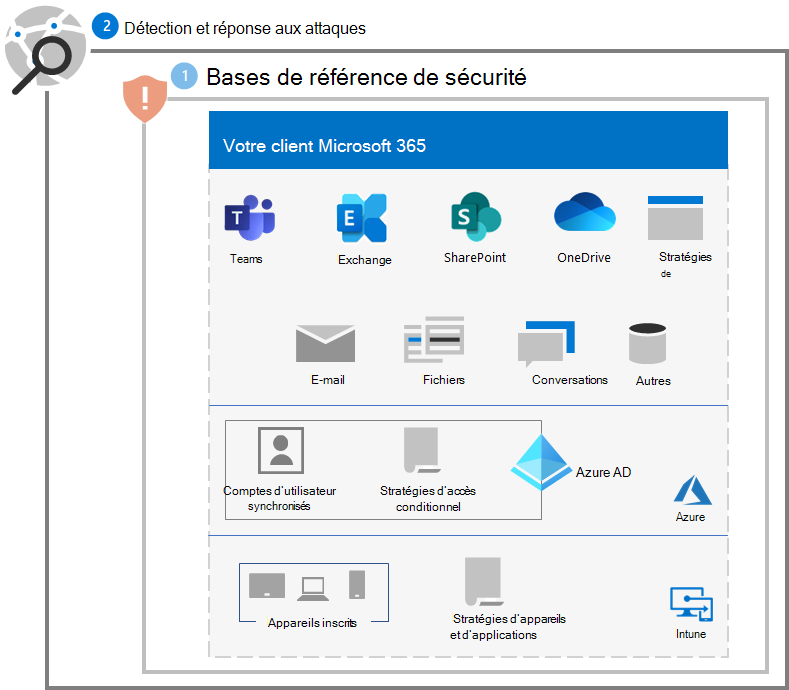
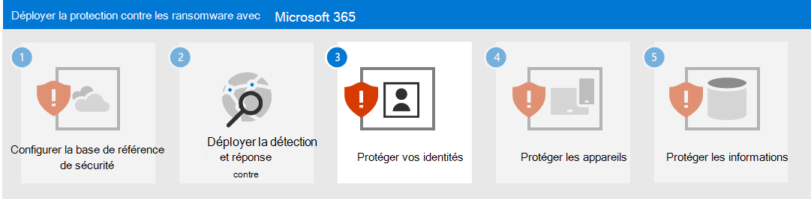

# Étape 2. Déployer la détection et la réponse des attaques

Tel qu’il est fortement recommandé dans la première étape pour la détection et la réponse aux attaques de ransomware dans votre client Microsoft 365, [configurez un environnement d’évaluation](/microsoft-365/security/defender/eval-overview) pour évaluer les fonctionnalités et les capacités de Microsoft 365 Defender.

Pour plus d’informations, consultez ces ressources.

| Fonctionnalité | Description | Par où commencer | Comment l’utiliser pour la détection et la réponse |
|:-------|:-----|:-------|:-------|
| [Microsoft 365 Defender](/microsoft-365/security/defender) | Combine les signaux et orchestre les fonctionnalités en une seule solution    Permet aux professionnels de la sécurité d’assembler les signaux des menaces et de déterminer l’étendue et l’impact complets d’une menace    Automatise les actions pour empêcher ou arrêter l’attaque et auto-panser les boîtes aux lettres, les points de terminaison et les identités des utilisateurs affectés | [Prise en main](/microsoft-365/security/defender/get-started) | [Réponse aux incidents](/microsoft-365/security/defender/incidents-overview) |
| [Microsoft Defender pour l’identité](/defender-for-identity/what-is) |  Identifie, détecte et examine les menaces avancées, les identités compromises et les actions malveillantes internes dirigées vers votre organisation via une interface de sécurité basée sur le cloud qui utilise vos signaux AD DS (Active Directory Domain Services) locaux. | [Vue d’ensemble](/defender-for-identity/what-is) | [Travailler avec le portail Microsoft Defender pour l’identité](/defender-for-identity/workspace-portal) |
| [Microsoft Defender pour Office 365](/microsoft-365/security/office-365-security) | Protège votre organisation contre les menaces malveillantes posées par les courriers électroniques, les liens (URL) et les outils de collaboration    Protège contre les programmes malveillants, le hameçonnage, l’usurpation et d’autres types d’attaques  | [Vue d’ensemble](/microsoft-365/security/office-365-security/overview) | [Recherche de menaces](/microsoft-365/security/office-365-security/threat-hunting-in-threat-explorer) |
| [Microsoft Defender pour point de terminaison](/microsoft-365/security/defender-endpoint) | Permet la détection et la réponse aux menaces avancées sur les points de terminaison (appareils) | [Vue d’ensemble](/microsoft-365/security/defender-endpoint/microsoft-defender-endpoint)  | [Détection et réponse du point de terminaison](/microsoft-365/security/defender-endpoint/overview-endpoint-detection-response) |
| [Azure Active Directory Identity Protection (Azure AD)](/azure/active-directory/identity-protection/) | Automatise la détection et la correction des risques basés sur l’identité et l’examen de ces risques | [Vue d’ensemble](/azure/active-directory/identity-protection/overview-identity-protection) | [Examiner le risque](/azure/active-directory/identity-protection/howto-identity-protection-investigate-risk) |
| [Microsoft Cloud App Security](/cloud-app-security) | Courtier de sécurité d’accès au cloud pour la découverte, l’examen et la gouvernance au sein de tous vos services cloud Microsoft et tiers. | [Vue d’ensemble](/cloud-app-security/what-is-cloud-app-security) | [Examiner](/cloud-app-security/investigate) |

>[!Note]
>Tous ces outils nécessitent Microsoft 365 E5 ou Microsoft 365 E3 avec le module complémentaire Microsoft 365 E5 Sécurité.
>

Utilisez ces outils pour détecter et répondre aux menaces courantes d’attaques par rançongiciel suivantes :

- Vol d’informations d’identification

   - Azure AD Identity Protection
   - Microsoft Defender pour l’identité
   - Microsoft Defender pour Office 365

- Compromission de l’appareil

   - Microsoft Defender pour point de terminaison
   - Microsoft Defender pour Office 365

- Élévation de privilèges

   - Azure AD Identity Protection
   - Microsoft Cloud App Security

- Comportement des applications malveillantes

   - Microsoft Cloud App Security

- Exfiltration, suppression ou chargement de données

   - Microsoft Defender pour Office 365
   - Microsoft Cloud App Security [stratégies de détection des anomalies](/cloud-app-security/anomaly-detection-policy#ransomware-activity)

Les outils suivants utilisent Microsoft 365 Defender et son portail (https://security.microsoft.com) comme un point d’analyse et de collecte des menaces courantes :

- Microsoft Defender pour l’identité
- Microsoft Defender pour Office 365
- Microsoft Defender pour point de terminaison
- Microsoft Cloud App Security

Microsoft 365 Defender combine les signaux de menace en alertes et les alertes connectées dans un incident afin que vos analystes de sécurité puissent détecter, examiner et corriger plus rapidement les phases d’une attaque par rançongiciel.

## Configuration résultante

Voici la protection contre les rançongiciels pour votre client pour les étapes 1 et 2.

## Étape suivante

Passez à l’[Étape 3](ransomware-protection-microsoft-365-identities.md) pour protéger les identités dans votre client Microsoft 365.
