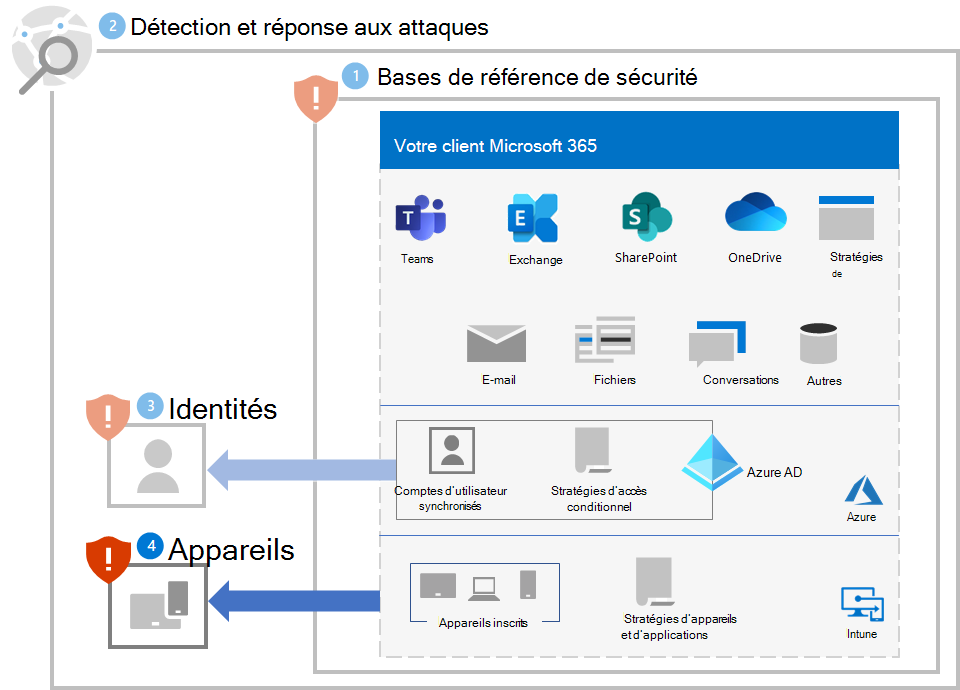
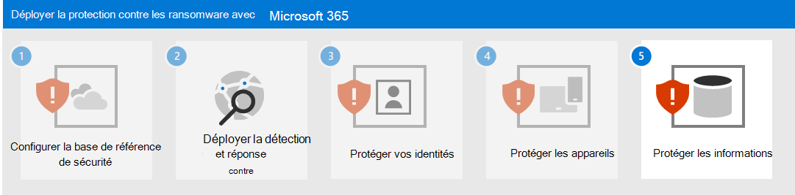

# Étape 4. Protéger les appareils

Pour aider à protéger les appareils (endpoints) contre la partie d’accès initiale d’une attaque de ransomware :

- Déployez [Intune](/mem/intune/fundamentals/what-is-intune) en tant que fournisseur de gestion des appareils mobiles (MDM) et de gestion des applications mobiles (GAM) pour vos appareils, puis inscrivez les appareils de votre organisation.
- Implémentez les [stratégies communes d’identité et d'accès aux appareils](/microsoft-365/security/office-365-security/identity-access-policies) pour valider les informations d’identification du compte utilisateur et appliquer les exigences d’intégrité et de conformité des appareils.
- Activez la [Protection réseau](/microsoft-365/security/defender-endpoint/network-protection) dans Microsoft Defender pour point de terminaison et Microsoft 365 Defender.
- Configurez la [vérification du site et du téléchargement](/windows/security/threat-protection/microsoft-defender-smartscreen/microsoft-defender-smartscreen-available-settings) et la [vérification des applications et des fichiers](/windows/security/threat-protection/microsoft-defender-smartscreen/microsoft-defender-smartscreen-available-settings) dans Microsoft Defender SmartScreen pour bloquer ou avertir.
- Activez [l’analyse par l’Antivirus Microsoft Defender](/microsoft-365/security/defender-endpoint/configure-advanced-scan-types-microsoft-defender-antivirus) des fichiers et pièces jointes téléchargés.
- Définissez le **Niveau de sécurité Bureau à distance** sur **TLS** dans Microsoft Defender pour point de terminaison et Microsoft 365 Defender.

## Appareils Windows 11 ou 10

Pour vous protéger contre le mouvement latéral d’une attaque provenant d’un appareil Windows 11 ou 10 :

- [Activer le Pare-feu Microsoft Defender](https://support.microsoft.com/windows/turn-microsoft-defender-firewall-on-or-off-ec0844f7-aebd-0583-67fe-601ecf5d774f).
- [Mettez à jour les définitions de l’Antivirus Microsoft Defender](/microsoft-365/security/defender-endpoint/manage-updates-baselines-microsoft-defender-antivirus).

Pour réduire l’impact de l’attaque :

- Utilisez les [règles de réduction de la surface d’attaque et la protection avancée contre les ransomwares](/microsoft-365/security/defender-endpoint/attack-surface-reduction-rules-reference#use-advanced-protection-against-ransomware).

Pour vous protéger contre un attaquant qui échappe à vos défenses de sécurité :

- Maintenez activée la [protection par le cloud](/microsoft-365/security/defender-endpoint/enable-cloud-protection-microsoft-defender-antivirus) dans l’Antivirus Microsoft Defender.
- Maintenez activée la [surveillance de comportement en temps réel](/microsoft-365/security/defender-endpoint/configure-real-time-protection-microsoft-defender-antivirus) dans l’Antivirus Microsoft Defender.
- Activer la [protection en temps réel](/microsoft-365/security/defender-endpoint/configure-real-time-protection-microsoft-defender-antivirus).
- Activer la [protection contre la falsification dans Microsoft Defender pour point de terminaison](/microsoft-365/security/defender-endpoint/prevent-changes-to-security-settings-with-tamper-protection) pour empêcher les modifications malveillantes apportées aux paramètres de sécurité.

Pour vous protéger contre l’exécution de code par une personne malveillante dans le cadre d’une attaque :

- Activer [Antivirus Microsoft Defender](/mem/intune/user-help/turn-on-defender-windows).
- [Bloquez les appels d’API Win32 dans les macros Office](/microsoft-365/security/defender-endpoint/attack-surface-reduction-rules#block-win32-api-calls-from-office-macros).
- Migrez tous les anciens classeurs nécessitant des macros Excel 4.0 vers le format de macro VBA mis à jour en utilisant [ce processus](https://www.microsoft.com/microsoft-365/blog/2010/02/16/migrating-excel-4-macros-to-vba/).
- [Désactivez l’utilisation de macros non signées](https://support.microsoft.com/topic/enable-or-disable-macros-in-office-files-12b036fd-d140-4e74-b45e-16fed1a7e5c6). Assurez-vous que toutes les macros internes ayant des besoins métier sont connectées et tirent parti des [emplacements fiables](/deployoffice/security/designate-trusted-locations-for-files-in-office) pour vous assurer que les macros inconnues ne s’exécutent pas dans votre environnement.
- Arrêtez les macros XME ou VBA malveillantes en veillant à ce que l’analyse des macros runtime par [l’interface d’analyse des logiciels malveillants](https://www.microsoft.com/security/blog/2021/03/03/xlm-amsi-new-runtime-defense-against-excel-4-0-macro-malware/) (AMSI) soit activée. Cette fonctionnalité (activée par défaut) est activée si le paramètre de stratégie de groupe pour **l’étendue d’analyse de temps d’exécution des macros** est définie sur **Activer pour tous les fichiers** ou **Activer pour les fichiers de confiance basse**. Obtenez les fichiers de modèles de stratégie de groupe les plus récents.

## Impact sur les utilisateurs et la gestion des modifications

Lorsque vous implémentez ces protections, effectuez la gestion des modifications pour les éléments suivants :

- Les [stratégies communes d’identité et d'accès aux appareils Zero Trust](/microsoft-365/security/office-365-security/identity-access-policies) peuvent refuser l’accès aux utilisateurs qui ont des appareils non conformes.
- Le téléchargement de fichiers peut avertir les utilisateurs avant le téléchargement ou le bloquer.
- Certaines macros Office, Excel 4.0, XLM ou VBA peuvent ne plus s’exécuter.

## Configuration résultante

Voici la protection contre les ransomwares pour votre locataire pour les étapes 1 à 4.

## Étape suivante

Poursuivez avec [l’étape 5](ransomware-protection-microsoft-365-information.md) pour protéger les informations dans votre client Microsoft 365. 
