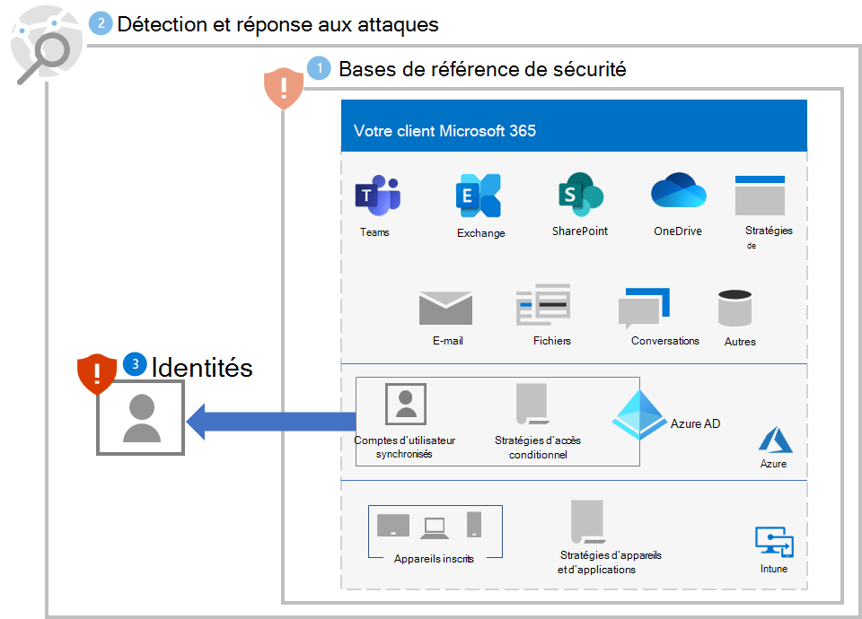
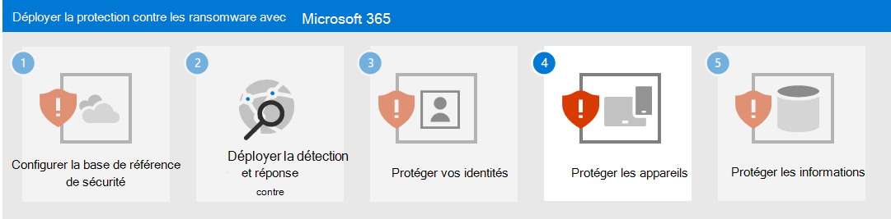

# Étape 3. Protéger vos identités

Utilisez les sections suivantes pour protéger votre organisation contre la compromission des informations d’identification, qui constitue généralement la première étape d’une attaque par rançongiciel plus importante.

## Renforcer la sécurité de la connexion

Utilisez [l’authentification sans mot de passe](/azure/active-directory/authentication/howto-authentication-passwordless-deployment) pour les comptes d’utilisateur dans Azure Active Directory (Azure AD).

Pendant la transition vers l’authentification sans mot de passe, utilisez ces meilleures pratiques pour les comptes d’utilisateur qui utilisent toujours l’authentification par mot de passe :

- Bloquez les mots de passe faibles et personnalisés connus avec la [Protection de mots de passe Azure AD](/azure/active-directory/authentication/concept-password-ban-bad).
- Étendez le blocage des mots de passe faibles et personnalisés connus à vos [Active Directory Domain Services (AD DS) locaux avec Protection de mots de passe Azure AD](/azure/active-directory/authentication/concept-password-ban-bad-on-premises).
- Autorisez vos utilisateurs à modifier leurs propres mots de passe avec la [Réinitialisation du mot de passe libre-service (SSPR)](/azure/active-directory/authentication/concept-sspr-howitworks).

Ensuite, implémentez les [Stratégies communes pour les identités et l’accès aux appareils](/microsoft-365/security/office-365-security/identity-access-policies). Ces stratégies fournissent une sécurité plus élevée pour l’accès aux services cloud Microsoft 365. 

Pour les utilisateurs qui se connectent, ces stratégies sont les suivantes :

- Exiger l’authentification multifacteur (MFA) pour les [comptes prioritaires](/microsoft-365/admin/setup/priority-accounts) (immédiatement) et finalement tous les comptes d’utilisateurs.
- Exiger l’utilisation de l’authentification multifacteur pour les connexions à risque élevé.
- Exiger que les utilisateurs à risque élevé avec des connexions à risque élevé modifient leurs mots de passe.

## Empêcher l’escalade des privilèges

Utilisez les meilleures pratiques ci-après :

- Implémentez le principe des [privilèges minimum](/windows-server/identity/ad-ds/plan/security-best-practices/implementing-least-privilege-administrative-models) et utilisez la protection par mot de passe comme décrit dans [Augmenter la sécurité de la connexion](#increase-sign-in-security) pour les comptes d’utilisateur qui utilisent encore des mots de passe pour leurs connexions. 
- Évitez d’utiliser des comptes de service de niveau administrateur à l’échelle du domaine. 
- Limitez les privilèges d’administration locaux pour restreindre l’installation de Chevaux de Troie autorisant un accès à distance (RAT) et d’autres applications indésirables.
- Utilisez l’accès conditionnel Azure AD pour valider explicitement la confiance des utilisateurs et des stations de travail avant d’autoriser l’accès aux portails d’administration. Voir [cet exemple](/azure/active-directory/conditional-access/howto-conditional-access-policy-azure-management) du portail Azure.
- Activez la gestion des mots de passe de l’administrateur local.
- Déterminez l’endroit où les comptes à privilèges élevés se connectent et exposent des informations d’identification. Les comptes à privilèges élevés ne doivent pas être présents sur les stations de travail.
- Désactivez le stockage local des mots de passe et des informations d’identification.

## Impact sur les utilisateurs et la gestion des modifications

Vous devez sensibiliser les utilisateurs de votre organisation aux :

- Nouvelles exigences en matière de mots de passe plus forts.
- Modifications apportées aux processus de signature, telles que l’utilisation obligatoire de l’authentification multifacteur et l’enregistrement de la méthode d’authentification secondaire MFA.
- Utilisation de la maintenance des mots de passe avec SSPR. Par exemple, plus aucun appel au support technique pour une réinitialisation de mot de passe.
- L’invite pour exiger une authentification multifacteur ou une modification de mot de passe pour les connexions considérées comme risquées.

## Configuration résultante

Voici la protection contre les rançongiciels pour votre client pour les étapes 1 à 3.

## Étape suivante

Poursuivez [l’étape 4](ransomware-protection-microsoft-365-devices.md) pour protéger les appareils (points de terminaison) dans votre client Microsoft 365. 
