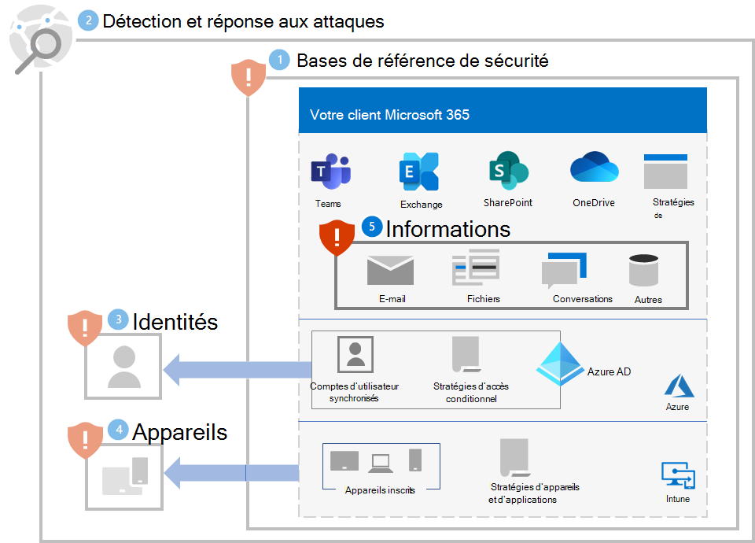

# Étape 5 : Vérifier les informations

Étant donné que les attaquants par rançongiciel vont également examiner vos données sur site situées sur des fichiers, des bases de données et d’autres types de serveurs, l’une des meilleures façons de protéger ces données consiste à les migrer vers votre client Microsoft 365. Une fois à cet emplacement, ils peuvent être protégés par des fonctionnalités intégrées d’atténuation et de récupération telles que le [contrôle de version, la corbeille et restauration de fichiers](ransomware-protection-microsoft-365.md#ransomware-mitigation-and-recovery-capabilities-provided-with-microsoft-365).

Pour fournir une protection supplémentaire des informations sensibles dans votre client Microsoft 365 client :

- Localisez vos informations sensibles.
- Implémenter des autorisations strictes et éliminer l’accès large (par exemple, empêcher un trop grand nombre d’utilisateurs d’avoir des capacités d’écriture, de modification et de suppression).
- Protégez vos informations sensibles.

>[!Note]
>Pour obtenir des conseils de déploiement détaillés pour la protection des informations dans un client Microsoft 365, voir [Déployer la protection des informations pour les réglementations en matière de confidentialité des données](information-protection-deploy.md). Bien qu’ils soient destinés aux réglementations en matière de confidentialité des données, la plupart des conseils s’appliquent également à la protection contre les rançongiciels.
>

## Protégez vos informations sensibles

La première tâche consiste à [identifier les types et les emplacements](/microsoft-365/compliance/information-protection#know-your-data) des informations sensibles dans votre client, qui peuvent inclure les types suivants :

- Sensible
- Propriétaire ou propriété intellectuelle
- Régulée, telles que les réglementations régionales qui spécifient la protection des informations d’identification personnelle (PII)
- Plans de récupération informatique

Pour chaque type d’informations sensibles, déterminez les informations suivantes :

- Utilisation des informations pour votre organisation
- Mesure relative de sa valeur monétaire si elle a été détenue contre rançon (élevée, moyenne, faible, par exemple)
- Son emplacement actuel, tel qu’un dossier OneDrive ou SharePoint ou un lieu de collaboration tel qu’une équipe Microsoft Teams
- Les autorisations actuelles, qui comportent :

   - Comptes d’utilisateurs qui disposent de l’accès

   - Actions autorisées pour chaque compte qui dispose de l’accès 

## Implémenter des autorisations strictes pour les emplacements avec des informations sensibles

L’implémentation d’autorisations strictes au sein de votre client Microsoft 365 utilise le principe du privilège minimum pour les emplacements et les lieux de communication, qui, dans Microsoft 365, sont généralement des dossiers OneDrive, des sites SharePoint et des dossiers et des équipes. 

Bien qu’il soit plus facile de créer des emplacements de stockage de fichiers ou des équipes avec un large accès (par exemple, la valeur par défaut de tous les membres de votre organisation), pour les informations sensibles, les comptes d’utilisateurs autorisés et les actions autorisées doivent être limités à l’ensemble minimum requis pour répondre aux besoins de collaboration et d’entreprise.

Une fois qu’un pirate de rançongiciel a infiltré votre client, il tente d’escalader ses privilèges en compromettant les informations d’identification des comptes d’utilisateur avec des étendues d’autorisations plus larges sur votre client, telles que les comptes de rôle d’administrateur ou les comptes d’utilisateur qui dispose d’un accès à des informations sensibles. 

En fonction de ce comportement d’attaquant classique, il existe deux niveaux de difficulté pour la personne malveillante :

- **Faible :** Une personne malveillante peut utiliser un compte à faible autorisation et découvrir vos informations sensibles en raison d’un large accès dans votre client.
- **Supérieur :** Une personne malveillante ne peut pas utiliser un compte à autorisation faible et découvrir vos informations sensibles en raison d’autorisations strictes. Elle devrait escalader ses autorisations en déterminant puis en compromettant les informations d'identification d'un compte qui a accès à un emplacement contenant des informations sensibles, mais ne pourrait alors ne pouvoir effectuer qu'un ensemble limité d'actions.

Pour les informations sensibles, vous devez rendre le niveau de difficulté aussi élevé que possible.

Vous pouvez garantir des autorisations strictes dans votre client à l’aide de ces étapes :

1. À partir de la [recherche de vos informations sensibles](#locate-your-sensitive-information), examinez les autorisations pour les emplacements des informations sensibles. 
2. Implémentez des autorisations strictes pour les informations sensibles tout en respectant les exigences de collaboration et d’entreprise, puis informez les utilisateurs concernés.
3. Gérez les modifications pour vos utilisateurs afin que des emplacements futurs pour les informations sensibles soient créés et maintenus avec des autorisations strictes.
4. Auditez et surveillez les emplacements pour les informations sensibles afin de vous assurer que des autorisations étendues ne sont pas accordées.

Pour obtenir des instructions détaillées, voir [Configurer le partage de fichiers sécurisé et la collaboration avec Microsoft Teams](setup-secure-collaboration-with-teams.md). Un exemple de lieu de communication et de collaboration avec des autorisations strictes pour les informations sensibles est une [équipe avec isolation de la sécurité](/microsoft-365/solutions/secure-teams-security-isolation).

## Protéger vos informations sensibles

Pour protéger vos informations sensibles au cas où un pirate de rançongiciel y aurait accès :

- Utilisez [l’accès contrôlé aux dossiers](/windows/security/threat-protection/microsoft-defender-atp/controlled-folders) pour rendre plus difficile pour les applications non autorisées de modifier des données dans des dossiers contrôlés.

- Utilisez la[protection des données de Microsoft Purview](/microsoft-365/compliance/information-protection) et des étiquettes de confidentialité, puis appliquez-les à des informations sensibles. Les étiquettes de confidentialité peuvent être configurées pour un chiffrement et des autorisations supplémentaires avec des comptes d’utilisateur et des actions autorisées définis. Un fichier étiqueté avec ce type d’étiquette de confidentialité qui est exfiltré à partir de votre client ne peut être utilisé que pour un compte d’utilisateur défini dans l’étiquette.

- Utilisez la [Protection contre la perte de données (DLP)](/microsoft-365/compliance/dlp-learn-about-dlp) Microsoft Purview pour détecter, avertir et bloquer le partage risqué, involontaire ou inapproprié de données contenant des informations personnelles ou confidentielles basées sur des étiquettes de confidentialité, à la fois en interne et en externe.

- Utilisez [Microsoft Defender for Cloud Apps pour](/cloud-app-security/what-is-cloud-app-security) bloquer les téléchargements d’informations sensibles telles que des fichiers. Vous pouvez également utiliser des [stratégies de détection d’anomalies Defender for Cloud Apps](/cloud-app-security/anomaly-detection-policy#ransomware-activity) pour détecter un taux élevé d’activités de téléchargements ou de suppressions de fichiers.

## Impact sur les utilisateurs et la gestion des modifications

Les modifications administratives apportées aux autorisations étendues peuvent entraîner un refus d’accès des utilisateurs ou l’impossibilité d’exécuter certaines actions.

En outre, pour la protection des informations sensibles dans votre client Microsoft 365, formez vos utilisateurs à :

- Créez des lieux de communication et de collaboration avec des autorisations strictes (l’ensemble minimal de comptes d’utilisateurs pour l’accès et les actions minimales autorisées pour chaque compte). 
- Appliquer les étiquettes de niveau de confidentialité correctes aux informations sensibles.
- Évaluer l’accès contrôlé aux dossiers.

## Configuration résultante

Voici la protection contre les rançongiciels pour votre client pour les étapes 1 à 5.

## Ressources supplémentaires sur les rançongiciels

Informations clés de Microsoft :

- [Menace croissante des rançongiciels](https://blogs.microsoft.com/on-the-issues/2021/07/20/the-growing-threat-of-ransomware/), billet de blog Microsoft On the Issues du 20 juillet 2021
- [Rançongiciel géré par l’humain](/security/compass/human-operated-ransomware)
- [Se protéger rapidement contre les rançongiciels et les attaques](/security/compass/protect-against-ransomware)
- [Rapport de défense numérique Microsoft 2021](https://www.microsoft.com/security/business/microsoft-digital-defense-report) (voir les pages 10 à 19)
- [Rançongiciel : rapport d’analyses sur les menaces constantes et omniprésentes](https://security.microsoft.com/threatanalytics3/05658b6c-dc62-496d-ad3c-c6a795a33c27/overview) dans le portail Microsoft 365 Defender
- [Approche et meilleurs pratiques](/security/compass/incident-response-playbook-dart-ransomware-approach) et [étude de cas](/security/compass/dart-ransomware-case-study) sur les rançongiciels de l’équipe de détection et d’intervention (DART) de Microsoft

Microsoft 365 :

- [Optimisez la résilience aux ransomwares avec Azure et Microsoft 365](https://azure.microsoft.com/resources/maximize-ransomware-resiliency-with-azure-and-microsoft-365/)
- [Récupérer après une attaque par rançongiciel](/microsoft-365/security/office-365-security/recover-from-ransomware)
- [Protection contre les rançongiciels et programmes malveillants](/compliance/assurance/assurance-malware-and-ransomware-protection)
- [Protéger votre PC Windows 10 contre les rançongiciels](https://support.microsoft.com//windows/protect-your-pc-from-ransomware-08ed68a7-939f-726c-7e84-a72ba92c01c3)
- [Gérer les rançongiciels dans SharePoint Online](/sharepoint/troubleshoot/security/handling-ransomware-in-sharepoint-online)
- [Rapports d’analyse sur les menaces pour les rançongiciels](https://security.microsoft.com/threatanalytics3?page_size=30&filters=tags%3DRansomware&ordering=-lastUpdatedOn&fields=displayName,alertsCount,impactedEntities,reportType,createdOn,lastUpdatedOn,tags,flag) dans le portail Microsoft 365 Defender

Microsoft 365 Defender :

- [Rechercher un rançongiciel avec la recherche avancée](/microsoft-365/security/defender/advanced-hunting-find-ransomware)

Microsoft Azure :

- [Défenses Azure pour les attaques par rançongiciel](https://azure.microsoft.com/resources/azure-defenses-for-ransomware-attack/)
- [Optimisez la résilience aux ransomwares avec Azure et Microsoft 365](https://azure.microsoft.com/resources/maximize-ransomware-resiliency-with-azure-and-microsoft-365/)
- [Plan de sauvegarde et de restauration pour se protéger contre les rançongiciels](/security/compass/backup-plan-to-protect-against-ransomware)
- [Se protéger contre les rançongiciels avec la Sauvegarde Microsoft Azure](https://www.youtube.com/watch?v=VhLOr2_1MCg) (vidéo de 26 minutes)
- [Récupération d’une compromission d’identité systémique](/azure/security/fundamentals/recover-from-identity-compromise)
- [Détection avancée d’attaques à plusieurs niveaux dans Azure Sentinel](/azure/sentinel/fusion#ransomware)
- [Détection de fusion pour les ransomware dans Azure Sentinel](https://techcommunity.microsoft.com/t5/azure-sentinel/what-s-new-fusion-detection-for-ransomware/ba-p/2621373)

Microsoft Defender for Cloud Apps :

-  [Créer des stratégies de détection des anomalies dans Defender for Cloud Apps](/cloud-app-security/anomaly-detection-policy)

Billets de blog de l’équipe de sécurité Microsoft :

- [3 étapes pour empêcher et récupérer à partir d’un rançongiciel (septembre 2021)](https://www.microsoft.com/security/blog/2021/09/07/3-steps-to-prevent-and-recover-from-ransomware/)
- [Guide de la lutte contre les ransomware gérés par des personnes : Partie 1 (septembre 2021)](https://www.microsoft.com/security/blog/2021/09/20/a-guide-to-combatting-human-operated-ransomware-part-1/)

  Étapes clés sur la façon dont l’équipe de détection et de réponse de Microsoft (CAS) effectue des enquêtes sur les incidents de ransomware.

- [Guide de la lutte contre les ransomware gérés par des personnes : Partie 2 (septembre 2021)](https://www.microsoft.com/security/blog/2021/09/27/a-guide-to-combatting-human-operated-ransomware-part-2/)

  Recommandations meilleures pratiques

- [Devenir résilient en comprenant les risques de cybersécurité : partie 4 : navigation avec les menaces actuelles (mai 2021)](https://www.microsoft.com/security/blog/2021/05/26/becoming-resilient-by-understanding-cybersecurity-risks-part-4-navigating-current-threats/)

  Consultez la section **Rançongiciel**.

- [Attaques par rançongiciels contrôlés par l’homme : un sinistre pouvant être évité (mars 2020)](https://www.microsoft.com/security/blog/2020/03/05/human-operated-ransomware-attacks-a-preventable-disaster/)

  Inclut des analyses de chaîne d’attaques des attaques réelles.

- [Réponse au rançongiciel : payer ou ne pas payer ? (Décembre 2019)](https://www.microsoft.com/security/blog/2019/12/16/ransomware-response-to-pay-or-not-to-pay/)
- [Norsk Hydro répond aux attaques par rançongiciel avec transparence (décembre 2019)](https://www.microsoft.com/security/blog/2019/12/17/norsk-hydro-ransomware-attack-transparency/)
