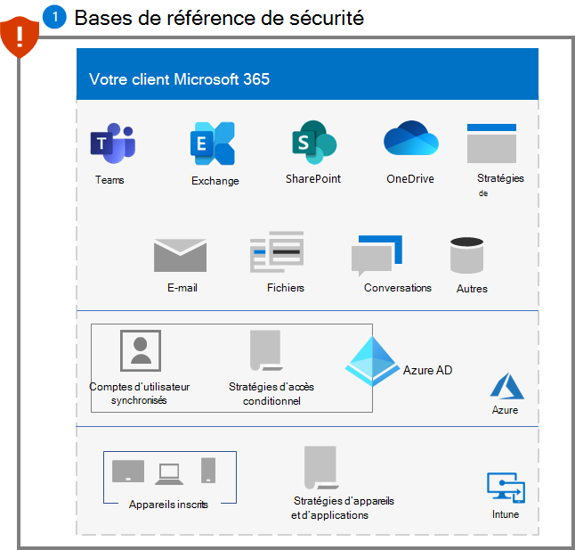
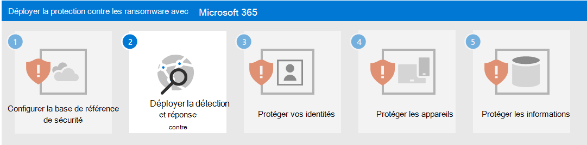

# Étape 1. Configurer les lignes de base de sécurité

Pour contrer les attaques par rançongiciels, vous devez d’abord configurer les lignes de base de sécurité définies par Microsoft suivantes :

- [Sécurité Microsoft 365](#microsoft-365-security-baseline)
- [Gestion du courrier Exchange](#exchange-email-management-baseline)
- [Lignes de base supplémentaires pour les appareils Windows et le logiciel client](#additional-baselines)

Ces lignes de base contiennent des paramètres de configuration et des règles connus des attaquants, dont l’absence est rapidement remarquée et couramment exploitée.

## Lignes de base de sécurité Microsoft 365

Tout d’abord, évaluez et mesurez votre niveau de sécurité à l’aide du [Niveau de sécurité Microsoft](/microsoft-365/security/defender/microsoft-secure-score), puis suivez les instructions pour l’améliorer selon vos besoins.

Ensuite, utilisez les [règles de réduction de la surface d’attaque](/microsoft-365/security/defender-endpoint/attack-surface-reduction) pour bloquer les activités suspectes et le contenu vulnérable. Ces règles comprennent la prévention de :

- Création de processus enfants par toutes les applications Office
- Contenu exécutable à partir du client de messagerie et du courrier web
- Exécution de fichiers exécutables, sauf s’ils répondent à un critère de prévalence, d’âge ou de liste approuvée
- Exécution de scripts potentiellement masqués
- Lancement de contenu exécutable téléchargé par JavaScript ou VBScript
- Création de contenu exécutable par les applications Office
- Injection de code dans d’autres processus par les applications Office
- Création de processus enfants par l’application de communication Office
- Processus non approuvés et non signés qui s’exécutent à partir du port USB
- Persistance via un abonnement de l'interface WMI (Windows Management Interface)
- Vol d’informations d’identification dans le sous-système d’autorité de sécurité locale de Windows (lsass.exe)
- Créations de processus provenant de commandes PSExec et WMI

## Ligne de base de gestion du courrier Exchange 

Empêchez l’accès initial à votre client par une attaque basée sur la messagerie avec les paramètres Exchange de ligne de base de courrier :

- Activez l’analyse de courrier par l’Antivirus Microsoft Defender.
- Utilisez Microsoft Defender pour Office 365 pour une [protection améliorée contre le hameçonnage](/microsoft-365/security/office-365-security/anti-phishing-protection) et une couverture contre les nouvelles menaces et les variantes polymorphes.
- Vérifiez vos paramètres de filtrage de courrier Office 365 pour vous assurer que vous bloquez les e-mails usurpés, le courrier indésirable et les courriers avec des programmes malveillants. Utilisez Defender pour Office 365 pour une protection améliorée contre le hameçonnage et une couverture contre les nouvelles menaces et les variantes polymorphes. Configurez Defender pour Office 365 pour [revérifier les liens sur un clic](/microsoft-365/security/office-365-security/atp-safe-links) et [supprimer les e-mails remis](/microsoft-365/security/office-365-security/zero-hour-auto-purge) en réponse à la veille sur les menaces récemment acquise.
- Examinez et mettez à jour les tous derniers  [paramètres recommandés pour la sécurité de Protection Exchange Online (EOP) et de Defender pour Office 365](/microsoft-365/security/office-365-security/recommended-settings-for-eop-and-office365-atp).
- Configurez Defender pour Office 365 pour [revérifier les liens sur un clic](/microsoft-365/security/office-365-security/set-up-safe-links-policies) et supprimer les e-mails remis en réponse à la veille sur les nouvelles menaces récemment acquise.

## Lignes de base supplémentaires

Appliquez les [lignes de base de sécurité](https://techcommunity.microsoft.com/t5/microsoft-security-baselines/bg-p/Microsoft-Security-Baselines) pour :

- Microsoft Windows 10
- Microsoft 365 Apps for enterprise
- Microsoft Edge

## Impact sur les utilisateurs et la gestion des modifications

En tant que meilleure pratique pour une règle de réduction de la surface d’attaque, évaluez l’impact d’une règle sur votre réseau en ouvrant la recommandation de sécurité pour cette règle dans Gestion des menaces et des vulnérabilités. Le volet des détails de recommandation décrit l’impact sur l’utilisateur, que vous pouvez utiliser pour déterminer le pourcentage de vos appareils qui peuvent accepter une nouvelle stratégie activant la règle en mode de blocage sans impact négatif sur la productivité des utilisateurs.

En outre, les paramètres de ligne de base de courrier Exchange peuvent bloquer le courrier entrant et empêcher l’envoi d’e-mails ou le clic sur des liens dans un courrier électronique. Informez vos employés sur ce comportement et sur la raison pour laquelle ces précautions sont prises.

## Configuration résultante

Voici la protection pour votre client contre les rançongiciels après cette étape.

## Étape suivante

Poursuivez avec [l’étape 2](ransomware-protection-microsoft-365-attack-detection-response.md) pour déployer les fonctionnalités de détection et de réponse aux attaques pour votre client Microsoft 365.
