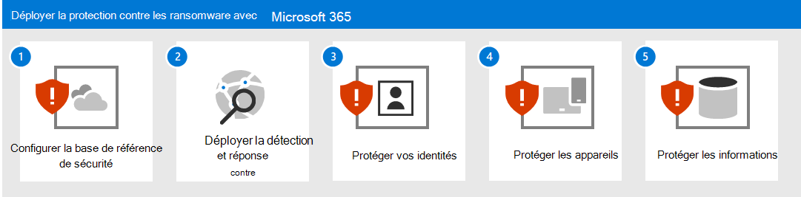
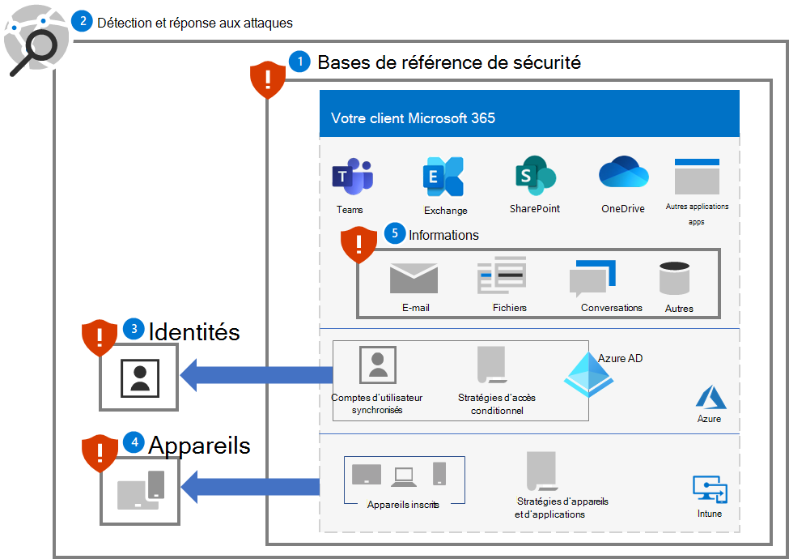
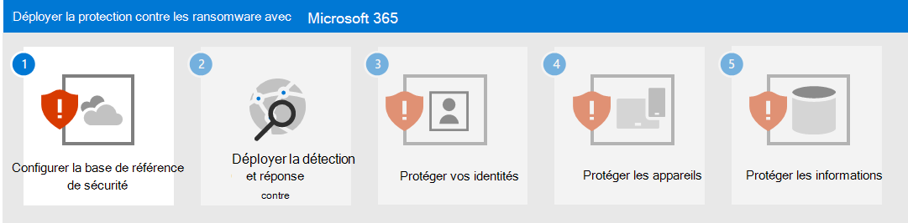

# Déployer la protection contre les rançongiciels pour votre client Microsoft 365

Le rançongiciel est un type d’attaque malveillante qui détruit ou chiffre des fichiers et des dossiers, empêchant ainsi l’accès aux données critiques. Les rançongiciels de produits se propagent généralement comme un virus qui infecte les appareils et nécessite uniquement une correction des programmes malveillants. Un rançongiciel géré par des personnes est le résultat d’une attaque active par des cybercriminels qui infiltrent l’infrastructure informatique locale ou cloud d’une organisation, élèvent leurs privilèges et déploient des rançongiciels sur des données critiques.

Une fois l’attaque terminée, un attaquant demande de l’argent aux personnes malveillantes en échange des fichiers supprimés, des clés de déchiffrement pour les fichiers chiffrés ou une promesse de ne pas libérer les données sensibles sur le site web sombre ou sur Internet public. Les rançongiciels contrôlés par l’homme peuvent également être utilisés pour arrêter des ordinateurs ou des processus critiques, tels que ceux nécessaires à la production industrielle, ce qui interrompt les opérations commerciales normales jusqu’à ce que la rançon soit payée et que les dommages soient corrigés, ou que l’organisation corrige les dommages elle-mêmes.

Une attaque par un rançongiciel contrôlé par l’homme peut être catastrophique pour les entreprises de toutes tailles et est difficile à nettoyer, nécessitant une défense totale de l’adversaire pour se protéger contre les attaques futures. Contrairement aux rançongiciels de produits, les rançongiciels gérés par l’homme peuvent continuer à menacer les opérations des entreprises après la demande de rançon initiale.

>[!Note]
>Une attaque par rançongiciel sur un client Microsoft 365 suppose que l’attaquant dispose d’informations d’identification de compte d’utilisateur valides pour un client et qu’il a accès à tous les fichiers et ressources qui sont autorisés pour le compte d’utilisateur. Une personne malveillante sans informations d’identification de compte d’utilisateur valides doit déchiffrer les données au repos qui ont été chiffrées par Microsoft 365 par défaut et le chiffrement amélioré. Pour plus d’informations, voir [La vue d’ensemble du chiffrement et de la gestion des clés](/compliance/assurance/assurance-encryption). 
>

Pour plus d’informations sur la protection contre les rançongiciels parmi les produits Microsoft, consultez ces [ressources supplémentaires sur les rançongiciels](#additional-ransomware-resources).

## La sécurité dans le cloud est un partenariat

La sécurité de vos services de cloud computing Microsoft est un partenariat entre vous et Microsoft :

- Les services de cloud computing Microsoft reposent sur la confiance et la sécurité. Microsoft met à votre disposition des contrôles et fonctionnalités de sécurité pour vous aider à protéger vos données et applications.
- Il est de votre responsabilité de protéger vos données et votre identité, ainsi que d’assurer la sécurité de vos ressources locales et des composants cloud que vous contrôlez.

En combinant ces fonctionnalités et responsabilités, nous pouvons fournir la meilleure protection contre une attaque par rançongiciel.

## Fonctionnalités d’atténuation et de récupération de rançongiciel fournies avec Microsoft 365

Un pirate par rançongiciel qui a infiltré un client Microsoft 365 peut exiger une rançon auprès de votre organisation en:

- Suppression de fichiers ou de messages électroniques
- Chiffrement des fichiers en place
- Copie de fichiers en dehors de votre client (exfiltration de données)

Toutefois, Microsoft 365 services en ligne ont de nombreuses fonctionnalités et contrôles intégrés pour protéger les données client contre les attaques par rançongiciel. Les sections suivantes fournissent un résumé. Pour plus d’informations sur la façon dont Microsoft protège les données client, la [Protection contre les programmes malveillants et les rançongiciels dans Microsoft 365](/compliance/assurance/assurance-malware-and-ransomware-protection).

>[!Note]
>Une attaque par rançongiciel sur un client Microsoft 365 suppose que l’attaquant dispose d’informations d’identification de compte d’utilisateur valides pour un client et qu’il a accès à tous les fichiers et ressources qui sont autorisés pour le compte d’utilisateur. Une personne malveillante sans informations d’identification de compte d’utilisateur valides doit déchiffrer les données au repos qui ont été chiffrées par Microsoft 365 par défaut et le chiffrement amélioré. Pour plus d’informations, voir [La vue d’ensemble du chiffrement et de la gestion des clés](/compliance/assurance/assurance-encryption). 
>

### Suppression de fichiers ou de messages électroniques

Les fichiers SharePoint et OneDrive Entreprise sont protégés par :

- Gestion des versions 

   Microsoft 365 conserve un minimum de 500 versions d’un fichier par défaut et peut être configuré pour en conserver davantage. 

   Pour réduire la charge sur votre sécurité et le personnel du service d’aide, formez vos utilisateurs sur la restauration des [versions précédentes des fichiers](https://support.microsoft.com/office/restore-a-previous-version-of-an-item-or-file-in-sharepoint-f66dbda0-81f4-4d1e-b08c-793265c58934).

- Corbeille

   Si le rançongiciel crée une copie chiffrée du fichier et supprime l’ancien fichier, les clients ont 93 jours pour le restaurer à partir de la Corbeille. Après 93 jours, il existe une fenêtre de 14 jours dans laquelle Microsoft peut toujours récupérer les données. 
  
   Pour réduire la charge sur votre sécurité et le personnel du service d’aide, formez vos utilisateurs sur la façon de [restaurer des fichiers à partir de la Corbeille](https://support.microsoft.com/en-us/office/restore-deleted-items-from-the-site-collection-recycle-bin-5fa924ee-16d7-487b-9a0a-021b9062d14b).

- [Restaurer des fichiers](https://techcommunity.microsoft.com/t5/microsoft-onedrive-blog/announcing-new-onedrive-for-business-feature-files-restore/ba-p/147436)

   Solution de récupération en libre-service complète pour SharePoint et OneDrive qui permet aux administrateurs et aux utilisateurs finaux de restaurer des fichiers à partir de n’importe quel moment au cours des 30 derniers jours.

   Pour réduire la charge sur votre sécurité et le personnel du service informatique, formez vos utilisateurs sur la [Restauration de fichiers](https://techcommunity.microsoft.com/t5/microsoft-onedrive-blog/announcing-new-onedrive-for-business-feature-files-restore/ba-p/147436).

Pour OneDrive fichiers SharePoint, Microsoft peut revenir à un point précédent dans le temps jusqu’à 14 jours si vous êtes atteint par une attaque de masse.

La messagerie électronique est protégée par :

- [Récupération d’élément unique](/exchange/recipients-in-exchange-online/manage-user-mailboxes/enable-or-disable-single-item-recovery) et rétention de boîte aux lettres, dans lesquelles vous pouvez récupérer des éléments dans une boîte aux lettres en cas de suppression accidentelle ou malveillante prématuré. Par défaut, vous pouvez supprimer les messages électroniques supprimés dans les 14 jours, configurables jusqu’à 30 jours.

- [Les stratégies de rétention](/exchange/security-and-compliance/messaging-records-management/retention-tags-and-policies) vous permettent de conserver des copies non permutables du courrier électronique pendant la période de rétention configurée.

### Chiffrement des fichiers en place

Comme décrit précédemment, les fichiers SharePoint et OneDrive Entreprise sont protégés contre le chiffrement malveillant avec :

- Gestion des versions
- Corbeille
- Bibliothèque de conservation et de préservation

Pour plus d’informations, consultez [Traitement de l’altération des données dans Microsoft 365](/compliance/assurance/assurance-dealing-with-data-corruption).

### Copie de fichiers en dehors de votre client 

Vous pouvez empêcher un pirate par rançongiciel de copier des fichiers en dehors de votre client avec :

- [Stratégie de prévention des pertes de données (DLP)](/microsoft-365/compliance/dlp-learn-about-dlp) 

    Détectez, avertissez et bloquez le partage à risque, par inadvertance ou inapproprié des données contenant :

    - Informations personnelles telles que l’identification personnelle (PII) pour le respect des réglementations régionales en matière de confidentialité.

    - Informations confidentielles de l’organisation basées sur les étiquettes de confidentialité.

- [Microsoft Cloud App Security](/cloud-app-security/what-is-cloud-app-security)

    Bloquer les téléchargements d’informations sensibles telles que des fichiers. 

    Vous pouvez également utiliser des stratégies de session [Microsoft Cloud App Security contrôle d’application d’accès conditionnel](/cloud-app-security/tutorial-dlp#how-to-discover-and-protect-sensitive-information-in-your-organization) pour surveiller le flux d’informations entre un utilisateur et une application en temps réel.

## Qu’y a-t-il dans cette solution ?

Cette solution vous guide tout au long du déploiement de Microsoft 365 fonctionnalités de protection et d’atténuation, de configurations et d’opérations en cours afin de réduire la capacité qu’a un pirate par rançongiciel à utiliser les données critiques de votre client Microsoft 365 pour exiger une rançon une auprès de votre organisation.

Les étapes de cette solution sont les suivantes :

1. [Configurer les lignes de base de sécurité](ransomware-protection-microsoft-365-security-baselines.md)
2. [Déployer la détection et la réponse aux attaques](ransomware-protection-microsoft-365-attack-detection-response.md)
3. [Protéger les identités](ransomware-protection-microsoft-365-identities.md)
4. [Protéger les appareils](ransomware-protection-microsoft-365-devices.md)
5. [Protéger les informations](ransomware-protection-microsoft-365-information.md)

Voici les cinq étapes de la solution déployée pour votre client Microsoft 365.

## Fonctionnalités de Microsoft 365

Pour protéger votre client Microsoft 365 contre une attaque par rançongiciel, utilisez ces fonctionnalités de Microsoft 365 pour ces étapes dans la solution.

### 1. Base de référence de sécurité

| Fonctionnalité | Description | Aide... | Gestion des licences |
|:-------|:-----|:-------|:-------|
| Niveau de sécurité Microsoft |  Mesure la posture de sécurité d’un client Microsoft 365 | Évaluez votre configuration de la sécurité et proposez des améliorations. | Microsoft 365 E3 ou Microsoft 365 E5 |
| Règles de réduction de la surface d’attaque | Réduit la vulnérabilité de votre organisation aux cyberattaques à l’aide de divers paramètres de configuration | Bloquer les activités suspectes et le contenu vulnérable. | Microsoft 365 E3 ou Microsoft 365 E5 |
| Paramètres de messagerie Exchange |  Active les services qui réduisent la vulnérabilité de votre organisation à une attaque basée sur la messagerie | Empêcher l’accès initial à votre client via le hameçonnage et d’autres attaques basées sur la messagerie.  | Microsoft 365 E3 ou Microsoft 365 E5 |
| Paramètres de Microsoft Windows, Microsoft Edge et Microsoft 365 Apps pour Enterprise  | Fournit des configurations de sécurité standard largement connues et testées | Empêcher les attaques par Windows, Edge et Microsoft 365 Apps pour Enterprise. | Microsoft 365 E3 ou Microsoft 365 E5 |
|

### 2. Détection et réponse

| Fonctionnalité | Description | Permet de détecter et de répondre à... | Gestion des licences |
|:-------|:-----|:-------|:-------|
| Microsoft 365 Defender | Combine les signaux et orchestre les fonctionnalités dans une solution unique    Permet aux professionnels de la sécurité d’assembler les signaux des menaces et de déterminer l’étendue et l’impact complets d’une menace    Automatise les actions pour empêcher ou arrêter l’attaque et auto-panser les boîtes aux lettres, les points de terminaison et les identités des utilisateurs affectés | Incidents, qui sont les alertes et données combinées qui font une attaque. | Microsoft 365 E5 ou Microsoft 365 E3 avec le module Microsoft 365 E5 Sécurité |
| Microsoft Defender pour l’identité |  Identifie, détecte et examine les menaces avancées, les identités compromises et les actions internes malveillantes dirigées vers votre organisation via une interface de sécurité basée sur le cloud utilise vos signaux AD DS (Active Directory Domain Services) locaux | Compromission des informations d’identification pour les comptes AD DS. | Microsoft 365 E5 ou Microsoft 365 E3 avec le module Microsoft 365 E5 Sécurité |
| Microsoft Defender pour Office 365 | Protégez votre organisation contre les menaces malveillantes posées par les messages électroniques, les liens (URL) et les outils de collaboration.    Protège contre les programmes malveillants, le hameçonnage, l’usurpation et d’autres types d’attaques | Attaques par hameçonnage. | Microsoft 365 E5 ou Microsoft 365 E3 avec le module Microsoft 365 E5 Sécurité |
| Microsoft Defender pour point de terminaison | Permet la détection et la réponse aux menaces avancées sur les points de terminaison (appareils) | Installation de programmes malveillants et compromission de l’appareil. | Microsoft 365 E5 ou Microsoft 365 E3 avec le module Microsoft 365 E5 Sécurité |
| Azure Active Directory (Azure AD) et Azure AD Identity Protection | Automatise la détection et la correction des risques basés sur l’identité et l’examen de ces risques | Compromission des informations d’identification pour les comptes Azure AD et l’élévation de privilèges. | Microsoft 365 E5 ou Microsoft 365 E3 avec le module Microsoft 365 E5 Sécurité |
| Microsoft Cloud App Security | Un courtier de sécurité d’accès au cloud pour la découverte, l’examen et la gouvernance au sein de tous vos services cloud Microsoft et tiers | Déplacement latéral et exfiltration des données. | Microsoft 365 E5 ou Microsoft 365 E3 avec le module Microsoft 365 E5 Sécurité |
|

### 3. Identités

| Fonctionnalité | Description | Permet d’éviter... | Gestion des licences |
|:-------|:-----|:-------|:-------|
|Protection par mot de passe Azure AD.|Bloquez les mots de passe à partir d’une liste commune et d’entrées personnalisées.|Détermination du mot de passe du compte d’utilisateur local ou cloud.|Microsoft 365 E3 ou Microsoft 365 E5|
|Authentification multifacteur appliquée avec accès conditionnel|Requiert une authentification multifacteur sur la base des propriétés de la connexion avec les stratégies d’accès conditionnel.|Compromission et accès aux informations d’identification.|Microsoft 365 E3 ou Microsoft 365 E5|
|Authentification multifacteur appliquée avec accès conditionnel basé sur les risques|Exigez l'AMF en fonction du risque lié à la connexion de l'utilisateur avec Azure AD Identity Protection. |Compromission et accès aux informations d’identification.|Microsoft 365 E5 ou Microsoft 365 E3 avec le module Microsoft 365 E5 Sécurité|
|

### 4. Appareils

Pour la gestion des appareils et des applications :

| Fonctionnalité | Description | Permet d’éviter... | Gestion des licences |
|:-------|:-----|:-------|:-------|
| Microsoft Intune | Gérer les appareils et les applications qu’ils exécutent  | Compromission et accès de l’appareil ou de l’application. | Microsoft 365 E3 ou E5 |
|  |  |  |  |

Pour les appareils Windows 10 :

| Fonctionnalité | Description | Aide... | Gestion des licences |
|:-------|:-----|:-------|:-------|
| Pare-feu Microsoft Defender | Fournit un pare-feu basé sur l’hôte.  | Empêcher les attaques du trafic réseau entrant non sollicité. | Microsoft 365 E3 ou Microsoft 365 E5 |
| Antivirus Microsoft Defender | Offre une protection contre les programmes malveillants des appareils (points de terminaison) à l’aide de l’apprentissage automatique, de l’analyse de big data, de la recherche approfondie de résistance aux menaces et de l’infrastructure cloud de Microsoft. | Empêcher l’installation et l’exécution de programmes malveillants. | Microsoft 365 E3 ou Microsoft 365 E5 |
| Microsoft Defender SmartScreen | Protège contre les sites web et applications de hameçonnage ou de programmes malveillants, ainsi que le téléchargement de fichiers potentiellement malveillants. | Bloquez ou avertissez lors de la vérification de sites, de téléchargements, d’applications et de fichiers. | Microsoft 365 E3 ou Microsoft 365 E5 |
| Microsoft Defender pour point de terminaison | Permet d’éviter, de détecter, d’examiner et de répondre aux menaces avancées sur les appareils (points de terminaison). | Protégez-vous contre la falsification du réseau. | Microsoft 365 E5 ou Microsoft 365 E3 avec le module Microsoft 365 E5 Sécurité |
|  |  |  |  |

### 5. Informations

| Fonctionnalité | Description | Aide... | Gestion des licences |
|:-------|:-----|:-------|:-------|
| Accès contrôlé aux dossiers | Protège vos données en vérifiant les applications par rapport à une liste d’applications connues et fiables | Empêcher les fichiers d’être modifiés ou chiffrés par un rançongiciel. | Microsoft 365 E3 ou Microsoft 365 E5 |
| Microsoft Information Protection | Permet d’appliquer des étiquettes de confidentialité à des informations pouvant être rançonnables | Empêcher l’utilisation d’informations exfiltrées. | Microsoft 365 E3 ou Microsoft 365 E5 |
| Protection contre la perte de données (DLP) | Protège les données sensibles et réduit les risques en empêchant les utilisateurs de les partager de manière inappropriée | Prévenir l'exfiltration des données. | Microsoft 365 E3 ou Microsoft 365 E5 |
| Microsoft Cloud App Security | Un courtier de sécurité d’accès au cloud pour la découverte, l’examen et la gouvernance | Détecter les mouvements latéraux et empêcher l’exfiltration des données. | Microsoft 365 E5 ou Microsoft 365 E3 avec le module Microsoft 365 E5 Sécurité |
|

## Impact sur les utilisateurs et la gestion des changements

Le déploiement de fonctionnalités de sécurité supplémentaires et l’implémentation des exigences et des stratégies de sécurité pour Microsoft 365 client peuvent avoir un impact sur vos utilisateurs. 

Par exemple, vous pouvez imposer une nouvelle stratégie de sécurité qui oblige les utilisateurs à créer des équipes pour des utilisations spécifiques avec une liste de comptes d’utilisateurs en tant que membres, au lieu de créer plus facilement une équipe pour tous les utilisateurs de l’organisation. Cela peut aider à empêcher un pirate par rançongiciel d’explorer les équipes qui ne sont pas disponibles pour le compte d’utilisateur compromis de l’attaquant et de cibler les ressources de cette équipe lors de l’attaque suivante.

Cette solution de base déterminera quand de nouvelles configurations ou stratégies de sécurité recommandées peuvent avoir un impact sur vos utilisateurs afin que vous pouvez effectuer la gestion des changements requise.

## Étapes suivantes

Utilisez ces étapes pour déployer une protection complète pour votre client Microsoft 365 :

1. [Configurer les lignes de base de sécurité](ransomware-protection-microsoft-365-security-baselines.md)
2. [Déployer la détection et la réponse aux attaques](ransomware-protection-microsoft-365-attack-detection-response.md)
3. [Protéger les identités](ransomware-protection-microsoft-365-identities.md)
4. [Protéger les appareils](ransomware-protection-microsoft-365-devices.md)
5. [Protéger les informations](ransomware-protection-microsoft-365-information.md)

## Ressources supplémentaires sur les rançongiciels

Informations clés de Microsoft :

- [Menace croissante des rançongiciels](https://blogs.microsoft.com/on-the-issues/2021/07/20/the-growing-threat-of-ransomware/), billet de blog Microsoft On the Issues du 20 juillet 2021
- [Rançongiciel géré par l’humain](/security/compass/human-operated-ransomware)
- [Se protéger rapidement contre les rançongiciels et les attaques](/security/compass/protect-against-ransomware)
- [Rapport de défense numérique Microsoft 2021](https://www.microsoft.com/security/business/microsoft-digital-defense-report) (voir les pages 10 à 19)
- [Rançongiciel : rapport d’analyses sur les menaces constantes et omniprésentes](https://security.microsoft.com/threatanalytics3/05658b6c-dc62-496d-ad3c-c6a795a33c27/overview) dans le portail Microsoft 365 Defender

Microsoft 365 :

- [Optimisez la résilience aux ransomwares avec Azure et Microsoft 365](https://azure.microsoft.com/resources/maximize-ransomware-resiliency-with-azure-and-microsoft-365/)
- [Récupérer après une attaque par rançongiciel](/microsoft-365/security/office-365-security/recover-from-ransomware)
- [Protection contre les rançongiciels et programmes malveillants](/compliance/assurance/assurance-malware-and-ransomware-protection)
- [Protéger votre PC Windows 10 contre les rançongiciels](https://support.microsoft.com//windows/protect-your-pc-from-ransomware-08ed68a7-939f-726c-7e84-a72ba92c01c3)
- [Gérer les rançongiciels dans SharePoint Online](/sharepoint/troubleshoot/security/handling-ransomware-in-sharepoint-online)
- [Rapports d’analyse sur les menaces pour les rançongiciels](https://security.microsoft.com/threatanalytics3?page_size=30&filters=tags%3DRansomware&ordering=-lastUpdatedOn&fields=displayName,alertsCount,impactedEntities,reportType,createdOn,lastUpdatedOn,tags,flag) dans le portail Microsoft 365 Defender

Microsoft 365 Defender :

- [Rechercher un rançongiciel avec la recherche avancée](/microsoft-365/security/defender/advanced-hunting-find-ransomware)

Microsoft Azure :

- [Défenses Azure pour les attaques par rançongiciel](https://azure.microsoft.com/resources/azure-defenses-for-ransomware-attack/)
- [Optimisez la résilience aux ransomwares avec Azure et Microsoft 365](https://azure.microsoft.com/resources/maximize-ransomware-resiliency-with-azure-and-microsoft-365/)
- [Plan de sauvegarde et de restauration pour se protéger contre les rançongiciels](/security/compass/backup-plan-to-protect-against-ransomware)
- [Se protéger contre les rançongiciels avec la Sauvegarde Microsoft Azure](https://www.youtube.com/watch?v=VhLOr2_1MCg) (vidéo de 26 minutes)
- [Récupération d’une compromission d’identité systémique](/azure/security/fundamentals/recover-from-identity-compromise)
- [Détection avancée d’attaques à plusieurs niveaux dans Azure Sentinel](/azure/sentinel/fusion#ransomware)
- [Détection de fusion pour rançongiciel dans Azure Sentinel](https://techcommunity.microsoft.com/t5/azure-sentinel/what-s-new-fusion-detection-for-ransomware/ba-p/2621373)

Microsoft Cloud App Security :

-  [Créer des stratégies de détection des anomalies dans Cloud App Security](/cloud-app-security/anomaly-detection-policy)

Billets de blog de l’équipe de sécurité Microsoft :

- [3 étapes pour empêcher et récupérer à partir d’un rançongiciel (septembre 2021)](https://www.microsoft.com/security/blog/2021/09/07/3-steps-to-prevent-and-recover-from-ransomware/)
- [Devenir résilient en comprenant les risques de cybersécurité : partie 4 : navigation avec les menaces actuelles (mai 2021)](https://www.microsoft.com/security/blog/2021/05/26/becoming-resilient-by-understanding-cybersecurity-risks-part-4-navigating-current-threats/)

  Consultez la section **Rançongiciel**.

- [Attaques par rançongiciels contrôlés par l’homme : un sinistre pouvant être évité (mars 2020)](https://www.microsoft.com/security/blog/2020/03/05/human-operated-ransomware-attacks-a-preventable-disaster/)

  Inclut des analyses de chaîne d’attaques des attaques réelles.

- [Réponse au rançongiciel : payer ou ne pas payer ? (Décembre 2019)](https://www.microsoft.com/security/blog/2019/12/16/ransomware-response-to-pay-or-not-to-pay/)
- [Norsk Hydro répond aux attaques par rançongiciel avec transparence (décembre 2019)](https://www.microsoft.com/security/blog/2019/12/17/norsk-hydro-ransomware-attack-transparency/)

