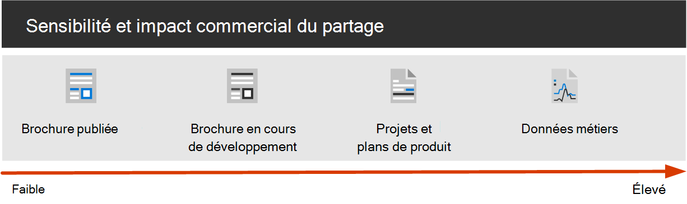

# Configurer le partage de fichiers sécurisé et la collaboration avec Microsoft Teams

La possibilité de partager facilement des fichiers et des documents avec les bonnes personnes tout en empêchant le surpartage est la clé du succès d’une organisation. Cela inclut la possibilité de partager en toute sécurité des données confidentielles ou d’autres données sensibles avec uniquement ceux qui doivent y avoir accès. Selon le projet, cela peut inclure le partage de données sensibles avec des personnes extérieures à votre organisation.

Cette solution de collaboration comprend deux composants pour vous aider :

- Déployer Teams avec le niveau de protection approprié pour chaque projet
- Configurer le partage externe avec les paramètres de sécurité appropriés pour chaque projet

Si les outils de collaboration de fichiers polyvalents et faciles à utiliser ne sont pas disponibles, les utilisateurs collaborent souvent en envoyant des documents par e-mail. Il s’agit d’une méthode de collaboration fastidieuse et sujette aux erreurs, qui peut augmenter le risque de partage inapproprié d’informations. Si les utilisateurs trouvent le partage de fichiers trop difficile, ils peuvent revenir à l’utilisation de produits de consommation qui ne sont pas régis par l’informatique. Cela peut poser un risque encore plus grand.

> [!VIDEO https://www.microsoft.com/videoplayer/embed/RWxMmL?autoplay=false]

Avec Microsoft 365, vous pouvez déployer Teams avec diverses configurations qui vous aident :

- Protéger votre propriété intellectuelle
- Faciliter la collaboration avec des documents et d’autres fichiers
- Créer un équilibre entre sécurité et facilité d’utilisation qui augmente la satisfaction des utilisateurs et réduit le risque d’informatique fantôme

La plupart des organisations disposent d’une variété d’informations, avec des degrés de sensibilité variables et des degrés variables d’impact sur l’entreprise si l’information est partagée de manière inappropriée. Selon la sensibilité d’une information donnée, vous pouvez autoriser le partage avec :

- Tout le monde (non authentifié)
- Personnes au sein de l’organisation
- Personnes spécifiques au sein de l’organisation
- Personnes spécifiques à l’intérieur et à l’extérieur de l’organisation

Les informations telles que les brochures marketing sont destinées à un large partage en dehors de l’organisation. Les informations telles que les menus de cafétéria ne sont pas destinées au partage externe, mais n’auraient aucun impact sur l’entreprise si elles étaient partagées en externe. Ces types d’informations nécessitent peu ou pas de protection.

Ces mêmes brochures marketing, alors qu’elles sont en cours de développement, peuvent uniquement être partagées au sein de l’organisation. Dans ce cas, les paramètres de partage par défaut dans Teams peuvent être suffisants.

Les informations sur un nouveau produit en cours de développement peuvent être considérées comme sensibles, même au sein de l’organisation. Un plus grand degré de protection peut être approprié dans ce cas. Vous pouvez restreindre l’accès à ces informations aux membres d’une équipe spécifique, par exemple. Selon le projet, vous devrez peut-être collaborer avec des personnes extérieures à votre organisation, telles qu’un fournisseur ou une organisation partenaire.

Les informations essentielles à la réussite de votre organisation ou qui ont des exigences strictes en matière de sécurité ou de conformité peuvent nécessiter des niveaux de protection encore plus élevés.

Pour tous les scénarios mentionnés ci-dessus, vous pouvez utiliser des équipes dans Microsoft Teams pour stocker, partager et collaborer sur les informations.

Pour configurer la collaboration sécurisée, vous utilisez ces fonctionnalités et fonctionnalités Microsoft 365.

|Produit ou composant|Fonctionnalité|Licence|
|---|---|---|
|Microsoft Defender pour Office 365|Coffre pièces jointes pour l’objet de stratégie de groupe, les OneDrive et les Teams ; Coffre documents; liens Coffre pour Teams|Microsoft 365 E1, E3 et E5|
|SharePoint|Stratégies de partage de sites et de fichiers, autorisations de partage de site, liens de partage, demandes d’accès, paramètres de partage d’invités de site|Microsoft 365 E1, E3 et E5|
|Microsoft Teams|Accès invité, équipes privées, canaux privés, canaux partagés|Microsoft 365 E1, E3 et E5|
|Microsoft Purview|Étiquettes de confidentialité|Microsoft 365 E3 et E5|

## Framework de gouvernance de collaboration pour Teams et Microsoft 365

Microsoft 365 fournit de nombreuses options pour régir votre solution de collaboration. Nous vous recommandons d’utiliser ce contenu de déploiement en même temps que le [contenu de gouvernance](collaboration-governance-overview.md) de collaboration pour créer la meilleure solution de collaboration pour votre organisation.

### Sécurisation des Teams pour les données sensibles et hautement sensibles

Pour gérer l’accès aux informations avec différentes sensibilités, nous avons développé [trois niveaux de protection différents pour Teams](configure-teams-three-tiers-protection.md). Vous pouvez personnaliser l’un de ces niveaux pour mieux répondre aux besoins ou à votre entreprise.

Ces niveaux , *de référence*, *sensibles* et *hautement sensibles* , augmentent progressivement les protections qui permettent d’éviter le surpartage et les fuites d’informations potentielles, comme indiqué dans le tableau suivant.

|-|Niveau de référence|Niveau sensible|Niveau hautement sensible|
|---|---|---|---|
|Équipe publique ou privée|Les deux|Private|Private|
|Partage non authentifié|Blocked|Blocked|Blocked|
|Partage de fichiers|Autorisé|Autorisé|Seuls les propriétaires d’équipe peuvent partager.|
|Appartenance à une équipe|N’importe qui peut rejoindre des équipes publiques. Approbation du propriétaire de l’équipe requise pour rejoindre des équipes privées.|Approbation du propriétaire de l’équipe requise pour participer.|Approbation du propriétaire de l’équipe requise pour participer.|
|Chiffrement de document|||Disponible avec l’étiquette de confidentialité|
|Partage d’invités|Autorisé|Peut être autorisé ou bloqué|Peut être autorisé ou bloqué|
|Appareils non gérés|Aucune restriction|Accès web uniquement|Blocked|

La configuration de ces niveaux implique les éléments suivants :

- Configuration des paramètres dans Teams pour l’accès invité et les canaux privés
- Configuration des paramètres dans le site SharePoint associé d’une équipe pour le partage interne et invité, les demandes d’accès et les liens de partage
- Pour les niveaux *sensibles* et *hautement sensibles* , la configuration des étiquettes de confidentialité pour classer les équipes et le contrôle du partage invité et de l’accès à partir d’appareils non gérés
- Pour le niveau *hautement sensible* , configuration d’une étiquette de confidentialité pour chiffrer les documents auxquels elle est appliquée

Commencez par le niveau de référence, puis ajoutez des équipes qui utilisent les niveaux *sensibles* et *hautement sensibles* si nécessaire pour protéger les informations de votre organisation. Consultez les ressources suivantes pour commencer :

- [Configurer les équipes avec la protection de référence](configure-teams-baseline-protection.md)
- [Configurer les équipes avec la protection des données sensibles](configure-teams-sensitive-protection.md)
- [Configurer des équipes avec la protection des données hautement sensibles](configure-teams-highly-sensitive-protection.md)

Si vous avez un projet hautement sensible qui nécessite une protection supplémentaire contre le partage, même au sein de votre organisation, vous pouvez configurer une équipe qui utilise sa propre étiquette de confidentialité pour chiffrer les fichiers afin que seuls les membres de l’équipe puissent les lire. Pour plus d’informations, consultez [Configurer une équipe avec isolation de sécurité](secure-teams-security-isolation.md) .

### Partage avec des personnes extérieures à votre organisation

Vous devrez peut-être [partager des informations de confidentialité avec des personnes extérieures à votre organisation](collaborate-with-people-outside-your-organization.md). Cela peut aller du partage d’un seul document avec une seule personne à la collaboration sur un projet majeur avec une grande organisation partenaire ou des pigistes du monde entier. Dans Microsoft 365, cette gamme de partages externes peut être effectuée facilement et avec les mesures de protection appropriées pour protéger vos informations sensibles.

Ces ressources vous aideront à commencer à configurer votre environnement pour collaborer avec des personnes extérieures à votre organisation :

- [Collaborez sur des documents](collaborate-on-documents.md) pour partager des fichiers individuels de dossiers.
- [Collaborez dans un site](collaborate-in-site.md) pour collaborer avec des invités dans un site SharePoint.
- [Collaborez en équipe](collaborate-as-team.md) pour collaborer avec des invités d’une équipe.
- [Collaborez avec des participants externes dans un canal](/microsoft-365/solutions/collaborate-teams-direct-connect) pour collaborer avec des personnes extérieures à l’organisation dans un canal partagé.

En fonction de la sensibilité des informations partagées, vous pouvez ajouter des dispositifs de protection pour éviter le surpartage. Ces ressources vous aideront à configurer les protections dont vous avez besoin pour votre organisation :

- [Meilleures pratiques relatives au partage de fichiers et de dossiers avec des utilisateurs non authentifiés](best-practices-anonymous-sharing.md)
- [Limiter l’exposition accidentelle de fichiers lors de partages avec des personnes extérieures à votre organisation](share-limit-accidental-exposure.md)
- [Créer un environnement de partage sécurisé avec des invités](create-secure-guest-sharing-environment.md)

Si vous avez un projet majeur avec une organisation partenaire, vous pouvez utiliser [des canaux partagés](/microsoft-365/solutions/collaborate-teams-direct-connect) ou [Azure Entitlement Management](b2b-extranet.md) pour gérer les personnes extérieures à votre organisation avec lesquelles vous devez collaborer.

## Formation pour les administrateurs

Ces modules de formation de Microsoft Learn peuvent vous aider à découvrir les fonctionnalités de collaboration, de gouvernance et d’identité dans Teams et SharePoint.

### Équipes

|Formation :|Gérer la collaboration en équipe avec Microsoft Teams|
|---|---|
||Gérer la collaboration en équipe avec Microsoft Teams vous présente les fonctionnalités et possibilités de Microsoft Teams, le Hub central pour la collaboration en équipe dans Microsoft 365. Vous découvrirez comment utiliser Teams pour simplifier le travail en équipe et la communication au sein de votre organisation, à la fois en local et hors site, sur un large éventail d’appareils (des bureaux aux tablettes et téléphones), tout en tirant parti des fonctionnalités enrichies des applications Office 365. Vous pourrez ainsi comprendre comment Teams fournit un environnement complet et flexible pour la collaboration entre les applications et les appareils. Cette rubrique d’apprentissage peut vous aider à vous préparer à la certification Certification Microsoft 365 : Administrateur Teams associé.
2 h 17 min - chemin Learning - 5 modules|

> [!div class="nextstepaction"]
> [Démarrer >](/learn/modules/m365-teams-collab-prepare-deployment/introduction/)

### SharePoint

|Formation :|Collaborer avec SharePoint dans Microsoft 365|
|---|---|
||Gérer le contenu partagé avec Microsoft SharePoint vous présente les fonctionnalités de SharePoint, ainsi que son fonctionnement avec Microsoft 365. Vous découvrirez les différents types de sites SharePoint, notamment les sites hub, ainsi que la protection des informations, la création de rapports et la surveillance. En outre, vous apprendrez à utiliser le partage de fichiers et de dossiers SharePoint pour optimiser la collaboration, à partager des fichiers en externe et à gérer des sites SharePoint dans le Centre d’administration SharePoint. Cette rubrique d’apprentissage peut vous aider à vous préparer à la certification Certification Microsoft 365 : Administrateur de travail d’équipe associé.
1 h 14 min - chemin Learning - 4 modules|

> [!div class="nextstepaction"]
> [Démarrer >](/learn/modules/m365-teams-sharepoint-plan-sharepoint/introduction/)

### Protection des informations

|Formation :|Protéger les informations d’entreprise avec Microsoft 365|
|---|---|
||La protection et la sécurisation des informations de votre organisation sont plus exigeantes que jamais. Le chemin d'accès de l’apprentissage Protéger une entreprise à l’aide de Microsoft 365 explique comment protéger vos informations sensibles contre tout partage excessif accidentel ou utilisation incorrecte, comment découvrir et classifier des données, comment les protéger à l’aide d’étiquettes de confidentialité, et comment surveiller et analyser vos informations sensibles pour prévenir leurs perte.
1 heure - chemin d’accès Learning - 5 modules|

> [!div class="nextstepaction"]
> [Démarrer >](/learn/modules/m365-security-info-overview/introduction/)

### Identité et accès

|Formation :|Protégez l’identité et l’accès avec Azure Active Directory Domain Services|
|---|---|
||Le parcours d’apprentissage Identité et accès aborde les dernières technologies de gestion des identités et accès, ainsi que les outils de renforcement de l’authentification, et donne des conseils sur la protection des identités au sein de votre organisation. Les technologies de gestion des identités et accès de Microsoft vous permettent de sécuriser l’identité de votre organisation (locale ou dans le cloud) et permettent à vos utilisateurs de travailler en toute sécurité où qu’ils se trouvent. Cette rubrique d’apprentissage peut vous aider à vous préparer aux certifications Certification Microsoft 365 : Administrateur de sécurité associé et Certification Microsoft 365 : Administration entreprise expert.
2 h 52 min - chemin Learning - 6 modules|

> [!div class="nextstepaction"]
> [Démarrer >](/learn/modules/m365-identity-overview/introduction/)

## Formation pour les utilisateurs finaux

Ces modules de formation peuvent aider vos utilisateurs à utiliser des Teams, des groupes et des SharePoint pour la collaboration dans Microsoft 365.

|Équipes|SharePoint|
|---|---|
| **[Configurer et personnaliser votre équipe](https://support.microsoft.com/office/702a2977-e662-4038-bef5-bdf8ee47b17b)**| **[Partager et synchroniser](https://support.microsoft.com/office/98cb2ff2-c27e-42ea-b055-c2d895f8a5de)**|
| **[Télécharger et rechercher des fichiers](https://support.microsoft.com/office/57b669db-678e-424e-b0a0-15d19215cb12)**||
| **[Collaborer dans des équipes et des canaux](https://support.microsoft.com/office/c3d63c10-77d5-4204-a566-53ddcf723b46)**||

## Illustrations

Ces illustrations vous aideront à comprendre comment les groupes et les équipes interagissent avec d’autres services dans Microsoft 365 et les fonctionnalités de gouvernance et de conformité disponibles pour vous aider à gérer ces services au sein de votre organisation.

### Groupes dans Microsoft 365 pour les architectes informatique

Quels sont les besoins des architectes informatique concernant les groupes dans Microsoft 365

|**Item**|**Description**|
|---|---|
|   [PDF](https://github.com/MicrosoftDocs/microsoft-365-docs/raw/public/microsoft-365/downloads/msft-m365-groups.pdf) \| [Visio](https://github.com/MicrosoftDocs/OfficeDocs-Enterprise/raw/live/Enterprise/downloads/msft-m365-groups.vsdx)   Mise à jour de juin 2019|Ces illustrations décrivent les différents types de groupes, la manière dont ceux-ci sont créés et gérés et quelques recommandations en matière de gouvernance.|

### Microsoft Teams et services de productivité connexes dans Microsoft 365 pour les architectes informatique

L’architecture logique de services de productivité dans Microsoft 365, fonctionnant avec Microsoft Teams.

|**Item**|**Description**|
|---|---|
|   [PDF](https://github.com/MicrosoftDocs/microsoft-365-docs/raw/public/microsoft-365/downloads/msft-m365-teams-logical-architecture.pdf) \| [Visio](https://github.com/MicrosoftDocs/OfficeDocs-Enterprise/raw/live/Enterprise/downloads/msft-m365-teams-logical-architecture.vsdx)   Mise à jour d’avril 2019|Microsoft fournit une suite de services de productivité qui fonctionnent ensemble pour fournir une expérience de collaboration avec la gouvernance des données, la sécurité et la conformité. 
Cette série d’illustrations fournit une visibilité de l’architecture logique de services de productivité pour les architectes d’entreprise, fonctionnant avec Microsoft Teams.|

## Déployer la solution de collaboration sécurisée

Lorsque vous êtes prêt à déployer cette solution, procédez comme suit :

1. Configurez les [trois niveaux de protection différents pour Teams](configure-teams-three-tiers-protection.md).
2. Configurez des paramètres pour [partager des informations de confidentialité avec des personnes extérieures à votre organisation](collaborate-with-people-outside-your-organization.md).

## Voir aussi

[Documentation de sécurité Office 365](../security/index.yml)

[Documentation Microsoft Purview](../compliance/index.yml)

[Bienvenue dans Microsoft Teams](/MicrosoftTeams/Teams-overview)
