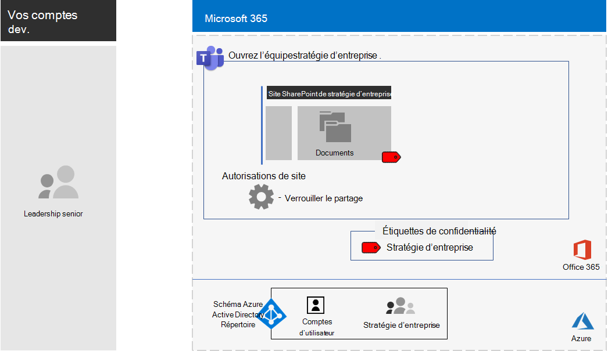

# <a name="configure-a-team-with-security-isolation-in-a-devtest-environment"></a>Configurer une équipe avec une isolation des problèmes de sécurité dans un environnement de test/développement

Cet article fournit des instructions pas à pas pour créer une [équipe avec une isolation des problèmes de sécurité](secure-teams-security-isolation.md) dans un environnement de développement/test.

[Configuration de la stratégie d’entreprise pour équipe isolée.](../media/team-security-isolation-dev-test/team-security-isolation-dev-test-config.png)

Utilisez cet environnement de développement/test pour expérimenter et affiner les paramètres de vos besoins spécifiques avant de déployer ce type d’équipe en production.

## <a name="phase-1-build-out-your-microsoft-365-enterprise-test-environment"></a>Phase 1 : Créer l’environnement de test Microsoft 365 Entreprise

Si vous souhaitez simplement tester les équipes sensibles et hautement sensibles de manière rapide avec une configuration minimale, suivez les instructions de [Configuration de base](../enterprise/lightweight-base-configuration-microsoft-365-enterprise.md).

Si vous voulez tester les équipes sensibles et hautement sensibles au sein d’une entreprise simulée, suivez les instructions de [Synchronisation de hachage de mot de passe](../enterprise/password-hash-sync-m365-ent-test-environment.md).

> [!NOTE]
> Tester une équipe sensible avec une isolation des problèmes de sécurité ne requiert pas d’environnement de test en entreprise simulée, qui utilise un intranet simulé connecté à Internet et la synchronisation d’annuaire pour une forêt Active Directory. Domain Services (AD DS). Il est proposé comme option dans cet article afin que vous puissiez tester une équipe avec une isolation des problèmes de sécurité et faire des essais dans un environnement qui représente une organisation classique.

## <a name="phase-2-create-and-configure-your-azure-active-directory-azure-ad-group-and-users"></a>Phase 2 : Création et configuration de votre groupe et des utilisateurs Azure Active Directory (AD)

Dans cette phase, vous créez et vous configurez le groupe et les utilisateurs Azure AD de votre organisation fictive.

Créez tout d’abord un groupe de sécurité à l’aide du portail Microsoft Azure.

1. Créez un onglet distinct dans votre navigateur, puis accédez au portail Azure à l'adresse [https://portal.azure.com](https://portal.azure.com). Si nécessaire, connectez-vous avec les informations d'identification du compte d'administrateur global pour votre essai ou abonnement payant Microsoft 365 E5.

2. Dans le portail Azure, cliquez sur **Azure Active Directory > Groupes**.

3. Dans le panneau **Groupes - Tous les groupes**, cliquez sur **+ Nouveau groupe**.

4. Dans le panneau **Groupe** :

  - Sélectionnez **Sécurité** dans **Type de groupe**.

  - Tapez **C-Suite** dans le champ **Nom**.

  - Sélectionnez **Affecté** dans le champ **Type d’appartenance**.

5. Cliquez sur **Créer** et fermez le panneau **Groupe**.

Ensuite, configurez la gestion de licences automatique pour que les membres du nouveau groupe **C-Suite** reçoivent automatiquement une licence Microsoft 365 E5.

1. Dans le portail Azure, cliquez sur **Azure Active Directory > Licences > Tous les produits**.

2. Dans la liste, sélectionnez **Microsoft 365 Entreprise E5**, puis cliquez sur **Attribuer**.

3. Dans le panneau **Affecter une licence**, cliquez sur **Utilisateurs et groupes**.

4. Dans la liste des groupes, sélectionnez le groupe **C-Suite**.

5. Cliquez sur **Sélectionner**, puis sur **Affecter**.

6. Fermez l’onglet du portail Azure dans votre navigateur.

Ensuite, [connectez-vous avec le module PowerShell Azure Active Directory pour Graph](../enterprise/connect-to-microsoft-365-powershell.md#connect-with-the-azure-active-directory-powershell-for-graph-module).

Renseignez le nom de votre organisation, votre emplacement et un mot de passe commun, puis exécutez les commandes suivantes à partir de l’invite de commandes PowerShell ou de l’environnement de script intégré (ISE) pour créer des comptes d’utilisateur et les ajouter au groupe C-Suite :

```powershell
$orgName="<organization name, such as contoso-test for the contoso-test.onmicrosoft.com trial subscription domain name>"
$location="<the ISO ALPHA2 country code, such as US for the United States>"
$commonPassword="<common password for all the new accounts>"

$PasswordProfile=New-Object -TypeName Microsoft.Open.AzureAD.Model.PasswordProfile
$PasswordProfile.Password=$commonPassword

$groupName="C-Suite"
$userNames=@("CEO","CFO","CIO")
$groupID=(Get-AzureADGroup | Where { $_.DisplayName -eq $groupName }).ObjectID
ForEach ($element in $userNames){
New-AzureADUser -DisplayName $element -PasswordProfile $PasswordProfile -UserPrincipalName ($element + "@" + $orgName + ".onmicrosoft.com") -AccountEnabled $true -MailNickName $element -UsageLocation $location
Add-AzureADGroupMember -RefObjectId (Get-AzureADUser | Where { $_.DisplayName -eq $element }).ObjectID -ObjectId $groupID
}
```

> [!NOTE]
> L'utilisation d'un mot de passe commun vise à automatiser et à faciliter la configuration d'un environnement de développement ou de test. Évidemment, cela est fortement déconseillé pour les abonnements de production.

Utilisez ces étapes pour vérifier que la gestion des licences basée sur un groupe fonctionne correctement.

1. Connectez-vous au [Centre d’administration Microsoft 365](https://admin.microsoft.com).

2. Sous le nouvel onglet **Centre d’administration Microsoft 365** de votre navigateur, cliquez sur **Utilisateurs**.

3. Dans la liste des utilisateurs, cliquez sur **PDG**.

4. Dans le volet qui affiche les propriétés du compte d’utilisateur **PDG**, vérifiez que les licences **Microsoft 365 Entreprise E5** lui ont été affectées dans les **Licences de produit**.

## <a name="phase-3-create-your-team"></a>Phase 3 : créer votre équipe

Au cours de cette phase, vous créez et configurez une équipe avec l’isolation des problèmes de sécurité pour les membres de l’équipe de direction afin de collaborer sur la stratégie de l’entreprise.

Veillez tout d’abord à activer [étiquettes de confidentialité pour protéger le contenu de Microsoft Teams, des groupes Office 365 et des sites SharePoint](../compliance/sensitivity-labels-teams-groups-sites.md) avant de passer aux étapes décrites dans cet article.

Ensuite, créez l’équipe :

1. Dans Teams, cliquez sur **Teams** sur le côté gauche de l’application, puis cliquez sur **Rejoindre ou créer une équipe** en bas de la liste des équipes.
2. Cliquez sur **Créer une équipe** (première carte, coin supérieur gauche).
3. Sélectionnez **Créer une équipe à partir de zéro**.
4. Dans la liste **Sensibilité**, conservez la valeur par défaut.
5. Sous **Confidentialité**, cliquez sur **Privée**.
6. Tapez **Stratégie d’entreprise**, puis cliquez sur **Créer** > **Fermer**.

Restreignez ensuite la création de canaux privés aux propriétaires du groupe stratégie de l’entreprise.

1. Dans l’équipe, cliquez sur **Autres options**, puis cliquez sur **Gérer l’équipe**.
2. Sous l’onglet **Paramètres**, développez **Autorisations de membre**.
3. Désactivez la case à cocher **Autoriser les membres à créer des canaux privés**.

Vous devez ensuite configurer une étiquette de confidentialité avec les paramètres suivants :

- Le nom est stratégie d’entreprise
- Le chiffrement est activé
- Le groupe Stratégie de l’entreprise possède des autorisations de co-création

Procédez comme suit :

1. Ouvrez le portail de conformité Microsoft Purview, puis sous **Solutions**, sélectionnez <a href="https://go.microsoft.com/fwlink/p/?linkid=2174015" target="_blank">**Protection des données**</a>.
1. Cliquez sur **Créer une étiquette**.
1. Tapez **Stratégie d’entreprise** comme nom d’étiquette.
1. Tapez **Documents de stratégie de la direction de l’entreprise** sous forme d’info-bulle, puis cliquez **Suivant**.
1. Sur la page **Chiffrement**, dans le menu déroulant **Chiffrement**, sélectionnez **Appliquer**.
1. Pour ajouter des autorisations d’équipe :<br>a. Cliquez sur **Attribuer des autorisations**.<br>b. Cliquez sur **Ajouter des utilisateurs ou des groupes**, sélectionnez **La stratégie de l’entreprise**, enfin cliquez sur **Ajouter**.<br>c. Cliquez sur **Choisir les autorisations**.<br>d. Sélectionnez **Co-auteur** dans la liste déroulante, puis cliquez sur **Enregistrer**.<br>
1. Cliquez sur **Suivant**.
1. Dans la page **Marque de contenu**, cliquez sur **Suivant**.
1. Dans la page **Paramètres de site et de groupe**, configurez **Paramètres de site et de groupe** sur **Activé**.
1. Dans la liste déroulante **Confidentialité de sites d’équipe Office 365 connectés à un groupe**, sélectionnez **Privé : seuls les membres peuvent accéder au site**.
1. Sous **Appareils non gérés**, sélectionnez **Bloquer l’accès**.
1. Cliquez sur **Suivant**.
1. Dans la page **Étiquetage automatique pour les applications Office**, cliquez sur **Suivant**.
1. Cliquez sur **Envoyer**, puis sur **Terminé**.

Ensuite, publiez la nouvelle étiquette en procédant comme suit :

1. Dans le portail de conformité Microsoft Purview, sur la page <a href="https://go.microsoft.com/fwlink/p/?linkid=2174015" target="_blank">**Protection des données**</a>, choisissez l’onglet **Stratégies d’étiquette**.
2. Cliquez sur **Publier des étiquettes**.
3. Dans la page **Choisir des étiquettes de confidentialité à publier**, cliquez sur **Choisir des étiquettes de confidentialité à publier**.
4. Sélectionnez **Stratégie d’entreprise**, puis cliquez sur **Ajouter**.
5. Cliquez sur **Suivant**.
6. Dans la page **Publier pour les utilisateurs et groupes**, cliquez sur **Choisir les utilisateurs et les groupes**.
7. Cliquez sur **Ajouter**, puis sélectionnez **Stratégie d’entreprise**.
8. Cliquez sur **Ajouter**, puis sur **Terminé**.
9. Cliquez sur **Suivant**.
10. Dans la page Paramètres de stratégie, activez la case à cocher **Les utilisateurs doivent fournir une justification pour supprimer une étiquette ou une étiquette de classification inférieure**, puis cliquez sur **Suivant**.
11. Tapez **Stratégie d’entreprise** comme nom de stratégie, puis cliquez sur **Suivant**.
12. Cliquez sur **Envoyer**, puis cliquez sur **Terminé**.

La **Stratégie d’entreprise** peut prendre un certain temps avant de devenir disponible une fois qu'elle a été publiée.

Ensuite, appliquez votre nouvelle étiquette à l’équipe **Stratégie d’entreprise** et mettez à jour le type de lien de partage par défaut pour réduire le risque de partager accidentellement des fichiers et des dossiers avec un public plus large que prévu.

1. Ouvrez le Centre d’administration SharePoint, sous **Sites**, sélectionnez <a href="https://go.microsoft.com/fwlink/?linkid=2185220" target="_blank">**Sites actifs**</a>.
1. Cliquez sur le site **Stratégie d’entreprise** .
1. Sous l’onglet **Stratégies**, sous **Confidentialité**, cliquez sur **Modifier**.
1. Sélectionnez l’étiquette **Stratégie d’entreprise**, puis cliquez sur **Enregistrer**.
1. Sous l’onglet **Stratégies**, sous **Partage externe**, cliquez sur **Modifier**.
1. Choisissez **Uniquement les personnes de votre organisation**.
1. Sous Type de lien de **Partage par défaut**, désactivez la case à cocher **Identique au paramètre de niveau organisation**, puis sélectionnez **Personnes disposant d’un accès existant**.
1. Sélectionnez **Enregistrer**.

Ensuite, configurez le partage de sites aux propriétaires uniquement pour l’équipe de **Stratégie d’entreprise**.

1. Dans Teams, accédez à l’onglet **Général** de l’équipe de la **Stratégie d’entreprise**.
2. Dans la barre d’outils de l’équipe, cliquez sur **Fichiers**.
3. Cliquez sur les points de suspension, puis sur **Ouvrir dans SharePoint**.
4. Dans la barre d’outils du site SharePoint sous-jacent, cliquez sur l’icône Paramètres, puis cliquez sur **Autorisations du site**.
5. Dans le volet Autorisations de site, sous le **Site de partage**, cliquez sur **Modifier les modalités de partage par les membres**.
6. Sous **Autorisations de partage**, sélectionnez **Seuls les propriétaires du site peuvent partager des fichiers, des dossiers et le site**, puis cliquez sur **Enregistrer**.
7. Fermez les volets **Autorisations** et **Paramètres**.

Si vous vous connectez en tant que membre du groupe **Stratégie d’entreprise**, la nouvelle étiquette apparaît dans l’option **Confidentialité** de la barre d’outils Accueil de Word, Excel et PowerPoint. Sélectionnez l’étiquette **Stratégie d’entreprise** à partir de l’option **Confidentialité** pour affecter l’étiquette à un fichier.

Voici la configuration obtenue pour l’équipe Stratégie d’entreprise.



## <a name="next-step"></a>Étape suivante

Lorsque vous êtes prêt pour le déploiement en production, consultez ces [instructions de configuration](secure-teams-security-isolation.md).
