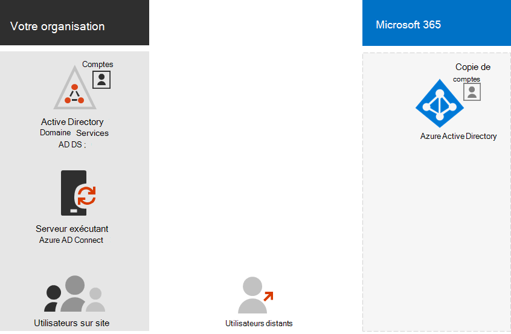

# Étape 3. Identité de vos clients Microsoft 365 entreprise

Votre client Microsoft 365 inclut un client Azure Active Directory (Azure AD) pour gérer les identités et l’authentification des connecteurs. La configuration correcte de votre infrastructure d’identité est essentielle à la gestion des autorisations et de l’accès des utilisateurs Microsoft 365 pour votre organisation.

## Cloud uniquement et hybride

Voici les deux types de modèles d’identité et leur meilleur ajustement et leurs avantages.

| Modèle | Description | Comment Microsoft 365 authentifier les informations d’identification de l’utilisateur | Recommandé pour | Plus grand avantage |
|:-------|:-----|:-----|:-----|:-----|
| Cloud uniquement | Le compte d’utilisateur existe uniquement dans le client Azure AD de votre client Microsoft 365. | Le client Azure AD de votre client Microsoft 365 effectue l’authentification avec le compte d’identité cloud. | Organisations qui n’ont pas ou n’ont pas besoin d’une AD DS locale. | Simple à utiliser. Aucun outil ou serveur d’annuaire supplémentaire n’est requis. |
| Hybride |  Un compte d’utilisateur existe dans vos services de domaine Active Directory (AD DS) locaux et une copie se trouve également dans le client Azure AD pour votre client Microsoft 365. Azure AD Connect s’exécute sur un serveur local pour synchroniser les modifications AD DS avec votre client Azure AD. Le compte d’utilisateur dans Azure AD peut également inclure une version hachée du mot de passe de compte d’utilisateur AD DS déjà haché. | Le client Azure AD de votre client Microsoft 365 gère le processus d’authentification ou redirige l’utilisateur vers un autre fournisseur d’identité. | Organisations utilisant AD DS ou un autre fournisseur d’identité. | Les utilisateurs peuvent utiliser les mêmes informations d’identification lors de l’accès à des ressources sur site ou en nuage. |
||||||

Voici les composants de base de l’identité cloud uniquement.
 

Dans cette illustration, les utilisateurs locaux et distants se connectent avec des comptes dans le client Azure AD de leur client Microsoft 365.

Voici les composants de base de l’identité hybride.

Dans cette illustration, les utilisateurs locaux et distants se connectent à leur client Microsoft 365 avec des comptes dans le client Azure AD qui ont été copiés à partir de leur AD DS local.

## Synchronisation de vos AD DS sur site

En fonction des besoins de votre entreprise et des exigences techniques, le modèle d’identité hybride et la synchronisation d’annuaires sont le choix le plus courant pour les clients d’entreprise qui adoptent Microsoft 365. La synchronisation d’annuaires vous permet de gérer les identités dans vos services AD DS et toutes les mises à jour des comptes d’utilisateur, des groupes et des contacts sont synchronisées avec le client Azure AD de votre client Microsoft 365.

>[!Note]
>Lorsque les comptes d’utilisateurS AD DS sont synchronisés pour la première fois, ils ne se voit pas attribuer automatiquement une licence Microsoft 365 et ne peuvent pas accéder aux services Microsoft 365, tels que la messagerie électronique. Vous devez d’abord leur attribuer un emplacement d’utilisation. Ensuite, attribuez une licence à ces comptes d’utilisateurs, individuellement ou dynamiquement par le biais de l’appartenance à un groupe.
>

Voici les deux types d’authentification lors de l’utilisation du modèle d’identité hybride.

| Type d’authentification | Description |
|:-------|:-----|
| Authentification gérée | Azure AD gère le processus d’authentification à l’aide d’une version de hachage stockée localement du mot de passe ou envoie les informations d’identification à un agent logiciel local pour qu’ils soient authentifiés par les services AD DS locaux.      Il existe deux types d’authentification gérée : la synchronisation de hachage de mot de passe (PHS) et l’authentification directe (PTA). Avec PHS, Azure AD effectue l’authentification elle-même. Avec PTA, Azure AD a AD DS effectuer l’authentification. |
| Authentification fédérée | Azure AD redirige l’ordinateur client demandant l’authentification vers un autre fournisseur d’identité. |
|  |  |

Pour en [savoir plus,](https://docs.microsoft.com/azure/active-directory/hybrid/choose-ad-authn) voir choisir la méthode d’authentification la plus efficace.

## Application de signatures fortes

Pour renforcer la sécurité des utilisateurs qui se connectent, utilisez les fonctionnalités du tableau suivant.

| Fonctionnalité | Description | Plus d’informations | Critères de licence |
|:-------|:-----|:-----|:-----|:-----|
| Windows Hello Entreprise | Remplace les mots de passe par une authentification forte à deux facteurs lors de la signature sur un appareil Windows. Les deux facteurs sont un nouveau type d’informations d’identification d’utilisateur qui est lié à un appareil et à un code biométrique ou PIN. | [Vue d’ensemble de Windows Hello Entreprise](https://docs.microsoft.com/windows/security/identity-protection/hello-for-business/hello-overview) | Microsoft 365 E3 ou E5 |
| Protection par mot de passe Azure AD. | Détecte et bloque les mots de passe faibles connus et leurs variantes, et peut également bloquer d’autres termes faibles spécifiques à votre organisation. | [Configurer la protection par mot de passe Azure AD](https://docs.microsoft.com/azure/active-directory/authentication/concept-password-ban-bad) | Microsoft 365 E3 ou E5 |
| Utilisez l’authentification multifacteur (MFA) | L' validation de compte d’utilisateur exige que les utilisateurs se connectent à une vérification supplémentaire au-delà du mot de passe du compte d’utilisateur, telle qu’une vérification avec une application de smartphone ou un SMS envoyé à un smartphone. Regardez [cette vidéo](https://support.microsoft.com/office/set-up-multi-factor-authentication-in-microsoft-365-business-a32541df-079c-420d-9395-9d59354f7225) pour obtenir des instructions sur la façon dont les utilisateurs définissent l’famf. | [MFA pour Microsoft 365 pour entreprise](../enterprise/microsoft-365-secure-sign-in.md#mfa) | Microsoft 365 E3 ou E5 |
| Configurations des identités et de l’accès aux appareils | Paramètres et stratégies qui se composent des fonctionnalités prérequises recommandées et de leurs paramètres combinés aux stratégies d’accès conditionnel, Intune et Azure AD Identity Protection qui déterminent si une demande d’accès donnée doit être accordée et dans quelles conditions.  | [Configurations des identités et de l’accès aux appareils](../security/office-365-security/microsoft-365-policies-configurations.md) | Microsoft 365 E3 ou E5 |
| Azure AD Identity Protection | Protégez-vous contre la compromission des informations d’identification, où une personne malveillante détermine le nom de compte et le mot de passe d’un utilisateur pour accéder aux données et services cloud d’une organisation. | [Azure AD Identity Protection](https://docs.microsoft.com/azure/active-directory/active-directory-identityprotection) | Microsoft 365 E5 ou Microsoft 365 E3 avec le module & protection contre les menaces |
|  |  |  |

## Résultats de l’étape 3

Pour l’identité de votre client Microsoft 365, vous avez déterminé :

- Modèle d’identité à utiliser.
- Comment appliquer un accès fort aux utilisateurs et aux appareils.

Voici un exemple de client avec les nouveaux éléments d’identité hybride mis en évidence.

Dans cette illustration, le client a :

- Forêt AD DS synchronisée avec le client Azure AD à l’aide d’un serveur DirSync et d’Azure AD Connect.
- Copie des comptes d’utilisateur AD DS et d’autres objets de la forêt AD DS.
- Ensemble de stratégies d’accès conditionnel pour appliquer la sécurisation des utilisateurs et l’accès en fonction du compte d’utilisateur. 

## Maintenance continue de l’identité

Régulièrement, vous devrez peut-être :

- Ajouter ou modifier des comptes d’utilisateurs et des groupes. Pour l’identité cloud uniquement, vous conservez vos utilisateurs et groupes basés sur le cloud avec les outils Azure AD tels que le Centre d’administration Microsoft 365 ou PowerShell. Pour l’identité hybride, vous maintenez vos utilisateurs et groupes locaux à l’aide des outils AD DS.
- Ajoutez ou modifiez votre configuration d’accès aux identités et appareils pour appliquer les exigences de sécurité de la signature.

## Étape suivante

Poursuivez [la migration](tenant-management-migration.md) pour migrer vos serveurs Office locaux et leurs données vers Microsoft 365.
