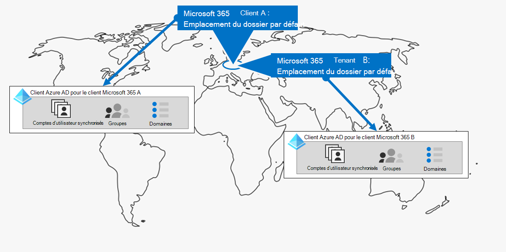
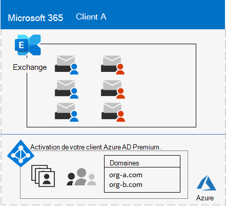

# Étape 1. Votre Microsoft 365 pour les locataires d’entreprise

L’une de vos premières décisions client est le nombre à prendre. Chaque Microsoft 365 client est distinct, unique et distinct de tous les autres Microsoft 365 client. Son client Azure AD correspondant est également distinct, unique et distinct de tous les autres Microsoft 365 client.

## Client unique
Le fait d’avoir un seul client simplifie de nombreux aspects de l’utilisation des Microsoft 365. Un seul client signifie un seul client Azure AD avec un ensemble unique de comptes, de groupes et de stratégies. Les autorisations et le partage des ressources au sein de votre organisation peuvent être effectués via ce fournisseur d’identité central.

Un client unique offre à vos utilisateurs l’expérience de collaboration et de productivité la plus riche et la plus simplifiée en fonctionnalités.

Voici un exemple montrant l’emplacement par défaut et le client Azure AD d’Microsoft 365 client.

## Plusieurs clients

Il existe de nombreuses raisons pour lesquelles votre organisation peut avoir plusieurs locataires :

- Isolation administrative
- It décentralisé
- Décisions historiques
- Fusions, acquisitions ou désinttures
- Séparation claire de la marque pour les organisations conglomérats
- Préproduction, test ou client bac à sable

Voici un exemple d’organisation qui possède deux clients (client A et client B) dans la même géo de centre de données par défaut. Chaque client en tant que client Azure AD distinct.

Lorsque vous avez plusieurs clients, il existe des restrictions et des considérations supplémentaires lors de leur gestion et de la fourniture de services à vos utilisateurs.

### Collaboration inter-clients

Si vous souhaitez que vos utilisateurs collaborent plus efficacement entre différents clients Microsoft 365 de manière sécurisée, les options de collaboration entre clients incluent l’utilisation d’un emplacement central pour les fichiers et les conversations, le partage de calendriers, l’utilisation de la messagerie instantanée, des appels audio/vidéo pour la communication et la sécurisation de l’accès aux ressources et aux applications.

Pour plus d’informations, [voir Microsoft 365 collaboration inter-locataires.](../enterprise/microsoft-365-inter-tenant-collaboration.md)

### Migration de boîtes aux lettres entre locataires (prévisualisation)

Avant la migration de boîtes aux lettres entre les locataires (en prévisualisation), lors du déplacement de boîtes aux lettres Exchange Online entre des locataires, vous devez déboarder complètement une boîte aux lettres utilisateur de son client actuel (le client source) vers l’ordinateur local, puis les intégrer à un nouveau client (le client cible). Grâce à la nouvelle fonctionnalité de migration de boîtes aux lettres entre les locataires, les administrateurs client des locataires source et cible peuvent déplacer des boîtes aux lettres entre les locataires avec des dépendances d’infrastructure minimales dans leurs systèmes locaux. Cela supprime la nécessité de supprimer les boîtes aux lettres d’intégration et d’intégration.

Voici deux exemples de client et leurs boîtes aux lettres avant la migration de boîtes aux lettres entre locataires.

Dans cette illustration, deux locataires distincts ont leurs propres domaines et ensemble de Exchange boîtes aux lettres.

Voici le client cible (locataire A) après la migration de boîtes aux lettres entre les locataires.

Dans cette illustration, un seul client possède à la fois des domaines et les deux ensembles Exchange boîtes aux lettres.

Pour plus d’informations, consultez [la migration de boîtes aux lettres entre locataires.](../enterprise/cross-tenant-mailbox-migration.md)

### Migrations client vers client

Il existe plusieurs approches architecturales pour les fusions, les acquisitions, les déssinttures et d’autres scénarios qui peuvent vous amener à migrer un client Microsoft 365 existant vers un nouveau client. 

Pour obtenir des instructions détaillées, [voir Microsoft 365 migrations](../enterprise/microsoft-365-tenant-to-tenant-migrations.md)client à client.

## Multi-Géo pour un client

Avec Microsoft 365 Multi-Géo, vous pouvez mettre en service et stocker des données au repos dans les autres emplacements géographiques de centres de données que vous avez choisis pour répondre aux exigences de résidence des données, et en même temps déverrouiller votre déploiement global d’expériences de productivité modernes pour vos employés.

Dans un environnement Multi-Géo, votre client Microsoft 365 se compose d’un emplacement par défaut ou central où votre abonnement Microsoft 365 a été créé à l’origine et d’un ou plusieurs emplacements satellites. Dans un client multigé géographique, les informations sur les emplacements géographiques, les groupes et les informations utilisateur sont maîtres dans un client Azure AD global. Étant donné que les informations de votre client sont centralisées et synchronisées dans chaque emplacement géographique, les expériences de collaboration impliquant toute personne de votre entreprise sont partagées entre les emplacements.

Voici un exemple d’organisation qui a son emplacement par défaut en Europe et un emplacement satellite en Amérique du Nord. Les deux emplacements partagent le même client Azure AD global pour le client Microsoft 365 client unique.

Pour en savoir plus, consultez [Microsoft 365 Multigéographie](../enterprise/microsoft-365-multi-geo.md).

## Déplacement de données principales vers une nouvelle géo de centres de données

Microsoft continue d’ouvrir de nouvelles géos de centres de données pour Microsoft 365 services. Ces nouvelles régions de centre de données permettent d'accroître la capacité et le nombre de ressources de calcul pour prendre en charge la demande continue des clients et l'augmentation de l'utilisation. En outre, les nouvelles régions de centre de données permettent d'héberger des données dans la région pour les données client essentielles.

Bien que l’ouverture d’une nouvelle géo de centre de données n’a pas d’impact sur vous et vos données principales stockées dans une géo de centres de données déjà existante, Microsoft vous permet de demander une migration anticipée des données client essentielles de votre organisation au repos vers une nouvelle géo de centres de données.

Voici un exemple dans lequel un client Microsoft 365 a été déplacé de la géo du centre de données de l’Union européenne (UE) vers celle située au Royaume-Uni.

Pour plus d’informations, voir [Déplacement de données principales vers de nouvelles Microsoft 365 de centres de données.](../enterprise/moving-data-to-new-datacenter-geos.md)

## Produits et licences pour un client

Votre Microsoft 365 client est créé lorsque vous achetez votre premier produit, par exemple Microsoft 365 E3. Les licences, qui sont facturées mensuellement ou annuellement, sont également des licences. Un administrateur attribue ensuite une licence disponible à partir de l’un de vos produits à un compte d’utilisateur, directement ou par le biais de l’appartenance à un groupe. Selon les besoins de votre organisation, vous pouvez avoir un ensemble de produits, chacun avec son propre pool de licences. 

La détermination de l’ensemble des produits et du nombre de licences pour chacun d’eux nécessite une planification pour :

- Assurez-vous que vous disposez de suffisamment de licences pour les comptes d’utilisateurs qui ont besoin de fonctionnalités avancées.
- Vous empêchez d’être à court de licences ou d’avoir trop de licences non inscrites, en fonction des modifications apportées au personnel de votre organisation.

## Résultats de l’étape 1

Pour vos Microsoft 365 d’entreprise, vous avez déterminé :

- Nombre de locataires dont vous avez ou avez besoin.
- Pour chaque client, quels produits et licences doivent être achetés.
- Indique si un client doit être multigéogé pour se conformer aux exigences de résidence des données.
- Si vous devez configurer la collaboration entre les locataires.
- Si vous devez migrer un client vers un autre.
- Indique si vous devez déplacer les données principales d’une géo de centres de données vers une nouvelle.

Voici un exemple de nouveau client.

Dans cette illustration, le client a :

- Emplacement par défaut correspondant à une Microsoft 365 de centre de données.
- Ensemble de produits et de licences.
- Ensemble d’applications de productivité cloud, dont certaines sont spécifiques aux produits.
- Un client Azure AD qui contient des comptes d’administrateur général et un nom de domaine DNS initial.

Au fil des étapes supplémentaires de cette solution, nous allons créer cette figure.

## Maintenance continue pour les locataires

Régulièrement, vous devrez peut-être :

- Ajoutez un nouveau client.
- Ajoutez de nouveaux produits à un client avec un nombre initial de licences.
- Modifier l’ensemble des licences d’un produit dans un client pour ajuster les besoins du personnel.
- Déplacez vos données principales d’un client vers un nouvel emplacement géographique de centre de données.
- Ajoutez Multi-Géo pour les exigences de résidence des données.
- Configurer la collaboration entre les locataires.

## Étape suivante

Poursuivez la [mise en réseau](tenant-management-networking.md) pour fournir une mise en réseau optimale de vos employés Microsoft 365 services cloud.
