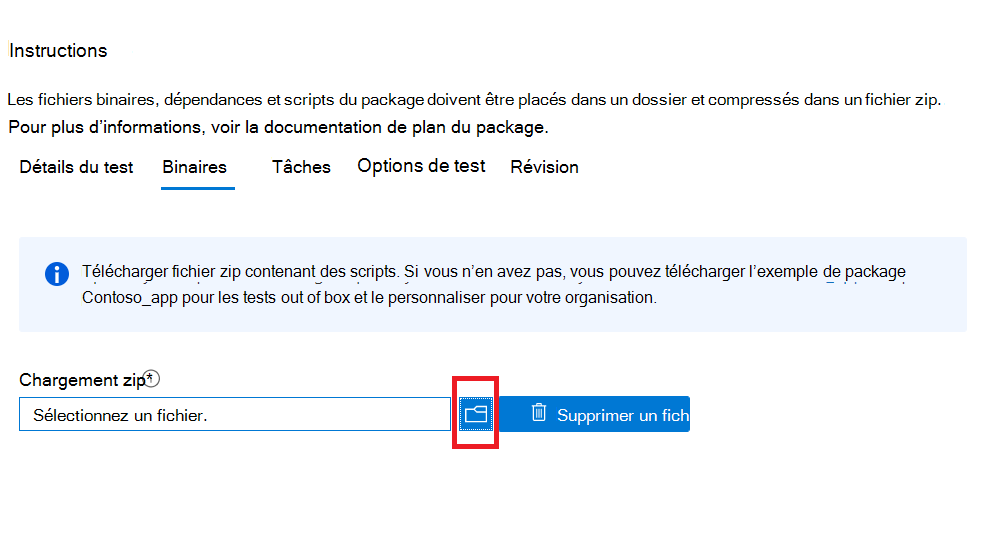

# <a name="step-3-upload-your-binaries-dependencies-and-scripts"></a>Étape 3 : Télécharger vos binaires, dépendances et scripts

Sous cet onglet, vous allez télécharger un package zip unique contenant vos fichiers binaires, dépendances et scripts utilisés pour exécuter votre suite de test.

## <a name="upload-package-zip-file"></a>Télécharger fichier zip du package



  - Les dépendances téléchargées peuvent inclure des frameworks de test, des moteurs de script ou des données accessibles pour exécuter votre application ou des cas de test. Par exemple, vous pouvez télécharger Selenium et un programme d’installation webdriver pour vous aider à exécuter des tests basés sur le navigateur.
  - Il est préférable de s’assurer que vos activités de script restent modulaires, c’est-à-dire. 
    - Le ```Install``` script effectue uniquement des opérations d’installation.
    - Le ```Launch``` script lance uniquement l’application.
    - Le ```Close``` script ferme uniquement l’application.
    - Le ```Uninstall``` script facultatif désinstalle uniquement l’application.

**Actuellement, le portail prend uniquement en charge les scripts PowerShell.**


## <a name="next-steps"></a>Étapes suivantes 

Passer à l’article suivant pour passer à l’étape 4 : **Définir vos tâches de test.**
> [!div class="nextstepaction"]
> [Retour](uploadApplication.md)
> [!div class="nextstepaction"]
> [Étape suivante](testtask.md)

