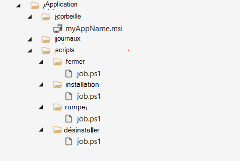

# <a name="build-a-package"></a>Créer un package

Un package est un fichier .zip contenant le fichier binaire et les scripts de test de votre application, qui est la condition préalable à l’utilisation de la base de test. Ce guide de démarrage rapide vous guidera dans la création de votre premier package, avec lequel vous pouvez effectuer des tests out-of-box sur votre application.

- *Un test **OOB (Out-of-Box)** effectue une installation, un lancement, une fermeture et une désinstallation de votre application. Après l’installation, la routine de fermeture de lancement est répétée 30 fois avant l’exécution d’une seule désinstallation. Le test OOB vous fournit des données de télémétrie standardisées sur votre package à comparer entre les builds Windows.*

Si vous le souhaitez, vous pouvez télécharger notre [exemple de package](https://aka.ms/testbase-sample-package) à référencer et commencer par.

## <a name="create-a-folder-structure"></a>Créer une structure de dossiers

Sur votre ordinateur local, créez une structure de dossiers comme suit :


Ces dossiers sont utilisés :

- **App\bin** : enregistrez les fichiers binaires d’application et de dépendance.
- **App\scripts** : enregistrez les scripts pour installer, lancer, fermer et désinstaller votre application.
- **App\logs**: scripts should output logs to this folder, then you can download and analyze logs after test is finished.

## <a name="copy-binary-files"></a>Copier des fichiers binaires

Copiez les fichiers d’installation de votre application dans **App\bin**. Si votre application a des dépendances, elles doivent d’abord être installées. Copiez également les fichiers d’installation de dépendance dans **App\bin**.


## <a name="add-powershell-scripts"></a>Ajouter des scripts PowerShell

Pour effectuer un test OOB, vous devez ajouter des scripts PowerShell pour installer, lancer, fermer et désinstaller votre application.

> [!NOTE]
> *Dans le test OOB, des scripts d’installation, de lancement et de fermeture sont nécessaires, tandis que le script de désinstallation est facultatif*.

Le script doit être ajouté au dossier comme suit :



Un script inclut généralement les comportements suivants :

- **Exécutez les commandes pour installer/lancer/fermer/désinstaller l’application**. Par exemple, si votre application est un fichier MSI, exécutez [msiexec](/windows-server/administration/windows-commands/msiexec) pour l’installer.
- **Vérifiez le résultat de l’opération d’installation/lancement/fermeture/désinstallation**, retournez le code de sortie zéro si le résultat est attendu. La base de test marque l’exécution d’un script comme un échec s’il retourne un code de sortie différent de zéro.
- **Enregistrez suffisamment de journaux**, enregistrez les journaux appropriés pour une utilisation ultérieure.

Reportez-vous aux exemples suivants. Vous pouvez simplement les copier dans vos fichiers et apporter des modifications en conséquence.

**Exemple de script d’installation (App\scripts\install\job.ps1)** :

```powershell
        push-location $PSScriptRoot
        $exit_code = 0
        $script_name = $myinvocation.mycommand.name
        $log_dir = "$PSScriptRoot\..\..\logs"
        $log_file = "$log_dir\$script_name.log"

        if(-not (test-path -path $log_dir )) {
            new-item -itemtype directory -path $log_dir
        }

        Function log {
           Param ([string]$log_string)
           write-host $log_string
           add-content $log_file -value $log_string
        }

        log("Installing TestBaseM365 Digital Clock")
        push-location "..\..\bin"
        if ([Environment]::Is64BitProcess) {
            $installer_name = "TestBaseM365DigitalClock.msi"
        }
        else {
            $installer_name = "TestBaseM365DigitalClock.msi"
        }
        $arguments = "/i "+$installer_name+" /quiet /L*v "+"$log_dir"+"\atp-client-installation.log"

        $installer = Start-Process msiexec.exe $arguments -wait -passthru
        pop-location

        if ($installer.exitcode -eq 0) {
            log("Installation succesful as $($installer.exitcode)")
        }
        else {
            log("Error: Installation failed as $($installer.exitcode)")
            $exit_code = $installer.exitcode
        }

        log("Installation script finished as $exit_code")
        pop-location
        exit $exit_code
```

**Exemple de script de lancement (App\scripts\launch\job.ps1)** :

```powershell
        push-location $PSScriptRoot
        $exit_code = 0
        $script_name = $myinvocation.mycommand.name
        $log_dir = "$PSScriptRoot\..\..\logs"
        $log_file = "$log_dir\$script_name.log"

        if(-not (test-path -path $log_dir )) {
            new-item -itemtype directory -path $log_dir
        }

        Function log {
           Param ([string]$log_string)
           write-host $log_string
           add-content $log_file -value $log_string
        }

        log("Launch TestBaseM365 Digital Clock")

        $PROCESS_NAME = "DigitalClock"
        $exePath = "C:\Program Files\Test Base M365\DigitalClock\DigitalClock.exe"

        Start-Process -FilePath $exePath

         if (Get-Process -Name $PROCESS_NAME) {
                log("Launch successfully $PROCESS_NAME...")
                $exit_code = 0
         }
         else {
            log("Not launched $PROCESS_NAME...")
            $exit_code = 1
         }

        log("Launch script finished as $exit_code")
        pop-location
        exit $exit_code
```

## <a name="compress-to-zip-file"></a>Compresser dans un fichier zip

Une fois les scripts et les fichiers binaires préparés, vous devez compresser le dossier dans un fichier zip. Cliquez avec le bouton droit sur le dossier Application, puis **sélectionnez Compresser dans le fichier ZIP**.


## <a name="verify-your-package-locally-optional"></a>Vérifier votre package localement (facultatif)

Après avoir généré le package zip, vous pouvez le charger sur votre compte de base de test.

Toutefois, il est recommandé d’exécuter le test localement pour vous assurer que les scripts fonctionnent correctement avant le chargement. Un test local peut identifier rapidement les problèmes et accélérer votre processus de chargement. Pour vérifier localement, suivez les étapes ci-dessous :

1. Préparer une machine virtuelle

   Nous vous recommandons d’utiliser une machine virtuelle pour ce test local, car un environnement Windows propre est actuellement nécessaire pour chaque test. Il est facile de créer une machine virtuelle Windows sur Azure ([démarrage rapide : machine virtuelle Windows](/azure/virtual-machines/windows/quick-create-portal)), vous pouvez sélectionner une version (image) Windows appropriée pour votre test, par exemple, *Windows 10 Professionnel, version 21H2.*<br>

2. Copier votre package sur la machine virtuelle

   Il existe de nombreuses façons de copier votre fichier de package sur la machine virtuelle. Si vous utilisez une machine virtuelle Azure, vous pouvez choisir :

     - Copiez le fichier directement dans votre connexion Bureau à distance.
     - Utiliser le partage de fichiers Azure ([Démarrage rapide : Créer et gérer un fichier Azure](/azure/storage/files/storage-files-quick-create-use-windows))

   Vous pouvez créer un dossier spécifique pour ce test et copier le fichier de package sous ce dossier. par exemple, *C:\TestBase*.

3. Tester le package

   Ouvrez Windows PowerShell, accédez au répertoire contenant le package, par exemple, `cd C:\TestBase`et commencez à exécuter vos tests sur le package :

   1. Extrayez le fichier de package.

      ```powershell
      Expand-Archive -LiteralPath C:\TestBase\App.zip -DestinationPath C:\TestBase
      ```

   2. Exécutez le script d’installation.

      ```powershell
      C:\TestBase\App\scripts\install\job.ps1
      ```

   3. Redémarrez la machine virtuelle si nécessaire.

   4. Exécutez le script de lancement.

      ```powershell
      C:\TestBase\App\scripts\install\job.ps1
      ```

   5. Exécutez un script de fermeture.

      ```powershell
      C:\TestBase\App\scripts\close\job.ps1
      ```

   6. Exécutez le script de désinstallation (si vous en avez un).

      ```powershell
      C:\TestBase\App\scripts\uninstall\job.ps1
      ```

Après chaque étape, vous pouvez vérifier s’il existe des problèmes dans votre script. Si tous les scripts s’exécutent comme prévu, votre package est prêt à être chargé sur votre compte de base de test.

## <a name="next-steps"></a>Prochaines étapes

[Charger un package](uploadApplication.md)
