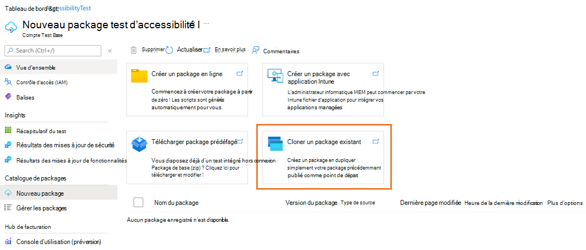

# Cloner un package existant

Dans cette section, vous allez apprendre à créer un package en dupliquer votre package précédemment publié comme point de départ. Il existe plusieurs entrées sur le portail de base de test pour vous permettre de démarrer le parcours du package clone.

> [!IMPORTANT]
> Pour utiliser la fonction de package clone, vous devez disposer d’au moins un package correctement chargé sur la base de test. 

## À partir de la page Nouveau package

> [!div class="mx-imgBorder"]
> [ clonage ](Media/clonepackage01_guidance.png#lightbox)

1. Dans la page **Nouveau package** , vous pouvez sélectionner le **package clone existant**. Sélectionnez ensuite un package dans la liste des packages existants, puis cliquez sur **« Cloner** ». 

   > [!div class="mx-imgBorder"]
   > [ existant ](Media/clonepackage02_clone_package.png#lightbox)

2. Vous serez dirigé vers les étapes de création du nouveau package avec toutes les informations et la configuration préremplies comme le package que vous avez cloné. Les seules informations que vous devez modifier sont la **version du package** sous la section **Informations de base** . 

   > [!NOTE]
   > La combinaison du nom et de la version du package doit être unique dans votre compte de base de test. 

   > [!div class="mx-imgBorder"]
   > [ le package ](Media/clonepackage03_basic_information.png#lightbox)

3. Vous pouvez :

   - afficher un aperçu de toutes les informations de paramètre de package prérempli du package de clonage. 
   - apporter des modifications de l’étape 1 à l’étape 4 (voir Chargement d’un package zip prédéffagé pour obtenir des instructions plus détaillées). 
   - vérifier et publier dans la base de test. 

## À partir de la page Gérer les packages

Dans la page **Gérer les packages** , vous pouvez cloner un package en sélectionnant l’icône **« Cloner »** sous la colonne Actions rapides. 

> [!div class="mx-imgBorder"]
> 

Vous pouvez également accéder à la page **Vue d’ensemble** du package spécifique que vous avez sélectionné dans la page **Gérer les packages** , puis sélectionner l’icône **Cloner le package** dans le menu d’action supérieur.

> [!div class="mx-imgBorder"]
> [ vue d’ensemble ](Media/clonepackage05_overview.png#lightbox)

