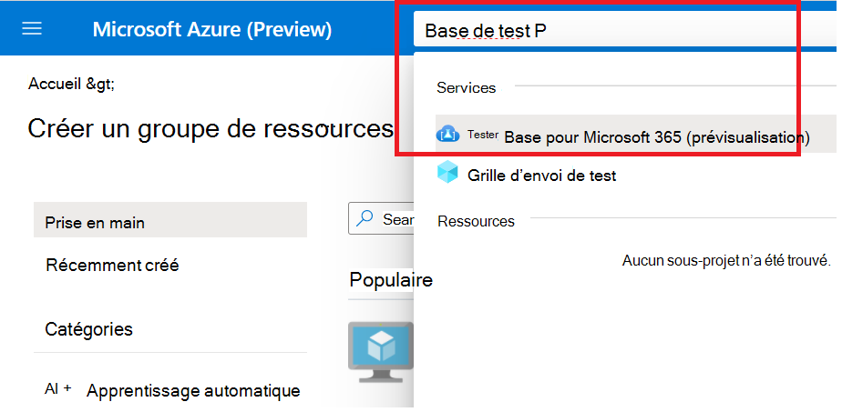
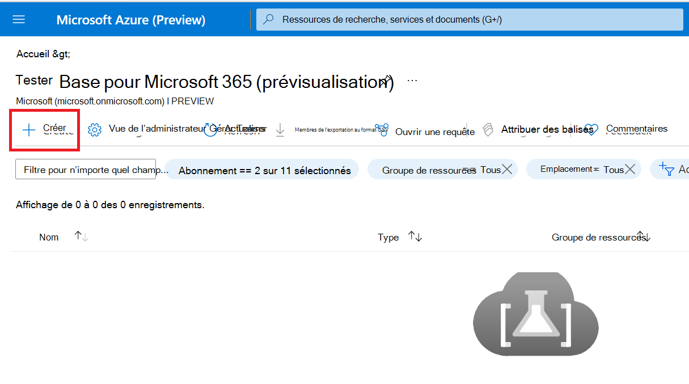
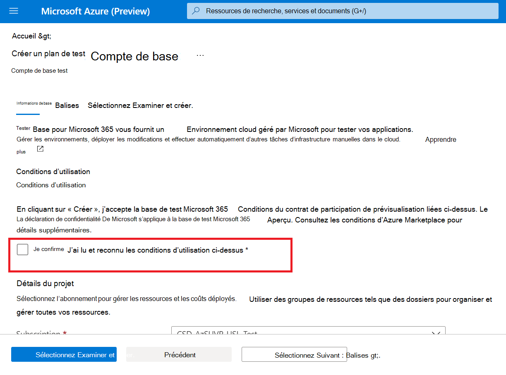
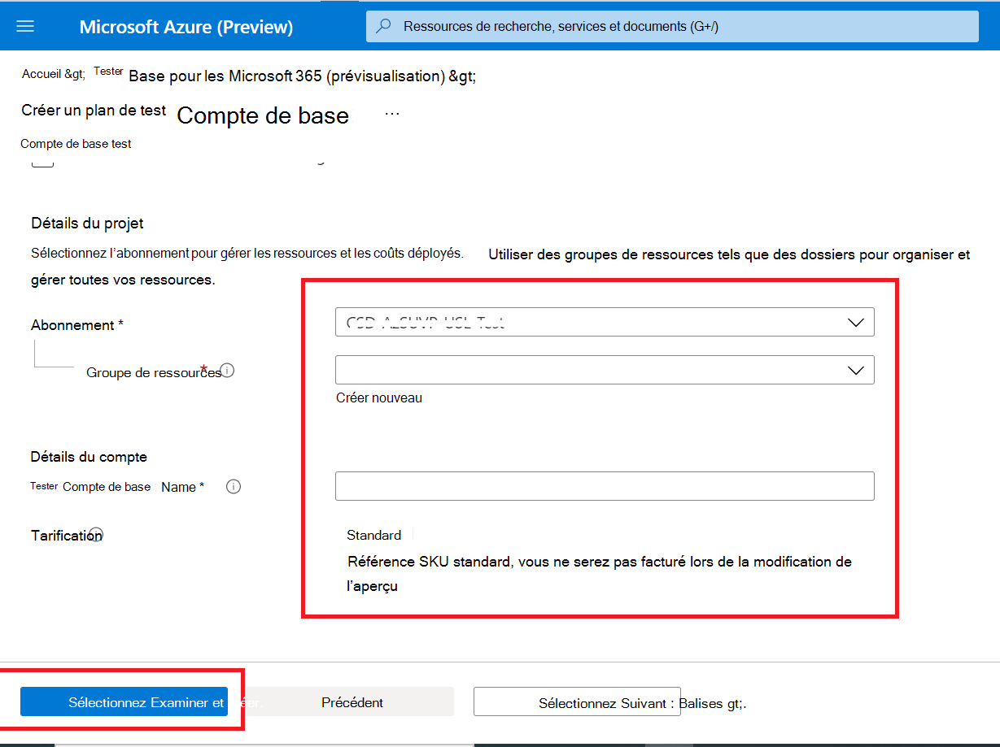

# <a name="step-1-create-a-test-base-account"></a>Étape 1 : Créer un compte de base de test

Si vous n’avez pas d’abonnement Azure, créez [un compte gratuit](https://azure.microsoft.com/free/) avant de commencer.

## <a name="enter-details-for-test-base-account"></a>Entrer des détails pour le compte de base de test
 
1. Recherchez **« Base de test »** dans le portail Azure.



2. Cliquez **sur « Créer »** pour créer un compte de base de test.



3.  Lisez ensuite la ```Terms of Use``` case à cocher pour confirmer votre satisfaction avec le ```Terms of Use```.



4.  Remplissez les informations correctes selon les conditions suivantes : 
    -   Abonnement : groupe de ressources
    -   Détails de l’instance : nom.

**Actuellement, la base de test prend uniquement en charge le niveau De tarification standard.**



5.  Enfin, cliquez sur pour ```Review + Create``` valider et activer votre compte nouvellement créé.

## <a name="next-steps"></a>Prochaines étapes

Passer à l’article suivant pour commencer à l’étape 2 : **Découvrez comment charger votre package.**
> [!div class="nextstepaction"]
> [Étape suivante](uploadApplication.md)

<!---
Add button for next page
-->
