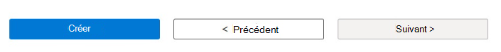

# Création d’un compte de base de test

Pour créer un compte **de base de test** , effectuez les étapes qui suivent. 

> [!IMPORTANT]
> Vous aurez besoin d’un abonnement pour vous inscrire à un compte **de base de test** . Si vous n’avez pas d’abonnement Azure, consultez **Abonnements** sur la page [d’accueil Azure](https://ms.portal.azure.com/#home) pour savoir comment en créer un. 

## Pour créer un compte de base de test
 
1. Dans la page d’accueil de [l’Portail Azure](https://ms.portal.azure.com/#home), **recherchez La base de test de Microsoft 365** dans la Place de marché Azure pour afficher les contrôles permettant de créer un compte **de base de** test. 

   > [!div class="mx-imgBorder"]
   > [ recherche ](Media/creatingaccount01-search.png#lightbox)

2. Dans le champ contrôles de la page Base de test **pour Microsoft 365** , sélectionnez le bouton **Créer** comme suit pour ouvrir la page **Créer un compte de base de test** . 

   > [!div class="mx-imgBorder"]
   > 

3. Dans la page **Créer un compte de base de test** , ajoutez vos informations aux champs d’entrée requis suivants dans la page **Créer un compte de base de test** : 

   - **Abonnement** : dans la liste déroulante, recherchez votre ID d’abonnement Azure et sélectionnez-le. 
   - **Groupe de** ressources : créez un groupe de ressources en sélectionnant **Créer et** en spécifiant un nom choisi dans la zone de texte **d’entrée Nom** qui s’affiche. Sélectionnez **OK** lorsque vous avez terminé. Si vous disposez déjà **d’un groupe de** ressources, recherchez son nom dans la liste déroulante et sélectionnez-le. 
   - **Compte de base de test** : sous **Détails du compte**, comme illustré dans la figure suivante, spécifiez un nom choisi pour votre compte **de base** de test en le tapant dans le champ de texte d’entrée. 

   > [!NOTE]
   > Vous devez fournir une entrée pour tous les champs requis (*). 

   > [!div class="mx-imgBorder"]
   > [ de base ](Media/creatingaccount03-basics.png#lightbox)

   > [!NOTE]
   > À compter d’avril 2022, **Test Base** prend uniquement en charge le niveau tarifaire **Standard** . Le **niveau tarifaire** détermine le coût de service horaire et de ressource facturé à votre abonnement Azure. 

   > [!div class="mx-imgBorder"]
   > 

4. Lisez les **conditions d’utilisation**. Si les termes sont acceptables, cochez la case pour confirmer que vous avez lu et accepté les conditions d’utilisation. 

   > [!div class="mx-imgBorder"]
   > 

5. Dans le secteur inférieur de la page **Créer un compte de base de test** , **sélectionnez Vérifier + créer** pour valider les données d’entrée que vous avez spécifiées. 

   Si le processus de validation réussit, vous pouvez passer en revue votre configuration des données d’entrée dans la page **Créer un compte de base de test** . 

   > [!div class="mx-imgBorder"]
   > 

6. Sélectionnez le bouton **Créer** qui s’affiche dans le secteur inférieur de la page **Créer un compte de base de test** précédente. 

   > [!div class="mx-imgBorder"]
   > 

7. Dans votre page **Déploiement** d’utilisateur, sélectionnez **Accéder à la ressource** pour ouvrir la page Vue d’ensemble de votre nouveau compte **de base** de test et commencer votre exploration, votre configuration et votre parcours de base de **test**. 

   > [!div class="mx-imgBorder"]
   > [ Création complète ](Media/creatingaccount08-complete.png#lightbox)

