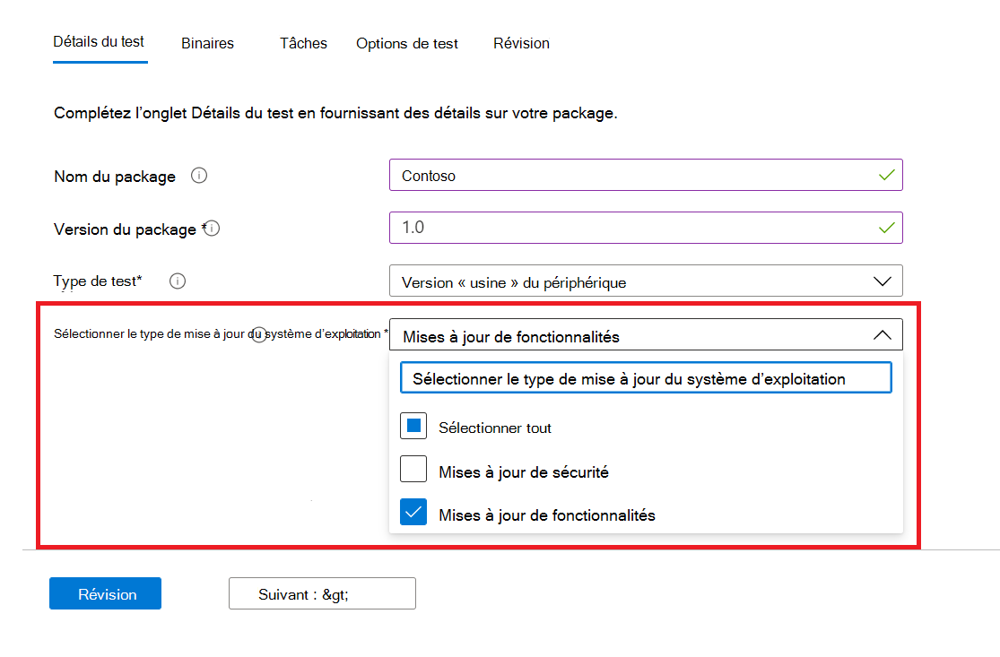
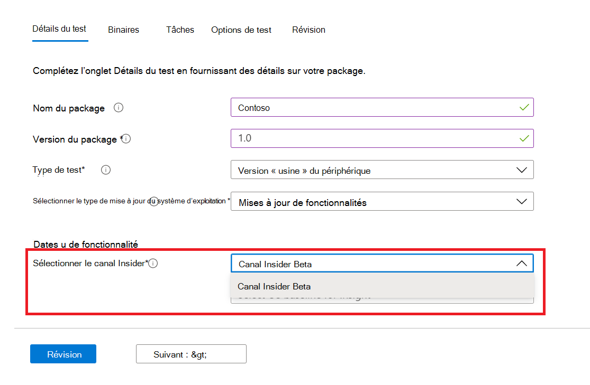

# <a name="windows-feature-update-validation"></a>Windows Validation de la mise à jour des fonctionnalités

Avez-vous besoin d’informations sur le fonctionnement de vos applications avec la prochaine version de Windows 10 ou Windows 11 , sans que vous ne tenez à jour un environnement pour valider les nouvelles fonctionnalités de Windows ? 

Voulez-vous exécuter vos tests de validation sur les builds Windows Programme Insider dans notre environnement Azure ?

**La** validation de la mise à jour des fonctionnalités sur la base de test pour M365 peut vous aider à atteindre tous ces objectifs et bien plus encore !

Consultez le plan pas à pas ci-dessous pour savoir comment accéder à cette nouvelle fonctionnalité dans la base de test pour le service M365.

Pour commencer à l’utilisation de la base de test pour M365, téléchargez vos applications (et fichiers associés) via le portail ```Feature update validation``` d’intégration en libre-service. 

Vous trouverez ci-dessous les étapes à suivre lorsque vous remplissez les **détails du test**:

1. Sélectionnez **Mise à jour des fonctionnalités** comme type de mise à jour du système d’exploitation :



2. Choisissez le canal Windows Insider sur lequel vous souhaitez que votre application soit validée.  



3. Sélectionnez une version commercialisée de Windows 10 ou Windows 11 comme référence pour votre test (et informations résultantes!) et fournissez les autres détails nécessaires pour intégrer correctement votre package.


4. Pour afficher les résultats de la validation de votre application par rapport aux mises à jour de fonctionnalités Windows 10 pré-publiées, visitez la ```Feature Updates Test Results``` .


## <a name="next-steps"></a>Étapes suivantes

Passer à l’article suivant pour commencer à comprendre l’analyse de la régression de la mémoire.
> [!div class="nextstepaction"]
> [Étape suivante](memory.md)

<!---
Add button for next page
-->
