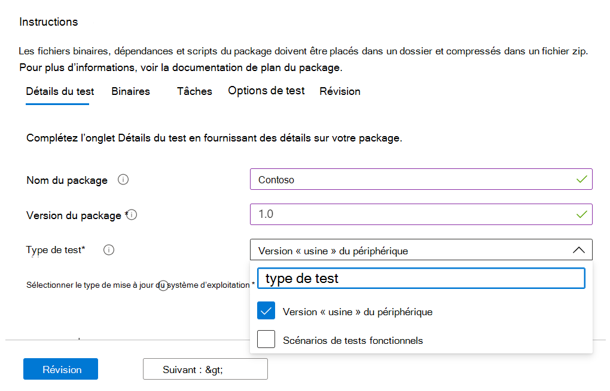
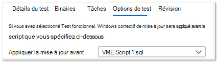

# <a name="functional-testing"></a>Test fonctionnel

En tant que fournisseur de logiciels, vous pouvez désormais effectuer des tests fonctionnels personnalisés, à l’aide de l’infrastructure de test de votre choix, via la base de test libre-service pour le portail M365. 

Lors du lancement initial du service, nous avons proposé les tests prédéfinis, qui sont un ensemble prédéfinis de tests pilotés par des scripts standardisés. Toutefois, cela n’a pas pu aboutir à une couverture de test complète pour de nombreux éditeurs de logiciels indépendants. 

Par conséquent, en réponse à vos commentaires, nous fournissons à nos isv la possibilité de télécharger des tests fonctionnels automatisés.

Pour utiliser cette fonctionnalité, suivez les étapes ci-dessous :

1. Télécharger fichiers (fichiers binaires, dépendances et scripts) en tant que package .zip unique.
2. Choisissez si vous souhaitez redémarrer les machines virtuelles (VM) de test à différents points d’exécution.
3. Gérez les options disponibles pour vos scripts.
4. Choisissez quand appliquer la mise à jour Windows sur la VM lors de l’exécution.

Les descriptions détaillées des étapes ci-dessus sont mises en évidence ci-dessous :

**Télécharger package de test fonctionnel**

To get started, navigate to the Télécharger page, select Télécharger new application under Application catalog on the left-side navigation menu of the Test Base for M365 portal in Azure. À partir de là :

Onglet 1 : entrez les informations de base. Fournissez le nom et la version de votre application. Dans l’option Type de test, sélectionnez ```Functional tests``` . 

*Notez que l’option OOB (Out-of-Box) est requise par défaut.*




Onglet 2 : Télécharger composants de votre package en chargeant un fichier zip avec l’intégralité de votre test (fichiers binaires, dépendances, scripts, etc.). 

Voir aka.ms/usl-package-outline pour plus d’informations. (Remarque : les scripts de test Out-of-Box et le contenu du test fonctionnel doivent être placés dans le même fichier zip). Actuellement, la taille du fichier est limitée à 2 Go.

Onglet 3 : configurer les tâches de test out-of-box et Fonctionnelles. Ici, choisissez le ou les chemins d’accès aux scripts PowerShell qui installeront, lanceront, fermeront et désinstalleront votre application (pour Out-of-Box), ainsi que les chemins d’accès à tous vos scripts personnalisés pour effectuer votre test fonctionnel. **(Remarque : un script pour désinstaller votre application est facultatif).**

Actuellement, vous pouvez charger entre 1 et 8 scripts pour vos tests fonctionnels. (Faites un commentaire sur ce billet si vous avez besoin de davantage de scripts !)


(Facultatif) Configurez un redémarrage après l’installation. Certaines applications nécessitent un redémarrage après l’installation. 

Sélectionnez le script spécifique dans l’onglet Tâches si vous souhaitez qu’un redémarrage soit effectué ```Reboot After Execution``` après l’exécution de ce script.

Onglet 4 : choisissez quand la mise à jour Windows est installée : l’application du correctif Windows Update est effectuée avant tout script de votre choix. Il est recommandé d’installer une mise à jour Windows après l’installation de l’application pour simuler étroitement les scénarios d’utilisation de votre application réelle.



Onglet 5 - Examinez et créez le package. Une fois que vous avez terminé les étapes répertoriées ci-dessus, ```Create``` sélectionnez pour terminer le processus de téléchargement.

Une fois votre package créé, vous pouvez vérifier l’état de vérification de votre package.

Nous exécuterons un test initial pour installer, lancer, fermer et désinstaller votre application. Cela nous permet de vérifier que votre package peut être installé sur notre service sans erreur.

Le processus de vérification peut prendre jusqu’à 24 heures. Une fois la vérification terminée, vous pouvez voir l’état dans le menu, qui serait l’une des ```Manage packages``` deux entrées :

1. La vérification a réussi : le package sera automatiquement testé par rapport aux mises à jour Windows pré-version pour les builds de système d’exploitation que vous avez sélectionnées.
ou
2. Échec de la vérification : vous devrez examiner les raisons de l’échec, résoudre le problème et re-télécharger votre package.

Vous serez également informé de l’un ou l’autre des résultats via l’icône de notification dans le portail Azure.
