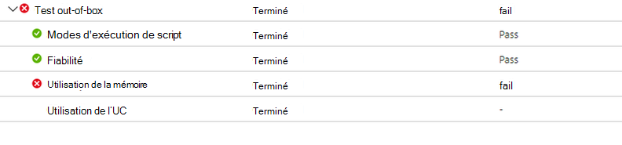
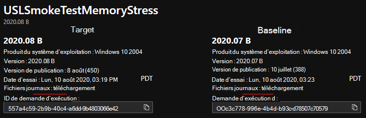

# <a name="memory-regression-analysis"></a>Analyse de la régression de la mémoire

Test Base vous permet de noter plus clairement les augmentations significatives de l’utilisation de la mémoire dans les ordinateurs VM test exécutant vos applications. Les mesures de performances, telles que l’utilisation de la mémoire, peuvent indiquer l’état global de l’application et nous pensons que cet ajout permettra de maintenir les performances optimales de vos applications.

Lisez la suite pour plus d’informations ou regardez cette vidéo pour obtenir une présentation rapide des dernières améliorations. 

Pour plus d’informations sur la capacité de base de test de M365 à faciliter l’analyse de régression, voir Résultats de régression basés sur la fiabilité des processus.

<b>En regardant de plus près les régressions de mémoire</b>

Le tableau de bord Base de test pour M365 affiche la mémoire consommée par votre application sur une nouvelle mise à jour Windows pré-publiée et la compare à la mémoire utilisée par la dernière mise à jour Windows publiée. 

Grâce aux améliorations apportées ce mois-ci, l’analyse de la régression de la mémoire est désormais mise en avant dans vos processus favoris. Les applications peuvent contenir plusieurs processus et vous pouvez sélectionner manuellement vos processus favoris via l’onglet Fiabilité. Notre service identifiera ensuite les régressions de mémoire dans ces processus favoris tout en comparant les tests s’exécutent entre Windows mises à jour. Si une régression est détectée, des détails sur la régression sont facilement disponibles.

Examinons maintenant cette fonctionnalité en détail et voyons comment résoudre les problèmes de régression de mémoire à l’aide de Windows Performance Analyzer.

Le signal d’échec provoqué par une régression de mémoire est affiché dans la base de test pour le tableau de bord M365 de la page des résultats des tests sous Utilisation de la mémoire :




L’échec de l’application en raison d’une consommation de mémoire plus élevée s’affiche également dans la page Résumé ```Fail``` des tests :


En fournissant ces signaux d’échec à l’avance, notre objectif est de marquer clairement les problèmes potentiels qui peuvent perturber et avoir un impact sur l’expérience de l’utilisateur final pour votre application. 

Vous pouvez ensuite télécharger les fichiers journaux et utiliser Windows Performance Analyzer, ou votre boîte à outils préférée, pour étudier plus en détail. Vous pouvez également travailler en collaboration avec l’équipe de base de test pour M365 pour résoudre le problème et éviter les problèmes qui ont un impact sur les utilisateurs finaux.

Les signaux de mémoire sont capturés dans l’onglet Utilisation de la mémoire dans la base de test pour le service M365 pour toutes les séries de tests. L’exemple ci-dessous illustre une série de tests récents avec l’application intégré « Stress de mémoire de test de la tension » par rapport à la mise à jour de sécurité d’août 2020 pré-publiée. (Cette application a été écrite par notre équipe pour illustrer les régressions de mémoire.)


Dans cet exemple, le processus favori « USLTestMemoryStress.exe » a consommé une moyenne d’environ 100 Mo sur la mise à jour d’août pré-publiée par rapport à la mise à jour publiée en juillet, d’où la base de test pour M365 a identifié une régression. 

Les autres processus, présentés ici sous les formes « USLTestMemoryStress_Aux1.exe » et « USLTestMemoryStress_Aux2.exe », appartiennent également à la même application, mais ont consommé à peu près la même quantité de mémoire pour les deux releases afin qu’elles « passent » et sont considérées comme saines.

La régression sur le processus principal a été déterminée comme « significative du point de vue statistique », de sorte que le service a communiqué et mis en évidence cette différence pour l’utilisateur. Si la comparaison n’était pas significative d’un point de vue statistique, elle ne serait pas mise en évidence. L’utilisation de la mémoire peut être bruyante. Nous utilisons donc des modèles statistiques pour distinguer, entre les builds et les releases, les différences significatives par rapport aux différences non significatives. 

Une comparaison peut rarement être signalée lorsqu’il n’existe aucune différence réelle (faux positif), mais il s’agit d’un compromis nécessaire pour améliorer la probabilité d’identifier correctement les régressions (ou les vrais positifs).)

L’étape suivante consiste à comprendre ce qui a provoqué la régression de la mémoire. Vous pouvez télécharger les fichiers zip pour les deux exécutions à partir de l’option Télécharger les fichiers journaux, comme illustré ci-dessous. 

Ces fichiers zip contiennent les résultats de votre exécution de test, y compris les résultats des scripts, la mémoire et les données de performances du processeur incluses dans le fichier ETL.



Vous pouvez télécharger et déconnecter les journaux pour les deux séries de tests, puis localiser le fichier ETL dans chaque dossier et les renommer en tant que target.etl (pour l’essai exécuté sur la mise à jour pré-publication) et baseline.etl (pour le test exécuté lors de la dernière mise à jour publiée) pour simplifier l’exploration et la navigation.
 
## <a name="next-steps"></a>Étapes suivantes

Passer à l’article suivant pour commencer à comprendre l’analyse intelligente de la régression du processeur.
> [!div class="nextstepaction"]
> [Étape suivante](cpu.md)

<!---
Add button for next page
-->
