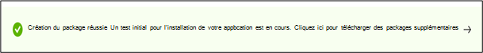

# Étape 6 : Passez en revue vos sélections pour créer votre package.

1. Dans cet onglet, le service affiche les détails de votre test et exécute une vérification rapide de l’exhaustivité.

    Un message **d’échec de validation ou de** **validation** indique si vous pouvez passer aux étapes suivantes ou non.

2. Passez en revue les détails de votre test et, si vous êtes satisfait, cliquez sur le bouton **Créer** .

    :::image type="content" alt-text="Afficher la validation." source="Media/validation.png" lightbox="Media/validation.png":::

3. Cela intégrera votre package à l’environnement de base de test. Si votre package est créé avec succès, un test automatisé qui vérifie si votre package peut être exécuté correctement sur Azure est déclenché.

    

    > [!NOTE]
    > Vous recevrez une notification de la Portail Azure pour vous informer de la réussite ou de l’échec de la vérification du package.
    >
    > Notez que le processus peut prendre jusqu’à 24 heures. Il est donc probable que votre page web ait expiré si vous n’y êtes pas actif. Par conséquent, la notification ne vous informera pas de la fin de cette exécution à la demande.

    - Si cela se produit, vous pouvez afficher l’état de votre package sous l’onglet **Gérer les packages** .

      :::image type="content" alt-text="Image pour la gestion des packages." source="Media/managepackages.png" lightbox="Media/managepackages.png":::

    - Pour les tests réussis, leurs résultats peuvent être consultés via les pages **Résumé** des tests, **Sécurité Mises à jour Résultats** et **Fonctionnalité Mises à jour Résultats** à intervalles réguliers, souvent quelques jours après votre chargement.
  
    - En cas d’échec des tests, vous devez charger un nouveau package. 

      Vous pouvez télécharger les **journaux de test** pour une analyse plus approfondie à partir des **pages de résultats des mises à jour de sécurité** et des **mises à jour des** fonctionnalités.

    - Si vous rencontrez des échecs de test répétés, contactez testbasepreview@microsoft.com avec les détails de votre erreur.

## Prochaines étapes

Découvrez nos instructions de contenu via le lien ci-dessous.

> [!div class="nextstepaction"]
> [Étape suivante](contentguideline.md)
