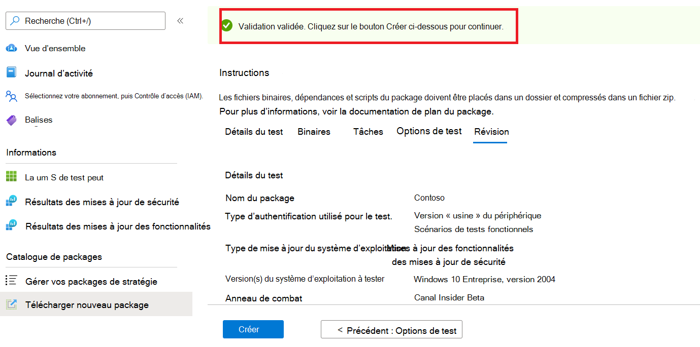

# <a name="step-6-review-your-selections-to-create-your-package"></a>Étape 6 : examinez vos sélections pour créer votre package.

1.  Sous cet onglet, le service affiche les détails de vos tests et exécute une vérification rapide de l’intégralité. 

    Un ```Validation passed``` ou plusieurs messages ```Validation failed``` indiquent si vous pouvez passer aux étapes suivantes ou non.

2.  Examinez les détails de votre test et, si vous êtes satisfait, cliquez sur le ```Create``` bouton. 



3.  Cela intégrera votre package à l’environnement de base de test. Si votre package est correctement créé, un test automatisé qui vérifie si votre package peut être correctement exécuté sur Azure sera déclenché.


> [!Note]
> Vous recevez une notification du portail Azure pour vous informer de la réussite ou de l’échec de la vérification du package. 
>
> Notez que le processus peut prendre jusqu’à 24 heures. Il est donc probable que votre page web arrive à terme si vous n’y êtes pas actif et, par conséquent, la notification ne vous informe pas de la fin de cette exécution à la demande. 

  - Cela se produit, vous pouvez afficher l’état de votre package sous ```Manage packages``` l’onglet.


  - Pour des tests réussis, leurs résultats peuvent être vus via les pages et à intervalles réguliers, souvent quelques jours après ```Test Summary``` ```Security Updates Results``` votre ```Feature Updates Results``` téléchargement.
  
  - En cas d’échec des tests, vous devez télécharger un nouveau package. 
  
    Vous pouvez télécharger les pages et les pages pour une ```test logs``` analyse ```Security update results``` plus ```Feature updates results``` approfondie.

  - Si vous faites face à des échecs de test répétés, contactez testbasepreview@microsoft.com avec les détails de votre erreur. 

## <a name="next-steps"></a>Étapes suivantes

Découvrez nos recommandations en matière de contenu via le lien ci-dessous.
> [!div class="nextstepaction"]
> [Étape suivante](contentguideline.md)
