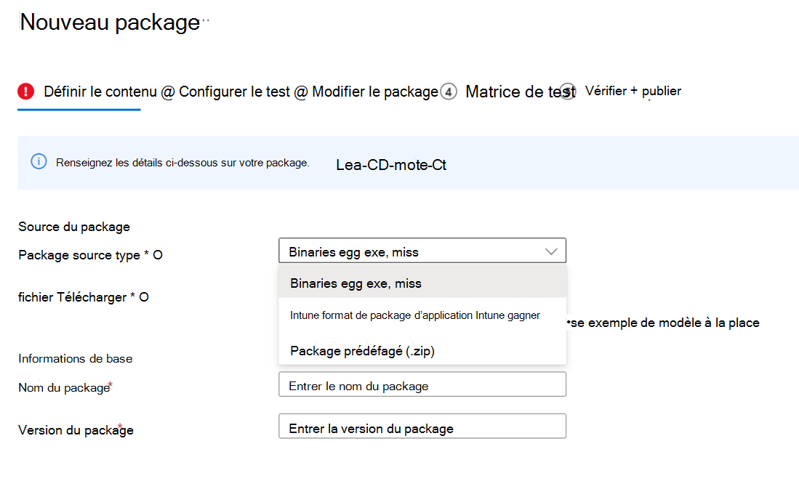
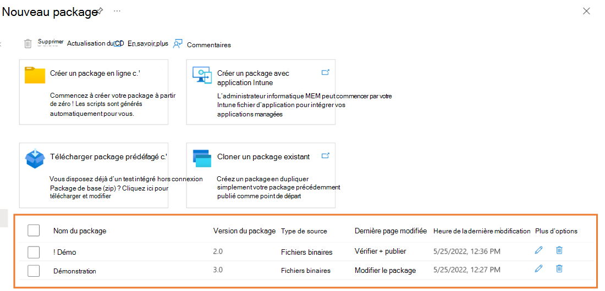

# Création et test de fichiers binaires sur la base de test

Cette section fournit toutes les étapes nécessaires pour créer un package contenant des fichiers binaires, pour le chargement et le test sur la base de test. Si vous disposez déjà d’un fichier .zip prédéfinis, vous pouvez voir [le chargement d’un package Zip prédéffagé](uploadApplication.md) pour charger votre fichier.

> [!IMPORTANT]
> Si vous n’avez pas de compte **de base** de test, vous devez en créer un avant de continuer, comme décrit dans [la création d’un compte de base de test](createAccount.md).

## Créer un package

Dans le [Portail Azure](https://portal.azure.com/), accédez au compte **de base** de test pour lequel vous allez créer et charger votre package, puis suivez les étapes ci-dessous. 

Dans le menu de gauche sous **Catalogue de packages**, sélectionnez le **nouveau package**. Cliquez ensuite sur la première carte **« Créer un package en ligne »** pour générer votre package en ligne en 5 étapes !

> [!div class="mx-imgBorder"]
> 

### Étape 1. Définir le contenu

1. Dans la section **Source du package** , sélectionnez Fichiers binaires (par exemple: .exe, .msi) dans le type de source du package.

   > [!div class="mx-imgBorder"]
   > 

2. Chargez ensuite votre fichier d’application en cliquant sur le bouton « Sélectionner un fichier » ou en cochant la case pour utiliser l’exemple de modèle de base de test comme point de départ si votre fichier n’est pas encore prêt.

   > [!div class="mx-imgBorder"]
   > 

3. Tapez le nom et la version de votre package dans la section **Informations de base** .

   > [!NOTE]
   > La combinaison du nom et de la version du package doit être unique dans votre compte de base de test.

   > [!div class="mx-imgBorder"]
   > 

4. Une fois toutes les informations demandées spécifiées, vous pouvez passer à la phase suivante en cliquant sur le bouton **Suivant : Test de configuration** .

   > [!div class="mx-imgBorder"]
   > 

### Étape 2. Configurer le test

1. Sélectionnez le **type de test**. Deux types de test sont pris en charge :
   - Un **test OOB (Out of Box)** effectue une installation, un lancement, une fermeture et une désinstallation de votre package. Après l’installation, la routine de fermeture de lancement est répétée 30 fois avant l’exécution d’une seule désinstallation. Le test OOB vous fournit des données de télémétrie standardisées sur votre package à comparer entre les builds Windows.
   - Un **test fonctionnel** exécuterait votre ou vos scripts de test chargés sur votre package. Les scripts sont exécutés dans la séquence que vous avez spécifiée et un échec dans un script particulier arrête l’exécution des scripts suivants.

   > [!NOTE]
   > Le test Out of Box est désormais facultatif.

   > [!div class="mx-imgBorder"]
   > 

2. Une fois toutes les informations requises remplies, vous pouvez passer à l’étape 3 en cliquant sur le bouton Suivant en bas. Une notification s’affiche lorsque les scripts de test sont générés avec succès.

   > [!div class="mx-imgBorder"]
   > 

### Étape 3. Modifier le package

1. Dans l’onglet Modifier le package, vous pouvez
   - Vérifiez votre dossier de package et votre structure de fichiers dans **la préversion du package**.
   - Modifiez vos scripts en ligne avec **l’éditeur de code PowerShell**.

   > [!NOTE]
   > Des exemples de scripts ont été générés pour votre référence. Vous devez examiner attentivement chaque script et remplacer le nom de la commande et du processus par le vôtre. 

   > [!div class="mx-imgBorder"]
   > 

2. Dans la **préversion du package**, selon vos besoins, vous pouvez
   - Créez un dossier.
   - Créez un script.
   - Chargez un nouveau fichier.

   > [!div class="mx-imgBorder"]
   > 

3. Sous **le dossier scripts**, des exemples de scripts et des balises de script ont été créés pour vous. Toutes les balises de script sont modifiables. Vous pouvez les réaffecter pour référencer vos chemins de script.
   - Si le **test Out of Box** est sélectionné à l’étape 2, vous pouvez voir le dossier **outofbox** sous le dossier des scripts. Vous avez également la possibilité d’ajouter la balise **« Redémarrer après l’installation »** pour le script d’installation.

   > [!div class="mx-imgBorder"]
   > 

   > [!NOTE]
   > Les balises d’installation, de lancement et de fermeture de script sont obligatoires pour le type de test OOB. La réaffectation des balises garantit que le chemin d’accès de script approprié sera utilisé lors du lancement du test.

   > [!div class="mx-imgBorder"]
   > 

   - Si le **test fonctionnel** est sélectionné à l’étape 2, vous pouvez voir le dossier **fonctionnel** sous le dossier des scripts. Vous pouvez ajouter d’autres scripts de test fonctionnels à l’aide du bouton **« Ajouter à la liste de tests fonctionnels** ». Vous avez besoin d’au moins un (1) script et pouvez ajouter jusqu’à huit (8) scripts de test fonctionnels.

   > [!div class="mx-imgBorder"]
   > 

   > [!NOTE]
   > Au moins 1 balise de script fonctionnel est obligatoire pour le type de test fonctionnel.

   Pour ajouter d’autres scripts fonctionnels, vous pouvez cliquer sur « **Ajouter à la liste de tests fonctionnels** ». Ensuite, le panneau d’action s’affiche, vous pouvez :
   - Réorganisez les chemins d’accès de script en faisant glisser les boutons de sélection gauche. Les scripts fonctionnels s’exécutent dans la séquence dans laquelle ils sont répertoriés. Un échec dans un script particulier empêche l’exécution des scripts suivants.
   - Définissez « Redémarrer après l’exécution » pour plusieurs scripts.
   - Appliquer la mise à jour avant sur un chemin d’accès de script spécifique. Cela s’applique aux utilisateurs qui souhaitent effectuer des tests fonctionnels pour indiquer quand le correctif Windows Update doit être appliqué dans la séquence d’exécution de leurs scripts de test fonctionnel.

   > [!div class="mx-imgBorder"]
   > 

4. Une fois toutes les informations requises remplies, vous pouvez passer à l’étape 4 en cliquant sur le bouton Suivant en bas.

### Étape 4. Définir la matrice de test

L’onglet Matrice de test vous permet d’indiquer le programme de mise à jour Windows spécifique ou le produit Windows sur lequel vous souhaitez peut-être exécuter votre test.

   > [!div class="mx-imgBorder"]
   > 

1. Choisir le **type de mise à jour du système d’exploitation**
   - La base de tests fournit des tests planifiés pour vous assurer que les performances de vos applications ne seront pas interrompues par les dernières mises à jour windows. 

   > [!div class="mx-imgBorder"]
   > 

   - Il existe 2 options disponibles :
   
     - Les **mises à jour de sécurité** permettent de tester votre package par rapport aux évolutions incrémentielles des mises à jour de sécurité mensuelles Windows.
     - Les **mises à jour des fonctionnalités** permettent de tester votre package par rapport aux nouvelles fonctionnalités des dernières versions Windows Insider Preview du programme Windows Insider.

2. Configurer la **mise à jour de sécurité** Pour configurer les mises à jour de sécurité, vous devez spécifier le ou les produits Windows que vous souhaitez tester dans la liste déroulante « Versions de système d’exploitation à tester ».

   > [!div class="mx-imgBorder"]
   > 

   - Votre sélection inscrit votre application pour les séries de tests automatiques sur la version B des mises à jour de qualité mensuelles Windows des produits sélectionnés.
     - Pour les clients disposant d’un accès par défaut sur la base de test, leurs applications sont validées par rapport à la version finale des mises à jour de sécurité de la version B, à partir de Patch Tuesday.
     - Pour les clients disposant d’un accès complet sur la base de test, leurs applications sont validées par rapport aux versions préliminaires des mises à jour de sécurité de la version B, à compter de 3 semaines avant le correctif mardi. Cela permet aux clients d’accès complet de prendre des mesures proactives pour résoudre les problèmes détectés lors des tests avant la publication finale du correctif mardi.  
       (Comment devenir un client d’accès complet ? Reportez-vous à [la demande de modification du niveau d’accès | Microsoft Docs](accesslevel.md))

3. Configurer **la mise à jour des fonctionnalités**
   - Pour configurer les mises à jour des fonctionnalités, vous devez spécifier le produit cible et son canal d’aperçu dans la liste déroulante « Insider Channel ».

   > [!div class="mx-imgBorder"]
   > 

   - Votre sélection inscrit votre application pour les tests automatiques sur les dernières mises à jour de fonctionnalités de votre canal de produit sélectionné et toutes les nouvelles mises à jour futures dans les dernières versions Windows Insider Preview de votre sélection.

   - Vous pouvez également définir votre système d’exploitation actuel dans « Base de référence du système d’exploitation pour Insight ». Nous vous fournirons plus d’insights de test en effectuant une analyse de régression de votre environnement de système d’exploitation en l’état et du système d’exploitation cible le plus récent.

   > [!div class="mx-imgBorder"]
   > 

### Étape 5. Vérifier + publier

1. Passez en revue toutes les informations pour vérifier l’exactitude et l’exactitude de votre brouillon de package. Pour apporter des corrections, vous pouvez revenir aux premières étapes où vous avez spécifié les paramètres en fonction des besoins.

   > [!div class="mx-imgBorder"]
   > 

2. Vous pouvez également cocher la case de notification pour recevoir la notification par e-mail de votre package pour l’avis d’exécution de validation.

   > [!div class="mx-imgBorder"]
   > 

3. Lorsque vous avez terminé la finalisation de la configuration des données d’entrée, cliquez sur **Publier** pour charger votre package dans la base de test.  La notification qui suit s’affiche lorsque le package est correctement publié et qu’il est entré dans le processus de vérification.  

   > [!NOTE]
   > Le package doit être vérifié avant d’être accepté pour les tests futurs. La vérification peut prendre jusqu’à 24 heures, car elle inclut l’exécution du package dans un environnement de test réel. 

   > [!div class="mx-imgBorder"]
   > 

4. Vous serez redirigé vers la page **Gérer les packages** pour vérifier la progression de votre package nouvellement chargé.

   > [!div class="mx-imgBorder"]
   > 

   > [!NOTE]
   > Une fois le processus de vérification terminé, l’état de vérification passe à Accepté. À ce stade, aucune autre action n’est requise. Votre package est acquis automatiquement pour l’exécution chaque fois que vos systèmes d’exploitation configurés disposent de nouvelles mises à jour. Si le processus de vérification échoue, votre package n’est pas prêt pour le test. Vérifiez les journaux et évaluez si des erreurs se sont produites. Vous devrez peut-être également vérifier les paramètres de configuration de votre package à la recherche de problèmes potentiels.

### Reprendre la création d’un package brouillon enregistré

Si vous avez des packages brouillons précédents, vous pouvez afficher la liste de vos packages brouillons enregistrés sur la page **Nouveau package** . En cliquant sur l’icône de crayon **« Modifier »,** vous pouvez reprendre la modification du package que vous avez sélectionné à partir de l’emplacement où vous vous êtes arrêté, comme décrit dans la colonne **État** .

> [!div class="mx-imgBorder"]
> 

> [!NOTE]
> Le tableau de bord affiche uniquement les packages brouillons enregistrés. Pour afficher les packages publiés, vous devez accéder à la page Gérer les packages.

