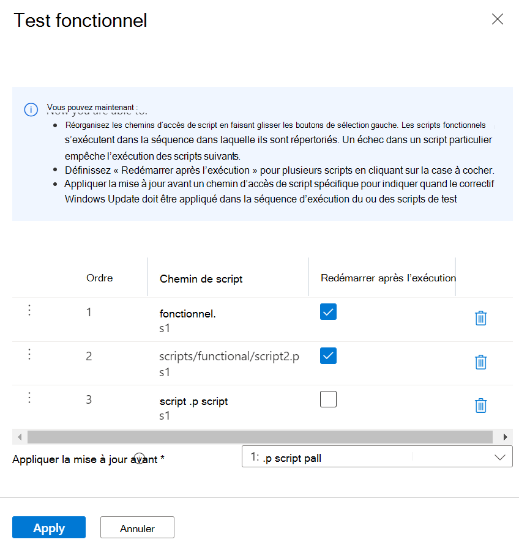
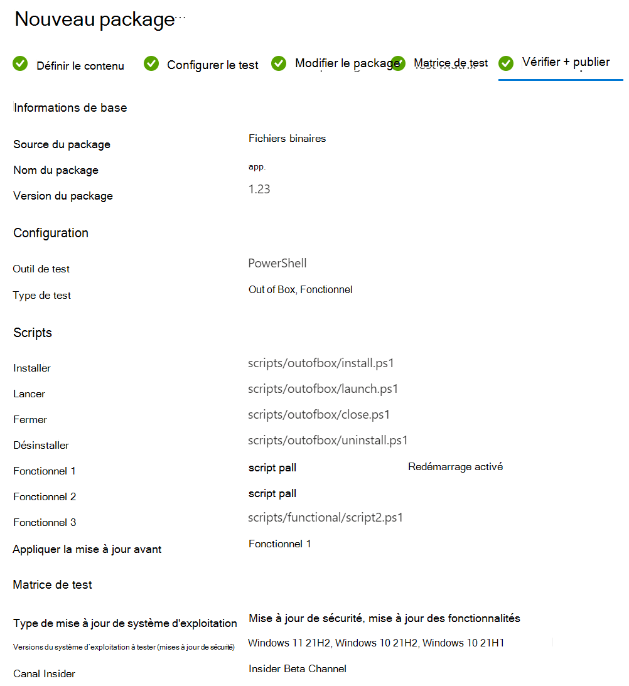

# Package Test Binaries sur la base de test
> [!NOTE]
> Ce guide vous guidera dans la création d’un package de base de test à partir de zéro. Si vous disposez déjà d’un package de base de test (.zip), vous pouvez basculer pour utiliser notre expérience de chargement [héritée Télécharger votre package de base de test (Zip).](uploadApplication.md)

## Conditions préalables
Un compte de base de test. Si vous n’en avez pas, [créez un compte de base de test](createAccount.md).

## Créer un package
Dans le [Portail Azure](https://portal.azure.com/), accédez au compte de base de test dans lequel vous souhaitez charger votre package. Dans le menu de gauche sous **Catalogue de packages**, sélectionnez le **nouveau package**. Cliquez ensuite sur la première carte **« Créer un package »** pour générer votre package en 5 étapes !

> [!div class="mx-imgBorder"]
> 

  
**Étape 1. Définir le contenu**
1. Dans la section **Source** du package, choisissez votre source de package. Si vous disposez d’une application Intunewin, sélectionnez Intunewin. Pour d’autres, par exemple, exe ou msi, sélectionnez Binaries.  
    
    > [!div class="mx-imgBorder"]
    > 

2. Chargez ensuite votre fichier d’application en cliquant sur le bouton « Sélectionner un fichier » ou en cochant la case pour utiliser l’exemple de modèle de base de test comme point de départ si votre fichier n’est pas encore prêt.
    
    > [!div class="mx-imgBorder"]
    > 
  
3. Tapez le nom et la version de votre package dans la section **Informations de base** .  
    > [!Note]
    > La combinaison du nom et de la version du package doit être unique dans votre compte de base de test.
    
    > [!div class="mx-imgBorder"]
    > 
  
4. Une fois toutes les informations requises remplies, vous pouvez passer à l’étape 2 en cliquant sur le bouton Suivant en bas.
    
    > [!div class="mx-imgBorder"]
    > 

  
**Étape 2. Configurer le test**
1. Sélectionnez le **type de test**. Deux types de test sont pris en charge : 
    - Un **test OOB (Out of Box)** effectue une installation, un lancement, une fermeture et une désinstallation de votre package. Après l’installation, la routine de fermeture de lancement est répétée 30 fois avant l’exécution d’une seule désinstallation. Le test OOB vous fournit des données de télémétrie standardisées sur votre package à comparer entre les builds Windows. 
    - Un **test fonctionnel** exécuterait votre ou vos scripts de test chargés sur votre package. Les scripts sont exécutés dans la séquence que vous avez spécifiée et un échec dans un script particulier arrête l’exécution des scripts suivants. 
    
    > [!div class="mx-imgBorder"]
    > 
  
2. Une fois toutes les informations requises remplies, vous pouvez passer à l’étape 3 en cliquant sur le bouton Suivant en bas. Une notification s’affiche lorsque les scripts de test sont générés avec succès. 
    
    > [!div class="mx-imgBorder"]
    > 

**Étape 3. Modifier le package**
1. Dans l’onglet Modifier le package, vous pouvez 
    - Vérifiez votre dossier de package et votre structure de fichiers dans **la préversion du package**. 
    - Modifiez vos scripts en ligne avec **l’éditeur de code PowerShell**.
    
    > [!div class="mx-imgBorder"]
    > 
  
2. Dans la **préversion du package**, selon vos besoins, vous pouvez 
    - Créez un dossier. 
    - Créez un script. 
    - Télécharger un nouveau fichier.  
    
    > [!div class="mx-imgBorder"]
    > 
  
3. Sous **le dossier scripts**, des exemples de scripts et des balises de script ont été créés pour vous. Toutes les balises de script sont modifiables. Vous pouvez les réaffecter pour référencer vos chemins de script.  
    - Si le **test Out of Box** est sélectionné à l’étape 2, vous pouvez voir le dossier **outofbox** sous le dossier des scripts. Vous avez également la possibilité d’ajouter la balise **« Redémarrer après l’installation »** pour le script d’installation.  
    
    > [!div class="mx-imgBorder"]
    >   
    
    > [!NOTE] 
    > Les balises d’installation, de lancement et de fermeture de script sont obligatoires pour le type de test OOB.  
    
    - Si le **test fonctionnel** est sélectionné à l’étape 2, vous pouvez voir le dossier **fonctionnel** sous le dossier des scripts. Vous pouvez ajouter des scripts de test fonctionnel supplémentaires à l’aide du bouton **« Ajouter à la liste de tests fonctionnels** ». Vous avez besoin d’au moins un (1) script et pouvez ajouter jusqu’à huit (8) scripts de test fonctionnels. 
    
    > [!div class="mx-imgBorder"]
    >  
  
    > [!NOTE] 
    > Au moins 1 balise de script fonctionnel est obligatoire pour le type de test fonctionnel.  
  
    En cliquant sur **« Ajouter à la liste de tests fonctionnels »,** le panneau d’action s’affiche. Vous pouvez : 
    - Réorganisez les chemins d’accès de script en faisant glisser les boutons de sélection gauche. Les scripts fonctionnels s’exécutent dans la séquence dans laquelle ils sont répertoriés. Un échec dans un script particulier empêche l’exécution des scripts suivants.  
    - Définissez « Redémarrer après l’exécution » pour plusieurs scripts. 
    - Appliquer la mise à jour avant sur un chemin d’accès de script spécifique. Cela s’applique aux utilisateurs qui souhaitent effectuer des tests fonctionnels pour indiquer quand le correctif Windows Update doit être appliqué dans la séquence d’exécution de leurs scripts de test fonctionnel.   
    
    > [!div class="mx-imgBorder"]
    > 
  
4. Une fois toutes les informations requises remplies, vous pouvez passer à l’étape 4 en cliquant sur le bouton Suivant en bas.  

**Étape 4. Matrice de test**
1. Sous l’onglet Matrice de test, sélectionnez le **type de mise à jour du système d’exploitation**. Deux types de mises à jour du système d’exploitation sont pris en charge.
    -   Les **mises à jour de sécurité** permettent de tester votre package par rapport aux évolutions incrémentielles de Windows mises à jour de sécurité mensuelles préversion.
    -   Les **mises à jour des fonctionnalités** permettent de tester votre package par rapport à Windows versions de mises à jour de fonctionnalités bi-annuelles préversion du programme Windows Insider.
  
2. Sélectionnez la ou les versions du système d’exploitation pour les tests de mise à jour de sécurité. 
  Si **les mises à jour de sécurité** sont sélectionnées dans le type de mise à jour du système d’exploitation, vous devez sélectionner la ou les versions de système d’exploitation de Windows votre package sera testé.
    > [!NOTE] 
    > Si vous sélectionnez de tester votre package sur les systèmes d’exploitation serveur et client, assurez-vous que le package est compatible et qu’il peut s’exécuter sur les deux systèmes d’exploitation.
  
3. Sélectionnez les options pour les tests de mise à jour des fonctionnalités.
    -   Si **les mises à jour des fonctionnalités** sont sélectionnées dans le type de mise à jour du système d’exploitation, vous devez terminer les options suivantes.
    -   Pour **Insider Channel**, sélectionnez la Windows Canal programme Insider comme build sur laquelle vos packages doivent être testés. Nous utilisons actuellement des builds en version d’évaluation dans le **canal bêta Insider**.
    -   Pour la **base de référence du système d’exploitation pour Insight**, sélectionnez la Windows version du système d’exploitation à utiliser comme base de référence pour comparer vos résultats de test.
    
    > [!div class="mx-imgBorder"]
    > 
   
4. Une fois toutes les informations requises renseignées, vous pouvez passer à l’étape 5 (dernière étape) en cliquant sur le bouton Suivant en bas.

**Étape 5. Vérifier + publier**
1. peut examiner toutes les informations de votre brouillon de package et vous pouvez revenir aux premières étapes pour apporter des modifications si nécessaire.  
    
    > [!div class="mx-imgBorder"]
    > 

2. Vous pouvez également cocher la case de notification pour recevoir la notification par e-mail de votre package pour l’avis d’exécution de validation.  
    
    > [!div class="mx-imgBorder"]
    > 

3. Une fois que vous vous êtes assuré que toutes les informations sont correctes, vous pouvez charger votre package dans la base de test en cliquant sur le bouton **« Publier** ». Une notification s’affiche lorsque le package a été publié avec succès. 
    
    > [!div class="mx-imgBorder"]
    > 

4. Vous serez redirigé vers la page **Gérer les packages** pour vérifier la progression de votre package nouvellement chargé.  
    
    > [!div class="mx-imgBorder"]
    > 

  
**Continuer la création du package** 

Dans la page **Nouveau package** , vous pouvez voir la liste de tous vos packages brouillons précédemment enregistrés. Vous pouvez continuer votre modification directement à l’étape que vous avez suspendue la dernière fois en cliquant sur l’icône « Modifier ». 

> [!NOTE] 
> Le tableau de bord affiche uniquement le package en cours d’exécution. Pour le package publié, vous pouvez consulter la page Gérer le package.

> [!div class="mx-imgBorder"]
> 

  
**Zip Télécharger (expérience de chargement héritée)** 

Si vous disposez déjà d’un fichier Zip, vous pouvez revenir à l’expérience de chargement de package héritée (chargement zip). En savoir plus sur le chargement zip [Télécharger votre package | Microsoft Docs](uploadApplication.md). 

> [!div class="mx-imgBorder"]
> 

> [!div class="mx-imgBorder"]
> 
 
  
  
**Intunewin Télécharger Flow**  
Dans le cadre de la feuille de route commerciale, Test Base a commencé à prendre en charge le format intunewin pour les professionnels de l’informatique qui gèrent les applications pour leurs applications dans Intune en tant que format de package d’intégration standard. Le flux de chargement intunewin offre l’expérience permettant aux professionnels de l’informatique de réutiliser leurs packages de format intunewin, qui contiennent les applications qu’ils ont déployées sur leurs appareils finaux via MEM/Intune pour intégrer rapidement leurs applications et tester les configurations sur La base de test.
 

[Testez votre application Intune sur la base de test.](testintuneapplication.md)
