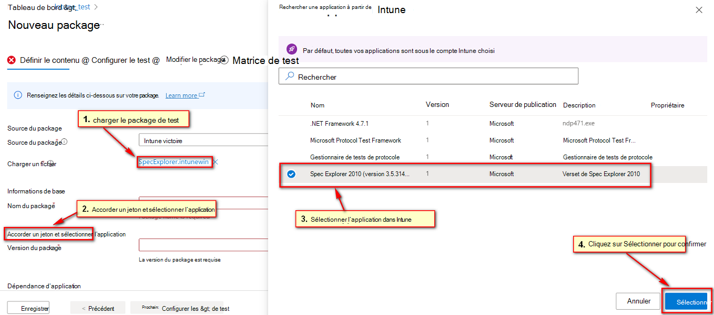
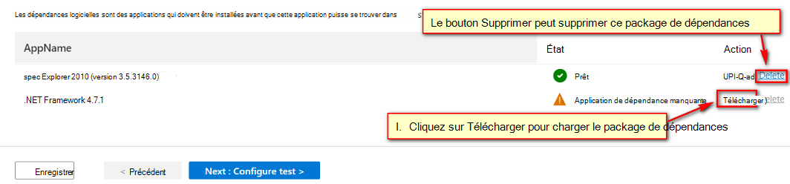
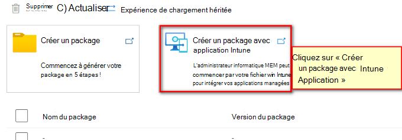

# Tester votre application Intune sur la base de test 
  > [!Note] 
  > Ce guide vous guidera pour charger votre package de format intunewin dans la base de test. Pour obtenir des instructions générales sur le chargement du package de base de test, reportez-vous à ce [document](https://microsoft.sharepoint.com/:w:/t/AzureSUVPCoreTeam/EeHQIT3qA0FKqBDWI5TzmzgBiH2Syz39o5VbY2kdugMn4A?e=Rk1KD9).

## Flux de chargement Intunewin
Afin d’activer davantage l’utilisation commerciale, Test Base a commencé à prendre en charge le format intunewin pour les professionnels de l’informatique qui gèrent les applications pour leurs applications dans Intune en tant que format de package d’intégration standard. Le flux de chargement intunewin offre l’expérience permettant aux professionnels de l’informatique de réutiliser leurs packages de format intunewin, qui contiennent les applications qu’ils ont déployées sur leurs appareils finaux via MEM/Intune pour intégrer rapidement leurs applications et tester les configurations sur La base de test. 

**Conditions préalables**
  - Actuellement, Test Base prend en charge la synchronisation via le même abonnement entre le compte Intune et le compte de base de test (vous n’avez pas besoin d’un compte Intune pour charger votre package Intunewin. Toutefois, si vous souhaitez synchroniser la configuration Intune pour les applications correspondantes du fichier Intunewin à partir de Intune, vous devez vous assurer que votre Intune  est créé sous le même abonnement que votre compte de base de test).
  - Packages Intunewin à charger. 

**Flux de chargement de fichier Intunwin (synchronisé avec Intune compte)**  
En tant que client Intune qui dispose d’un package Intune, qui a déjà été intégré à Intune portail. Le client peut intégrer le package intunewin (contenant une application avec/sans dépendances d’applications préinstalles gérées dans Intune) au service de base de test. (via Intune compte, qui dispose de l’autorisation appropriée pour synchroniser les informations d’application Intune).

**Étape de préparation**
1. Connectez-vous avec votre compte de base de test.
2. Préparez votre package Intunewin.
3. Commencez le chargement en cliquant sur le lien « Créer un package avec Intune App », comme ci-dessous.
    
    > [!div class="mx-imgBorder"] 
    >  

**Étape 1 : Définir le contenu**
1. Chargez le package intunewin que vous choisissez.
2. Accordez le jeton en cliquant sur le lien ci-dessous « Accorder le jeton et sélectionner l’application ».
3. Après la synchronisation automatique avec votre compte Intune, vous êtes répertorié avec l’application de vos applications sous votre compte Intune. Choisissez l’application correspondant à votre package Intunewin chargé, puis cliquez sur « Sélectionner ».
    
    > [!div class="mx-imgBorder"] 
    >  

5. Dans la page Étape 1, vous verrez les dépendances répertoriées dans la section Dépendances. Vous pouvez choisir de charger le fichier d’installation de la dépendance ou de le supprimer de cette étape (si vous envisagez de gérer la dépendance à l’étape 3 en fournissant automatiquement les fichiers binaires associés). Les dépendances sélectionnées dans cette section seront préinstallées de la même façon qu’elles seront installées via Intune.
    
    > [!div class="mx-imgBorder"] 
    >  

**Étape 2 : Configurer le test**
1. Sélectionnez PowerShell.
2. Sélectionnez Out of Box.

**Étape 3 : Modifier le package**
1. Vérifiez que les scripts générés automatiquement sont correctement étiquetés.
2. Si vous avez correctement synchronisé la configuration à partir de Intune, vous devriez voir que les commandes d’installation/désinstallation de l’application de test ont été ajoutées dans les scripts d’installation/désinstallation. Les commandes de la dépendance **qui a été chargée** doivent également être insérées dans l’arborescence de l’Explorateur de packages pour révision.
3. Vérifiez que les fichiers binaires d’application de test sont déplacés sous le dossier **bin** .
4. Vérifiez les fichiers binaires de **dépendances qui ont été chargés** placés sous le dossier **guid** .
5. Vous pouvez modifier les scripts en fonction des besoins et les enregistrer.
    > [!Note] 
    > Si le package de dépendances n’a pas été chargé, test base ne génère pas de commandes d’installation/désinstallation pour celui-ci.  

**Étape 4. Définir la matrice de test**

L’onglet Matrice de test vous permet d’indiquer le programme de mise à jour Windows spécifique ou le produit Windows sur lequel vous souhaitez peut-être exécuter votre test.

   > [!div class="mx-imgBorder"]
   > 

1. Choisir le **type de mise à jour du système d’exploitation**
   - La base de tests fournit des tests planifiés pour vous assurer que les performances de vos applications ne seront pas interrompues par les dernières mises à jour windows. 

   > [!div class="mx-imgBorder"]
   > 

   - Il existe 2 options disponibles :
   
     - Les **mises à jour de sécurité** permettent de tester votre package par rapport aux évolutions incrémentielles des mises à jour de sécurité mensuelles Windows.
     - Les **mises à jour des fonctionnalités** permettent de tester votre package par rapport aux nouvelles fonctionnalités des dernières versions Windows Insider Preview du programme Windows Insider.

2. Configurer la **mise à jour de sécurité** Pour configurer les mises à jour de sécurité, vous devez spécifier le ou les produits Windows que vous souhaitez tester dans la liste déroulante « Versions de système d’exploitation à tester ».

   > [!div class="mx-imgBorder"]
   > 

   - Votre sélection inscrit votre application pour les séries de tests automatiques sur la version B des mises à jour de qualité mensuelles Windows des produits sélectionnés.
     - Pour les clients disposant d’un accès par défaut sur la base de test, leurs applications sont validées par rapport à la version finale des mises à jour de sécurité de la version B, à partir de Patch Tuesday.
     - Pour les clients disposant d’un accès complet sur la base de test, leurs applications sont validées par rapport aux versions préliminaires des mises à jour de sécurité de la version B, à compter de 3 semaines avant le correctif mardi. Cela permet aux clients d’accès complet de prendre des mesures proactives pour résoudre les problèmes détectés lors des tests avant la publication finale du correctif mardi.  
       (Comment devenir un client d’accès complet ? Reportez-vous à [la demande de modification du niveau d’accès | Microsoft Docs](accesslevel.md))

3. Configurer **la mise à jour des fonctionnalités**
   - Pour configurer les mises à jour des fonctionnalités, vous devez spécifier le produit cible et son canal d’aperçu dans la liste déroulante « Insider Channel ».

   > [!div class="mx-imgBorder"]
   > 

   - Votre sélection inscrit votre application pour les tests automatiques sur les dernières mises à jour de fonctionnalités de votre canal de produit sélectionné et toutes les nouvelles mises à jour futures dans les dernières versions Windows Insider Preview de votre sélection.

   - Vous pouvez également définir votre système d’exploitation actuel dans « Base de référence du système d’exploitation pour Insight ». Nous vous fournirons plus d’insights de test en effectuant une analyse de régression de votre environnement de système d’exploitation en l’état et du système d’exploitation cible le plus récent.

   > [!div class="mx-imgBorder"]
   >   

**Étape 5 : Vérifier + publier**  
Passez en revue la configuration après laquelle le package a pu être publié.  

**Flux de chargement de fichier Intunwin (impossible de synchroniser avec Intune compte)**  
En tant que client de base de test disposant d’un package intunewin autonome. Le client peut intégrer le package intunewin (contenant une application avec/sans dépendances d’applications préinstallées gérées dans Intune) sans avoir besoin d’obtenir l’autorisation accordée sur Intune compte pour terminer le processus d’intégration.

**Étape de préparation**
1. Connectez-vous avec votre compte de base de test.
2. Préparez votre package Intunewin.
3. Commencez le chargement en cliquant sur le lien « Créer un package avec Intune App », comme ci-dessous.
    
    > [!div class="mx-imgBorder"] 
    >  

**Étape 1 : Définir le contenu**
1. Chargez le package intunewin.
2. Spécifiez toutes les informations en fonction de vos préférences.

**Étape 2 : Configurer le test**
1. Sélectionnez PowerShell.
2. Sélectionnez Out of Box.

**Étape 3 : Modifier le package**
1. Vérifiez que les scripts sont correctement étiquetés.
2. Comme aucune commande d’installation/désinstallation n’est synchronisée à partir du compte Intune correspondant, vous devez fournir tous les scripts (installer/désinstaller/lancer/fermer) par vous-même.
3. Vérifiez que les fichiers binaires d’application de test sont déplacés sous le dossier bin.
4. Vous pouvez modifier les scripts en fonction des besoins et les enregistrer.

**Étape 4 : Tester la matrice**
1. Aucune version du système d’exploitation par défaut n’est présélectionnée.
2. Les utilisateurs sont autorisés à effectuer leur propre sélection sur les systèmes d’exploitation à planifier.

**Étape 5 : Vérifier + publier**  
Passez en revue la configuration après laquelle le package a pu être publié.

