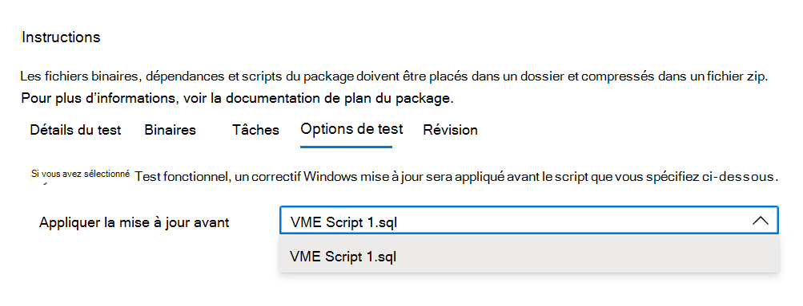

# <a name="step-5-choose-your-test-options"></a>Étape 5 : Choisissez vos options de test. 

L’onglet est pour les utilisateurs qui souhaitent effectuer des tests fonctionnels afin d’indiquer quand le correctif Windows Update doit être appliqué dans la séquence d’exécution de ```Test Options``` leurs scripts de test fonctionnels.



Sélectionnez _**Révision**_ pour accéder à l’onglet suivant et passer en revue les options de test sélectionnées.

## <a name="next-steps"></a>Étapes suivantes

Vous trouverez plus d’informations sur l’étape d’imbrouillement dans l’article suivant via le lien ci-dessous :
> [!div class="nextstepaction"]
> [Étape suivante](review.md)
